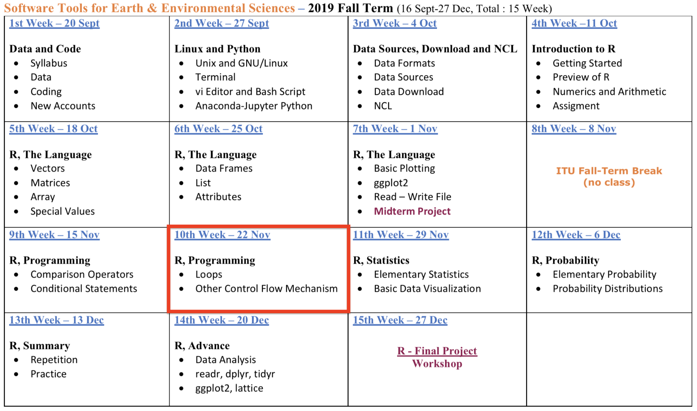

## **R Promgramming - Part 2**

- **Syllabus and Book**
- **DataCamp Class**
- **Practice - R Language**
- **Practice - R Programming**

<span style="color:brown">**Coffee Break**</span>

- **R Programming - <span style="color:blue">*repeat*</span> Loops**
- **R Programming - <span style="color:blue">*while*</span> Loops**
- **R Programming - <span style="color:blue">*for*</span> Loops** 
- **R Programming - <span style="color:blue">*apply*</span> Loops**

<span style="color:brown">**QUIZ**</span>

- **Next Week**


# **Syllabus, Book**
## **Syllabus**


## **Book**


## Homework-1 and Midterm Project 

**?**

# **DataCamp Class**
## **DataCamp Class**


## **DataCamp Class**

<span style="color:brown">`(1$ = 5,75 TL)`</span>

29$ `*` 5,75 TL `*` 6 Months `*` 1 Student= <span style="color:brown">**833,75 TL** </span>

833,75 TL `*` 25 Students = <span style="color:brown">**20.843,75 TL** </span>


# **Practice - R Language**
## **Practice - R Language**

**Objectives**

- Manage Working Directory

- Find the Data

- Read Data with **utils** (R utility functions)

## **Practice - R Language**

Manage Working Directory

- <span style="color:blue">**getwd()**</span> - ***get** **w**orking **d**irectory*
- <span style="color:blue">**list.files()**</span> *# or dir()*

```{r}
getwd()
list.files()
```

## **Practice - R Language**

Manage Working Directory

- <span style="color:blue">**setwd()**</span> - ***set** **w**orking **d**irectory*

```{r}
# 1
setwd("/Users/emirtoker/Downloads/")
# 2
getwd()
list.files()
file.path("~","Users","emirtoker","Downloads","-this_is_my_file.csv")
```


## **Practice - R Language**

Find the Data

- <span style="color:blue">**file.path()**</span>

```{r}
# Option 1
# setwd("/Users/emirtoker/Downloads/")
# read.csv("-this_is_my_file.csv")

# Option 2
path <- file.path("~","Users","emirtoker","Downloads","-this_is_my_file.csv")
path
# read.csv(path)
```


## **Practice - R Language**

Read Data 

*with **utils** (R utility functions)*

- <span style="color:blue">**read.csv()**</span> - ***C**omma **S**eperated **V**alue*
- <span style="color:blue">**read.delim()**</span> - *Tab Delimited Data*
- <span style="color:blue">**read.table()**</span> - *Exocit file format*

## **Practice - R Language**

Read Data with **utils** (R utility functions)

<span style="color:blue">**read.csv()**</span> -  ***C**omma **S**eperated **V**alue*


## **Practice - R Language**

Read Data with **utils** (R utility functions)

<span style="color:blue">**read.delim()**</span> - *Tab Delimited Data*


## **Practice - R Language**

Read Data with **utils** (R utility functions)

<span style="color:blue">**read.table()**</span> - *Exocit file format*

  


## **Practice - R Language**

BONUS - <span style="color:blue">**Import Dataset**</span>


## **Practice - R Language**

BONUS - <span style="color:blue">**Import Dataset**</span>


## **Practice - R Language**

BONUS - <span style="color:blue">**Import Dataset**</span>


## **Practice - R Language**

BONUS - <span style="color:blue">**Import Dataset**</span>


## **Practice - R Language**


BONUS - <span style="color:blue">**Import Dataset**</span>


- `17061_Sariyer_Sariyer_15dk` <- read.csv(
  "~/Desktop/NCL_Script_ve_Gorsel/Makale/
  time_series_makale/mgm_veri/17061_Sariyer_Sariyer_15dk.txt", 
  header=FALSE,
  sep=";")

- View(`17061_Sariyer_Sariyer_15dk`)

<span style="color:brown">**~**</span>


## **Practice - R Language**

Manage Directory, Find and Read Data

**Instructions**

1. Go to main webpage of course
2. Open Data "Istanbul_Goztepe_Precipitation_1846-2013_Monthly" (.dat) LINK
3. Copy and Paste it in your "Downloads" directory in a text file
4. Open your R Studio

**We Have 4 Ways to Read**

## **Practice - R Language**

Manage Directory, Find and Read Data

**Instructions** - <span style="color:blue">WAY 1 - **GO TO FILE**<span>

5. Check your Project Name and your Working directory
6. Go to "Downloads" directory in R Studio
7. List files and Read Data with three different read functions
    - read.csv()
    - read.delim()
    - read.table()
8. Choose the best 
9. Assign your data as "precip_1"

<span style="color:brown">***Caraful about header, seperater and missing data***<span>

***look at the main web page for examples***

## **Practice - R Language**

Manage Directory, Find and Read Data

**Instructions** - <span style="color:blue">WAY 2 - **CALL THE FILE**<span>

10. Go Back to your Working directory
11. Define your file path with file.path()
12. Assign the path a new variable as "path_my_file"
13. Use your best read() function
14. Read the file with "path_my_file"
15. Assign your data as "precip_2"

```
path_my_file <- file.path("~","Downloads")
precip_2 <- read.table(path_my_file)
```

## **Practice - R Language**

Manage Directory, Find and Read Data

**Instructions** - <span style="color:blue">WAY 3 - **IMPORT THE FILE**<span>

16. Use "Import Datase"
17. Assign your data as "precip_3"


## **Practice - R Language**

Manage Directory, Find and Read Data

**Instructions** - <span style="color:blue"> WAY 4 - **DOWNLOAD THE FILE**<span>

18. Copy the LINK of data
19. Use your best read() function
20. Read the file with this function and LINK
21. Assign your data as "precip_4"

```
precip_4 <- read.table("link")
```


# **Practice - R Programming**

## **Practice - R Programming**

**Objectives**

- Identify the Data

- Indexing 

- Use Condition Statements

- Plot


## **Practice - R Programming**

**Meet with the Data**

1. Look at structure
2. Learn attributes and dimensions
3. Rename attributes

**? dimensions, variables and types ?**

```
month.name
month.abb

attributes(precip_2)
attributes(precip_2)[1]
attributes(precip_2)[[1]]

attributes(precip_2)[[1]] <- c("Year",month.abb)

attr(precip_2,"names") <- c("Year",month.abb)
attr(precip_2,"row.names") <- 1846:2013

precip_2a <- precip_2[-1]
head(precip_2a)
```

## **Practice - R Programming**

**Clear NA and Choose Colomn**

4. Print "precip_2a"
5. Delete rows which include NA ( na.omit() )
6. Assign it as "precip_2b"
7. Select summer season 
8. Assign it as "precip_2b_summer"


```
precip_2b <- na.omit(precip_2a)
precip_2b_summer <- precip_2b[ ,6:8]
```

## **Practice - R Programming**

**Use Condition Statements - if**


9. Compare June Mean Precipitation with July
10. IF June mean precipitation is LOWER than July then print "June has low precipitation."

```
mean_jun <- mean(precip_2b_summer$Jun)
mean_jul <- mean(precip_2b_summer$Jul)

if (mean_jun > mean_jul) {
  print("June has low precipitation.")
}

colMeans(precip_2b_summer)

```


## **Practice - R Programming**

**Use Condition Statements - else**


10. IF June mean precipitation is LOWER than July then print "June has low precipitation."
11. ELSE print "June has high precipitation."
12. Calculate mean of each month ( colMeans() )

```
mean_jun <- mean(precip_2b_summer$Jun)
mean_jul <- mean(precip_2b_summer$Jul)

if (mean_jun < mean_jul) {
  print("June has low precipitation.")
} else {
  print("June has high precipitation.")
}

colMeans(precip_2b_summer)
```

## **Practice - R Programming**

**Plot**

Problem : Extremes and Outliers

13. Plot precipitation for June
14. Add title and unit

```
plot(precip_2b_summer$Jun, 
    xlab = "Years",
    ylab = "Precipitation [mm/month]", 
    main = "Istanbul Monthly Precipitation - June", 
    type = "l", 
    col="blue")
```


## **Practice - R Programming**

**Plot**

Problem : Extremes and Outliers

15. Edit x-axis, which years are they ?
16. What about August ?

```
attr(precip_2b_summer,"row.names")
x_years <- attr(precip_2b_summer,"row.names")

plot(x_years,
    precip_2b_summer$Jun, 
    xlab = "Years",
    ylab = "Precipitation [mm/month]", 
    main = "Istanbul Monthly Precipitation - June", 
    type = "l", 
    col="blue")
    
    plot(precip_2b_summer$Aug)
```

## **Practice - R Programming**

**Plot**

Problem : Extremes and Outliers

 

Homework-2

##

<span style="color:brown">**Coffee Break**</span>

# **R Programming - Loops**

## **R Programming - Loops**


Loops are R’s method for repeating a task, which makes them a useful tool for programming simulations. 


# **R Programming - <span style="color:blue">*repeat*</span> Loops**
## **R Programming - <span style="color:blue">*repeat*</span> Loops**


```
repeat
{
  message("Happy Groundhog Day!")
  break
}
```

## **R Programming - <span style="color:blue">*repeat*</span> Loops**

```{r}
coins <- 3
game <- 0

repeat
{
  game <- game + 1
  coins <- coins -1
  
  print(game)
  print("nice try, play again")
  
if (coins==0) {
    break
  }
}
```

```
[1] 1
[1] "nice try, play again"
[1] 2
[1] "nice try, play again"
[1] 3
[1] "nice try, play again"
```


# **R Programming - <span style="color:blue">*while*</span> Loops** 
## **R Programming - <span style="color:blue">*while*</span> Loops** 

While loops are like backward repeat loops.


```
while(condition) {
conditional statement
}
```

## **R Programming - <span style="color:blue">*while*</span> Loops** 


```{r}
coins <- 3
game <- 0

while(coins >= 0)
{
  coins <- coins -1
  game <- game + 1
  print(game)
  print("nice try, play again")
}
```


# **R Programming - <span style="color:blue">*for*</span> Loops**
## **R Programming - <span style="color:blue">*for*</span> Loops**

The third type of loop is to be used when you know exactly how many times you want the code to repeat. 


## **R Programming - <span style="color:blue">*for*</span> Loops**


```{r}
for(i in 1:2) {
message("just say it ", i, " times")
}
```


## **R Programming - <span style="color:blue">*for*</span> Loops**

```{r}
for(i in c(1,2) ) {
message("just say it ", i, " times")
}
```

```{r}
for(i in c("apple","banana") ) {
message("just say it ", i, " times")
}
```

<span style="color:brown">*it is related with length of vector*</span>


## **R Programming - <span style="color:blue">*for*</span> Loops**

```{r}
month.name

for(month in month.name) {
  message("The month of ", month)
}
```


# **R Programming - <span style="color:blue">*apply*</span> Loops**
## **R Programming - <span style="color:blue">*apply*</span> Loops**

- The **apply()** functions form the basis of more complex combinations and helps to perform operations with very few lines of code. 
- More specifically, the family is made up of the **apply()**, **lapply()** , **sapply()**, **vapply()**, **mapply()**, **rapply()**, and **tapply()** functions.

```
apply(X, MARGIN, FUN, ...)

# X is an array or a matrix, dim(X) must have a positive length
# MARGIN=1, it applies over rows, whereas with 
# MARGIN=2, it works over columns. Note that when you use the construct 
# MARGIN=c(1,2), it applies to both rows and columns
# FUN, which is the function that you want to apply to the data. 
```

```
apply(precip_2b_summer, MARGIN=1, mean)
apply(precip_2b_summer, MARGIN=2, mean)
apply(precip_2b_summer, MARGIN=c(1,2), mean)
apply(precip_2b_summer, MARGIN=c(2,1), mean)
```

## **R Programming - <span style="color:blue">*apply*</span> Loops**


## **R Programming - <span style="color:blue">*lapply*</span> Loops**


```
lapply(precip_2b_summer,"[",1)

sapply(precip_2b_summer,"[",1)
```


# <span style="color:brown">**QUIZ**</span>
## <span style="color:brown">**QUIZ**</span>


# **Next Week**
## **Next Week**

- QUIZ - Seriously
- Homework - 2 (read and plot)
- Homework - 3 (if, for, function)
- DataCamp Assignments

- Elementery Statistics


