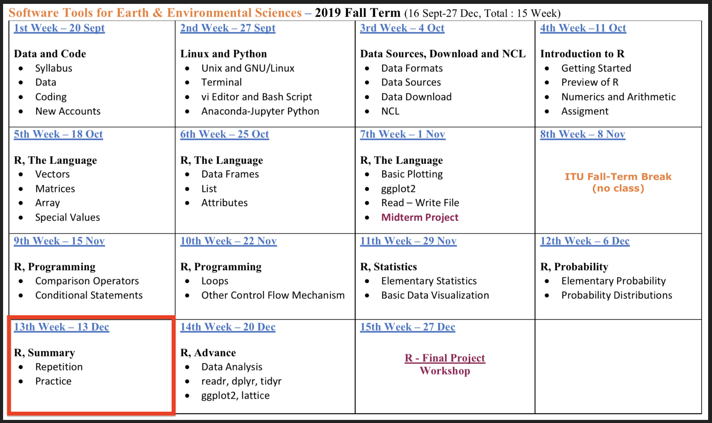
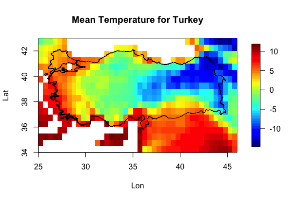

## **R Probability**

- **Syllabus and Book**
- **DataCamp Class**
- **Additional Course**
- **R - Common Probability Distributions**
- **Practice** : Write A Function for outliers

<span style="color:brown">**Coffee Break**</span>

- **R - NETCDF**

<span style="color:brown">**QUIZ**</span>

**Next Week**


# **Syllabus and Book**
## **Syllabus and Book**



## **Book**

 


# **DataCamp Class**
## **DataCamp Class**


[LINK](https://www.datacamp.com/enterprise/software-tools-introduction-to-r/assignments)


# **Additional Course**

## **Additional Course**


[LINK](https://emirtoker.github.io/Software_Tools_R_Github/additional_course.html)


# **R - Common Probability Distributions**
## **Uniform**

The **uniform** distribution is a simple density function that describes a continuous random variable whose interval of possible values offers no fluctuations in probability.


## **Uniform**


## **Uniform**

- runif()
- dunif()
- punif()
- qunif()


## **Uniform**


```{r}
runif(n = 10,-0.4,1.1)

r1 <- runif(n = 10,-0.4,1.1)
table(r1)

t1 <- table(r1)
```

## **Uniform**

```{r fig.height=5}
barplot(t1)
```

## **Uniform**

```{r fig.height=5}
barplot(table(runif(n = 100,-0.4,1.1)))

```


## **Uniform**

```{r fig.height=5}
barplot(table(runif(n = 1000,-0.4,1.1)))

```


## **Uniform**

```{r fig.height=3}
dunif(x=c(-2,-0.33,0,0.5,1.05,1.2),min=-0.4,max=1.1)
d1 <- dunif(x=c(-2,-0.33,0,0.5,1.05,1.2),min=-0.4,max=1.1)
barplot(d1,names.arg=c(-2,-0.33,0,0.5,1.05,1.2))
```

## **Uniform**

```{r fig.height=3}
d2 <- dunif(x=c(-2,runif(998,-0.4,1.1),1.2),min=-0.4,max=1.1)
barplot(d2)
```


## **Normal**

Characterized by a distinctive “bell-shaped” curve, it’s also referred to as the **Gaussian** distribution.


## **Normal**


## **Standart Normal**


## **Normal**

**0.95 −2σ to +2σ** and **0.99 −3σ tp +3σ**


## **Normal**

- rnorm()
- dnorm()
- pnorm()

## **Normal**


```{r}
r1 <- rnorm(50,mean = 0, sd = 1)
r1
```


## **Normal**

```{r fig.height=4}
plot(r1)
```

## **Normal**

```{r fig.height=4}
hist(r1)
```


## **Normal**

```{r fig.height=4}
barplot(r1)
```

## **Normal**

```{r fig.height=4}
barplot(table(r1))
```


## **Normal**

```{r}
dnorm(r1, mean = 0, sd = 1)
fx3 <- dnorm(r1)
```


## **Normal**
```{r fig.height=4}
plot(r1,fx3)
```


# **Practice** : Write A Function for outliers

## **outliers**

```{r}
foo <- c(0.6,-0.6,0.1,-0.2,-1.0,0.4,0.3,-1.8,1.1,6.0)
```


## **outliers**


```{r}
summary(foo)
```

## **outliers**

```{r fig.height=4}
plot(foo,rep(0,10),yaxt="n",ylab="",bty="n",cex=2,cex.axis=1.5,cex.lab=1.5)
abline(h=0,col="gray",lty=2)
```

## **outliers**

```{r fig.height=4}
plot(foo,rep(0,10),yaxt="n",ylab="",bty="n",cex=2,cex.axis=1.5,cex.lab=1.5)
abline(h=0,col="gray",lty=2)
arrows(5,0.5,5.9,0.1,lwd=2)
text(5,0.7,labels="outlier?",cex=3)
```


## **outliers**


boxplot()

## **outliers**

```{r fig.height=4}
boxplot(foo)
```

## **outliers**

```{r fig.height=4}
mean(foo)
mean(foo[-10])
```


## **Function**

```
baz <- c(-0.3,0.9,2.8,2.3,1.2,12,-4.1,-0.4,4.1,-2.3)
```

- Mean, Median, Range
- Variance, Standart Deviation
- Plot, hist
- Barplot with table() function
- summary() function
- boxplot
- if there is *outliers*, print

**Condition for outliers is**

OUTLIERS < MEAN-(3`*`IQR) 

or 

OUTLIERS > MEAN+(3`*`IQR) 


## **Function**

```{r}
baz <- c(-0.3,0.9,2.8,2.3,1.2,12,-4.1,-0.4,4.1,-2.3,1.2)

statistic_function <- function(baz) {

  
}
```


## **Function**

```{r}
statistic_function <- function(baz) {
  print(c(mean(baz),"mean"))
  print(c(median(baz),"median"))
  print(c(range(baz),"range"))
  
}

statistic_function(baz)
```


## **Function**

```{r}
statistic_function <- function(baz) {
  print(c(mean(baz),"mean"))
  print(c(median(baz),"median"))
  print(c(range(baz),"range"))
  print(c(var(baz),"var"))
  print(c(sd(baz),"sd"))

}

statistic_function(baz)
```


## **Function**

```{r}
statistic_function <- function(baz) {
  print(c(mean(baz),"mean"))
  print(c(median(baz),"median"))
  print(c(range(baz),"range"))
  print(c(var(baz),"var"))
  print(c(sd(baz),"sd"))
  plot(baz)
  hist(baz)
}

statistic_function(baz)
```


## **Function**

```{r}
statistic_function <- function(baz) {
  print(c(mean(baz),"mean"))
  print(c(median(baz),"median"))
  print(c(range(baz),"range"))
  print(c(var(baz),"var"))
  print(c(sd(baz),"sd"))
  plot(baz)
  hist(baz)
  barplot(table(baz))
  print(c(summary(baz),"summary"))
  boxplot(baz)
  
}

statistic_function(baz)
```


## **Function**

```{r}
statistic_function <- function(baz) {
  print(c(mean(baz),"mean"))
  print(c(median(baz),"median"))
  print(c(range(baz),"range"))
  print(c(var(baz),"var"))
  print(c(sd(baz),"sd"))
  plot(baz)
  hist(baz)
  barplot(table(baz))
  print(c(summary(baz),"summary"))
  boxplot(baz)
  for (i in 1:length(baz)) {
      if (baz[i]<mean(baz)-3*IQR(baz) | baz[i]>mean(baz)+3*IQR(baz)) {
        print("there is outliers")
        print(c(baz[i] , "outlier") )
        print(which(baz==baz[i]))
      }
  }
}

statistic_function(baz)
```


#<span style="color:brown">**Coffee Break**</span>


# **R - NETCDF**
## **R - NETCDF**


## **R - NETCDF**

```
install.packages("maptools")
library("maptools")
install.packages("fields")
library("fields")

readShapePoly("turkiye/turkiye.shp")

turkey_shp <- readShapePoly("turkiye.shp")
ncdf4_tmp_10 <- ncdf4_tmp[,,10]

image.plot( ncdf4_lon, ncdf4_lat, ncdf4_tmp_mean, 
            xlab = "Lon", 
            ylab = "Lat", 
            main = "Mean Temperature for Turkey" )
            
plot(turkey_shp, add = T)

```

## **R - NETCDF**




# <span style="color:brown">**QUIZ**</span>

## <span style="color:brown">**QUIZ**</span>

(https://kahoot.it/)

# **Next Week**


