## **R Probability**

- **Syllabus and Final Project**
- **R Repeat**
  - R, R-Studio, R-Files
  - Data Types and Structures
  - Conditions, Loops and Functions
  - Statistic and Probability
- **Practice** : Function and If
- **Practice** : NetCDF and shapefile
- **Next Week**


# **Syllabus and Final Project**

## **Syllabus**


## **Final Project**


<style>

.column-right0{
  float: right;
  width: 40%;
  text-align: right;
}
.column-left0{
  float: left;
  width: 50%;
  text-align: left;
}
</style>

<div class="column-left0">


29 January 2020, 09:00-11:30


</div>


<div class="column-right0">


- Download the data
- Open a new R-Project and R-Script
- Read .txt, .csv, and .nc file
- Manipulate and plot the data
- Use if, for and function
- Export as R-Notebook


</div>


# **R Repeat**

## **R, R-Studio, R-Files**

R Homepage - [LINK](https://www.r-project.org/)

The Comprehensive R Archive Network (CRAN) - [LINK](https://cran.r-project.org/mirrors.html)


## **R, R-Studio, R-Files**

Turkey - Middle East Technical University Northern Cyprus Campus, Mersin - [LINK](https://cran.ncc.metu.edu.tr)


## **R**

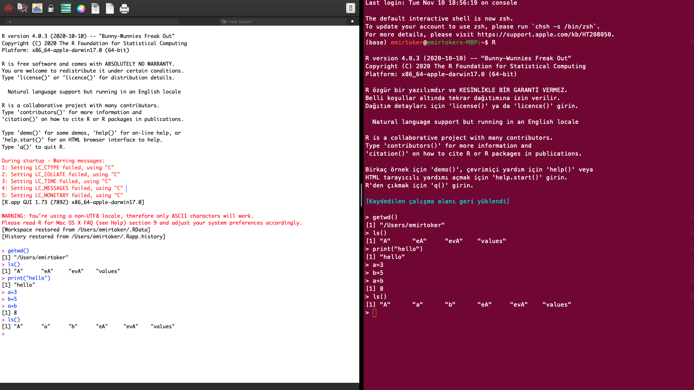 


## **RStudio Desktop Download**


## **RStudio**

An **Integrated Development Environment (IDE)** for R.

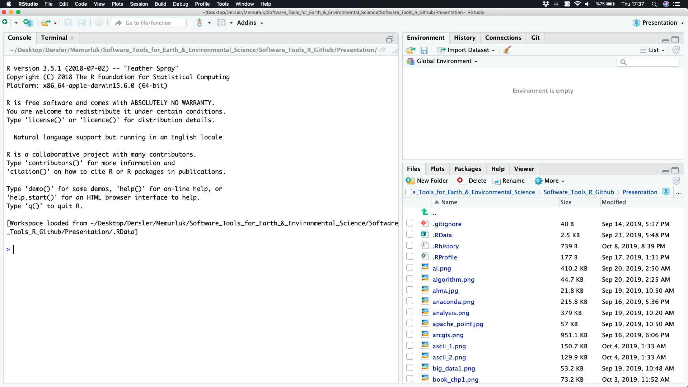


## **Project**

*File - New Project*


## **R Files**


## **R Notebook**

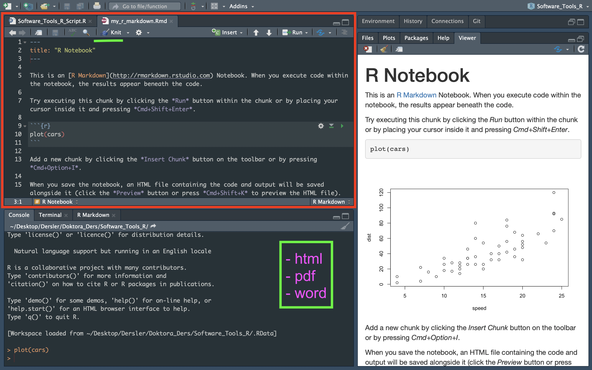


## **Packages**

*Install, Update*


## R for Basic Math

25 **`*`** 4 **+** 9 **/** 3 **-** 56

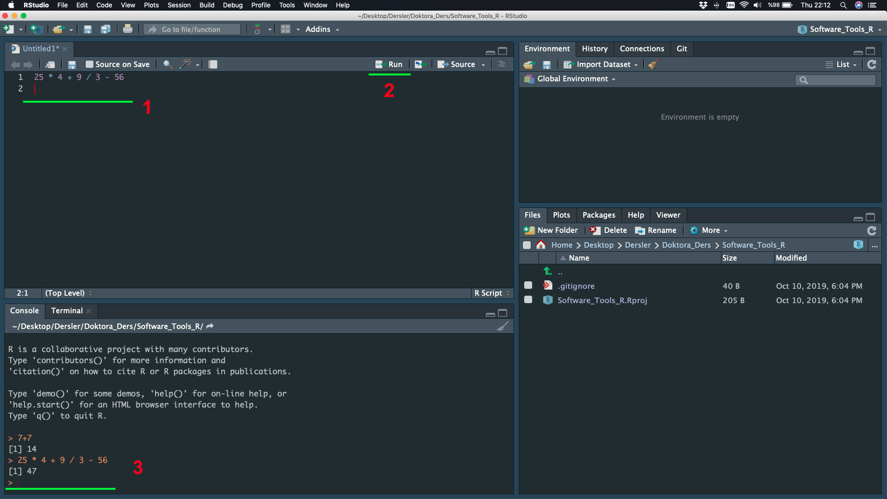


## Assigning Objects

The assignment arrow (**<-**)

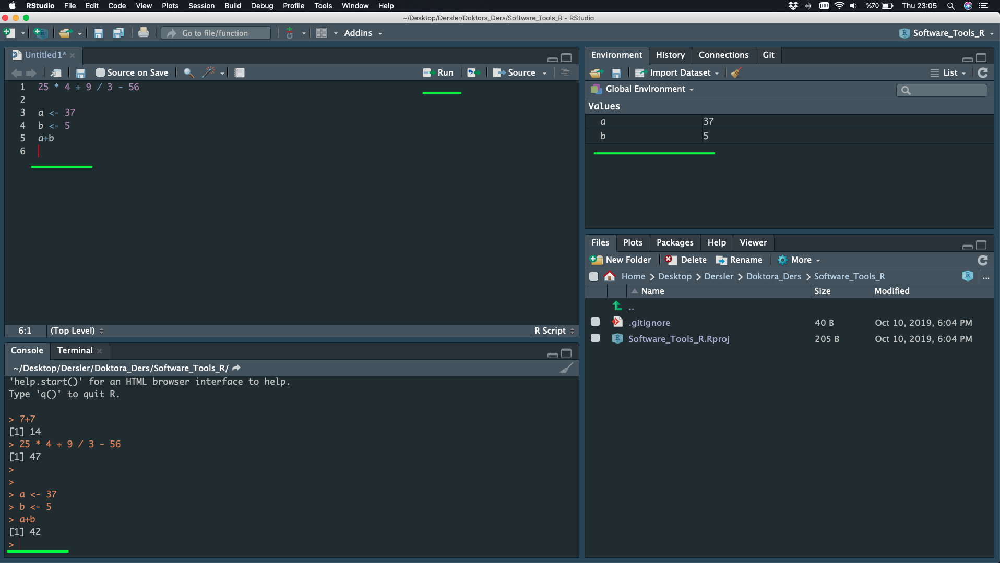


## Comments

How to tell R to ignore a part of your code? (**#**)


## **Data Types**

- Numeric (Double)
- Integer
- Complex
- Logical
- Character
- Special Values
- Date/Time


- Arithmetic Operators ( +, -, /, x )
- Logical Operators ( <, >, ==, != ....)


## **Coercion**


## **Data Structures (R-Objects)**

 


## **Arrays and Data Frames**


{width=40%} {width=60%}


## **Create a Function**

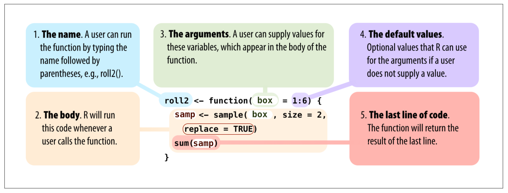


## **Read**

Import Dataset -> From Text (readr) -> Browse

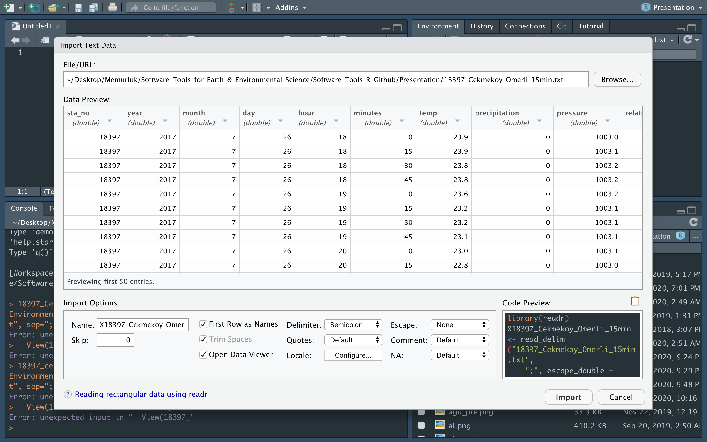


## **Read and write**

Console

- read.table()
- read.delim()
- read.csv()

- write.table()


## **Plot**

Uptade Preview


## **Repeat - R Programming (Conditions)**

- **Comparison Operators **
    - equal (**==**)
    - not equal (**!=**)
    - greater or equal to (**>=**)
    - less or equal to (**<=**)

- **Logical Operators **
    - the *and* operator (**&**)
    - the *or* operator (**|**)
    - the *not* operator (**!**)

- ***if*** (Stand-Alone) Statement
- ***else*** Statement
- ***else if*** Statement


## ***if*** (Stand-Alone) Statement

{width=80%}


## -***else ***-  and -***else if***- Statement

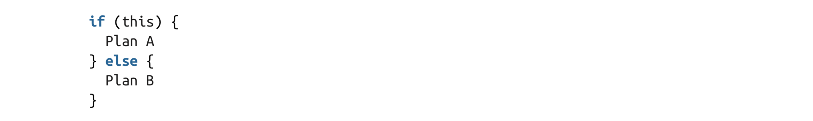

If your situation has more than two mutually exclusive cases, 
use **else** and **if** statements together.


##  Nesting and Stacking Statements


## **R Programming - Loops**

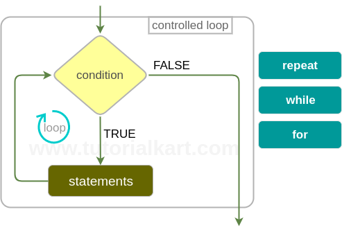


## **R Programming - <span style="color:blue">*repeat*</span> Loops**


## **R Programming - <span style="color:blue">*while*</span> Loops** 


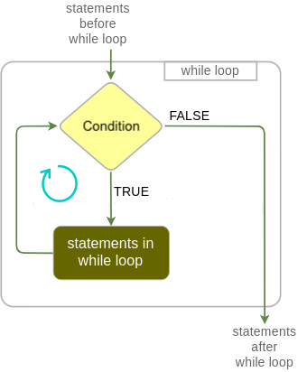


## **R Programming - <span style="color:blue">*for*</span> Loops**


## **R Programming - <span style="color:blue">*apply*</span> Groups**

- The **apply()** functions form the basis of more complex combinations and helps to perform operations with very few lines of code. 
- More specifically, the family is made up of the **apply()**, **lapply()** , **sapply()**, **vapply()**, **mapply()**, **rapply()**, and **tapply()** functions.


##  **R Elemantary Statistics**


##  **R Elemantary Statistics**

- **Centrality**: Mean, Median, Mode
- Quantiles, Percentiles, and the Five-Number Summary
- **Spread**: Variance, Standard Dev., Interquartile Range
- Covariance and Correlation


{width=50%}
{width=60%}


##  **Basic Data Visualization** 

- Barplots and Pie Charts
- Histogram
- Boxplot
- Scatter Plots

{width=40%} {width=40%}


## **R - Probability**

- **Qualitative and Quantitative Data**
- **Discrete and Continuous Data**
- **Probability 'Density vs Mass' Function (PDF vs PMF)**
- **Cumulative Distribution Function (CDF)**
- **Shape of PDF** : Symmetry, Skewness, Modality, Kurtosis
- **Common Probability Distributions**

{width=55%}  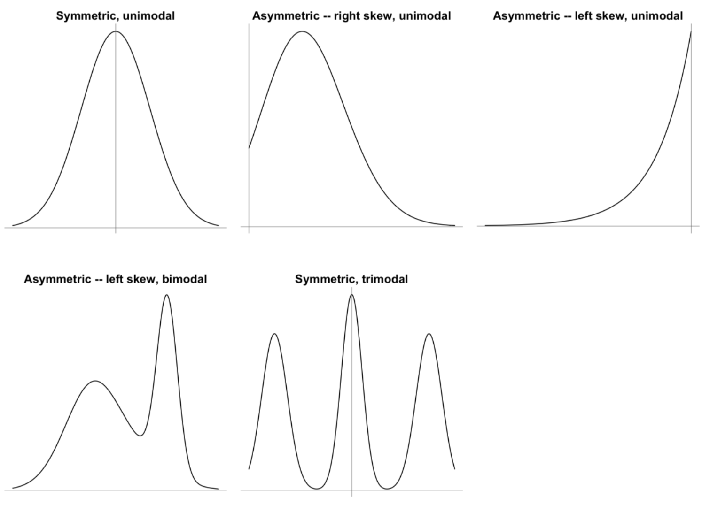{width=40%} 


## My density distribution

<style>

.column-right1{
  float: right;
  width: 40%;
  text-align: right;
}
.column-left1{
  float: left;
  width: 60%;
  text-align: left;
}
</style>

<div class="column-left1">

</div>

<div class="column-right1">

```
lower < 7 < upper

X >= 2  &  X <= 7
(X[lower] - 1)/36

X > 7 & X <= 12
13 - X[upper])/36
```
</div>


## PDF - Probability Density Function


# **Practice** : Write A Function 

## **Practice** : Write A Function - 1 

- I have four different numbers w,x,y,z
- I want to define them OUT of function
- I want to calculate w+x IN function
- I want to calculate y*z IN function
- I want to print the results IN function


```{r}
w <-
x <-
y <-
z <-

my_fun1 <- function(){


print(result1)
print(result2)

}

```


## **Practice** : Write A Function - 1 

- I have four different numbers w,x,y,z
- I want to define them OUT of function
- I want to calculate w+x IN function
- I want to calculate y*z IN function
- I want to print the results IN function


```{r}
w <- 
x <- 
y <- 
z <- 

my_fun1 <- function(){

result1 <-
result2 <-

print(result1)
print(result2)

}

```


## **Practice** : Write A Function - 1 

- I have four different numbers w,x,y,z
- I want to define them OUT of function
- I want to calculate w+x IN function
- I want to calculate y*z IN function
- I want to print the results IN function


```{r}
w <- 
x <- 
y <- 
z <- 

my_fun1 <- function(){

result1 <- w+x
result2 <- y*z

print(result1)
print(result2)

}

```


## **Practice** : Write A Function - 1

- I have four different numbers w,x,y,z
- I want to define them OUT of function
- I want to calculate w+x IN function
- I want to calculate y*z IN function
- I want to print the results IN function


```{r}
w <- 1
x <- 2
y <- 3
z <- 4

my_fun1 <- function(){

result1 <- w+x
result2 <- y*z

print(result1)
print(result2)

}

```


## **Practice** : Write A Function - 1

- I have four different numbers w,x,y,z
- I want to define them OUT of function
- I want to calculate w+x IN function
- I want to calculate y*z IN function
- I want to print the results IN function


```{r}
w <- 1
x <- 2
y <- 3
z <- 4

my_fun1 <- function(){
result1 <- w+x
result2 <- y*z
print(result1)
print(result2)
}

my_fun1()
```


## **Practice** : Write A Function - 2

- I have four different numbers w,x,y,z
- I want to define them IN of function
- I want to calculate w+x IN function
- I want to calculate y*z IN function
- I want to print the results IN function


```{r}
my_fun2 <- function(){
  
w <- 1
x <- 2
y <- 3
z <- 4

result1 <- w+x
result2 <- y*z

print(result1)
print(result2)

}
```


## **Practice** : Write A Function - 3

- I have four different numbers w,x,y,z
- I want to define them WHEN I am using the function
- I want to calculate w+x IN function
- I want to calculate y*z IN function
- I want to print the results IN function


```{r}
my_fun3 <- function(w,x,y,z){
  
result1 <- w+x
result2 <- y*z

print(result1)
print(result2)

}

# my_fun3()
my_fun3(1,2,3,4)
```


##  BONUS

- menu() function


```
menu(c("Yes", "No"), title="What dou you think?")
menu1 <- menu(c("Yes", "No"), title="What dou you think?")
menu1

menu(c("Option1","Option2","Option3","Option4"), title="Choose one of them")
menu2 <- menu(c("Option1","Option2","Option3","Option4"), title="Choose one of them")
menu2

```

## **Practice** : Write A Function - 3

- I have two different numbers x,y
- I want to define them WHEN I am using the function
- I want to define ONE calculation DURING the function
- I want to print the results IN function

```
my_fun3 <- function(x,y){

math <- menu(c("+", "-", "*", "/"), title="Which calculation?")

  if (math==1) {
    result <- x+y
  } else if ( ) {
     
  } else if ( ) {
    
  } else  {
    
  }

print(result)
}
```


# **Practice** : Write An IF-Statement 

## **Practice** : Write An IF-Statement - 1

- Write your own if-statement and condition


```

if ( condition ) {

print( )

}

```


## **Practice** : Write An IF-Statement - 2

<style>

.column-right0{
  float: right;
  width: 40%;
  text-align: right;
}
.column-left0{
  float: left;
  width: 50%;
  text-align: left;
}
</style>

<div class="column-left0">

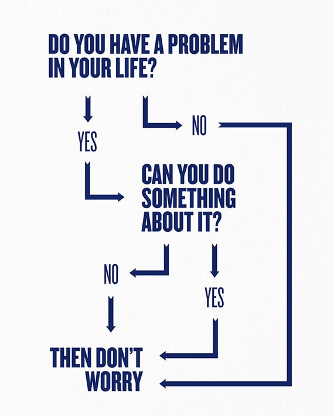
</div>

<div class="column-right0">

- Two answers
- Two options
- One Result

```
worry_flow <- function() {

answer1 <- menu()

  if () {
  
    print()
  
  }
  
  else {
  
    answer2 <- menu()

  }
  
}

```

</div>


## **Practice** : Write An IF-Statement - 2

<style>

.column-right0{
  float: right;
  width: 40%;
  text-align: right;
}
.column-left0{
  float: left;
  width: 50%;
  text-align: left;
}
</style>

<div class="column-left0">


</div>

<div class="column-right0">

- Two answers
- Two options
- One Result

```
worry_flow <- function() {

answer1 <- menu()
  if () {
      print()
  }
  else {
      answer2 <- menu()
      if(){
          print()
      }
      else{
      }
  }
}

```

</div>


## **Practice** : Write An IF-Statement - 2

<style>

.column-right0{
  float: right;
  width: 50%;
  text-align: right;
}
.column-left0{
  float: left;
  width: 50%;
  text-align: left;
}
</style>

<div class="column-left0">


</div>

<div class="column-right0">

- Two answers
- Two options
- One Result

```{r}
worry_flow <- function() {

answer1 <-  menu(c("Yes","No"), title = "Do you have a problem in your life ?")
  if (answer1 == 2) {
      print("Then Don't Worry")
  }
  else {
      answer2 <- menu(c("Yes","No"), title = "Can you do something about it ?")
      if(answer2 == 1){
          print("Then Don't Worry")
      }
      else{
      print("Then Don't Worry")
      }
  }
}
```

</div>


## **Practice** : Write An IF-Statement - 2

<style>

.column-right0{
  float: right;
  width: 50%;
  text-align: right;
}
.column-left0{
  float: left;
  width: 50%;
  text-align: left;
}
</style>

<div class="column-left0">


</div>

<div class="column-right0">

- Two answers
- Two options
- One Result

```{r}
worry_flow <- function() {

answer1 <-  menu(c("Yes","No"), title = "Do you have a problem in your life ?")
  if (answer1 == 2) {
      print("Then Don't Worry")
  }
  else {
      answer2 <- menu(c("Yes","No"), title = "Can you do something about it ?")
      if(answer2 == 1){
          print("Then Don't Worry")
      }
      else{
      print("Then Don't Worry")
      }
  }

require(tcltk)
msgBox <- tkmessageBox(title = "Title of message box",
                       message = "THEN WYH WORRY!", 
                       icon = "info", 
                       type = "ok")

}
```

</div>


# **R - NETCDF**
## **R - NETCDF**

{width=90%}

CRU_TR_Near-Surface_Temp_16-01-1901_16-12-2012_Monthly


## **R - NETCDF**

{width=90%}

CRU_TR_Near-Surface_Temp_16-01-1901_16-12-2012_Monthly


## **R - NETCDF**

```
install.packages("ncdf4")
install.packages("RNetCDF")
install.packages("maptools")
install.packages("fields")
```

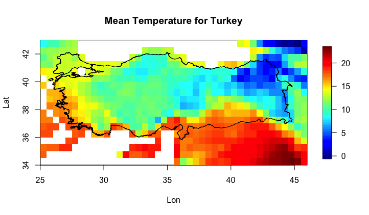


## **R Advance - <span style="color:orangered">*ncdf4*</span> Package**


## **R Advance - <span style="color:orangered">*ncdf4*</span> Package**


```{r}
library(ncdf4)
ncdf4_open <- nc_open("cru_1901_2012_tmp_TR.nc")
ncdf4_open
```


## **R Advance - <span style="color:orangered">*RNetCDF*</span> Package**


## **R Advance - <span style="color:orangered">*RNetCDF*</span> Package**


```{r}
library(RNetCDF)
rnetcdf_open <- open.nc("cru_1901_2012_tmp_TR.nc")
print.nc(rnetcdf_open)
```


## R Advance - <span style="color:orangered">*ncdf4 *</span> VS <span style="color:orangered">*RNetCDF*</span>

<style>

.column-right0{
  float: right;
  width: 50%;
  text-align: right;
}
.column-left0{
  float: left;
  width: 50%;
  text-align: left;
}
</style>

<div class="column-left0">

```
ncdf4_open <- nc_open("data.nc")
class(ncdf4_open)
str(ncdf4_open)
attributes(ncdf4_open)
attributes(ncdf4_open$dim)
attributes(ncdf4_open$var)
attributes(ncdf4_open$var$tmp)

ncdf4_open$var$tmp$longname
ncdf4_open$var$tmp$name
ncdf4_open$var$tmp

```

```
ncatt_get(ncdf4_open,'tmp')
ncvar_get(ncdf4_open,"tmp")
ncdf4_tmp <- ncvar_get(ncdf4_open,"tmp")

class(ncdf4_tmp)
dim(ncdf4_tmp)
str(ncdf4_tmp)

attributes(ncdf4_open)
attributes(ncdf4_open$dim)
ncdf4_lon <- ncvar_get(ncdf4_open, ncdf4_open$dim$lon)
ncdf4_lat <- ncvar_get(ncdf4_open, ncdf4_open$dim$lat)
ncdf4_time<- ncvar_get(ncdf4_open, ncdf4_open$dim$time)

```

</div>


<div class="column-right0">

```
rnetcdf_open <- open.nc("data.nc")
class(rnetcdf_open)
str(rnetcdf_open)

rnetcdf_read <- read.nc(rnetcdf_open)
class(rnetcdf_read)
str(rnetcdf_read)
attributes(rnetcdf_read)

var.get.nc(rnetcdf_open,'tmp')
rnetcdf_tmp <- var.get.nc(rnetcdf_open,'tmp')

class(rnetcdf_tmp)
dim(rnetcdf_tmp)
str(rnetcdf_tmp)
```

```
attributes(rnetcdf_open)
attributes(rnetcdf_read)

rnetcdf_lon <- var.get.nc(rnetcdf_open, "lon")
rnetcdf_lat <- var.get.nc(rnetcdf_open, "lat")
rnetcdf_time<- var.get.nc(rnetcdf_open, "time")
```

</div>


## **R Advance - <span style="color:orangered">*ncdf4*</span> Package**


```
ncdf4_tmp <- ncvar_get(ncdf4_open,"tmp")
ncdf4_tmp[,,1]
ncdf4_tmp_first<- ncdf4_tmp[,,1]

image(ncdf4_lon, ncdf4_lat, ncdf4_tmp_first)
````


## **R Advance - <span style="color:orangered">*ncdf4*</span> Package**


```
library("maptools")

turkey_shp <- readShapePoly("turkiye.shp")

image(ncdf4_lon, ncdf4_lat, ncdf4_tmp_first)

plot(turkey_shp, add = T)

```


## **R Advance - <span style="color:orangered">*ncdf4*</span> Package**


```
library("fields")

image.plot( ncdf4_lon, ncdf4_lat, ncdf4_tmp_first, 
              xlab = "Lon", 
              ylab = "Lat", 
              main = "First Step (01-1901) Temperature for Turkey" )

plot(turkey_shp, add = T) 

```


apply(array1[,,index1],1:2,mean)


## **R - NETCDF**

``` 
image.plot( ncdf4_lon, ncdf4_lat, 
            apply(ncdf4_tmp[,,1332:1344],1:2,mean) - apply(ncdf4_tmp[,,1:1331],1:2,mean), 
            xlab = "Lon", 
            ylab = "Lat", 
            main = "? for Turkey" )
         
plot(turkey_shp, add = T) 
```


## **R - NETCDF**

```
image.plot( ncdf4_lon, ncdf4_lat, 
            apply(ncdf4_tmp[,,1332:1344],1:2,mean) - apply(ncdf4_tmp[,,1:1331],1:2,mean), 
            xlab = "Lon", 
            ylab = "Lat", 
            main = " 2012 VS Mean of 1901-2011 for Turkey" )
         
plot(turkey_shp, add = T) 
```


# **Next Week**

## **Next Week**


- Assessment Test before Final 


