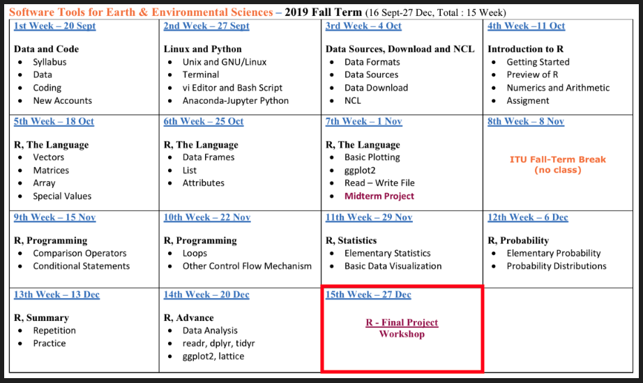
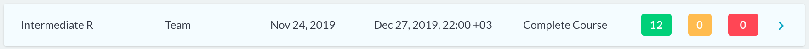
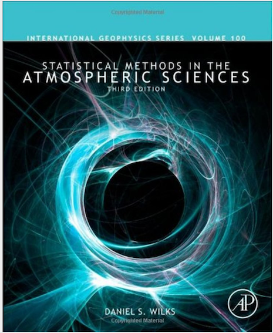
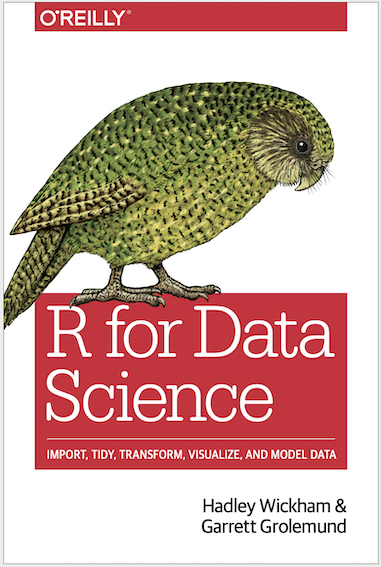

## **R FINAL PROJECT**

- **Syllabus**

- **Course Requirements**

- **DataCamp** **Class**

- **Next Term - Data Analysis**

- **ANKET**

- **FINAL**

## **Syllabus**

## **Course Requirements**

- **Absence**

- **Homeworks**

- **DataCamp** **Class**

- **FINAL**

## **DataCamp Class**

   

## **Next Term - Data Analysis**

 

## **ANKET**

https://emirtoker.github.io/Software_Tools_R_Github/index.html

## **FINAL**

1. Go to web page.
2. Click on **FINAL**, and start.
3. Don't talk to anybody for 1 hour.
4. We have 1 hour to complete the first 20 steps.
5. Mail me the **Project_1**, when you complete the first 20 steps. (tokerem@itu.edu.tr)
6. Continue for other steps. You have 2 hours for next 15.
7. Mail me the **Project_2**, with all. (tokerem@itu.edu.tr)

