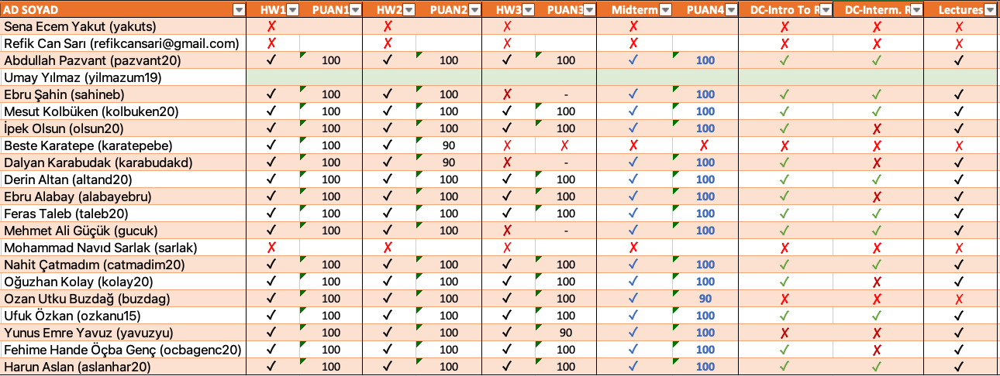
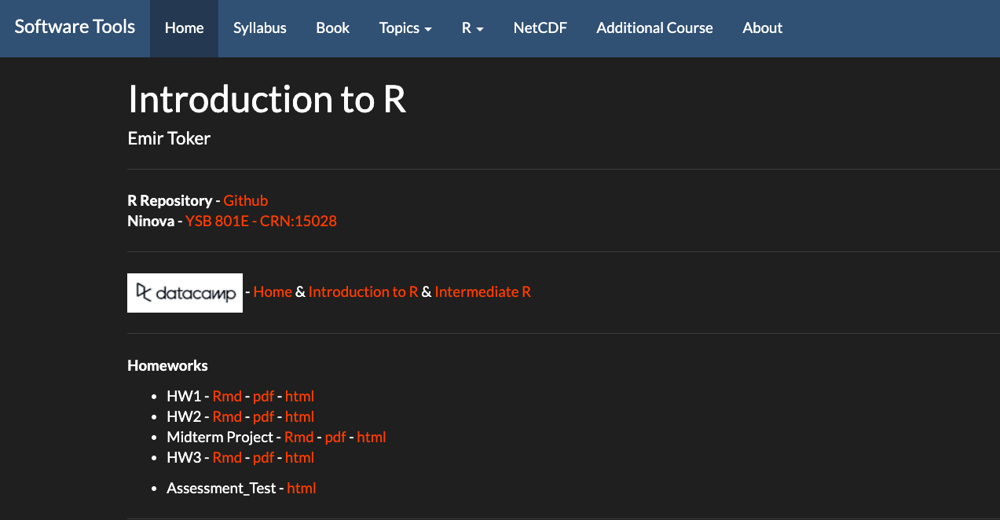
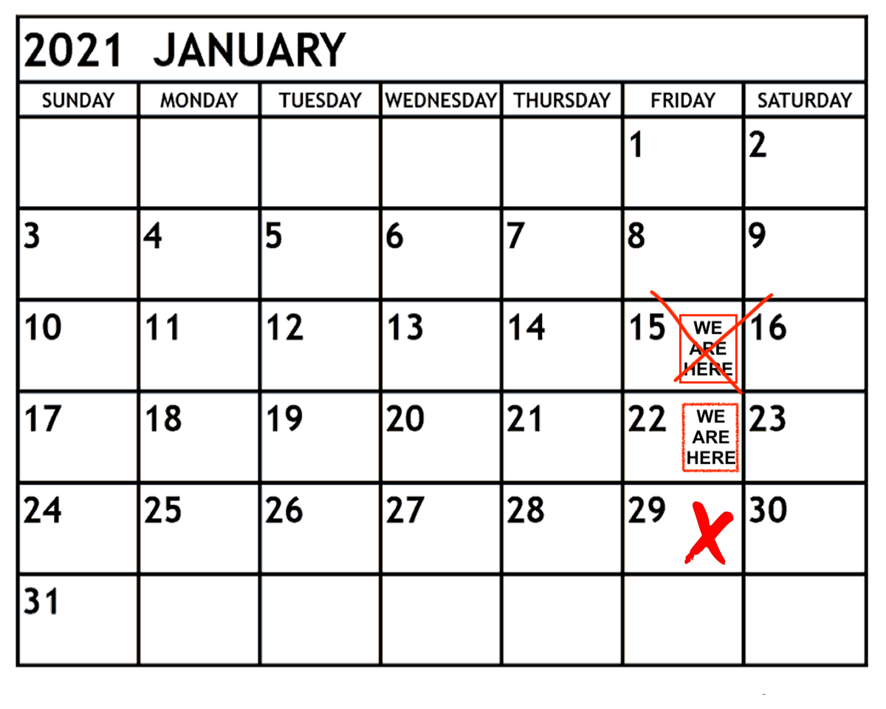

## **R FINAL PROJECT**

- **Syllabus**

- **Course Requirements**

- **Course Assessment**

- **Self Assesment Exam**

- **Netcdf Read and Plot**

- <span style="color:orangered">**Next Week**</span>


## **Syllabus**


## **Course Requirements**




## **Next Term - Data Analysis**

 


## **Course Assessment**


https://emirtoker.github.io/Software_Tools_R_Github/index.html


## **Self Assesment Exam**



https://emirtoker.github.io/Software_Tools_R_Github/index.html


# **Netcdf Read and Plot**

## **Netcdf Read and Plot**


{width=90%}

CRU_TR_Near-Surface_Temp_16-01-1901_16-12-2012_Monthly


## **R - NETCDF**

{width=90%}

CRU_TR_Near-Surface_Temp_16-01-1901_16-12-2012_Monthly


## **R - NETCDF**

```
install.packages("ncdf4")
install.packages("RNetCDF")
install.packages("maptools")
install.packages("fields")
```


## **R Advance - <span style="color:orangered">*ncdf4*</span> Package**


## **R Advance - <span style="color:orangered">*ncdf4*</span> Package**


```{r}
library(ncdf4)
ncdf4_open <- nc_open("cru_1901_2012_tmp_TR.nc")
ncdf4_open
```


## **R Advance - <span style="color:orangered">*RNetCDF*</span> Package**


## **R Advance - <span style="color:orangered">*RNetCDF*</span> Package**


```{r}
library(RNetCDF)
rnetcdf_open <- open.nc("cru_1901_2012_tmp_TR.nc")
print.nc(rnetcdf_open)
```


## R Advance - <span style="color:orangered">*ncdf4 *</span> VS <span style="color:orangered">*RNetCDF*</span>

<style>

.column-right0{
  float: right;
  width: 50%;
  text-align: right;
}
.column-left0{
  float: left;
  width: 50%;
  text-align: left;
}
</style>

<div class="column-left0">

```
ncdf4_open <- nc_open("data.nc")
class(ncdf4_open)
str(ncdf4_open)
attributes(ncdf4_open)
attributes(ncdf4_open$dim)
attributes(ncdf4_open$var)
attributes(ncdf4_open$var$tmp)

ncdf4_open$var$tmp$longname
ncdf4_open$var$tmp$name
ncdf4_open$var$tmp

```

```
ncatt_get(ncdf4_open,'tmp')
ncvar_get(ncdf4_open,"tmp")
ncdf4_tmp <- ncvar_get(ncdf4_open,"tmp")

class(ncdf4_tmp)
dim(ncdf4_tmp)
str(ncdf4_tmp)

attributes(ncdf4_open)
attributes(ncdf4_open$dim)
ncdf4_lon <- ncvar_get(ncdf4_open, ncdf4_open$dim$lon)
ncdf4_lat <- ncvar_get(ncdf4_open, ncdf4_open$dim$lat)
ncdf4_time<- ncvar_get(ncdf4_open, ncdf4_open$dim$time)

```

</div>


<div class="column-right0">

```
rnetcdf_open <- open.nc("data.nc")
class(rnetcdf_open)
str(rnetcdf_open)

rnetcdf_read <- read.nc(rnetcdf_open)
class(rnetcdf_read)
str(rnetcdf_read)
attributes(rnetcdf_read)

var.get.nc(rnetcdf_open,'tmp')
rnetcdf_tmp <- var.get.nc(rnetcdf_open,'tmp')

class(rnetcdf_tmp)
dim(rnetcdf_tmp)
str(rnetcdf_tmp)
```

```
attributes(rnetcdf_open)
attributes(rnetcdf_read)

rnetcdf_lon <- var.get.nc(rnetcdf_open, "lon")
rnetcdf_lat <- var.get.nc(rnetcdf_open, "lat")
rnetcdf_time<- var.get.nc(rnetcdf_open, "time")
```

</div>


## **R Advance - <span style="color:orangered">*ncdf4*</span> Package**


```
ncdf4_tmp <- ncvar_get(ncdf4_open,"tmp")
ncdf4_tmp[,,1]
ncdf4_tmp_first<- ncdf4_tmp[,,1]

image(ncdf4_lon, ncdf4_lat, ncdf4_tmp_first)
````


## **R Advance - <span style="color:orangered">*ncdf4*</span> Package**


```
library("maptools")

turkey_shp <- readShapePoly("turkiye.shp")

image(ncdf4_lon, ncdf4_lat, ncdf4_tmp_first)

plot(turkey_shp, add = T)

```


## **R Advance - <span style="color:orangered">*ncdf4*</span> Package**


```
library("fields")

image.plot( ncdf4_lon, ncdf4_lat, ncdf4_tmp_first, 
              xlab = "Lon", 
              ylab = "Lat", 
              main = "First Step (01-1901) Temperature for Turkey" )

plot(turkey_shp, add = T) 

```


apply(array1[,,index1],1:2,mean)


## **R - NETCDF**

``` 
image.plot( ncdf4_lon, ncdf4_lat, 
            apply(ncdf4_tmp[,,1332:1344],1:2,mean) - apply(ncdf4_tmp[,,1:1331],1:2,mean), 
            xlab = "Lon", 
            ylab = "Lat", 
            main = "? for Turkey" )
         
plot(turkey_shp, add = T) 
```


## **R - NETCDF**

```
image.plot( ncdf4_lon, ncdf4_lat, 
            apply(ncdf4_tmp[,,1332:1344],1:2,mean) - apply(ncdf4_tmp[,,1:1331],1:2,mean), 
            xlab = "Lon", 
            ylab = "Lat", 
            main = " 2012 VS Mean of 1901-2011 for Turkey" )
         
plot(turkey_shp, add = T) 
```


## <span style="color:orangered">**Next Week**</span>

# <span style="color:orangered">**Next Week**</span>


29 January 2020, 09:00-11:30


