```{r, echo=FALSE}
knitr::opts_chunk$set(error = FALSE)
```

```{r, include = FALSE}
knitr::opts_chunk$set(echo = FALSE)
```


## **Lecture 1 - Data and Code**

- **Course**

- **Data**

- **Code**

- **New Accounts**


# **Course**
- Syllabus
- Book

## **Objective**

* Introduction to software tools.

* Background for data analysis course

* Traditional 5-step process for the scientific method

1. Observation
2. Hypothesis
3. Experimental Design
4. **Data** collection
5. **Analysis** and Conclusion

## **Syllabus**


## **Extended Syllabus**

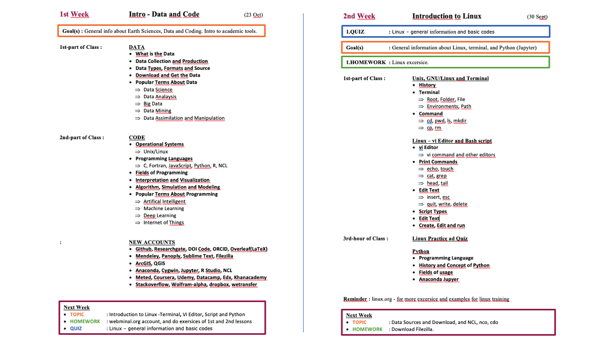 

[LINK](https://web.itu.edu.tr/~tokerem/Software_Tools_Syllabus.pdf)

## **Book**


[PDF](https://web.itu.edu.tr/~tokerem/The_Book_of_R.pdf)

## **Flow**

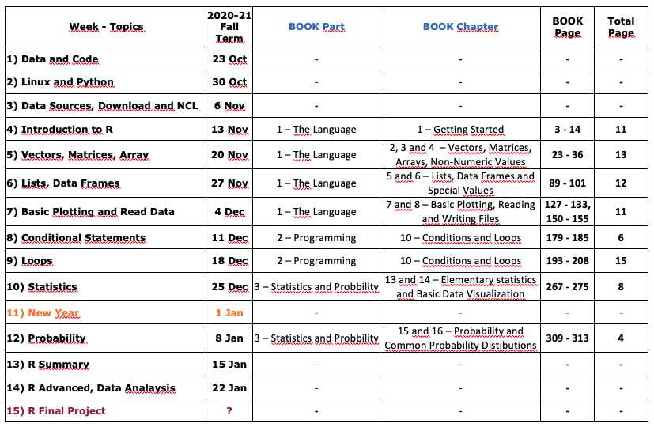

[LINK](https://web.itu.edu.tr/~tokerem/Software_Tools_Syllabus.pdf)


## **Course Github-Web Page**

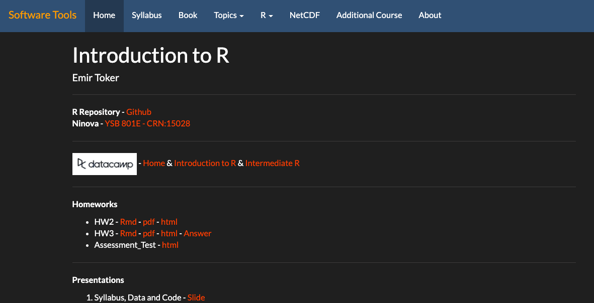


Google -> 'emir toker github' -> Software_Tools_R_Github

Then, at the bottom of the page you will see the course [LINK](https://emirtoker.github.io/Software_Tools_R_Github/index.html)

# **Data**


## **Data**
- What is the Data and Metadata?
- Data Collection and Generation
- Data Types, Formats and Sources
- Download and Get the Data
- Popular Terms About Data

## What is the Data and Metadata?

Data are things, known or assumed as facts, making the basis of reasoning or calculation.

  

Metadata is information about data.

## Metadata

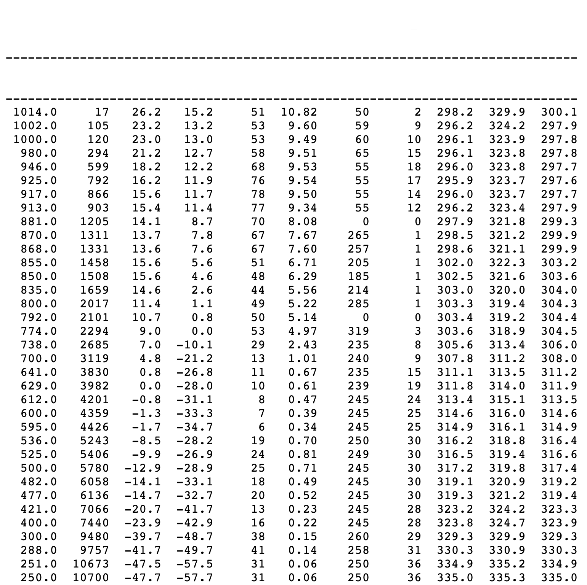

## Metadata


## Metadata


## Metadata


## Metadata


## Data Collection and Generation

Data collection is the process of gathering and measuring information on targeted variables in an established system. The purpose is to answer relevant questions or/and evaluate outcomes.

* Observational 
* Statistical 
* Simulation


## Data Types

In computer science and computer programming, a **data type** or simply **type** is an attribute of data.

 { width=30% }

What is the programmer's purpose? 

What is the nature of the data?

## Data Formats

* Text, Picture, Audio, Video
* File; pdf, txt, csv, html, xml, nc, hdf
* Point, Line, Polygon
* 1D, 2D, 3D, xD


## Data Sources

The location where data that is being used comes from.


[LINK](https://earthdata.nasa.gov/)

## Download and Get the Data

You can just click the **DOWNLOAD** button.

{ width=10% }

What if the size of data is very big and you need numerous data files like hundreds or thousands.


## Popular Terms About Data

- Data Analysis and EDA
- Big Data
- Data Mining
- Data Assimilation and Manipulation
- Data Scientist


## Data Analysis

Data analysis is a process of inspecting, cleaning, transforming and modeling data with the goal of discovering useful information, informing conclusions and supporting decision-making.

 

## Exploratory Data Analysis (EDA)

In statistics, exploratory data analysis (EDA) is an approach to analyzing data sets to summarize their main characteristics, often with visual methods.


## Big Data

Too large or complex data to be dealt with by traditional data-processing application and software.

 

Apache Point, New Mexico, US, 1995

ALMA, Atacama, Antofagasta Region, Chile

## Apache Point, New Mexico, US, 1995

After **one month**, the 'apache point' collected astronomical data as much as we have since the beginning of the earth.

After **ten years**, it collected data as much as we have. (not only astronomically, all data)


Important because of the golden rate.

## ALMA, Atacama, Antofagasta Region, Chile, 2011

66 high-precision antennas (over 100 tons for each), like 1 big teleschope. The antennas can be moved across the desert plateau over distances from 150 m to 16 km.

 { width=37% }  { width=28% }   { width=30% }

Atacama Large Millimeter/submillimeter Array, ALMA Transporter (130-ton) and Correlator (1.5 trillion/sec)

In 5 days it collects data as much as we have. Also we found the Black Body. 

## Data Mining

Data mining is the process of discovering patterns in large data sets.

{ width=42% } 

## Data Assimilation and Manipulation

Data assimilation is a mathematical discipline that seeks to optimally combine theory with observations. 

{ width=40% }  { width=31% } 

Data manipulation; inserting, deleting, and modifying data in a database.

Chemical and Physical

## Data Science

Data science is a multi-disciplinary field that uses scientific methods, processes, algorithms and systems to extract knowledge from structured and unstructured data.


# **Code**

## **Code**

words, letters, figures, or symbols

{ width=30% }

telegraph key /	morse alphabet / morse code (1835)

In computing *->* program instructions.

## **Code**

- Operating Systems
- Programming Languages
- Interpretation and Visualization
- Algorithm, Simulation and Modelling
- Popular Terms About Programming


## Operational Systems

An operating system (OS) is system software that manages computer hardware, software resources, and provides common services for computer programs.


Microsoft Windows, Apple macOS, Linux 

## Programming Languages

Programming language is a formal language and used in computer programming to implement algorithms.


{ width=38% }

Top 20 (256) most popular programming (2019-2020)

## Interpretation and Visualization

Interpretation is the process of making sense of the data that has been collected, analyzed, and presented. 

Visualization is the graphical representation of information and data.


##  Algorithm 

The algorithm is a set of instructions, typically to solve a class of problems or perform a computation.


## Simulation 

The simulation is an approximate imitation of the operation of a process or system; that represents its operation over time.


## Modelling

Model is a description of a system using mathematical concepts. The aim of modeling is to understand easier a particular part or feature of thing.


##  Popular Terms About Programming

-	Artificial İntelligence
-	Machine Learning
-	Deep Learning
-	Internet of Things

##  Artificial İntelligence

Artificial intelligence (AI) is the simulation of human intelligence processes by machines, especially computer systems. These processes include learning, reasoning and self-correction.


##  Machine Learning

Machine learning (ML) is the scientific study of algorithms and statistical models that computer systems use to perform a specific task without using explicit instructions.


1997, Deep Blue vs Garry Kasparov

##  Deep Learning

Deep learning is part of a family of machine learning methods based on artificial neural networks.


##  Internet of Things

The Internet of Things (IoT) is a system of interrelated computing devices, mechanical and digital machines. IoT has the ability to transfer data over a network without requiring human-to-human or human-to-computer interaction.


# **NEW ACCOUNTS**


## **NEW ACCOUNTS**

- Github, Researchgate, DOI Code, ORCID, Overleaf(LaTeX)
- Mendeley, Panoply, Sublime Text, Filezilla
- ArcGIS, QGIS
- Anaconda, Jupyter, Cygwin, R Studio, NCL
- Meted, Coursera, Udemy, Datacamp, Edx, Khanacademy
- Stackoverflow, Wolfram-alpha, Dropbox, Wetransfer


## Github

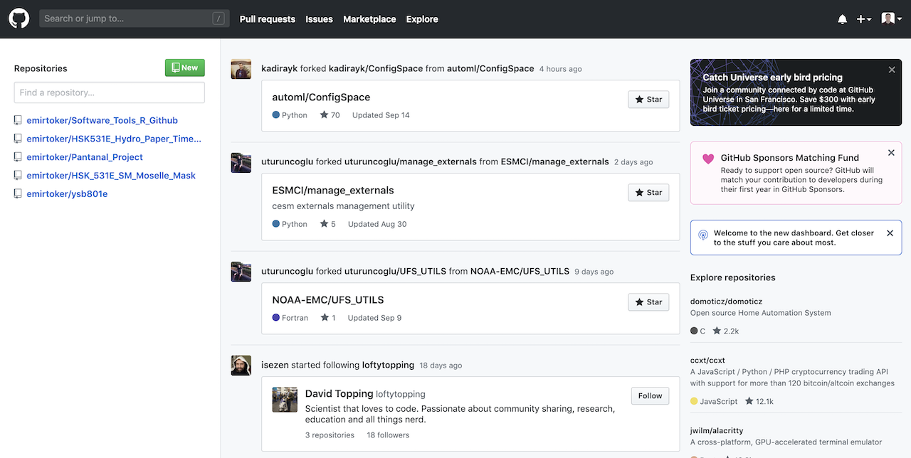

[LINK](https://github.com)

## Researchgate


[LINK](https://www.researchgate.net)

## DOI Code  - (digital object identifier) - Zenodo


[LINK](https://zenodo.org/)


## ORCID


[LINK](https://orcid.org/)


## Overleaf(LaTeX)


[LINK](https://www.overleaf.com/)


## Mendeley


[LINK](https://www.mendeley.com)


## Panoply


[LINK](https://www.giss.nasa.gov/tools/panoply/)


## Sublime Text


[LINK](https://www.sublimetext.com/)


## Filezilla


[LINK](https://filezilla-project.org/)


## ArcGIS


[LINK](https://www.arcgis.com/index.html)


## QGIS


[LINK](https://qgis.org/en/site/)


## Anaconda


[LINK](https://www.anaconda.com)


## Jupyter


[LINK](https://jupyter.org/install)


## Cygwin


[LINK](https://www.cygwin.com/)


## R Studio


[LINK](https://www.rstudio.com/)


## NCL


[LINK](https://www.ncl.ucar.edu/)


##  Meted


[LINK](https://www.meted.ucar.edu/)

## Coursera


[LINK](https://www.coursera.org)


## Udemy

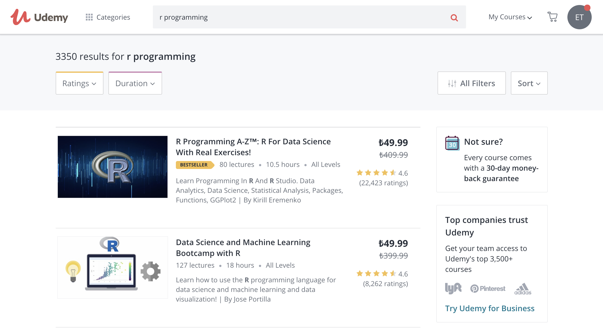

[LINK](https://www.udemy.com/)

## Datacamp

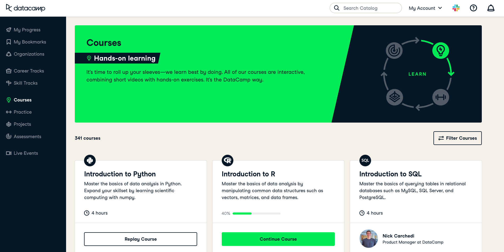

[LINK](https://www.datacamp.com/home)

## Edx


[LINK](https://www.edx.org)

## Khan academy

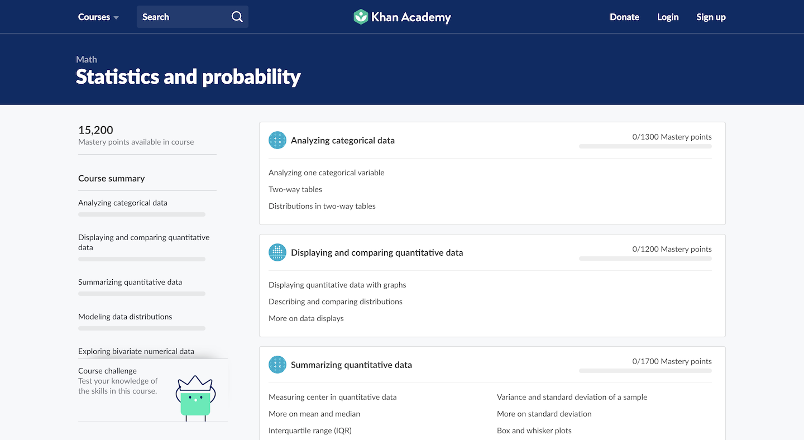

[LINK](https://www.khanacademy.org/)

## Stack overflow

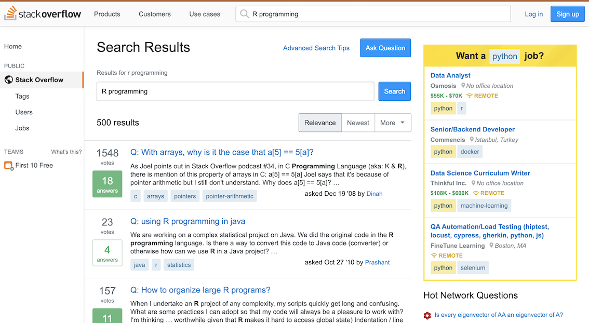

[LINK](https://stackoverflow.com/)


## Wolfram alpha


[LINK](https://www.wolframalpha.com/)


## Dropbox

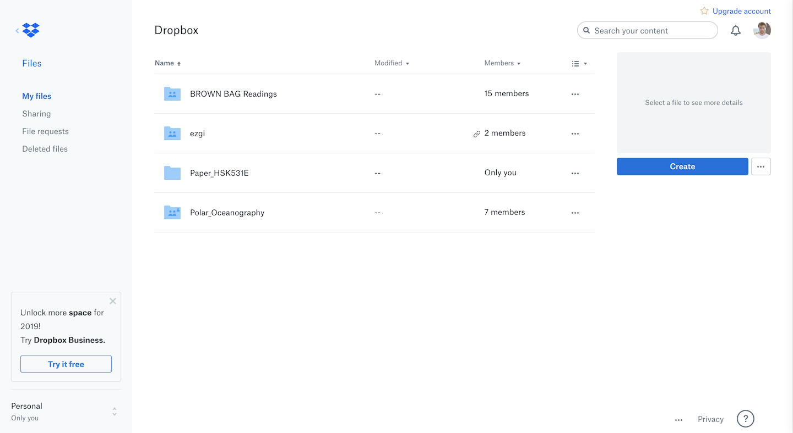

[LINK](https://www.dropbox.com/)


## Wetransfer

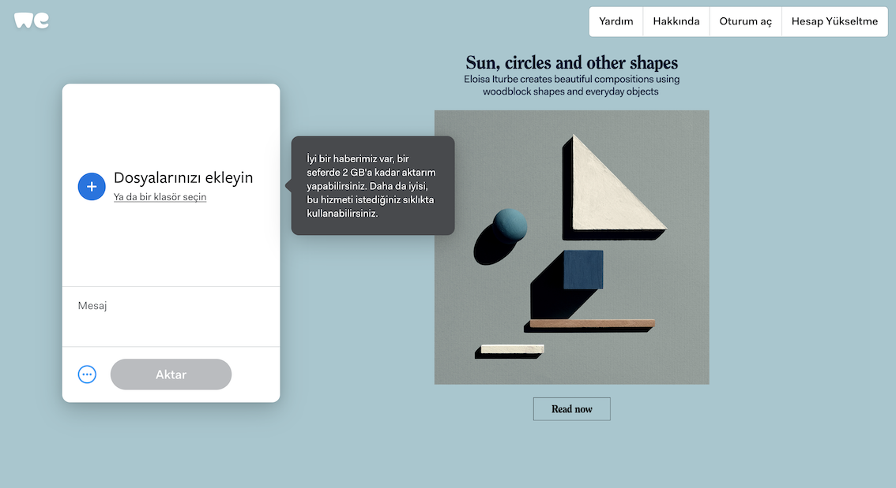

[LINK](https://wetransfer.com/)


## TeamViewer


[LINK](https://www.teamviewer.com/en-us/?t=1570379454764)


# **BY THE WAY**


## **I prepared this slide in R**

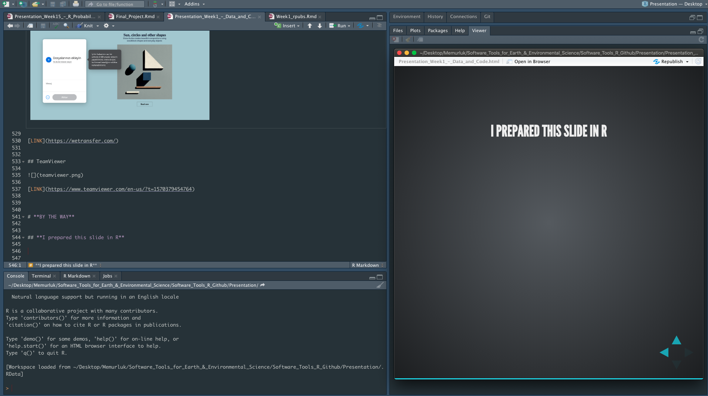

## **Also our course webside is prepared in R**


## **See you**

I will share these in Ninova

I let you know what we will do at the next week

- Quiz
- Homework

Also you can check the Extended Abstract

**

Question ?

**

**- THE END -**
