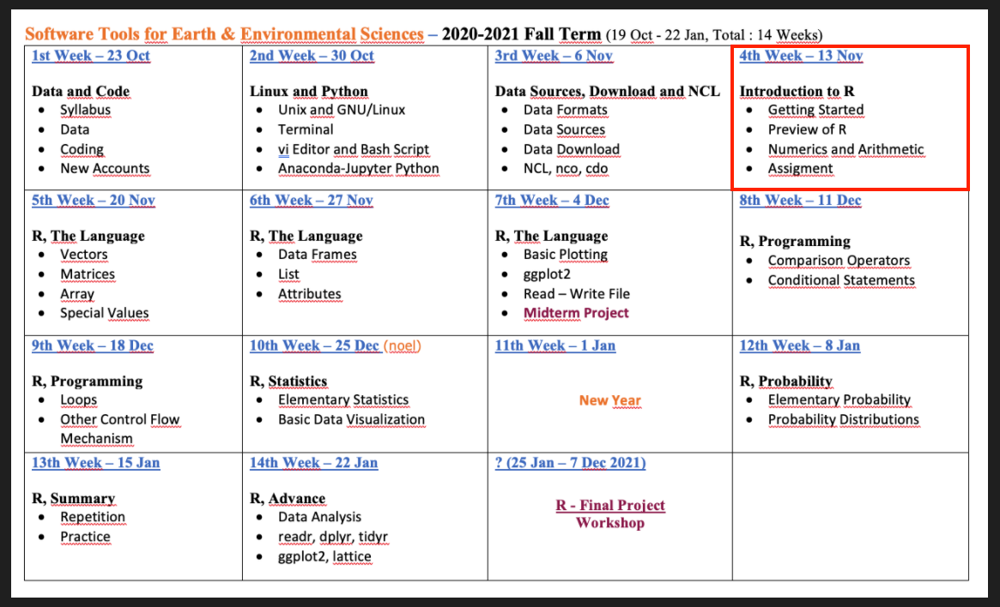
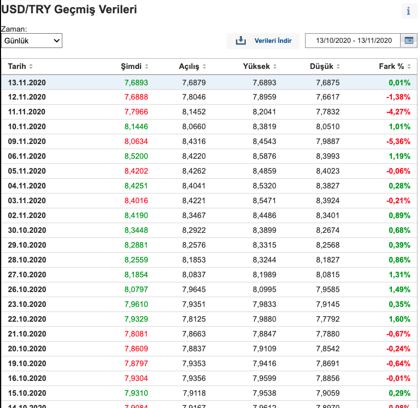
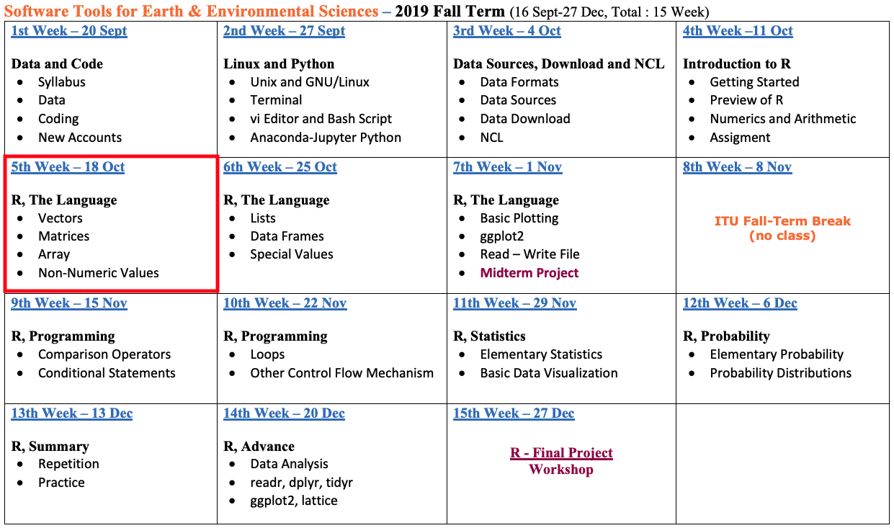
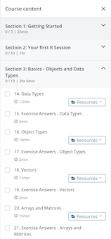

```{r, echo=FALSE}
knitr::opts_chunk$set(error = FALSE)
```

```{r, include = FALSE}
knitr::opts_chunk$set(echo = FALSE)
```


## **Introduction to R**

- **Syllabus, Last Week, Book and This Week**

- **R and RStudio**

- **Fields of Usage**

- **Preview of R Course**

- **Getting Started**

- **QUIZ**

- **Next Week**


# **Syllabus, Last Week, Book and Homework**


## **Syllabus**


Extended Syllabus [PDF](https://web.itu.edu.tr/~tokerem/Software_Tools_Syllabus.pdf)


## **Last Week**


Week 3 - Presentation [LINK](http://rpubs.com/emirtoker/software_tools_week3)


## **Book**

**The Book of R** - The Language - Getting Started 

(Part 1, Section 1, Pg. 3-14)

 

The Book of R - [PDF](https://web.itu.edu.tr/~tokerem/The_Book_of_R.pdf)

## **Homework for Today**

- **Download R and R Studio**
- <span style="color:green">**datacamp**</span> - **Introduction to R** - Intro to basics

 

##  **QUIZ**

R Language - Getting Started


# **R and RStudio**

## **R and RStudio**

- What is R?
- R History
- R and CRAN
- What is RStudio?
- RStudio Products


## **What is R?**

R is a **language**. It is a free software environment for statistical computing and graphics.

 


It is a **GNU project**.

Linux/UNIX, MacOS and Windows

*R version 4.0.3 has been released on 2020-10-10*

## **R History**

- **Bell Laboratories** are used for industrial research and scientific development.
- **S** is a statistical programming language, by John Chambers, Bell Laboratories, New Jersey, 1975–1976.
- **R** was created by **R**oss Ihaka and **R**obert Gentleman, (statisticians), **GNU** public license, the University of Auckland, New Zealand, 1992.

 


*Powerful but cheap graphics* - *Open Sources*


## **Milestones of R**

- 1991 - Statistical Models in S (White Book) was published.
- 1997 - The oldest R source was released on The Comprehensive R Archive Network (CRAN).
- 1997 - 3 mirrors and 12 packages.
- 1997 - R becomes an official part of the GNU Project.
- 1999 - "*update.packages*" and "*install.packages*" functions.
- 2001 - The first version for Mac OS X.
- 2010 - Support for Windows 64 bit systems.
- 2013 - Support for numeric index values 2^31 and larger on 64 bit systems.
- 2017 - Just-in-time compilation (JIT) of functions and loops (10 to 20 times faster).

*almost 20 years, and more than 10,000 R packages*

## **R Download and CRAN**

R Homepage - [LINK](https://www.r-project.org/)

The Comprehensive R Archive Network (CRAN) - [LINK](https://cran.r-project.org/mirrors.html)


*please choose a location close to you*


## **R Download and CRAN**

Turkey - Middle East Technical University Northern Cyprus Campus, Mersin - [LINK](https://cran.ncc.metu.edu.tr)


## **R**

 


## **What is RStudio**

An **Integrated Development Environment (IDE)** for R.


**RStudio Desktop** and **RStudio Server**

- *Developer(s) : RStudio, Inc.*
- *Initial release :	28 February 2011*
- *Stable release : 1.3.1903 / 18 September 2020*
- *Written in : Java, C++, JavaScript*


## **RStudio Desktop**


## **RStudio Cloud**

R studio anywhere using a web browser https://rstudio.cloud/


## **Other RStudio Products**


[https://rstudio.com/](https://rstudio.com/)

## **RStudio Desktop Download**


Download [LINK](https://rstudio.com/products/rstudio/download/)


## Any Problem About Installation ?


# **Fields of Usage**

## **Fields of Usage**

- **Data analysis**
    - Interpretation
    - Visualization
    - Manipulation

- **Statistical techniques**
    - Linear and nonlinear regression (or modelling)
    - Classical statistical tests
    - Time-series analysis
    - Classification and Clustering 
    - Correlation Analysis
    - etc.


## **Interpretation**

The process of making sense out of a collection of data.


## **Visualization**

Data visualization is the graphical representation of information and data.


## **Visualization**



## **Visualization**


## **Visualization**


*storms*


## **Manipulation**

The process of changing data to make it easier to read or be more organized.


*R dplyr scheme*


## **Linear and nonlinear Regression (or Modelling)**

Linear functions are those whose graph is a straight line.

y = f(x) = a + bx

Regression is a statistical method used to create a model.


## **Classical statistical tests**

Describe the distribution of data and to determine the reliability of a sample drawn from a population.

 

***Statistical significance tests** is used to inform judgments regarding whether the hypothesis is false or not false*


## **Time-series analysis**

Time series is a series of data points in which each data point is associated with a timestamp.


## **Classification and Clustering**

Classification and Clustering are characterize objects into groups by one or more features. 


***Classification** is used in a supervised learning technique which include predefined properties. **Clustering** is used in unsupervised learning based on group properties.*


## **Correlation analysis**

The measure of the strength and direction of the linear relationship between two variables.


## **Fields of Usage**

- **Facebook** – Update status and social network graph.
- **Google** – Calculate Return on Investment (ROI), predict the economic activity, improve the efficiency of online advertising.
- **New York Times** – Prepare graphics before printing.
- **Twitter** – R is part of Twitter’s Data Science toolbox for sophisticated statistical modeling.


# **Preview of R Course**

## **Preview of R Course**

- A Scientific Calculator 

- Classes and Data Structures 

- Create and Manipulation Data

- Reading, Writing and Plotting Data

- R Programming Structure

- Statistics and Probability

- Data Analysis Packages


# **Getting Started**

## **Getting Started**

- Using the RStudio

- R for Basic Math

- Assigning Objects

- Comments


## **Open Your RStudio**


***R*** You Ready ?!


# **Using the RStudio**


## **Using the RStudio**

 - Preferences
 - Project
 - File
     - Script
 - Undo, Redo, Replace and Find
 - Tools - New Terminal
 - View/Show Screens

## **Preferences**
*RStudio - Preferences - Appearance - Editor Theme*


## **New Theme**

*Functions, Parentheses, Quotation Marks  - Material*


## **Project**

*File - New Project*

*Don't Save Current Workspace - New Directory*


## **Project**


*New Project*


## **Project**


Directory Name - Create Project


## **NEW Project is Ready**


## **File**

*File - New File - Script*


## **File**

*File - New File - Script*


## **Undo, Redo, Replace and Find**

*Edit*


## **Tools - New Terminal**

*Tools - Terminal - New Terminal*


    
## **View/Show Screens**

*View - Zoom and Show ...*


## **Script**

*Save, Run*


## **Environment**

*Save, Import Dataset, Clean*


## **History**

*Save, Remove, Clean*


## **Console**

*Working Directory, Commands, Clean*

{width=80%} 

 - getwd() == pwd (linux command)
 - setwd("...") == cd (linux command)

## **Files**

*New Folder, Delete, Rename, Copy*


## **Plot**

*Before, Zoom, Export, Remove, Clean*


## **Packages**

*Install, Update*


## **Help**

*Topic / Word Search*


# R for Basic Math

## R for Basic Math

addition (**+**),
subtraction (**-**),
multiplication (**`*`**),
division (**/**)


## R for Basic Math

25 **`*`** 4 **+** 9 **/** 3 **-** 56


# Assigning Objects

## Assigning Objects

The assignment arrow (**<-**)


# Comments

## Comments

How to tell R to ignore a part of your code? (**#**)


## Comments

**Why we use Comments (or Comment Out Lines) ?**

- Help yourself and other people to reading the code and understand it faster:

```
# This code will calculate the probability that it will rain tomorrow

  rain_calculation()
```

- Ignore a line of code and see how a program will run without it:

```
# value <- old_code()

  value <- new_code()
```

## Save Your Script


# SUMMARY

## SUMMARY

- R is a language

- RStudio is an interface

- Script is a passive text

- Console is an interactive decoding area

- Math is pre-defined

- Assigment arrow ***<-***

- Comments (hashtag) ***#***


## **QUIZ**

R - Getting Started


<span style="color:pink">**kahoot.it**</span> 


# **Next Week**

## **Next Week - Syllabus**



## **Next Week - 5th Week**

- R Markdown and Notebook
- Arithmetics
- Help Functions and Install Packages
- Classes
- Vectors
- Matrices
- Arrays
- Non-Numeric Values

## **Next Week - Book**

*PART 1 - The Language - Section 2,3 and 4*

   

Pages : **23 - 36**


## **Next Week - Homework**

<span style="color:red">**udemy**</span> - Introduction to R, Section 1, 2 and 3 (Part 14 to 21)

 

LINK - [udemy](https://www.udemy.com/course/introduction-to-r/)


## **Next Week - Homework**

<span style="color:green">**datacamp**</span> - 2)Vectors and 3)Matrices


LINK - [datacamp](https://learn.datacamp.com/courses/free-introduction-to-r/)

## **Next Week - QUIZ**

R - Basic and Vectors


<span style="color:pink">**kahoot.it**</span> 


