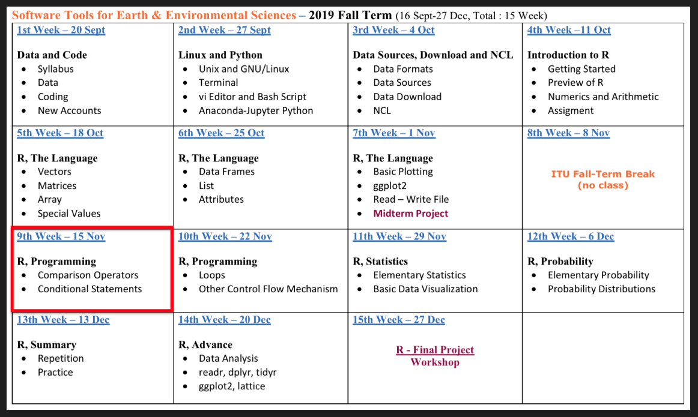

```{r, echo=FALSE}
knitr::opts_chunk$set(error = FALSE)
```

```{r, include = FALSE}
knitr::opts_chunk$set(echo = FALSE)
```


## **R Promgramming - Part 1**

- **Syllabus and Book**
- **DataCamp Class**
- **Repeat - R Language**
- **Practice - R Language**
- **Practice - Create a Function**

<span style="color:brown">**Coffee Break**</span>

- **R Programming - Conditions**
     - Comparison Operators
     - ***if*** Statement
     - ***else*** Statement
     - ***ifelse*** Statement

- **Next Week**

<span style="color:brown">**(Optional)**</span> <span style="color:brown">**Practice - MidTerm Project**</span>


# **Syllabus and Book**


## **Syllabus**


Extended Syllabus [PDF](https://web.itu.edu.tr/~tokerem/Software_Tools_Syllabus.pdf)

## **Book**

 

[PDF](https://web.itu.edu.tr/~tokerem/The_Book_of_R.pdf) - (179 - 185)


# **DataCamp - Class**

## **DataCamp**


[LINK](https://www.datacamp.com/home)

## **DataCamp**


My Class

## **DataCamp**


Home - My Class

## **DataCamp**


Team - Introduction to R

## **DataCamp**


Team Assignments !!  

## **DataCamp**


1000 XP - 1hour/Week

Related Chapters and Courses

## **DataCamp**


Each +100XP 

Take Hint -30 XP

## **DataCamp**


Introduction to R Course

4 hours

62 Excersize

6200 XP

*Also available on mobile*

## **DataCamp**


Search - "**R**"

## **DataCamp**


## **DataCamp**


Only "Intro" is Free

## **DataCamp**


But you can use all

## **DataCamp**


If you not a member of team

## **DataCamp**


You have to pay

## **DataCamp**


<span style="color:brown">`(1$ = 5,75 TL)`</span>

29$ `*` 5,75 TL `*` 6 Months `*` 1 Student= <span style="color:brown">**833,75 TL** </span>

833,75 TL `*` 25 Students = <span style="color:brown">**20.843,75 TL** </span>


# **R Language - Repeat**

## **R Language - Repeat**

 - **Create/Open R Project or R File**
 - **Basic Math, Assigment, Comment**
 - **Data Types - Classes**
     - Numeric
     - Integer
     - Logical
     - Character
 - **Data Structures - Objects**
     - Vector
     - Matrice
     - Array
     - Data Frame
     - List
 - **Special Values, Attributes**
    
    
# **Create/Open R Project or R File**

## **Project**

*File - New Project - New Directory*


## **Project**


*New Project*


## **Project**


*Directory Name - Create Project*

## **NEW Project is Ready**


## **File**

*File - New File - Script*


# **Basic Math, Assigment, Comment**

## **Basic Math, Assigment, Comment**

  - Arithmetic Operators ( +  -  *  /  ^ )
  
  - Scientific Math
  
  - Assignment Arrow (**<-**)

```
a <- 3.8
```

  - Comment Lines, Comment Out, Hash (**#**)
  
```
# value <- old_code()
value <- new_code()
```


# **Data Types - Classes**

## **Data Types - Classes**

  - Numeric
  - Integer
  - Logical
  - Character
  - Complex
  - Date
   
```
a <- 4
b <- 3:9
c <- 7L
d <- 1i
e <- 5 < -9
f <- "23"

date <- "2007-06-22"
date1 <- as.Date(date)
date2 <- as.Date("2004-02-13")

date1 - date2
## Time difference of 1225 days
```

## **Coercion**


# **Data Structures - Objects**
 
## **Data Structures - Objects**

  

     
     
## **Data Structures - Vector**

**c()** 


```{r, echo=TRUE}
spring_months <- c("March", "April", "May", "June")
spring_months[2] <- "new"
spring_months
```

```{r, echo=TRUE}
myvec1 <- c(1, 3, 1, 42)
a <- 35
myvec2 <- c(3L, myvec1, 1e+03, 64^0.5, 2+(3-1.1)/9.44, a)
myvec2
```

?lenght ?seq   ?round   ?rep   ?sort   ?runif   ?set.seed

## **Data Structures - Matrice**


matrix(data = ,nrow = ,ncol = )

```{r, echo=TRUE}
data <- runif(9,1,100)    
data
matrix <- matrix(data, nrow = 3, ncol = 3)
matrix
print(c(length(matrix),dim(matrix)))
```


## **Data Structures - Array**

array(data = ,dim = )

```{r, echo=TRUE}
data <- 1:24
array <- array(data, dim = c(4,3,2))    # raw, col, level
array
array[2,2,1]    # raw, col, level
```


## **Data Structures - Factor**

```{r, echo=TRUE}
gender = c("male", "female", "male", "male", "female")
gender
class(gender)
str(gender)
gender[2]
```

## **Data Structures - Factor**

```{r, echo=TRUE}
gender_factor <- factor(c("male", "female", "male", "male", "female"))
gender_factor
class(gender_factor)
str(gender_factor)
gender_factor[2]
```

## **Data Structures - Data Frame**

data.frame(data1,data2,data3...)

```{r, echo=TRUE}
person=c("Peter", "Lois", "Meg", "Chris", "Stewie")
age=c(42, 40, 17, 14 ,1)
sex=factor(c("M", "F", "F", "M", "M"))
married=c(TRUE, TRUE, FALSE, FALSE, FALSE)
df <- data.frame(person, age, sex, married)
df
str(df)
```


## **Data Structures - Data Frame**

data.frame(data1,data2,data3...)

```{r, echo=TRUE}
person=c("Peter", "Lois", "Meg", "Chris", "Stewie")
age=c(42, 40, 17, 14 ,1)
sex=factor(c("M", "F", "F", "M", "M"))
married=c(TRUE, TRUE, FALSE, FALSE, FALSE)
df <- data.frame(person ,age, sex, married, stringsAsFactors=FALSE)
df
str(df)
```

## **Data Structures - Data Frame**

data.frame(data1,data2,data3...)

```{r, echo=TRUE}
df[1]
df[[1]]       # df$person
df[[1]][1]
```


## **Data Structures - List**

list(data1,data2,data3...)

```{r, echo=TRUE}
matrix <- matrix(data=1:4,nrow=2,ncol=2)
vector <- c(T,F,T,T)
var <- "hello"
data_frame <- data.frame(person ,age, sex, married, stringsAsFactors=FALSE)
list  <- list(matrix,vector,var,data_frame)
list
```


# **Special Values, Attributes**

## **Special Values**

*NA, NaN, NULL, Inf*

```{r, echo=TRUE}
class(NA)     # Not Available (“missing” entity)
class(NaN)    # Not a Number
class(NULL)   # Null (“empty” entity)
class(Inf)     # Infinity

```
  
  
## **Attributes**

```{r, echo=TRUE}
person=c("Peter", "Lois", "Meg", "Chris", "Stewie")
age=c(42, 40, 17, 14 ,1)
sex=factor(c("M", "F", "F", "M", "M"))
married=c(TRUE, TRUE, FALSE, FALSE, FALSE)

data_frame <- data.frame(person ,age, sex, married, stringsAsFactors=FALSE)
data_frame

data_frame[2]
```

## **Attributes**


```{r, echo=TRUE}
attributes(data_frame)

attr(data_frame,"row.names") <- c("bir", "iki", "uc", "dort","bes")

data_frame
```

# **Practice - R Language**

## **Practice - R Language**

1. **Read** and **assign** your csv data (Header or seperator ?).
"18397_Cekmekoy_Omerli_15dk.txt"
2. Check the **class** and **structure** of your new data.
3. Take the ***"Temperature"*** parameter and **assign** it as a new variable.
4. **Plot** the "temperature" vector.
5. **Print** **minimum** temperature and find **which** element is the minimum in temperature vector.
6. **change** the minimum value with **NA** and **Print**.
7. **Plot** the new "temperature" vector.
8. Replace these **new** temperature values with **old** temperature values located in your data frame.
9. **Write** your data frame as a new csv file.

## **Practice - R Language**

1. **Read** and **assign** your csv data (Header or seperator ?).
"18397_Cekmekoy_Omerli_15dk.txt"

```{r, echo=TRUE}
mydata <- read.csv(file = "18397_Cekmekoy_Omerli_15dk.txt", 
                   header = TRUE, 
                   sep = ";")
mydata
```


## **Practice - R Language**

1. **Read** and **assign** your csv data (Header or seperator ?).
"18397_Cekmekoy_Omerli_15dk.txt"
2. Check the **class** and **structure** of your new data.
3. Take the ***"Temperature"*** parameter and **assign** it as a new variable.
4. **Plot** the "temperature" vector.
5. **Print** **minimum** temperature and find **which** element is the minimum in temperature vector.
6. **change** the minimum value with **NA** and **Print**.
7. **Plot** the new "temperature" vector.
8. Replace these **new** temperature values with **old** temperature values located in your data frame.
9. **Write** your data frame as a new csv file.

## **Practice - R Language**

2. Check the **class** and **structure** of your new data.

```{r}
class(mydata)
str(mydata)
attributes(mydata)
```


## **Practice - R Language**

1. **Read** and **assign** your csv data (Header or seperator ?).
"18397_Cekmekoy_Omerli_15dk.txt"
2. Check the **class** and **structure** of your new data.
3. Take the ***"Temperature"*** parameter and **assign** it as a new variable.
4. **Plot** the "temperature" vector.
5. **Print** **minimum** temperature and find **which** element is the minimum in temperature vector.
6. **change** the minimum value with **NA** and **Print**.
7. **Plot** the new "temperature" vector.
8. Replace these **new** temperature values with **old** temperature values located in your data frame.
9. **Write** your data frame as a new csv file.

## **Practice - R Language**

3. Take the ***"Temperature"*** parameter and **assign** it as a new variable.

```{r, echo=TRUE}
temp_data <- mydata$temp
temp_data
```


## **Practice - R Language**

1. **Read** and **assign** your csv data (Header or seperator ?).
"18397_Cekmekoy_Omerli_15dk.txt"
2. Check the **class** and **structure** of your new data.
3. Take the ***"Temperature"*** parameter and **assign** it as a new variable.
4. **Plot** the "temperature" vector.
5. **Print** **minimum** temperature and find **which** element is the minimum in temperature vector.
6. **change** the minimum value with **NA** and **Print**.
7. **Plot** the new "temperature" vector.
8. Replace these **new** temperature values with **old** temperature values located in your data frame.
9. **Write** your data frame as a new csv file.

## **Practice - R Language**

4. **Plot** the "temperature" vector.
```
plot(temp_data)
```


## **Practice - R Language**

1. **Read** and **assign** your csv data (Header or seperator ?).
"18397_Cekmekoy_Omerli_15dk.txt"
2. Check the **class** and **structure** of your new data.
3. Take the ***"Temperature"*** parameter and **assign** it as a new variable.
4. **Plot** the "temperature" vector.
5. **Print** **minimum** temperature and find **which** element is the minimum in temperature vector.
6. **change** the minimum value with **NA** and **Print**.
7. **Plot** the new "temperature" vector.
8. Replace these **new** temperature values with **old** temperature values located in your data frame.
9. **Write** your data frame as a new csv file.

## **Practice - R Language**

5. **Print** **minimum** temperature and find **which** element is the minimum in temperature vector.

```{r, echo=TRUE}
print(min(temp_data))

which(temp_data==min(temp_data))

which(temp_data==19.2)
```


## **Practice - R Language**

1. **Read** and **assign** your csv data (Header or seperator ?).
"18397_Cekmekoy_Omerli_15dk.txt"
2. Check the **class** and **structure** of your new data.
3. Take the ***"Temperature"*** parameter and **assign** it as a new variable.
4. **Plot** the "temperature" vector.
5. **Print** **minimum** temperature and find **which** element is the minimum in temperature vector.
6. **change** the minimum value with **NA** and **Print**.
7. **Plot** the new "temperature" vector.
8. Replace these **new** temperature values with **old** temperature values located in your data frame.
9. **Write** your data frame as a new csv file.

## **Practice - R Language**

6. **change** the minimum value with **NA** and **Print**.

```{r, echo=TRUE}
temp_data[which(temp_data==min(temp_data))] <- NA

temp_data[which(temp_data==19.2)] <- NA

temp_data[89] <- NA

print(temp_data)
```

## **Practice - R Language**

1. **Read** and **assign** your csv data (Header or seperator ?).
"18397_Cekmekoy_Omerli_15dk.txt"
2. Check the **class** and **structure** of your new data.
3. Take the ***"Temperature"*** parameter and **assign** it as a new variable.
4. **Plot** the "temperature" vector.
5. **Print** **minimum** temperature and find **which** element is the minimum in temperature vector.
6. **change** the minimum value with **NA** and **Print**.
7. **Plot** the new "temperature" vector.
8. Replace these **new** temperature values with **old** temperature values located in your data frame.
9. **Write** your data frame as a new csv file.

## **Practice - R Language**

7. **Plot** the new "temperature" vector.

```{r}
plot(temp_data)
```

## **Practice - R Language**

1. **Read** and **assign** your csv data (Header or seperator ?).
"18397_Cekmekoy_Omerli_15dk.txt"
2. Check the **class** and **structure** of your new data.
3. Take the ***"Temperature"*** parameter and **assign** it as a new variable.
4. **Plot** the "temperature" vector.
5. **Print** **minimum** temperature and find **which** element is the minimum in temperature vector.
6. **change** the minimum value with **NA** and **Print**.
7. **Plot** the new "temperature" vector.
8. Replace these **new** temperature values with **old** temperature values located in your data frame.
9. **Write** your data frame as a new csv file.

## **Practice - R Language**

8. Replace these **new** temperature values with **old** temperature values located in your data frame.

```{r, echo=TRUE}
mydata$temp <- temp_data

mydata
```


## **Practice - R Language**

1. **Read** and **assign** your csv data (Header or seperator ?).
"18397_Cekmekoy_Omerli_15dk.txt"
2. Check the **class** and **structure** of your new data.
3. Take the ***"Temperature"*** parameter and **assign** it as a new variable.
4. **Plot** the "temperature" vector.
5. **Print** **minimum** temperature and find **which** element is the minimum in temperature vector.
6. **change** the minimum value with **NA** and **Print**.
7. **Plot** the new "temperature" vector.
8. Replace these **new** temperature values with **old** temperature values located in your data frame.
9. **Write** your data frame as a new csv file.

## **Practice - R Language**

9. **Write** your data frame as a new csv file.

```{r, echo=TRUE}
write.csv(mydata, file = "new_data.csv")
```


# **Practice - Create a Function**

## **Practice - Create a Function**


Problem: Take a **sample** belonged to population, and **sum**


```{r, echo=TRUE}
pop <- 1:6                    # This is my population
pop

samp <- sample(pop, size = 2) # This is my sample, I choose two var.
samp

sum(samp)

```


## **Practice - Create a Function**


I want to create a new function named **roll**

```
my_new_function <- function() {

new_variable_1 <-     # number or something
new_variable_2 <-     # number or something
do_this()

}
```

```{r, echo=TRUE}
roll <- function() {
pop <- 1:6 
samp <- sample(pop, size = 2) 
print(samp)
sum(samp)
}
```

```{r, echo=TRUE}
roll()
```


## **Practice - Create a Function**


Problem: I want to assign a population spontaneously.

```{r, echo=TRUE}
roll_2 <- function() {
pop <- 
samp <- sample(pop, size = 2) 
print(samp)
sum(samp)
}
```

**roll_2()**   *# This will  give error. Because **pop** in undefined.*

```{r, echo=TRUE}
roll_2 <- function(pop) {
samp <- sample(pop, size = 2) 
print(samp)
sum(samp)
}

roll_2(pop = 1:27)
```


## **Practice - Create a Function**


You can add new options.
**{ }** and **()** are important

```{r, echo=TRUE}
sum(1:27)

# Think about these functions
# mean(), print(), plot(), max(), install.packages(), help(), ...
```


# **R Programming - Conditions**

## **R Programming - Conditions**

<style>

.column-right0{
  float: right;
  width: 50%;
  text-align: right;
}
.column-left0{
  float: left;
  width: 50%;
  text-align: left;
}
</style>

<div class="column-left0">

- **Comparison Operators **
    - equal (**==**)
    - not equal (**!=**)
    - greater or equal to (**>=**)
    - lower or equal to (**<=**)


- **Logical Operators **
    - the and operator (**&**)
    - the or operator (**|**)
    - the not operator (**!**)

- ***if*** (Stand-Alone) Statement
- ***else*** Statement
- ***ifelse*** Statement

</div>


<div class="column-right0">

```
TRUE & TRUE  
TRUE & FALSE
TRUE | FALSE 
!TRUE

2 == 3
5 < 6

c(1,4) >= 6

9 != 8

5 < 6 & 9 != 8
```
```
score <- 80
exam_no <- 2

score >= 75 | exam_no == 1

score>=75 & score<90 | exam_no==1
```
</div>

     
## ***if*** (Stand-Alone) Statement

The ***if statement*** executes a chunk of code if and only if a defined condition is **TRUE**, which looks something like this:


<style>
.column-left2{
  float: left;
  width: 50%;
  text-align: left;
}
.column-right2{
  float: right;
  width: 50%;
  text-align: right;
}
</style>

<div class="column-left2">

```{r, echo=TRUE}
if(TRUE) message("It was true!")

if(FALSE) message("It wasn't true!")
```
</div>

<div class="column-right2">

```{r, echo=TRUE}
a <- 3
num <- 4

if ( a <= num ) {
a <- a ^ 2
}

a
```
</div>


## ***if*** (Stand-Alone) Statement


```{r, echo=TRUE}
num <- -1

if ( num < 0 ) {
  print("num is negative.")
  print("Don't worry, I'll fix it.") 
  num <- num * -1
  print("Now num is positive.")
}
num
```


## ***if*** (Stand-Alone) Statement


## ***if*** (Stand-Alone) Statement


## ***else*** - Statement

If you want something different to happen when the condition
is **FALSE**, you can add an else declaration.


<style>
.column-left1{
  float: left;
  width: 60%;
  text-align: left;
}
.column-right1{
  float: right;
  width: 40%;
  text-align: right;
}
</style>

<div class="column-left1">

```{r, echo=TRUE}
if(FALSE)
    {
      message("This won't execute...")
} else
    {
      message("but this will.")
}
```
</div>

<div class="column-right1">

```{r, echo=TRUE}
a <- 3.5
dec <- 0.5

if (dec <= 0.5) {
  adec <- dec + 1
} else {
  adec <- dec
}

adec
```
</div>


## -***else ***-  and -***else if***- Statement


If your situation has more than two mutually exclusive cases, 
use **else** and **if** statements together.

```{r, echo=TRUE}
a <- 1 
b <- 1 

if (a > b) { 
  print("A wins!")
} else if (a < b) { 
  print("B wins!")
} else {
  print("Tie.")
}
```


##  Nesting and Stacking Statements

An ***if statement*** can be placed in another ***if statement***.
In the editor, modify the mynumber example once more as follows:


##  Nesting and Stacking Statements


##  Nesting and Stacking Statements


##  Nesting and Stacking Statements


##  Nesting and Stacking Statements


##  Practice - Conditions - TRUE and FALSE


1. **Print** this **if** it is **TRUE.**
"This message will print!"

```
if (...) {
  print(...)
} 
```
2. Go to sleep if it is TRUE, else wake up.

```
if (...) {
   print("Go to sleep!")
} else {
   print("Wake up!")
}
```

3. The variable message to *"I execute this when true!"* when the condition is **TRUE**.

```
if (...) {
  message <- "..."
  print(message)
} else {
  message <- "I execute this when false!"
  print(...)
}
```


##  Practice - Conditions - Logical Op

**Problem** : You are a CAR, and you are going on the road, BUT ;

```{r, echo=T}
Car_Stop_Light <- 'orange'
Number_of_Pedestrians <- 2
```

Remember rules

```
if (...) {
  print(...);
} else {
  print(...);
}
```

##  Practice - Conditions - Logical Op

**ANSWER** : You are a CAR, and you are going on the road, BUT ;

```{r, echo=T}
Car_Stop_Light <- 'orange'
Number_of_Pedestrians <- 2
```

Remember rules

```{r, echo=T}
if (Car_Stop_Light == 'green' & Number_of_Pedestrians ==0) {
  print('Go!');
} else {
  print('STOP');
}
```


##  Practice - Conditions - Logical Op

**Problem** : You want to enjoy, and let's say the day is;

```{r, echo=T}
day <- "Saturday"
```

It is okay, you can fun **if** it is **weekend**.
```
if (...) {
  print('Enjoy the weekend!')
} else {
  print('Do some work.')
}
```


##  Practice - Conditions - Logical Op

**ANSWER** : You want to enjoy, and let's say the day is;

```{r, echo=T}
day <- "Saturday"
```

It is okay, you can fun **if** it is **weekend**.
```{r, echo=T}
if (day == 'Saturday' | day == 'Sunday') {
  print('Enjoy the weekend!')
} else {
  print('Do some work.')
}
```


##  Practice - Conditions - Logical Op

**Problem** : You want to go out and your question is **"Should I take an umbrella?"**

- Check to see, if **"weather"** is **"equal"** to **"cloudy"** and, whether there is a **"high_chance_of_rain"**.
- **If** it is **both**, the code should assign the value of the variable **message** to be **"Take umbrella!"**
- **Otherwise**, the code should assign the value of the variable **message** to **"No need for umbrella!"**
- **Print** the **message** variable after the conditional statement. 
- Based on the condition, what should its value be?

**Note** : There are two variables in your code, 
**"weather"** and **"high_chance_of_rain"**

##  Practice - Conditions - Logical Op


```{r, echo=T}
# you want to go out and your question is "Should I take an umbrella?"

message <- 'Should I take an umbrella?'

weather <- "cloudy"

high_chance_of_rain <- TRUE
```

##  Practice - Conditions - Logical Op


```{r, echo=T}
# you want to go out and your question is "Should I take an umbrella?"

message <- 'Should I take an umbrella?'

weather <- "cloudy"

high_chance_of_rain <- TRUE
```

```
if (...) {
  message <- 'Take umbrella!'
  print(message)
} else { 
  message <- 'No need for umbrella!'
  print(message)
  }
```

##  Practice - Conditions - Logical Op


```{r, echo=T}
# you want to go out and your question is "Should I take an umbrella?"

message <- 'Should I take an umbrella?'

weather <- "cloudy"

high_chance_of_rain <- TRUE

if (weather == "cloudy" & high_chance_of_rain == TRUE) {
  message <- 'Take umbrella!'
  print(message)
} else { 
  message <- 'No need for umbrella!'
  print(message)
  }
```


# **Next Week**

## **Next Week**


Conditions and Loops, DataCamp

# <span style="color:brown">**(Optional) Practice - MidTerm Project**</span>


