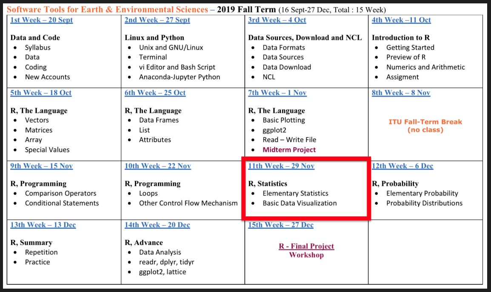
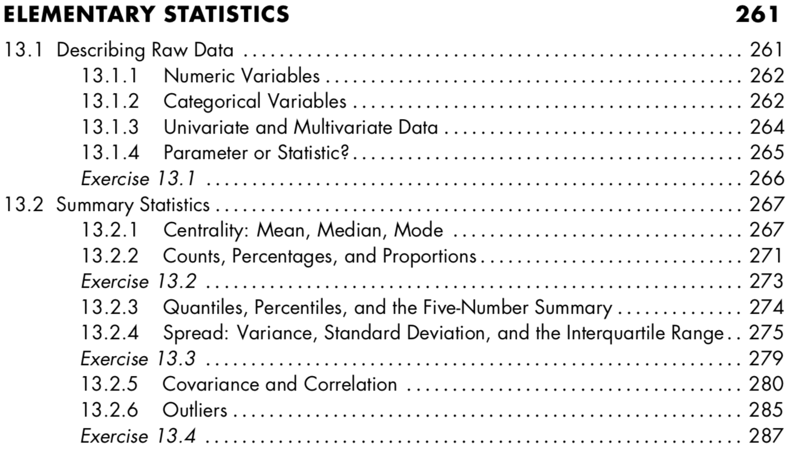
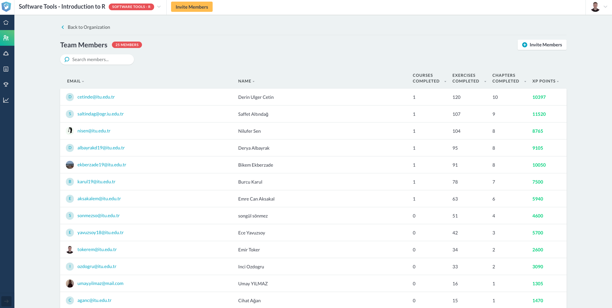

## **R Promgramming - Part 2**

- **Syllabus and Book**
- **DataCamp Class**
- **Practice - Assessment Test**
- **R Advance - *ncdf4* & *RNetCDF* Packages**

**Coffee Break**

- **R Elemantary Statistics**
- **Basic Data Visualization** 

**QUIZ**

- **Next Week**

# **Syllabus and Book**
## **Syllabus**

## **Book**

## **Book**

# **DataCamp Class**
## **DataCamp Class**

[LINK](https://www.datacamp.com/enterprise/software-tools-introduction-to-r)

# **Practice - Assessment Test**
## **Practice - Assessment Test**

1. Open Your R-Studio :)
2. Create a new **"R Project"**
3. Create a new **"R Script"** file and save it
4. Learn your **Working Directory**
5. Check **files**, under your working directory 
6. Create a **vector** with four **numeric** elements using **seq()**
7. **Assign** it to a new variable *(vec1)*
8. Check the **length** of vector
9. Calculate the **mean** of vector
10. Coerce your **numeric** vector to **characteristic** vector
11. Check the **class** of your new vetcor
12. **Print** the second element of your vector
13. **Change** the second element as "TRUE", assign it as ***vec1***

## **Practice - Assessment Test**

14. Create a new **vector** with 12 elements using **runif()**
15. Assign it as ***vec2***
16. Create a new **matrix**, 3 rows, 4 columns using this vector
17. **Assign** this matrix as a new variable
18. Check **dimensions** of this matrix
19. Create a new matrix (4x4) with using ***vec1*** and ***vec2***
20. Explain what is happening (bycol or byrow)
21. Create the same matrix again, this time with **byrow=T**
22. Assign it as ***mat1***
23. Create a new **array** with 4 rows, 4 columns and 2 layers using ***mat1***
24. Assign it as ***arr1***
25. **Select** 2nd row, 3rd column and change it with ***NA*** for each layers

## **Practice - Assessment Test**

26. Go to main web page of our course
27. Copy this data : Istanbul_Cekmekoy_Omerli_26072017-29072017_15min - txt
28. Paste your **"Download"** folder
29. Turn back to R Studio
30. **Read** the station data, be careful about file **path**, **header** and **seperator**
31. Assign it as **sta_data**
32. Check the **structure** and **attributes** of **sta_data**
33. **Print** and **plot** *precipiptation* of ***sta_data***
34. Write a **condition**; **if** total precipitation is **higher** than zero than **print** "Weather was rainy"
35. Install & load "ncdf4", "RNetCDF" and "ggplot2" packages

## NETCDF

## NETCDF - Data and Packages

[LINK](https://emirtoker.github.io/Software_Tools_R_Github/netcdf.html)

#  **R Elemantary Statistics**
##  **R Elemantary Statistics**

##  **R Elemantary Statistics**

[LINK](https://emirtoker.github.io/Software_Tools_R_Github/r_statistics.html)

#  **Basic Data Visualization** 
##  **Basic Data Visualization** 

[LINK](https://emirtoker.github.io/Software_Tools_R_Github/r_statistics.html)

