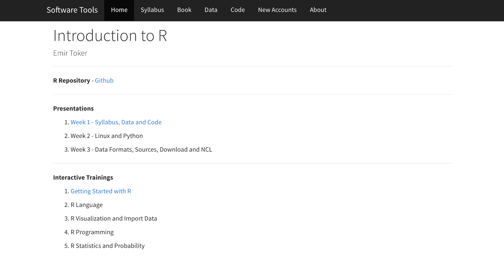

```{r, echo=FALSE}
knitr::opts_chunk$set(error = FALSE)
```

```{r, include = FALSE}
knitr::opts_chunk$set(echo = FALSE)
```


## **Linux and Python**

- **Syllabus, Book and Last Week**

- **Unix, Gnu/Linux and Terminal**

- **Python and Jupyter**


# **Syllabus, Book and Last Week**


## **Syllabus**


Extended Syllabus [PDF](https://web.itu.edu.tr/~tokerem/Software_Tools_Syllabus.pdf)

## **Book**


The Book of R - [PDF](https://web.itu.edu.tr/~tokerem/The_Book_of_R.pdf)

## **Last Week**


Course Home Page [LINK](https://emirtoker.github.io/Software_Tools_R_Github/index.html)

Week 1 - Presentation [LINK](http://rpubs.com/emirtoker/software_tools_week1)


# **Unix, Gnu/Linux and Terminal**

## **Unix, Gnu/Linux and Terminal**

- **What is Unix?**
- **What is GNU?**
- **What is Linux (or GNU/Linux) ?**
- **How is Unix different from Linux?**
- **GNU/Linux Distributions**
- **Terminal**
- **Basic GNU/Linux Commands**
- Practice and Quiz

[Web Link](https://emirtoker.github.io/Software_Tools_R_Github/unix_linux.html)


# **Python and Jupyter**


## **Python and Jupyter**

- **What is the Python**
- **Python in Terminal**
- **What is the Anaconda/Jupyter**
- **Python in Anaconda/Jupyter**

[Web Link](https://emirtoker.github.io/Software_Tools_R_Github/unix_linux.html)

# **Next Week**

## **Next Week**

- Data Fortmats, Sources and Download

- NCL, nco, cdo


