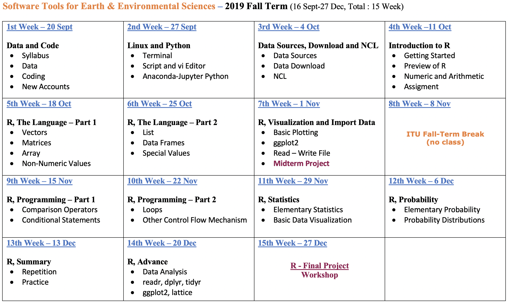
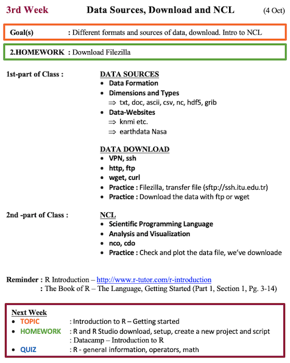
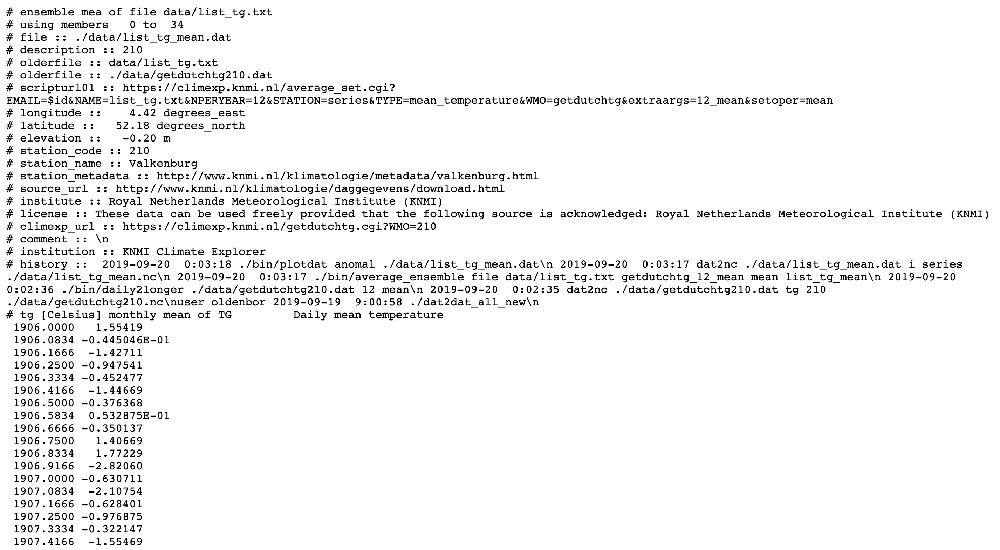
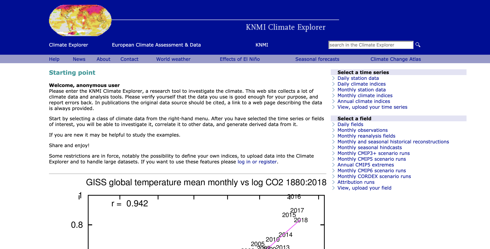
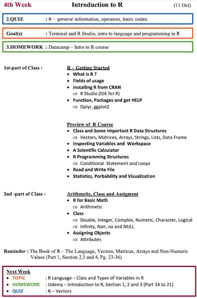
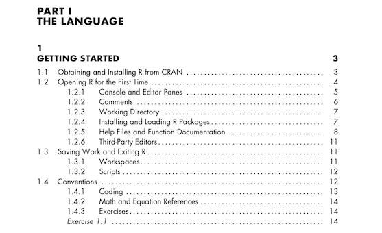

```{r, echo=FALSE}
knitr::opts_chunk$set(error = FALSE)
```

```{r, include = FALSE}
knitr::opts_chunk$set(echo = FALSE)
```


## **Data Sources-Download and NCL**

- **Syllabus, Book and Last Week**

- **Data and Metadata**

- **Data Formats**

- **Data Sources**

- **Data Download**

- **NCL, nco and cdo**

- **Next Week**


# **Syllabus, Book and Last Week**


## **Syllabus**


Extended Syllabus [PDF](https://web.itu.edu.tr/~tokerem/Software_Tools_Syllabus.pdf)

## **Book**


The Book of R - [PDF](https://web.itu.edu.tr/~tokerem/The_Book_of_R.pdf)

## **Last Week**


Course Home Page [LINK](https://emirtoker.github.io/Software_Tools_R_Github/index.html)

Week 2 - Presentation [LINK](http://rpubs.com/emirtoker/software_tools_week2)

## **3th Week - Extended Syllabus**



## **Repeat - Linux**


[webminal.org](https://www.webminal.org/)


## **Repeat and Practice**

- **Direction Commands**
    - <span style="color:red">**pwd**</span> *(**P**rint **W**orking **D**irectory)*
    - <span style="color:red">**ls**</span> *(**L**ist **D**irectories)*
    - <span style="color:red">**cd**</span> *(**C**hange **D**irectory)*
    - <span style="color:red">**mkdir**</span> *(**M**ake **D**irectory)*

- **File Commands**
    - <span style="color:red">**touch**</span>
    - <span style="color:red">**cat**</span> *(Concatenate)*
    - <span style="color:red">**rm**</span> *(Remove)*
    - <span style="color:red">**cp**</span> *(Copy)*
    - <span style="color:red">**mv**</span> *(Move)*
    
- **vi command**
    - <span style="color:red">**esc**</span> and <span style="color:red">**i**</span>
    - <span style="color:red">**:q**</span> and <span style="color:red">**:q!**</span> and <span style="color:red">**:qw**</span>
    

## **Practice**

1. **Learn where you are** *(Print your working directory)*
2. **Look at inside** *(list all documents and directories)*
3. **Create a new folder** *(make a directory,`<my_new_dir>`)*
4. **Go to the `<my_new_dir>`** *(change your directory)*
5. **Create a new file** *(touch it, file name : `<my_new_file>`)*
6. **Open your file with text editor** *(vi `<my_new_file>`)*
7. **Activate Insert mode** *(with i)*
8. **Write this line: <echo hello there>**
9. **Write/Save and Quit** *(:wq)*
10. **Change your new file name** *(move `<my_new_file.sh>`)*
11. **Run the script `<my_new_file.sh>`** *(bash .sh)*
12. **Turn back parent directory** *(cd ..)*
13. **Delete all files and folders** *(remove -rf)*


    
    
    
    
    
    
    
    

# **Data and Metadata**

## **What is Data?**

Data are things, known or assumed as facts, making the basis of reasoning or calculation.

  


## **What is Metadata?**

Metadata is information about data.


## **What is Metadata?**




# **Data Formats**

## **Data Formats**

  - **Data Types**

  - **Data Set**

  - **Data Formats**


[LINK](https://emirtoker.github.io/Software_Tools_R_Github/data.html)

*scroll down*


# **Data Sources**

## **Data Sources**

  - Earthdata
  - KNMI
  - Wordclim
  - ERA
  - GFS
  - ESGF
  - CRU
  - E-OBS
  
[LINK](https://emirtoker.github.io/Software_Tools_R_Github/data_sources.html)


# **Data Download**

## **Data Download**

  - Click
  - ftp, sftp, https, ssh
  - wget


## **Click**



[KNMI Climate Explorer](http://climexp.knmi.nl/start.cgi)


## **ftp, sftp, https**

- ftp - File Transfer Protocol 
- sftp - Secure File Transfer Protocol
- https - Hypertext Transfer Protocol Secure
- ssh - Secure Shell

## **BONUS - FileZilla**

```
ssh.itu.edu.tr
```


# **cdo, nco and NCL**

## **cdo, nco and NCL**

  - cdo
  - nco
  - NCL


[LINK](https://emirtoker.github.io/Software_Tools_R_Github/ncl.html)
  
  
  

# **Next (4th) Week**

## **Syllabus**


## **Extended Syllabus**

 


## **BOOK**

**The Book of R** - The Language - Getting Started 

(Part 1, Section 1, Pg. 3-14)

 


The Book of R - [PDF](https://web.itu.edu.tr/~tokerem/The_Book_of_R.pdf)


## **Homework**

- **Download R and R Studio**

<span style="color:red">**Udemy**</span> - R Basics - [LINK](https://www.udemy.com/course/r-basics/)

 

- **Introduction to R** 

<span style="color:red">**Datacamp**</span> - Introduction to R - Intro to basics
(FREE) - [LINK](https://www.datacamp.com/courses/free-introduction-to-r)


## **QUIZ**

**R - Getting Started**


