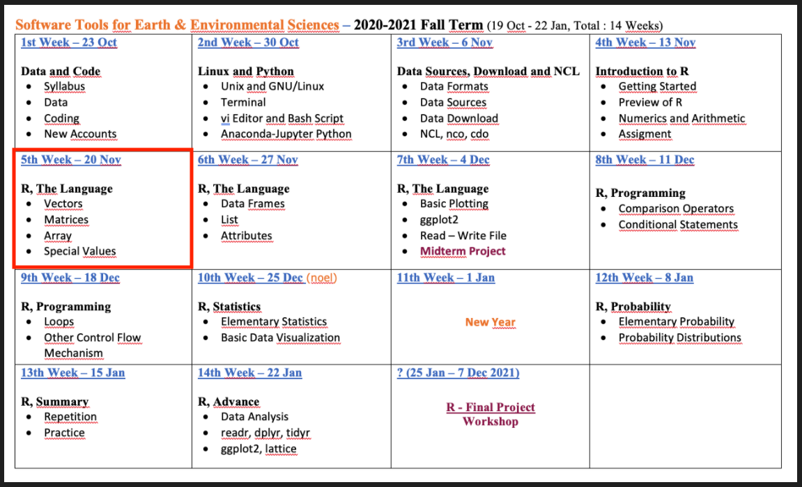
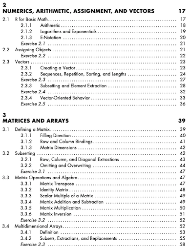
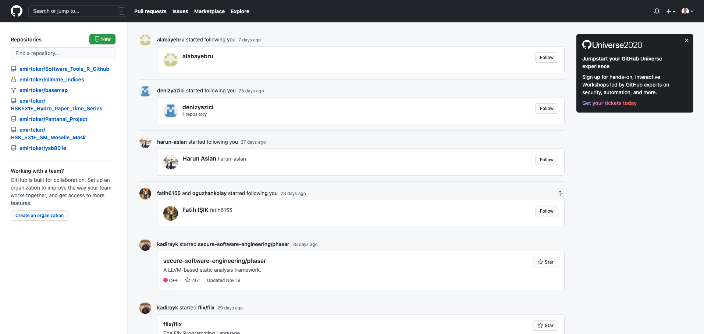
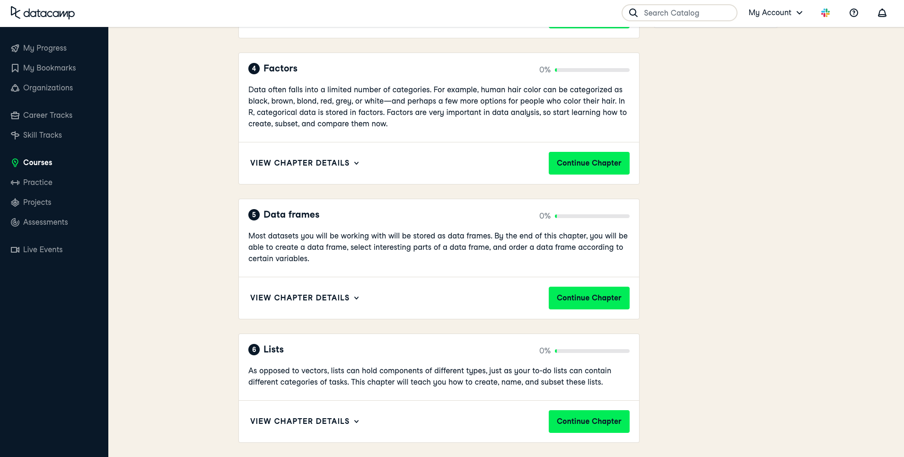

```{r, echo=FALSE}
knitr::opts_chunk$set(error = FALSE)
```

```{r, include = FALSE}
knitr::opts_chunk$set(echo = FALSE)
```


## **R Language - Part 1**

- **Syllabus, Last Week, Book and This Week**

- **R - Script, Notebook and Markdown**

- **GitHub**

- **R Language**
    - Class
    - Vectors 
    - Matrice
    - Arrays

- **PRACTICE, SUMMARY and QUIZ**

- **Next Week**


# **Syllabus, Last Week, Book and This Week**


## **Syllabus**


Extended Syllabus [PDF](https://web.itu.edu.tr/~tokerem/Software_Tools_Syllabus.pdf)


## **Last Week**


Week 4 - Presentation [LINK](http://rpubs.com/emirtoker/software_tools_week4)

- *assigment* **`<-`**
- *comments* **`#`**

## **Book**

 

(Pg. 22-27)


# **R Files**

## **R Files**

[LINK](https://emirtoker.github.io/Software_Tools_R_Github/r_and_rstudio.html)

Scroll down :)


# **GitHub**

## **GitHub**


[LINK](https://github.com/)

## **GitHub**



## **GitHub**


## **GitHub**


# **R Language**

## **R Language**

- Scientific Calculator

- Class

- Vectors 

- Matrices

- Arrays


[LINK](https://emirtoker.github.io/Software_Tools_R_Github/r_language.html)


# **Practice, Summary and QUIZ**


## **Practice**

**Scientific Calculator**


## **Practice**

**Scientific Calculator**

Problem: Compute double, triple or higher order integrals

 

```
install.packages("cubature")
library(cubature)

f <- function(x) 1
adaptIntegrate(f,lowerLimit = c(0,0,0),upperLimit = c(4,4,4))
```

```
$integral
[1] XX
```

## **BONUS**

**What is Function ?**

A function is a set of statements organized together to perform a specific task

ex: **mean()** (arithmetic mean)
```
x <- c(1,2,3)
mean(x)
```

```
(1+2+3) / 3
```


## **Practice**

**Create a Function**

Problem: Take a sample belonged to population and sum

```
pop <- 1:6                    # This is my population
samp <- sample(pop, size = 2) # This is my sample, I choose two var.
sum(samp)
```
```
pop
samp
```

I want to create a new function named ***roll()***
```
roll <- function(pop) {
pop <- 1:6 
samp <- sample(pop, size = 2) 
sum(samp)
}
```
```
roll()
```


## **Practice**

**Problem**: I want to define population myself, in every time.
*remove pre-defined population and changed the name* ***pop*** *to* ***box*** *?*

```
roll2 <- function(box) {
samp <- sample(box, size = 2) 
sum(samp)
}
```
```
roll2(box)
```
box ?
```
box = 1:6
roll2(box)

roll2(box = 1:6)
roll2(1:6)
```

## **Practice**

**Create a Function**


- You can add new options
- { } and () are important


## **Practice**

1. Print your name as a character string.
2. Print your age as a numeric type.
3. Print your age as a character type.

*print()*

4. Create a numeric vector with your favorite numbers.
5. Check the lenght of the vector, *lenght()*.
6. Choose the last element (indexing) with []. 
7. Create 4 × 2 matrice, fill with numbers
8. Delete first row. (minus indexing)
9. Generate 48 random number and assign it, *runif()*.
9. Create and store a three-dimensional array with six layers of a
4 × 2 matrice, and fill it with these random numbers.


## **Summary**

- Arithmetic Operators ( +, -, /, x )
- Logical Operators ( <, >, ==, != ....)
- Special Values ( NULL, Nan, NA, Inf)
- Vector, Matrice, Array (1d and Homogeneous)
- **class()**, **print()**, **seq()**, **runif()**
- **c()**, **[]**
- **?**xxx or **help(**xxx**)**
- **install.packages()**, **library()**

## **QUIZ**

R Language - Part-I


https://kahoot.it/


# **Next Week**

## **6th Week - R Language Part 2**

List - Data Frame - Attributes - ATMOS

## **Homework**

Udemy – Introduction to R, Section 3 (Video 22-25)


[LINK](https://www.udemy.com/course/introduction-to-r/)


## **Homework**




LINK - [datacamp](https://learn.datacamp.com/courses/free-introduction-to-r/)


## **Take Home - HOMEWORK-I**

{width=60%} 

- Create a new R notebook
- Write your name
- Create a new vector, matrice and array
- Create a new function

## **Quiz**

R Language - Part-II


List and Data Frame

