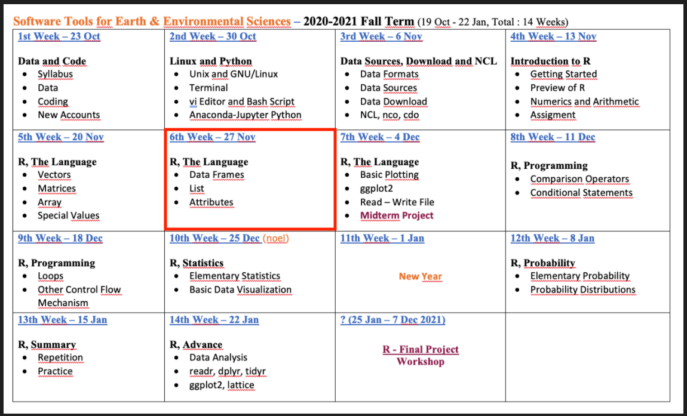
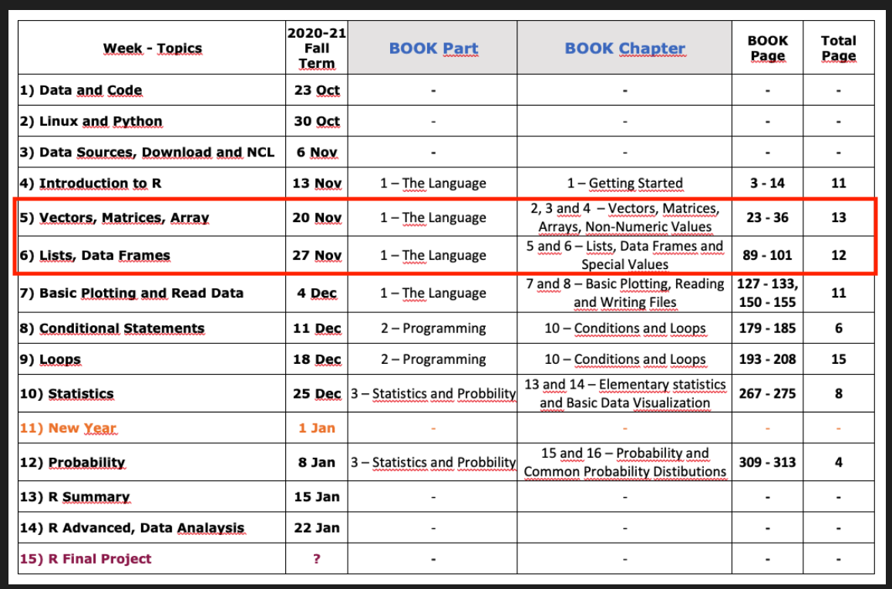
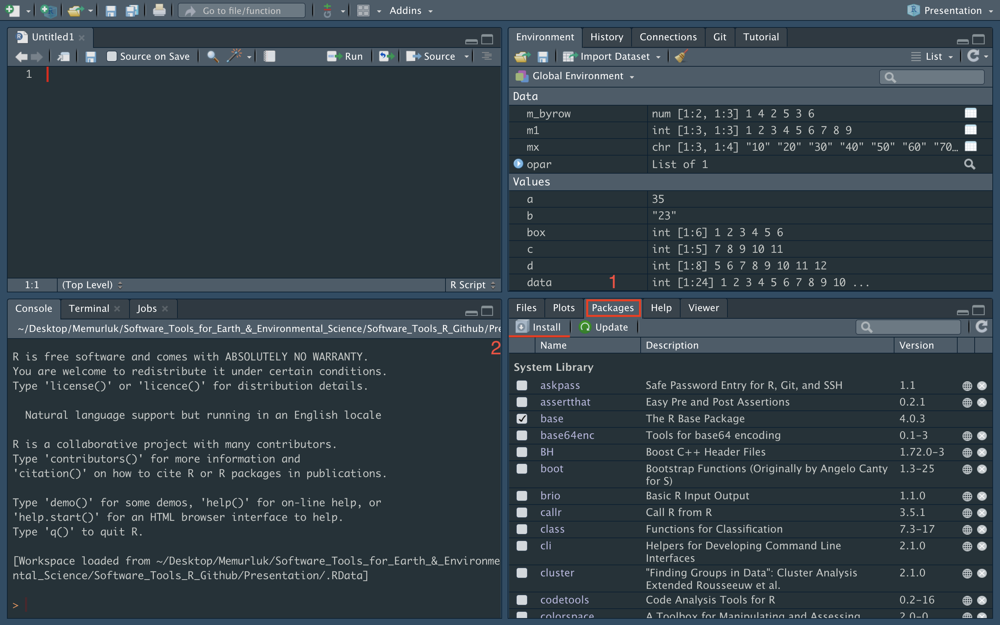
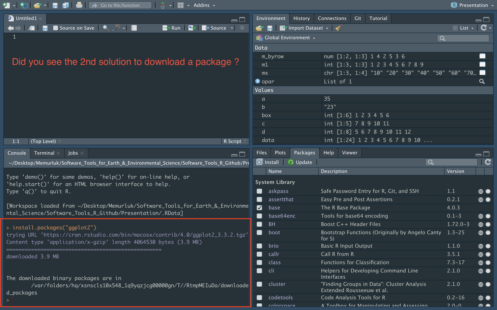
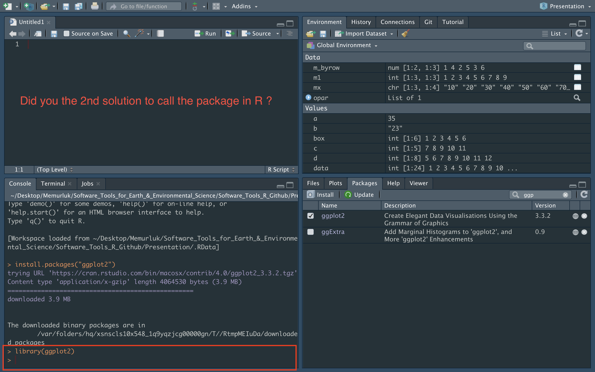
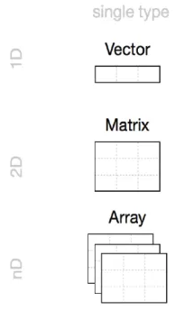
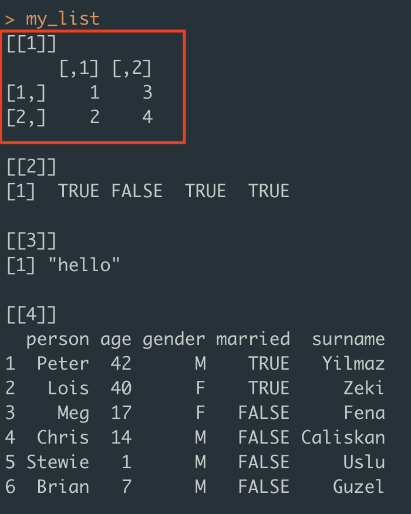
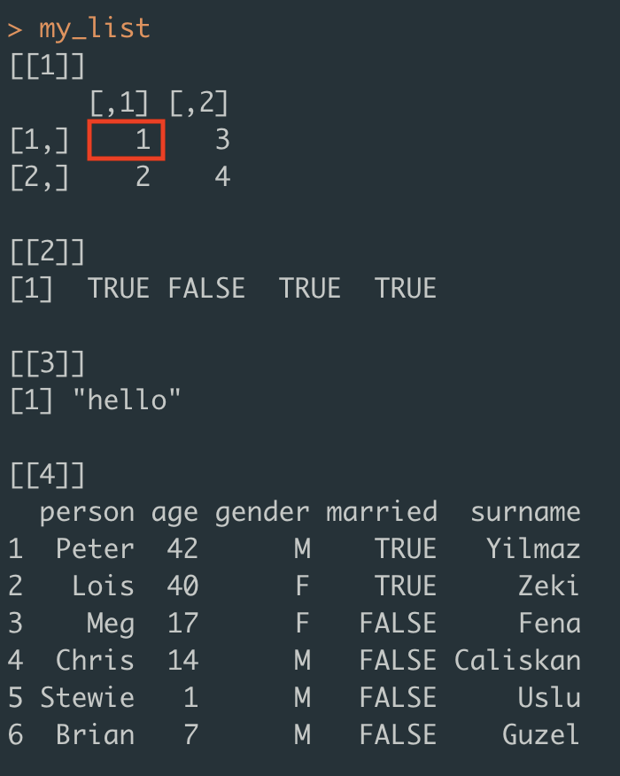

```{r, echo=FALSE}
knitr::opts_chunk$set(error = FALSE)
```

```{r, include = FALSE}
knitr::opts_chunk$set(echo = FALSE)
```


## **R Language - Part 1 & 2**

- **Syllabus, Last Week and Book**

- **This Week**
  -   R Language Part-1 : *Data Types (Repeat)*
  -   R Language Part-2 : *Data Structures*
  - **Take Home**
    - HMW-1 : *Create a New R-Notebook*
    - HMW-2 : *Practice for Data Types and Data Structures*
  - **QUIZ**
  
- **Next Week**
  -   R Language Part-3 : *Read, Write and Plot Data*
  -   Midterm Project

# **Syllabus, Last Week and Book**


## **Syllabus**


Extended Syllabus [PDF](https://web.itu.edu.tr/~tokerem/Software_Tools_Syllabus.pdf)


## **Last Week**


[LINK](https://emirtoker.github.io/Software_Tools_R_Github/)

## **Book**

{width=20%} {width=70%}

[PDF](https://web.itu.edu.tr/~tokerem/The_Book_of_R.pdf) - (Pg. 22-36 and 89-101)


# **R Language**

## **R Language - Part 1**

  - **Getting Started**
    - Assignment
    - Comment
    - Basic and Scientific Math
  - **Data Types - Classes**
    - Numeric
    - Integer
    - Logical
    - Character
    - Special

## **R Language - Part 2**

 - **Data Structures - Objects**
     - Vector
     - Matrice
     - Array
     - Data Frame
     - List

## **R Language - Part 3**
 - **Attributes**
 - **Read**
 - **Write**
 - **Plot**
  - *ggplot2* **Package**


# **R Language - Part 1**

## **Summary**

- Assignment; <span style="color:orangered">**<-**</span>
- Comment; <span style="color:orangered">**#**</span>
- Help; <span style="color:orangered">**?**</span>func .or. <span style="color:orangered">**help(**</span>func<span style="color:orangered">**)**</span>
- Install Packages; <span style="color:orangered">install.packages()</span>
- Call from Library; <span style="color:orangered">library()</span>
- Basic Math; 
    - addition; <span style="color:orangered">**+**</span>
    - subtraction; <span style="color:orangered">**-**</span>
    - multiplication; <span style="color:orangered">**`*`**</span>
    - division; <span style="color:orangered">**/**</span>
    - exponentiation; <span style="color:orangered">**^**</span>
    - the square root; <span style="color:orangered">**sqrt**</span>

## **Questions**

1) What is Function ?

2) What is Package ?

3) What is R Library ?

## **Answer**

R packages are a collection of R functions, complied code and sample data. They are stored under a directory called "library" in the R environment.

**Codes --> Functions --> Packages --> Library**


  - R Library
    - Packages
      - Functions
        - Codes
        
## **Question**

How can i download a package in my library ?


## **Install Package - 1st Solution**



## **Install Package - 1st Solution - ggplot2**


## **Install Package - 1st Solution - ggplot2**



## **Question**

How can i use or call my package in R ?

## **Call Package - 1st Solution - ggplot2**


## **Call Package - 1st Solution - ggplot2**



## **Install and Call Package - 2nd Solution - ggplot2**

Console 

-   install.packages("ggplot2")
-   library(ggplot2)

## **Basic Math**


## **Basic Math**


```{r, echo=TRUE}
a <- 2.3
(6*a+42)/(3^(4.2-3.62))
```


## **Question**

```{r, echo=TRUE}
a <- 2.3
(6*a+42)/(3^(4.2-3.62))
```

```{r, echo=TRUE}
isTRUE((6*a+42)/(3^(4.2-3.62))==29.50556)
```


## **Question**

```{r, echo=TRUE}
a <- 2.3
(6*a+42)/(3^(4.2-3.62))
```

```{r, echo=TRUE}
isTRUE((6*a+42)/(3^(4.2-3.62))==29.50556)
```


  -   hint : *print(x, digits=16)*


## **Data Types - Classes**

  - Numeric
```
# Any number with (or without) a decimal point.
a <- 3
```
  - Integer
```
# Sub-class of the numeric class. The suffix L tells R to store.
a <- 3L
```
  - Logical
```
# TRUE or FALSE - Logical Operators. < , > , == , >= , <= , != ... 
a <- 3<2
```
  - Character
```
# Data type consists of letters or words. String. with quotes: " … "
a <- "3"
```

<span style="color:orangered">**is.XXX()**</span> and <span style="color:orangered">**class()**</span>


## **Data Types - Classes**

```
name1 <- emir
name1 <- "emir"
name2 <- name1
name3 <- "name1"

number1 <- 32
number2 <- "32"
number3 <- 1:10
number4 <- seq(1,10)
number5 <- seq(1,10,2)

var1 <- TRUE
var2 <- "TRUE"

answer1 <- is.logical(var1)
answer2 <- var1 + answer1 / 3
```

```
surname1 <- "toker"
print(name1)
print(surname1)

print(name1,surname1)
```
<span style="color:orangered">**is.XXX()**</span> and <span style="color:orangered">**class()**</span>


## **BONUS - Data Structures - Factor**

- Factors are a special variable type for storing categorical variables. 

- They sometimes behave like strings, and sometimes like integers.

```
gender = c("male", "female", "male", "male", "female")
gender
class(gender)
str(gender)
gender[2]


gender_factor <- factor(c("male", "female", "male", "male", "female"))
gender_factor
class(gender_factor)
str(gender_factor)
gender_factor[2]
```


# **R Language - Part 2**

## **R Language - Part 2**

 - **Data Structures - Objects**
     - Vector
     - Matrice
     - Array
     - Data Frame
     - List

## **Data Structures (R-Objects)**

 


## **(Atomic) Vector**

The simplest data structure in R


Vectors are a list-like structure that contain items of the **same** data type.

```
spring_month <- "April"
spring_month
spring_months <- c("March", "April","May","June")
spring_months
class(spring_months)
```

**c** means **“combine”**


## **Data Structures - (Atomic) Vector**

**Vector** : The simplest data structure in R


```
name <- "emir"
surname <- "toker"
name_surname <- c(name,surname)
class(name_surname)
length(name_surname)

vector1 <- c("21","21")  
vector2 <- c("21",21)  
vector3 <- c(21,21)   
```
**print(), class(), length()**


## **Data Structures - (Atomic) Vector**

```
spring_months <- c("March", "April","May","June")

spring_months

length(spring_months)

dim(spring_months)     # dimension
```
[] for indexing
```
spring_months[1]

spring_months[3:4]

str(spring_months)     # structure
```
**print(), class(), length(), dim(), str()**

## **Data Structures - (Atomic) Vector**

Basic string manipulations

```
substr(spring_months, start = 1, stop = 2)     # substrings

strsplit(spring_months,"")          # string split

gsub("a", "A", spring_months)       # matching and eeplacement
```

**?**substr , **?**strsplit , **?**gsub


## **(Atomic) Vector**

```
myvec <- c(1, 3, 1, 42)
a <- 35
myvec2 <- c(3L, 3.45, 1e+03, 64^0.5, 2+(3-1.1)/9.44, a)
myvec3 <- c(myvec, myvec2)
class(myvec3)
```

```
x <- c("all", "b", "olive")
```

**Length** of a vector, *length(vector_name)*
```
length(x)
```
**Indexing** element, *vector_name[element_position]*
```
x[2]
```
**Manipulating** element of vector, *assigning arrow*
```
x[2] <- "b_new"
x
```
**Note**: In R, counting elements start position **1**, not **0**.


## **(Atomic) Vector**

```
y <- c( 1.2, 5, "Rt", "2000", 20, 4905)
y [0]
class(y)
y
```

**Sequences**

```
7:16.4
a <- 7:16
a
seq(from=7,to=16,by=3)
seq(50,150,25)
seq(50,149,25)
seq(from=3,to=27,length.out=40)
```


**Round**

```
3/2
round(3/2)
round(5.1)
round(pi)
round(pi, digits = 6)
```

## **(Atomic) Vector**

**Repetition**

```
rep(x=1, times=4)
rep(x=c(3, 62, 8),times=3)
rep(x=c(3, 62, 8),each=2,times=3)
```

**Sorting**

```
sort(x=c(2.5, -1, -10, 3.44))             # decreasing=FALSE (default)
sort(x=c(2.5, -1,- 10, 3.44), decreasing=TRUE)
```

**Random - Uniform Distribution**

```
runif(15, min = 20, max = 45)
runif(15, 20, 45)
runif(25, 60, 50)
```

**Random variable can be saved**
```
set.seed(1)
runif(15, 20, 45)
```


## **Data Structures - Matrice**

Vectors indexed using two indices instead of one.

 

**[ row, col ]**


```{r, echo=TRUE}
a <- c(1:3)
# str(a), dim(a), length(a)
b <- matrix(1:3, nrow = 1, ncol = 3)
# str(b), dim(b), length(b)
```


## **Data Structures - Matrix**

<style>
.column-left{
  float: left;
  width: 25%;
  text-align: left;
}
.column-right{
  float: right;
  width: 75%;
  text-align: right;
}
</style>

<div class="column-left">


</div>

<div class="column-right">
```{r, echo=TRUE}
a <- c(1:3)
b <- matrix(1:3, nrow = 1, ncol = 3)
```
```{r}
a <- c(1:3)
b <- matrix(1:3, nrow = 1, ncol = 3)
a
b
```
```{r, echo=TRUE}
c <- matrix(1:9, nrow = 3, ncol = 3)
```
```{r}
c <- matrix(1:9, nrow = 3, ncol = 3)
c
```
```{r, echo=TRUE}
d <- matrix(1:9, nrow = 3, ncol = 3, byrow = TRUE)
```
```{r}
d <- matrix(1:9, nrow = 3, ncol = 3, byrow = TRUE)
d
```
</div>


## **Matrices**

{width=29.5%}  {width=30%} 

```
m_mycol <- matrix(c(1, 2, 3, 4, 5, 6),
                  nrow = 2,
                  ncol = 3,
                  byrow = FALSE)       # Default
m_mycol 

m_byrow <- matrix(c(1, 2, 3, 4, 5, 6),
                  nrow = 2,
                  ncol = 3,
                  byrow = TRUE)     
m_byrow      
t(m_byrow)
```

```
length(m_byrow)
dim(m_byrow)
```


                        
## **Matrices**

 

```
n <- runif(9,1,100)    
n
matrix(n, nrow = 3, ncol = 3)

n2 <- runif(10,1,100)    
matrix(n2, nrow = 3, ncol = 3)
```


## **Matrices**

```
x <- as.numeric(seq(from=10,to=120,by=10))
length(x)
mx <- matrix(x,3,4)                  # n, nrow, ncol
mx
class(mx)
class(mx[1])
typeof(mx)
```

```
mx[1,]
mx[,2]
mx[,2:4]
mx_new <- mx[,2:4]
mx
mx[2,3] <- "rose"
mx
class(mx)
typeof(mx)

mx_new <- as.numeric(mx)
mx_new
class(mx_new)
typeof(mx_new)
```


## **Data Structures - Matrix**

```{r, echo=TRUE}
my_mat <- matrix(runif(n=20, min=0, max=100), nrow = 4,  ncol = 5)
```
```{r}
my_mat <- matrix(runif(n=20, min=0, max=100), nrow = 4,  ncol = 5)
my_mat
```
```{r, echo=TRUE}
add <-  matrix(seq(from=10, to=60, by=10), nrow = 2, ncol = 3)
```
```{r}
add <-  matrix(seq(from=10, to=60, by=10), nrow = 2, ncol = 3)
add
```
```{r, echo=TRUE}
my_mat[2:3,2:4] <- add
```
```{r}
my_mat[2:3,2:4] <- add
my_mat
```


## **Data Structures - Array**



lots of matrices...

**array(x, dim = c(raw,col,level))**


## **Data Structures - Array**

 

**[ row, col, level ]**


## **Data Structures - Array**

<style>
.column-left1{
  float: left;
  width: 35%;
  text-align: left;
}
.column-right1{
  float: right;
  width: 65%;
  text-align: right;
}
</style>

<div class="column-left1">

```{r}
arr <- array(1:24, dim = c(3,4,2)) #raw,col,level
```
```{r, echo=TRUE}
str(arr)
# dim(), class()
# length(), typeof()
# QUESTION : where is 17
# x[ ? , ? , ? ]
```

</div>

<div class="column-right1">
```{r, echo=TRUE}
x <- 1:24
```
```{r}
x <- 1:24
x
```
```{r, echo=TRUE}
arr <- array(x, dim = c(3,4,2)) #raw,col,level
```
```{r}
arr <- array(x, dim = c(3,4,2))    # raw, col, level
arr
```
</div>


## **Data Structures - Array**


<style>
.column-left2{
  float: left;
  width: 33%;
  text-align: left;
}
.column-right2{
  float: right;
  width: 65%;
  text-align: right;
}
</style>

<div class="column-left2">


**[ row, col, level ]**
</div>

<div class="column-right2">
```{r, echo=TRUE}
arr <- array(data=10:30,dim=c(2,5,2))
```
```{r}
arr
```
```{r, echo=TRUE}
arr[2,2:4,]
```
```{r, echo=TRUE}
arr[1,1:5,2]
```
</div>


## **Data Structures - Array**

<style>
.column-left3{
  float: left;
  width: 70%;
  text-align: left;
}
.column-right3{
  float: right;
  width: 30%;
  text-align: right;
}
</style>

<div class="column-left3">
```{r, echo=TRUE}
array <- array(data=seq(2,144,2),dim=c(3,6,4))
```
```{r}
array
```
</div>

<div class="column-right3">
```
array[1,1,1:4]
array[1,1,]
array[1,1,4:1]
array[1,1,c(1:4!=2)]

array[1,1,2]
array[1,1,which(x==2)]
array[1,1,which(x<=2)]

array[1,1,2:4]
array[1,1,-1]
array[1,1,c(-1,-2)]

array[1,2:5,2]
array[1,c(2,3,4,5),2]
array[1,c(2,5),2]
```
```
array[1,c(2,5),2:3]
array[,c(2,5),2:3]
```
**[ row, col, level ]**
</div>


## **Data Structures (R-Objects)**

 


## **Data Structures (R-Objects)**


## **Data Structures - Data Frame**


- Each element is of the same length, like a matrix.
- A column can have different types.
- BUT, all the elements within a column are the same type. 


## **Data Structures - Data Frame**

```
person  <- c("Peter","Lois","Meg","Chris","Stewie")
age     <- c(42,40,17,14,1)
gender  <- factor(c("M","F","F","M","M"))
married <-c(TRUE,TRUE,FALSE,FALSE,FALSE)

m1 <- matrix(c(person,married),5,2)
m2 <- matrix(c(age,married),5,2)
m3 <- matrix(c(person,age),5,2)
m4 <- matrix(c(person,gender),5,2)
```
no need to **Combine**
```
df <- data.frame(person,married)
df

class(df)
dim(df)
length(df)
str(df)
df$
df$person
as.character(df$person)

df <- data.frame(person,age,gender,married)
df
str(df)
```

## **Data Structures - Data Frame**

```
new_person  <- "Brian"
new_age     <- 7
new_gender  <- factor("M")
new_married <- FALSE

new_record_row <- data.frame(new_person,new_age,new_gender,new_married)
new_df1 <- rbind(df, new_record_row)      # Combine R Objects by Rows
new_df1

surname <- c("Yilmaz","Zeki","Fena","Caliskan","Uslu","Guzel")
new_record_col <- data.frame(surname)
new_df2 <- cbind(new_df1, new_record_col) # Combine R Objects by Columns

new_df2
new_df2[c(5,6),]
new_df2[c(5,6),] <- new_df2[c(6,5),]
new_df2

new_df2[5]

```

**rbind(), cbind()**


## **Data Structures - Data Frame**


```
new_df2
new_df2[1]   # 1st column
new_df2[1,]    # 1st row, all columns
length(new_df2[1])
dim(new_df2[1])


new_df2[[1]]
length(new_df2[[1]])
dim(new_df2[[1]])

new_df2[[1]][2]
new_df2[[1]][2:5]

new_df2$person[2]
new_df2$person[2:5]
```

```
new_df2
new_df2[2:3,1:5]
new_df2[2:3,]

new_df2[2,1]
new_df2[2:2,1:1]

attributes(new_df2)
```


## **Data Structures - List**

  


- Lists are like atomic vectors because they group data into a one-dimensional set. 
- Lists are like data frame because they can group different types of data.
- BUT, the length of elements is NOT important.

## **Data Structures - List**


  

```
my_matrix <- matrix(data=1:4,nrow=2,ncol=2)
my_vector <- c(T,F,T,T)
my_var <- "hello"
my_data_frame <- new_df2     # I've created already

my_list  <- list(my_matrix,my_vector,my_var,my_data_frame)
my_list
```

## **Data Structures - List**


  

```
my_list
class(my_list)
str(my_list)
dim(my_list)
length(my_list)
```

## **Data Structures - List**

How can i choose first member/component of *my_list* ?

{width=40%}

## **Data Structures - List**

```
my_list

my_list[1]

my_list[1][1]

my_list[1][1][1]

my_list[[1]]
```

## **Data Structures - List**

How can i choose the first row and the first column of the first member/component of *my_list* ?

{width=40%}

## **Data Structures - List**

```
my_list

my_list[[1]][1,1]
```

## **QUIZ**

R Language - Part - I & II


kahoot.it

# **Next Week**

## **Next Week**


## **R Language - Part 3**
    
 - **Read**
 
 - **Write**
 
 - **Plot**
 
 - **Practice with the data**
 
 - **Create a function**
 
 - **<span style="color:purple">Midterm Project</span>**

## **Read**

```
library(help="datasets")
```
```
list.files("/Users/emirtoker/Desktop/Dersler/Memurluk/Software_Tools_for_Earth_&_Environmental_Science/Software_Tools_R_Github/Presentation")
```
```
file.choose()
```
```
read.table(file = "18397_Cekmekoy_Omerli_15dk.txt")

read.table(file = "18397_Cekmekoy_Omerli_15dk.txt", 
          header=TRUE, sep=";")
          
read.table(file = "18397_Cekmekoy_Omerli_15dk.txt", 
          header=TRUE, sep=";", na.strings="-9999")

mydata_txt <- read.table(file = "18397_Cekmekoy_Omerli_15dk.txt",
                        header=TRUE, 
                        sep=";",
                        na.strings="-9999")
              
str(mydata_txt)
```
```
mydata_csv <- read.csv(file="18397_Cekmekoy_Omerli.csv",
                      header=TRUE,
                      na.strings="-9999")
                      
str(mydata_csv)

```

## **Read and Write**

```
url <- "https://web.itu.edu.tr/tokerem/18397_Cekmekoy_Omerli_15dk.txt"
urldata_txt <- read.table(url,
                          header=TRUE, 
                          sep=";",
                          na.strings="-9999")
```
Write .TXT and .CSV
```
write.table(x=urldata_txt,file="somenewfile.txt")

write.table(x=urldata_txt,file="somenewfile.txt",
           sep=";",na="-9999",quote=FALSE,row.names=FALSE)

new_df2
write.table(x=new_df2,file="dffile.txt",
            sep=";",na="-9999",quote=FALSE,row.names=FALSE)
            
write.table(x=new_df2,file="dffile.csv",
            sep=";",na="-9999",quote=FALSE,row.names=FALSE)

```

## **Plot**

```
foo <- c(1.1,2,3.5,3.9,4.2)
bar <- c(2,2.2,-1.3,0,0.2)
plot(foo,bar)
```

- **type** the supplied coordinates (for example, as stand-alone points or joined by lines or both dots and lines).
- **main, xlab, ylab** Options to include plot title, the horizontal axis label, and the vertical axis label, respectively.
- **col** Color (or colors) to use for plotting points and lines.
- **lty** Stands for line type. (for example, solid, dotted, or dashed).
- **lwd** This controls the thickness of plotted lines.
- **xlim, ylim** limits for the horizontal range and vertical range (respectively)

## **Plot**

```
plot(foo,bar)
plot(foo,bar,type="l")
plot(foo,bar,type="b",main="My lovely plot",xlab="x axis label", ylab="location y")
plot(foo,bar,type="b",main="My lovely plot",xlab="",ylab="",col="red")
```

<style>
.column-left3{
  float: left;
  width: 70%;
  text-align: left;
}
.column-right3{
  float: right;
  width: 30%;
  text-align: right;
}
</style>

<div class="column-left3">

</div>

<div class="column-right3">
```
x <- 1:20
y <- c(-1.49,3.37,2.59,-2.78,-3.94,-0.92,6.43,8.51,3.41,-8.23,
-12.01,-6.58,2.87,14.12,9.63,-4.58,-14.78,-11.67,1.17,15.62)
plot(x,y,type="n",main="")
abline(h=c(-5,5),col="red",lty=2,lwd=2)
segments(x0=c(5,15),y0=c(-5,-5),x1=c(5,15),y1=c(5,5),col="red",lty=3,
lwd=2)
points(x[y>=5],y[y>=5],pch=4,col="darkmagenta",cex=2)
points(x[y<=-5],y[y<=-5],pch=3,col="darkgreen",cex=2)
points(x[(x>=5&x<=15)&(y>-5&y<5)],y[(x>=5&x<=15)&(y>-5&y<5)],pch=19,
col="blue")
points(x[(x<5|x>15)&(y>-5&y<5)],y[(x<5|x>15)&(y>-5&y<5)])
lines(x,y,lty=4)
arrows(x0=8,y0=14,x1=11,y1=2.5)
text(x=8,y=15,labels="sweet spot")
legend("bottomleft",
legend=c("overall process","sweet","standard",
"too big","too small","sweet y range","sweet x range"),
pch=c(NA,19,1,4,3,NA,NA),lty=c(4,NA,NA,NA,NA,2,3),
col=c("black","blue","black","darkmagenta","darkgreen","red","red"),
lwd=c(1,NA,NA,NA,NA,2,2),pt.cex=c(NA,1,1,2,2,NA,NA))
```

## **Plot**

```
mydata_txt <- read.table(file = "18397_Cekmekoy_Omerli_15dk.txt",
                        header=TRUE, 
                        sep=";",
                        na.strings="-9999")

mydata_txt

plot(mydata_txt$temp, type="l" )
```


## **Create a Function**


## **Take Home - HMW**

  - HMW-1 : *Create a New R-Notebook*
  - HMW-2 : *Practice for Data Types and Data Structures*
    
I will upload Homework-1 and Homework-2 to Ninova

## **Additional Course (is Turkish)**

We can do it again in the next week

After 7th Course ?

  - Data Types
  - Data Structure
  - Read, Write and Plot Data
