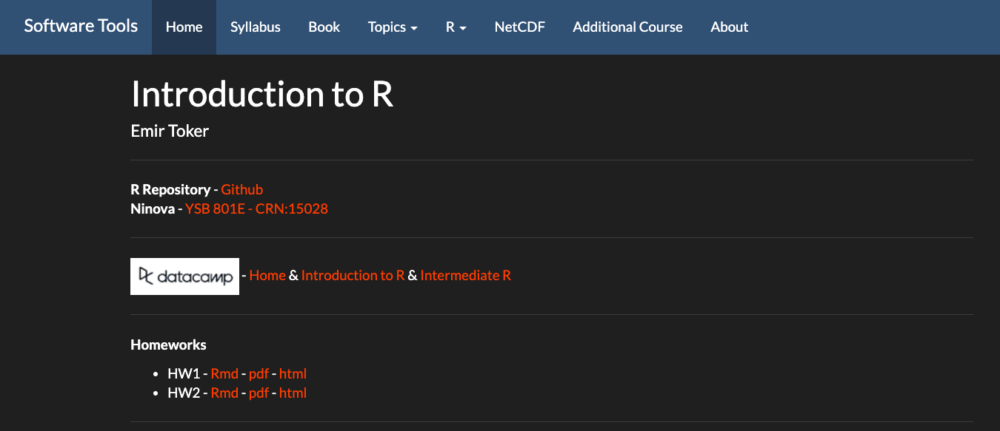
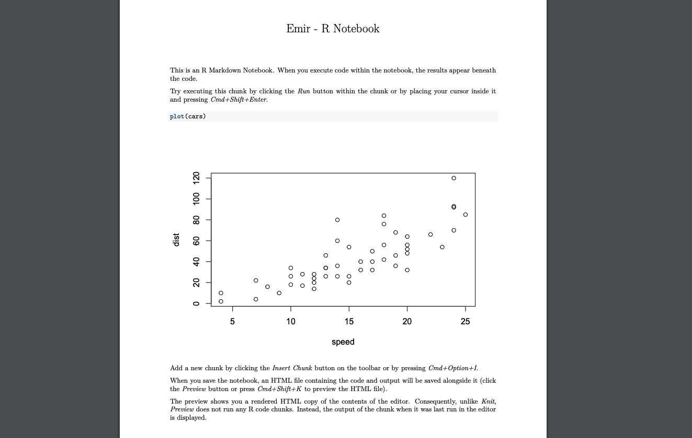
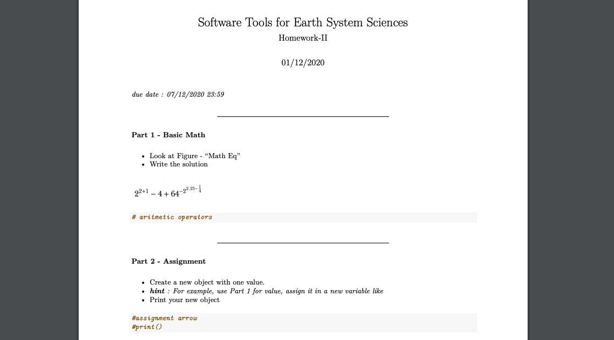
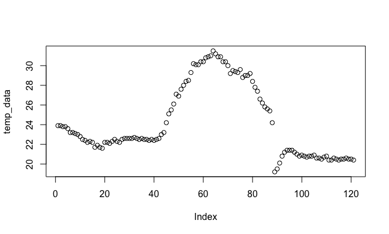
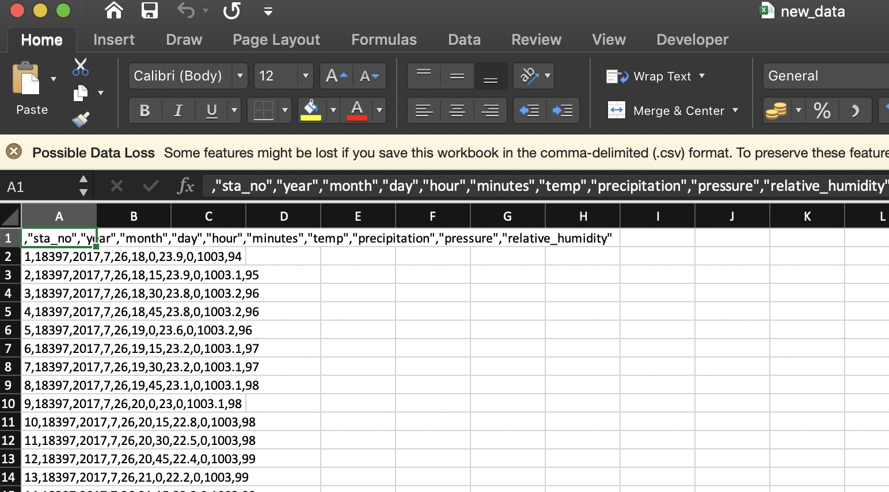
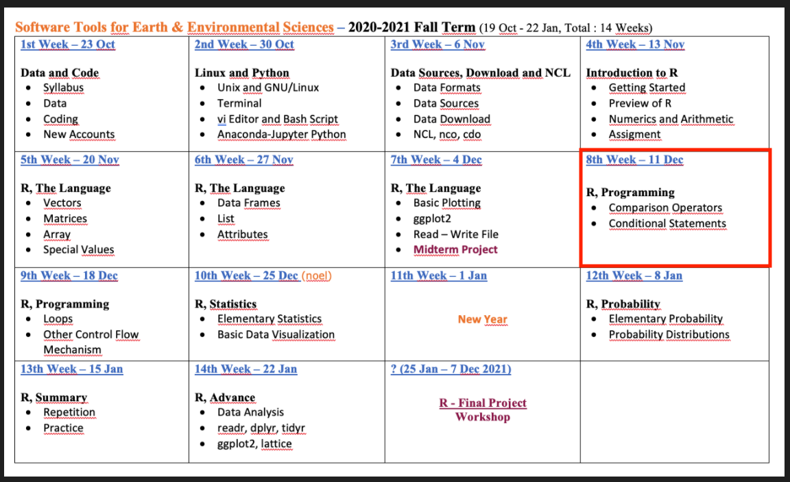

```{r, echo=FALSE}
knitr::opts_chunk$set(error = FALSE)
```

```{r, include = FALSE}
knitr::opts_chunk$set(echo = FALSE)
```


## **R Language - Part 3**

- **Syllabus, Last Week and Book**

- **R Language - Part 3**

  -   Read
  -   Write
  -   Plot

- <span style="color:orangered">**TakeHome - MidTerm Project**</span>

- Additional Course - II

- **Next Week - R Programming**


# **Syllabus, Last Week and Book**


## **Syllabus**


Extended Syllabus [PDF](https://web.itu.edu.tr/~tokerem/Software_Tools_Syllabus.pdf)


## **Last Week**


[LINK](https://emirtoker.github.io/Software_Tools_R_Github/)

## **Book**

 

[PDF](https://web.itu.edu.tr/~tokerem/The_Book_of_R.pdf) - (Pg. 127-133 and 150-155)

## **Homework - I and II**

*due date: 07/12/2020 23:59



## **Homework - I**

Create a Notebook



## **Homework - II**

Practice - Data Types and Structures



## **Additional Course - II**


Today, 15:00 - 16:00


# **R Language**

## **R Language - Part 1 & Part 2**

 - **Basic Math, Assigment, Comment**
 - **Data Types - Classes**
     - Numeric
     - Integer
     - Logical
     - Character
     - Special Values
 - **Data Structures - Objects**
     - Vector
     - Matrice
     - Array
     - Data Frame
     - List
 
 [LINK](https://emirtoker.github.io/Software_Tools_R_Github/r_language.html)
    
## **R Language - Part 3**
    
 - **Read**
 
 - **Write**
 
 - **Plot**
 
[LINK](https://emirtoker.github.io/Software_Tools_R_Github/r_language.html)


# **Practice - R Language**

## **Practice - R Language**

1. **Read** and **assign** your csv data (Header or seperator ?).
"Cekmekoy_Omerli_15min.txt"
2. Check the **class** and **structure** of your new data.
3. Take the ***"Temperature"*** parameter and **assign** it as a new variable.
4. **Plot** the "temperature" vector.
5. **Print** **minimum** temperature and find **which** element is the minimum in temperature vector.
6. **change** the minimum value with **NA** and **Print**.
7. **Plot** the new "temperature" vector.
8. Replace these **new** temperature values with **old** temperature values located in your data frame.
9. **Write** your data frame as a new csv file.

## **Practice - R Language**

1. **Read** and **assign** your csv data (Header or seperator ?).
"18397_Cekmekoy_Omerli_15dk.txt"

```{r, echo=TRUE}
mydata <- read.csv(file = "Cekmekoy_Omerli_15min.txt", 
                   header = TRUE, 
                   sep = ";")
mydata
```


## **Practice - R Language**

1. **Read** and **assign** your csv data (Header or seperator ?).
"Cekmekoy_Omerli_15min.txt"
2. Check the **class** and **structure** of your new data.
3. Take the ***"Temperature"*** parameter and **assign** it as a new variable.
4. **Plot** the "temperature" vector.
5. **Print** **minimum** temperature and find **which** element is the minimum in temperature vector.
6. **change** the minimum value with **NA** and **Print**.
7. **Plot** the new "temperature" vector.
8. Replace these **new** temperature values with **old** temperature values located in your data frame.
9. **Write** your data frame as a new csv file.

## **Practice - R Language**

2. Check the **class** and **structure** of your new data.

```{r}
class(mydata)
str(mydata)
attributes(mydata)
```


## **Practice - R Language**

1. **Read** and **assign** your csv data (Header or seperator ?).
"Cekmekoy_Omerli_15min.txt"
2. Check the **class** and **structure** of your new data.
3. Take the ***"Temperature"*** parameter and **assign** it as a new variable.
4. **Plot** the "temperature" vector.
5. **Print** **minimum** temperature and find **which** element is the minimum in temperature vector.
6. **change** the minimum value with **NA** and **Print**.
7. **Plot** the new "temperature" vector.
8. Replace these **new** temperature values with **old** temperature values located in your data frame.
9. **Write** your data frame as a new csv file.

## **Practice - R Language**

3. Take the ***"Temperature"*** parameter and **assign** it as a new variable.

```{r, echo=TRUE}
temp_data <- mydata$temp
temp_data
```


## **Practice - R Language**

1. **Read** and **assign** your csv data (Header or seperator ?).
"Cekmekoy_Omerli_15min.txt"
2. Check the **class** and **structure** of your new data.
3. Take the ***"Temperature"*** parameter and **assign** it as a new variable.
4. **Plot** the "temperature" vector.
5. **Print** **minimum** temperature and find **which** element is the minimum in temperature vector.
6. **change** the minimum value with **NA** and **Print**.
7. **Plot** the new "temperature" vector.
8. Replace these **new** temperature values with **old** temperature values located in your data frame.
9. **Write** your data frame as a new csv file.

## **Practice - R Language**

4. **Plot** the "temperature" vector.
```
plot(temp_data)
```



## **Practice - R Language**

1. **Read** and **assign** your csv data (Header or seperator ?).
"Cekmekoy_Omerli_15min.txt"
2. Check the **class** and **structure** of your new data.
3. Take the ***"Temperature"*** parameter and **assign** it as a new variable.
4. **Plot** the "temperature" vector.
5. **Print** **minimum** temperature and find **which** element is the minimum in temperature vector.
6. **change** the minimum value with **NA** and **Print**.
7. **Plot** the new "temperature" vector.
8. Replace these **new** temperature values with **old** temperature values located in your data frame.
9. **Write** your data frame as a new csv file.

## **Practice - R Language**

5. **Print** **minimum** temperature and find **which** element is the minimum in temperature vector.

```{r, echo=TRUE}
print(min(temp_data))

which(temp_data==19.2) # which(temp_data==min(temp_data))
```


## **Practice - R Language**

1. **Read** and **assign** your csv data (Header or seperator ?).
"Cekmekoy_Omerli_15min.txt"
2. Check the **class** and **structure** of your new data.
3. Take the ***"Temperature"*** parameter and **assign** it as a new variable.
4. **Plot** the "temperature" vector.
5. **Print** **minimum** temperature and find **which** element is the minimum in temperature vector.
6. **change** the minimum value with **NA** and **Print**.
7. **Plot** the new "temperature" vector.
8. Replace these **new** temperature values with **old** temperature values located in your data frame.
9. **Write** your data frame as a new csv file.

## **Practice - R Language**

6. **change** the minimum value with **NA** and **Print**.

```{r, echo=TRUE}

temp_data[89] <- NA

temp_data[which(temp_data==19.2)] <- NA

temp_data[which(temp_data==min(temp_data))] <- NA

print(temp_data)
```

## **Practice - R Language**

1. **Read** and **assign** your csv data (Header or seperator ?).
"Cekmekoy_Omerli_15min.txt"
2. Check the **class** and **structure** of your new data.
3. Take the ***"Temperature"*** parameter and **assign** it as a new variable.
4. **Plot** the "temperature" vector.
5. **Print** **minimum** temperature and find **which** element is the minimum in temperature vector.
6. **change** the minimum value with **NA** and **Print**.
7. **Plot** the new "temperature" vector.
8. Replace these **new** temperature values with **old** temperature values located in your data frame.
9. **Write** your data frame as a new csv file.

## **Practice - R Language**

7. **Plot** the new "temperature" vector.

```{r}
plot(temp_data)
```

## **Practice - R Language**

1. **Read** and **assign** your csv data (Header or seperator ?).
"Cekmekoy_Omerli_15min.txt"
2. Check the **class** and **structure** of your new data.
3. Take the ***"Temperature"*** parameter and **assign** it as a new variable.
4. **Plot** the "temperature" vector.
5. **Print** **minimum** temperature and find **which** element is the minimum in temperature vector.
6. **change** the minimum value with **NA** and **Print**.
7. **Plot** the new "temperature" vector.
8. Replace these **new** temperature values with **old** temperature values located in your data frame.
9. **Write** your data frame as a new csv file.

## **Practice - R Language**

8. Replace these **new** temperature values with **old** temperature values located in your data frame.

```{r, echo=TRUE}
mydata$temp <- temp_data

mydata
```


## **Practice - R Language**

1. **Read** and **assign** your csv data (Header or seperator ?).
"Cekmekoy_Omerli_15min.txt"
2. Check the **class** and **structure** of your new data.
3. Take the ***"Temperature"*** parameter and **assign** it as a new variable.
4. **Plot** the "temperature" vector.
5. **Print** **minimum** temperature and find **which** element is the minimum in temperature vector.
6. **change** the minimum value with **NA** and **Print**.
7. **Plot** the new "temperature" vector.
8. Replace these **new** temperature values with **old** temperature values located in your data frame.
9. **Write** your data frame as a new csv file.

## **Practice - R Language**

9. **Write** your data frame as a new csv file.

```{r, echo=TRUE}
write.csv(mydata, file = "new_data.csv")
```




## **BONUS - Create a Function**

**What is Function ?**

A function is a set of statements organized together to perform a specific task

ex: **mean()** (arithmetic mean)

```{r echo=TRUE}
x <- c(1,2,3)
mean(x)
```

```{r echo=TRUE}
(1+2+3) / 3
```


## **BONUS - Create a Function**

**What is Function ?**

A function is a set of statements organized together to perform a specific task

ex: **sample()** (takes a sample of the specified size from the elements of x )

```{r echo=TRUE}
sample(c(1,6,32,7), size = 2)
```

ex: **sum()** (returns the sum of all the values)


## **Practice**

**Create a Function**

Problem: Take a sample belonged to population and sum

```
box <- 1:6                    # This is my population in a BOX
my_samp <- sample(box, size = 2) # This is my sample, I choose two var.
sum(my_samp)
```
```
box
samp
```

I want to create a new function named ***my_roll()***
```
my_roll <- function(box) {
box <- 1:6 
my_samp <- sample(box) 
sum(my_samp)
}
```
```
my_roll()
```


## **Practice**

**Problem**: I want to define population myself, in every time.
*remove pre-defined population* ***box*** *?*

```
my_roll2 <- function(box) {
my_samp <- sample(box, size = 2) 
sum(my_samp)
}
```
```
my_roll2(box)
```
box ?
```
box = 1:6
my_roll2(box)

my_roll2(box = 1:6)
my_roll2(1:6)
```

## **Practice**

**Create a Function**


- You can add new options
- { } and () are important


# **Workshop - Midterm Project**

## **Workshop - Midterm Project**

- Open a new R notebook
- Go to course home page, (Midterm Project)
- Click **Rmd** and Open "Midterm_Project.Rmd"
- Copy all code and paste in your R notebook
- Same way, open STATION DATA (18397_Cekmekoy_Omerli_15dk.txt) and paste file in your project directory.
- Start to follow **Instructions**


# **Next Week (not next, the other one)**

## **Next Week (not next, the other one)**



## **Next Week R Programming - PART I**


