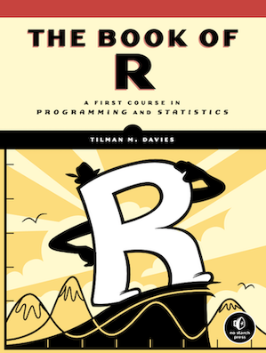
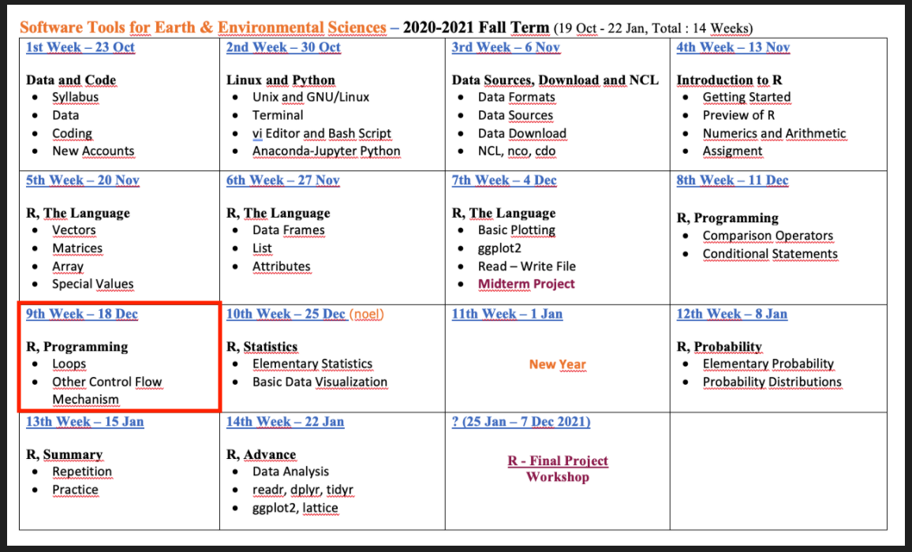

```{r, echo=FALSE}
knitr::opts_chunk$set(error = FALSE)
```

```{r, include = FALSE}
knitr::opts_chunk$set(echo = FALSE)
```


## **R Promgramming - Part 1**

- **Syllabus and Book**
- **DataCamp Class**
- **Homework I & II and Midterm Project**
- **Questions - R Language**
- **Practice - Create a Function**
- **R Programming - Conditions**
     - Comparison Operators
     - ***if*** Statement
     - ***else*** Statement
     - ***else if*** Statement
- **Next Week**


# **Syllabus and Book**


## **Syllabus**


Extended Syllabus [PDF](https://web.itu.edu.tr/~tokerem/Software_Tools_Syllabus.pdf)

## **Book**

 

[PDF](https://web.itu.edu.tr/~tokerem/The_Book_of_R.pdf) - (179 - 185)


# **R Language - Repeat**

## **Questions - R Language**

- What are the benefits of R-Script and R-Project?
- What are the data types and data structures in R?
- What are the advantages of the Data Frame?
- What is the difference between NA and NaN?

[LINK](https://emirtoker.github.io/Software_Tools_R_Github/r_language.html)


# **Practice - Create a Function**


## **What is Function ?**

A function is a set of statements organized together to perform a specific task

ex: **mean()** (arithmetic mean)

```{r echo=TRUE}
x <- c(1,2,3)
mean(x)
```

```{r echo=TRUE}
(1+2+3) / 3
```


## **Create a Function**


## **Create a Function**

{width=60%}


{width=90%}


## **Create a Function**


**Problem**: Take a **sample** belonged to population, and **sum**

```{r, echo=TRUE}
box <- 1:6                    # This is my population in a BOX
box

samp <- sample(box, size = 2)   # This is my sample, I choose two values.
samp

sum(samp)
```


## **Create a Function**

I want to collect my **sample()** and **sum()** functions and put in ONE **function**.
I will create a new function named ***roll2()***.

{width=70%}


```
name_new_function <- function( argument ) {

name_new_variable <- do_this( argument, option )
then_do_this( name_new_variable )
}
```
```
name_new_function( )    # It will work with my default argument
```


## **Create a Function**

```
name_new_function <- function( argument ) {

name_new_variable <- do_this( argument, option )
then_do_this( name_new_variable )
}
```
```
name_new_function( )   # It will work with my default argument
```
in formal :
```{r, echo=TRUE}
roll2 <- function(box = 1:6) {
  
samp <- sample(box, size=2) 
sum(samp)
}
```
```{r, echo=TRUE}

roll2( )      # It will work with my default argument ( box = 1:6 )
```


## **Create a Function**

{width=70%}

```{r, echo=TRUE}
roll2 <- function(box = 1:6) {
  
samp <- sample(box, size=2) 
sum(samp)
}
```
```{r, echo=TRUE}

roll2()    # It will work with my default argument ( box = 1:6 )
```


## **Create a Function**

You can change the default argument in every time

```{r, echo=TRUE}

roll2(box = 1:10)   # It will work with argument ( 1,2,3,4,5,6,7,8,9,10 )

roll2(1:10)   # It will work with argument ( 1,2,3,4,5,6,7,8,9,10 )

roll2(seq(1,10,0.5))   # It will work with argument ( 1, 1.5, 2, 2.5, 3,... )

```


## **Practice - Create a Function**


{width=70%}

You can add new options or new functions in your new function.

**{ }** and **()** are important

```
# Think about these functions
# mean(), print(), plot(), max(), install.packages(), help(), ...
```


# **R Programming - Conditions**

## **R Programming - Conditions**

<style>

.column-right0{
  float: right;
  width: 50%;
  text-align: right;
}
.column-left0{
  float: left;
  width: 50%;
  text-align: left;
}
</style>

<div class="column-left0">

- **Comparison Operators **
    - equal (**==**)
    - not equal (**!=**)
    - greater or equal to (**>=**)
    - lower or equal to (**<=**)


- **Logical Operators **
    - the and operator (**&**)
    - the or operator (**|**)
    - the not operator (**!**)

- ***if*** (Stand-Alone) Statement
- ***else*** Statement
- ***ifelse*** Statement

</div>


<div class="column-right0">

```
TRUE & TRUE  
TRUE & FALSE
TRUE | FALSE 
!TRUE

2 == 3
5 < 6

c(1,4) >= 6

9 != 8

5 < 6 & 9 != 8
```
```
score <- 80
exam_name <- "math"

score >= 75 & exam_name == "math"
```
</div>


## **R Programming - Conditions**


[LINK](https://emirtoker.github.io/Software_Tools_R_Github/r_programming.html)


# **Next Week**

## **Next Week**


Check, Conditions and Loops, DataCamp


