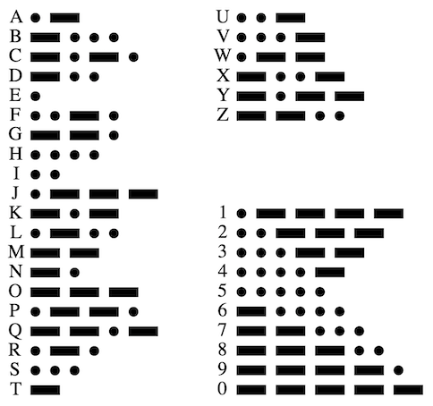
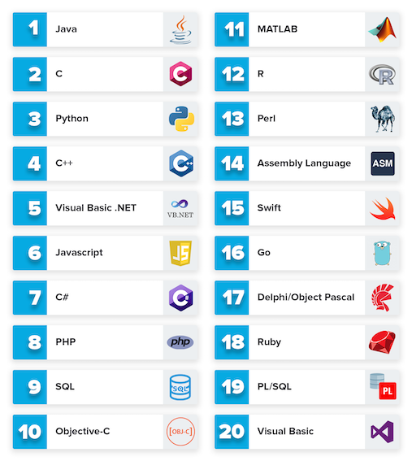
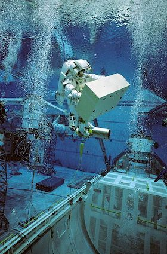
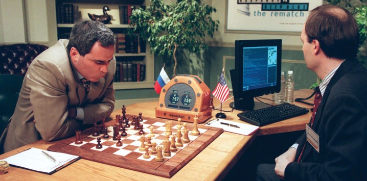

```{r, echo=FALSE}
knitr::opts_chunk$set(error = FALSE)
```

```{r, include = FALSE}
knitr::opts_chunk$set(echo = FALSE)
```


***




***

## **Code**

- Operating Systems
- Programming Languages
- Interpretation and Visualization
- Algorithm, Simulation and Modelling
- Popular Terms About Programming


***

## **Operational Systems**

An operating system (OS) is system software that manages computer hardware, software resources, and provides common services for computer programs.


Microsoft Windows, Apple macOS, Linux 

***

## **Programming Languages**




***

##  **Algorithm**

The algorithm is a set of instructions, typically to solve a class of problems or perform a computation.


***

## **Simulation**

The simulation is an approximate imitation of the operation of a process or system; that represents its operation over time.



***

## **Modelling**

Model is a description of a system using mathematical concepts. The aim of modeling is to understand easier a particular part or feature of thing.


***

##  **Popular Terms About Programming**

-	Artificial İntelligence
-	Machine Learning
-	Deep Learning
-	Internet of Things

***

##  **Artificial İntelligence**

Artificial intelligence (AI) is the simulation of human intelligence processes by machines, especially computer systems. These processes include learning, reasoning and self-correction.


***

##  **Machine Learning**

Machine learning (ML) is the scientific study of algorithms and statistical models that computer systems use to perform a specific task without using explicit instructions.



1997, Deep Blue vs Garry Kasparov

***

##  **Deep Learning**

Deep learning is part of a family of machine learning methods based on artificial neural networks.


***

##  **Internet of Things**

The Internet of Things (IoT) is a system of interrelated computing devices, mechanical and digital machines. IoT has the ability to transfer data over a network without requiring human-to-human or human-to-computer interaction.


***
