```{r, echo=FALSE}
knitr::opts_chunk$set(error = FALSE)
```

```{r, include = FALSE}
knitr::opts_chunk$set(echo = FALSE)
```


***

- What is the Data and Metadata?
- Data Collection and Generation
- Data Types, Formats and Sources
- Download and Get the Data
- Interpretation and Visualization
- Popular Terms About Data

***

## **What is the Data and Metadata?**

Data are things, known or assumed as facts, making the basis of reasoning or calculation.

  

Metadata is information about data.

***

## **Metadata**

#### **Sample 1**


/

#### **Sample 2**


***

## **Data Collection and Generation**

Data collection is the process of gathering and measuring information on targeted variables in an established system. The purpose is to answer relevant questions or/and evaluate outcomes.

* Observational 
* Statistical 
* Simulation


***

## **Data Types**


***

## **Data Formats**

* Text, Picture, Audio, Video
* File; pdf, txt, csv, html, xml, nc, hdf
* Point, Line, Polygon
* 1D, 2D, 3D, xD


***

## **Data Sources**

The location where data that is being used comes from.


[LINK](https://earthdata.nasa.gov/)

***

## **Download and Get the Data**

 


***

## **Interpretation and Visualization**

Interpretation is the process of making sense of numerical data that has been collected, analyzed, and presented. 

Visualization is the graphical representation of information and data.


***

## **Popular Terms About Data**

- Data Analysis and EDA
- Big Data
- Data Mining
- Data Assimilation and Manipulation
- Data Scientist

***

## **Data Analysis**

Data analysis is a process of inspecting, cleaning, transforming and modeling data with the goal of discovering useful information, informing conclusions and supporting decision-making.

 

***

## **Exploratory Data Analysis (EDA)**

In statistics, exploratory data analysis (EDA) is an approach to analyzing data sets to summarize their main characteristics, often with visual methods.


***

## **Big Data**

Too large or complex data to be dealt with by traditional data-processing application and software.

 

Apache Point, New Mexico, US, 1995

ALMA, Atacama, Antofagasta Region, Chile

***

## **Data Mining**

Data mining is the process of discovering patterns in large data sets.

  

***

## **Data Assimilation and Manipulation**

Data assimilation is a mathematical discipline that seeks to optimally combine theory with observations. 


Data manipulation; inserting, deleting, and modifying data in a database.

***

## **Data Science**

Data science is a multi-disciplinary field that uses scientific methods, processes, algorithms and systems to extract knowledge from structured and unstructured data.


***

# **Data Formats** - 3th Week

  - **Data Types**

  - **Data Set**

  - **Data Formats**


***

### **Data Types**

- Vector
    - Point
    - Line
    - Polygon

- Raster

- Gridded

***

### **Vector Data**

Vector data structures represent specific features on the Earth’s surface, and assign attributes to those features.

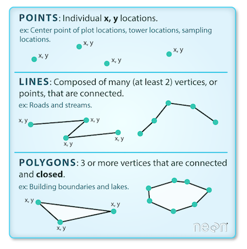 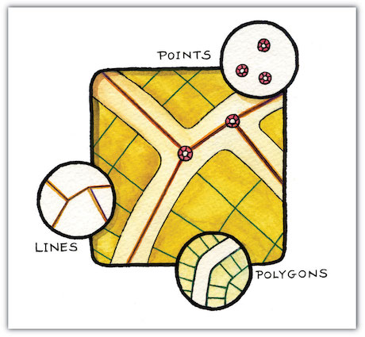

***

### **BONUS - Point to Polygon**

Thiessen polygon 

 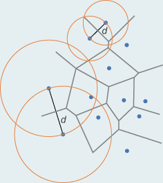 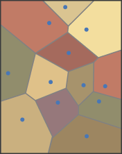

It defines an area around a point, where every location is nearer to this point than to all the others (2D).

***

### **Raster Data**

Rasters are made up of a matrix of pixels (also called cells), each containing a value that represents the conditions for the area covered by that cell.


***

### **Vector vs Raster**

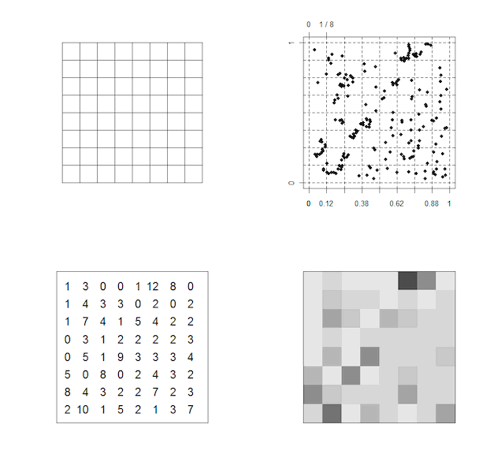


***

### **Vector vs Raster**


***

### **Vector vs Raster**


***

### **Gridded Data**

- A multi-dimensional rectangular or square-shaped
- The array of grid 
- Borders and points which are containing values

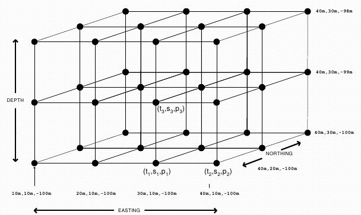


***

### **Gridded Data**


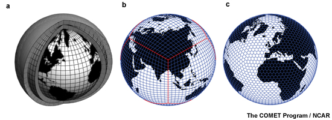


***

### **BONUS - Numerical weather prediction (NWP)**

NWP uses mathematical models of the atmosphere and oceans to predict the weather based on current weather conditions.


 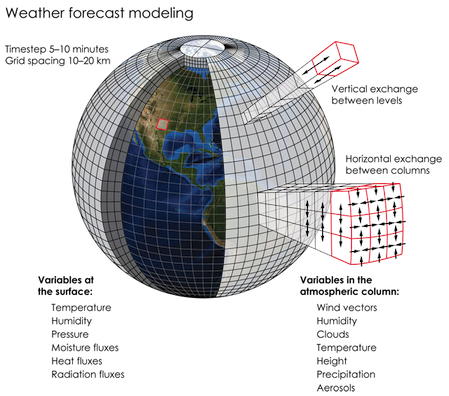


***

### **Data Set**

- Observation

- Forecast

- Re-Analysis Data

- Ensamble Data


***

### **Observation Data**

The information collected by a primary source.


***

### **Forecast**

The process of making predictions of the future based on past and present data. 

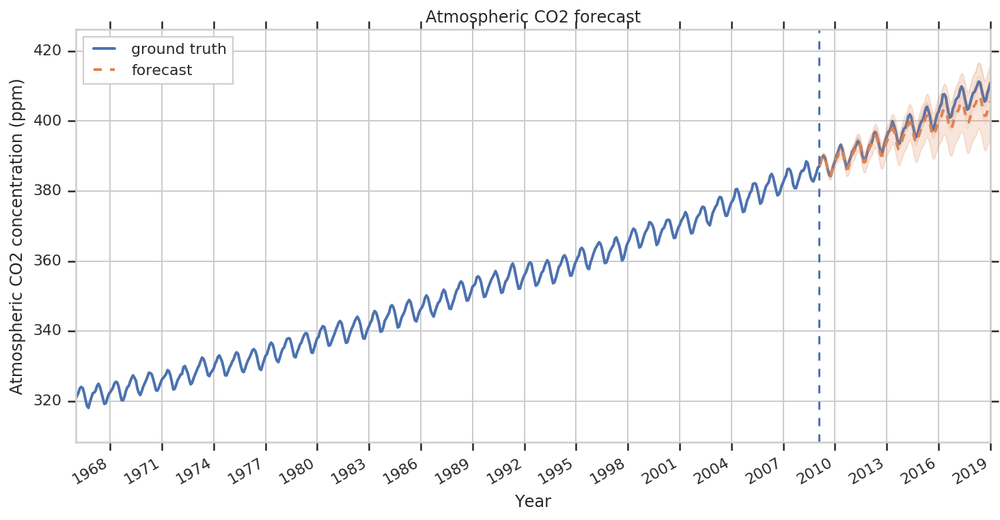


***

### **Re-Analysis Data**

A scientific method for developing a comprehensive record.
Observations and a numerical model are combined objectively.


***

### **Ensamble Data**

Instead of making a single forecast, a set (or ensemble) of forecasts. 
This set of forecasts aims to give an indication of the range of possible future states of the atmosphere.


    
***

### **Data Formats**

- ASCII (csv, txt)

- netCDF

- HDF

- GRIB

- Shapefile    


***

### **ASCII**

*American Standard Code for Information Interchange*

ASCII codes represent text in computers and other devices.

- .txt (tab-separated values)
- .csv (comma-separated values)
- .xls (excel spreadsheet)

 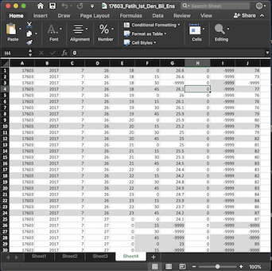


***

### **netCDF**

*Network Common Data Form*

A file format for storing multidimensional scientific data (variables) such as temperature, humidity, pressure, wind speed, and direction.


***

### **netCDF - .nc**

NCAR (National Center for Atmospheric Research)

UCAR (University Corporation for Atmospheric Research)


***

### **HDF - .hdf**

*Hierarchical Data Format*

Designed to store and organize large amounts of data. 

National Center for Supercomputing Applications, supported by The HDF Group.


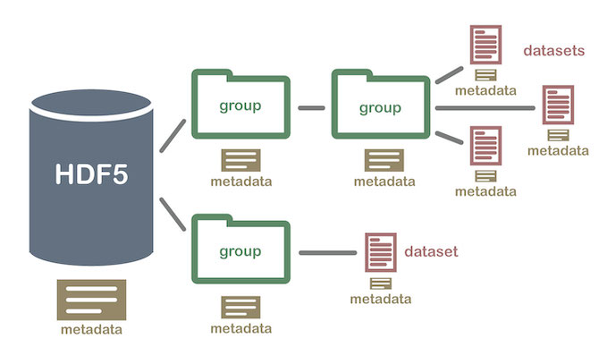


***

### **GRIB - .grib**

*GRIdded Binary or General Regularly-distributed Information in Binary form*

Data format commonly used in meteorology to store historical and forecast weather data.

World Meteorological Organization


***

### **GRIB - .grib**

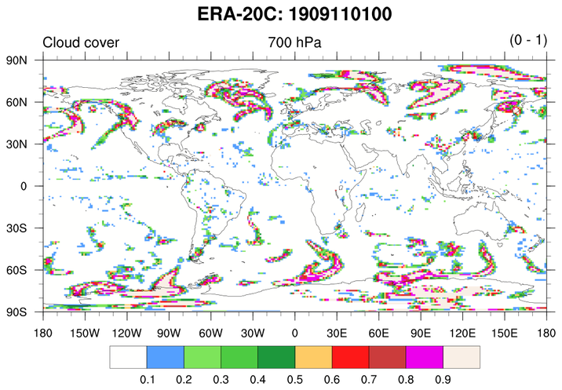


***

### **Shapefile - .shp**

Geospatial vector data format for geographic information system (GIS) software. 

It is developed and regulated by Esri.

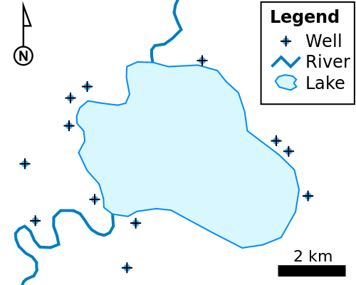


***

### **Shapefile - .shp**

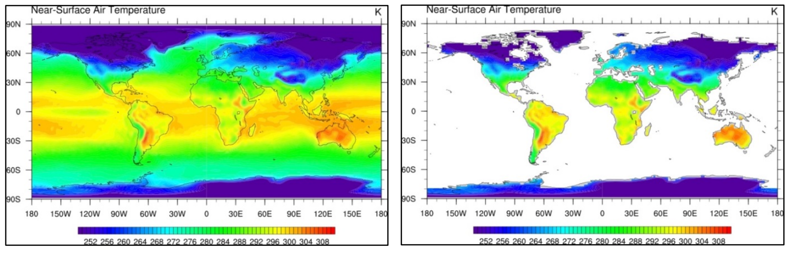


***


