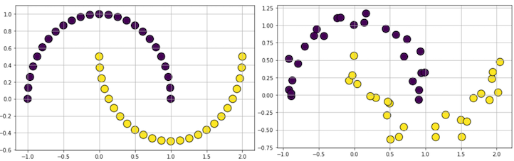
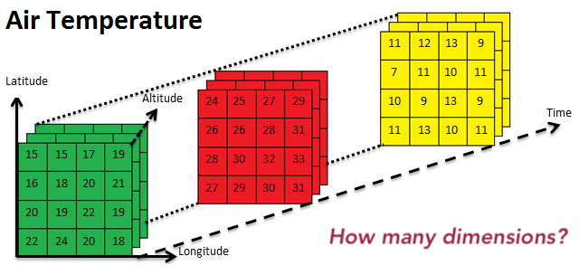
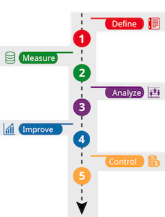
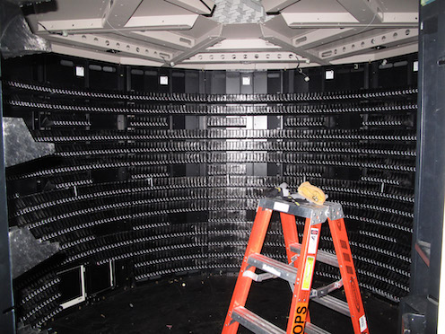
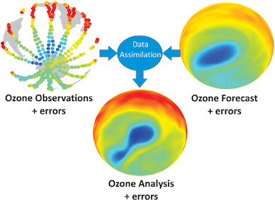
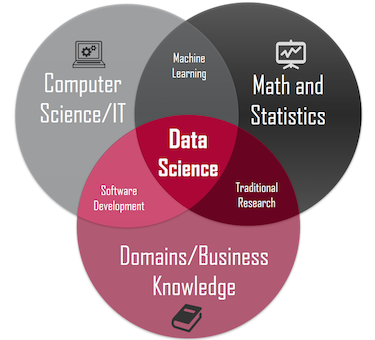

```{r, echo=FALSE}
knitr::opts_chunk$set(error = FALSE)
```

```{r, include = FALSE}
knitr::opts_chunk$set(echo = FALSE)
```


# **Data**


- What is the Data and Metadata?
- Data Collection and Generation
- Data Types, Formats and Sources
- Download and Get the Data
- Interpretation and Visualization
- Popular Terms About Data

***

## What is the Data and Metadata?

Data are things, known or assumed as facts, making the basis of reasoning or calculation.

  

Metadata is information about data.

***

## Metadata

#### Sample 1


/

#### Sample 2


***

## Data Collection and Generation

Data collection is the process of gathering and measuring information on targeted variables in an established system. The purpose is to answer relevant questions or/and evaluate outcomes.

* Observational 
* Statistical 
* Simulation



***

## Data Types


***

## Data Formats

* Text, Picture, Audio, Video
* File; pdf, txt, csv, html, xml, nc, hdf
* Point, Line, Polygon
* 1D, 2D, 3D, xD



***

## Data Sources

The location where data that is being used comes from.


[LINK](https://earthdata.nasa.gov/)

***

## Download and Get the Data

 


***

## Interpretation and Visualization

Interpretation is the process of making sense of numerical data that has been collected, analyzed, and presented. 

Visualization is the graphical representation of information and data.


***

## Popular Terms About Data

- Data Analysis and EDA
- Big Data
- Data Mining
- Data Assimilation and Manipulation
- Data Scientist

***

## Data Analysis

Data analysis is a process of inspecting, cleaning, transforming and modeling data with the goal of discovering useful information, informing conclusions and supporting decision-making.

 

***

## Exploratory Data Analysis (EDA)

In statistics, exploratory data analysis (EDA) is an approach to analyzing data sets to summarize their main characteristics, often with visual methods.


***

## Big Data

Too large or complex data to be dealt with by traditional data-processing application and software.

 

Apache Point, New Mexico, US, 1995

ALMA, Atacama, Antofagasta Region, Chile

***

## Data Mining

Data mining is the process of discovering patterns in large data sets.

  

***

## Data Assimilation and Manipulation

Data assimilation is a mathematical discipline that seeks to optimally combine theory with observations. 



Data manipulation; inserting, deleting, and modifying data in a database.

***

## Data Science

Data science is a multi-disciplinary field that uses scientific methods, processes, algorithms and systems to extract knowledge from structured and unstructured data.



***