```{r, echo=FALSE}
knitr::opts_chunk$set(error = FALSE)
```

```{r, include = FALSE}
knitr::opts_chunk$set(echo = FALSE)
```


***


  - Click
  - ftp, sftp, https
  - ssh, nfs, smb
  - wget, curl


***

### **Click**


[KNMI Climate Explorer](http://climexp.knmi.nl/start.cgi)

Monthly reanalysis fields

***

### **Click - ERA**

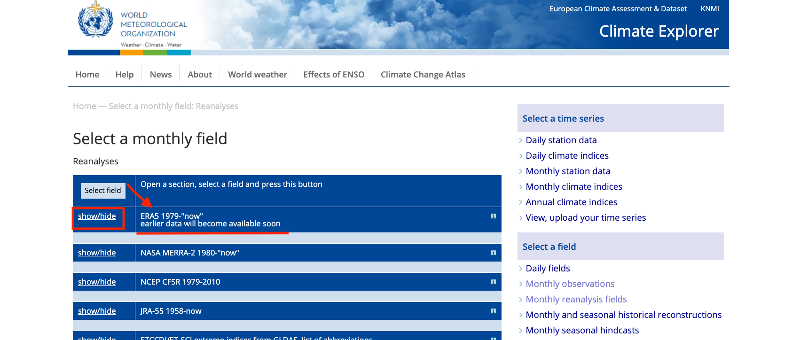

***

### **Click - ERA 2m Temperature**

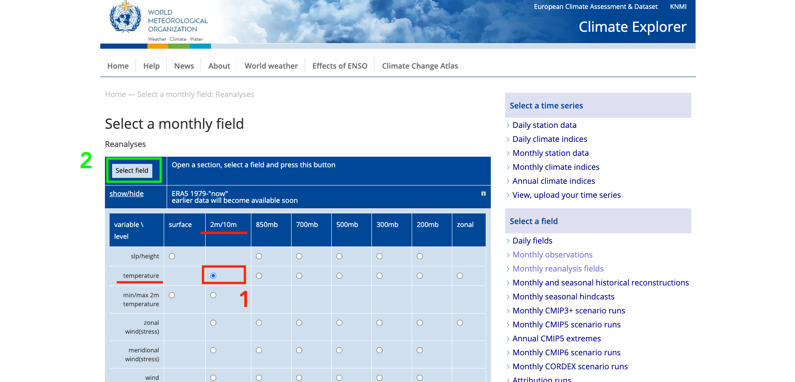

***

### **Click - ERA 2m Temperature**

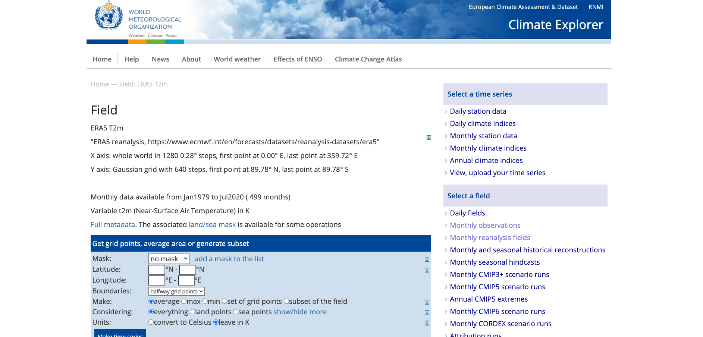

Scroll Down

***

### **Click - ERA 2m Temperature - Netcdf**


***

### **Connect to Download or Edit**

Connect-Download Remotely

- ftp - File Transfer Protocol 
- sftp - Secure File Transfer Protocol
- https - Hypertext Transfer Protocol Secure

Connect-Edit (also download) Remotely

- ssh - Secure Shell
- nfs - Network File System
- smb - Samba (ftp-like)

***

### **ftp**

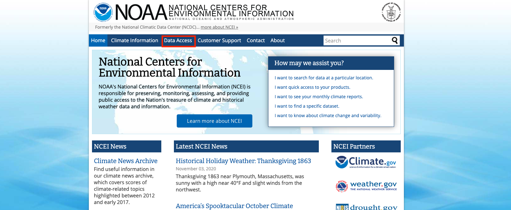

***

### **ftp-NOAA**


Land-Based Station -> Datasets -> Integrated Surface Databased (ISD)

***

### **ftp-NOAA**

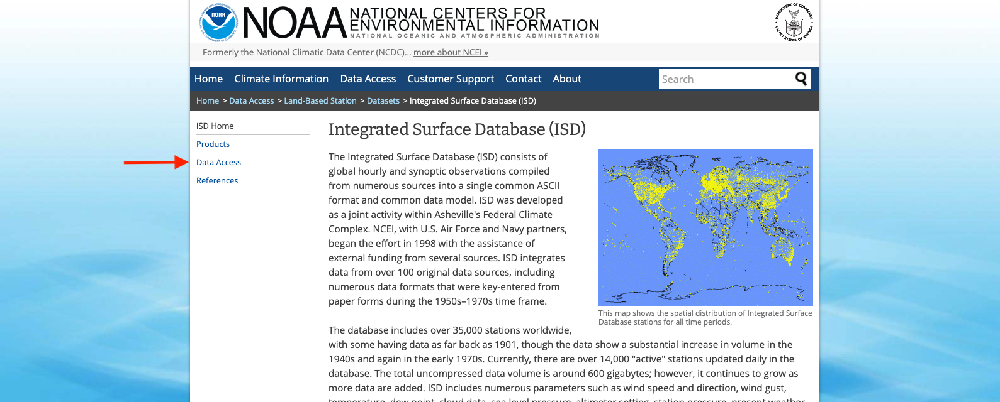

***

### **ftp-NOAA**


We will see it in 'wget' section

***

### **ftp-NOAA**


ISD/Global Hourly 

***

### **ftp-NOAA**


ftp://ftp.ncei.noaa.gov/pub/data/noaa/

***

### **ftp-NOAA with FileZilla**


***

### **BONUS - FileZilla - sftp**

ITU Portal - https://portal.itu.edu.tr/apps/default/


Check your ITU Cloud quota

***

### **BONUS - FileZilla - sftp**

```
ssh.itu.edu.tr or sftp://ssh.itu.edu.tr
tokerem (your ITU account)
password (your ITU password)
```

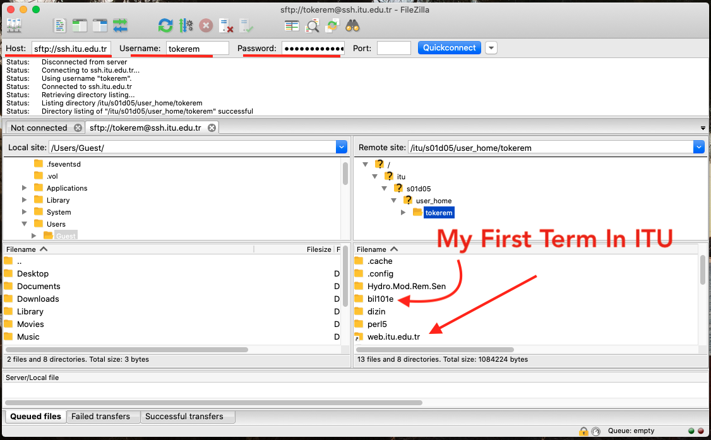


***

### **BONUS - FileZilla - sftp**

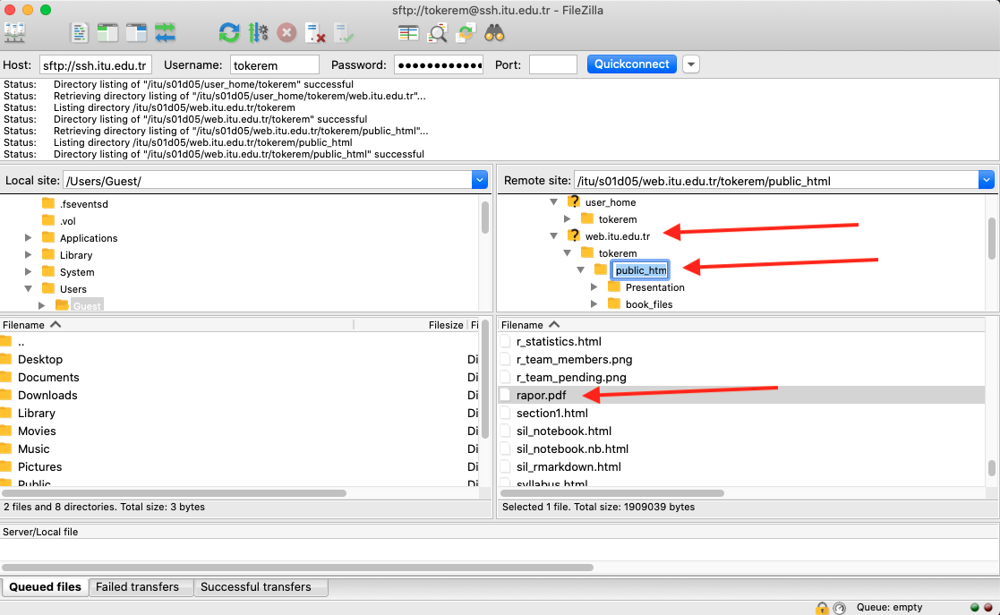

***

### **BONUS - FileZilla - sftp**


***

### **BONUS - FileZilla - sftp**


***

### **BONUS - FileZilla - sftp**

Your Official Website

https://web.itu.edu.tr/~tokerem/

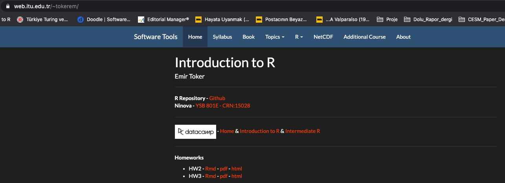

I showed this page to DataCamp

***

### **wget or curl**

wget

  - GNU Wget (or just Wget)
  - World Wide Web and get
  - It supports downloading via HTTP, HTTPS, and FTP.
  


***

### **wget or curl**

cURL

- Client URL
- URL : Uniform Resource Locator. (reference web pages (http), file transfer (ftp), email (mailto), database access (JDBC) etc.)


***

### **wget-noaa**

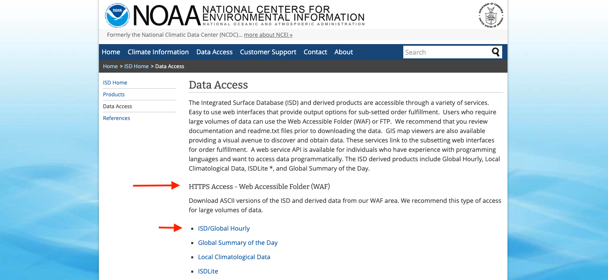

***

### **wget-noaa**

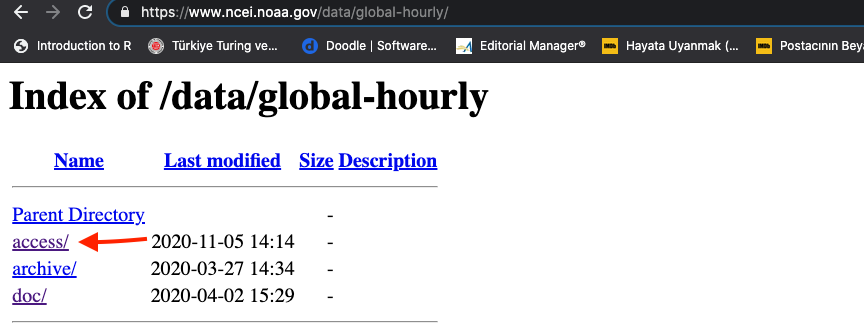

***

### **wget-noaa**


***

### **wget-noaa**

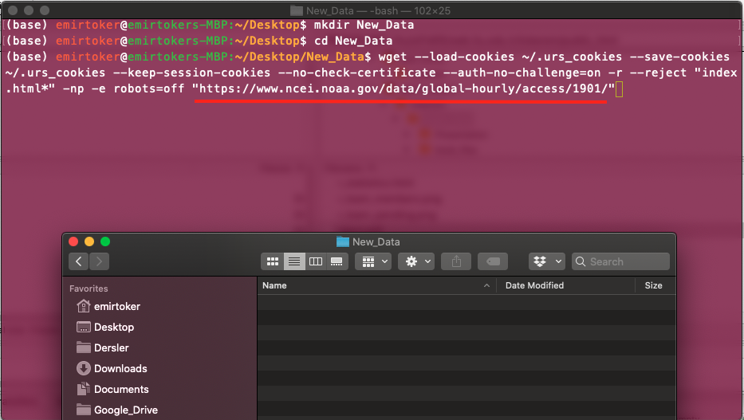

***

### **wget-noaa**

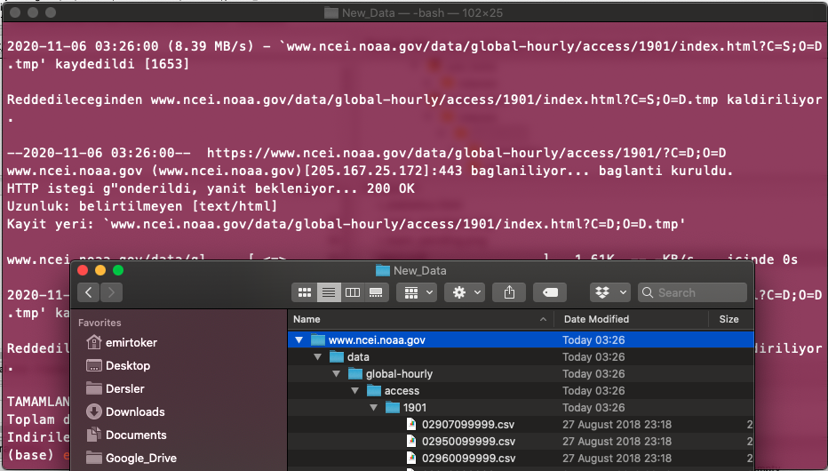

***
