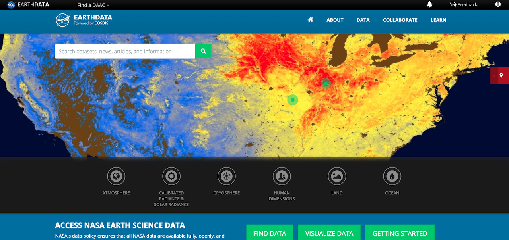
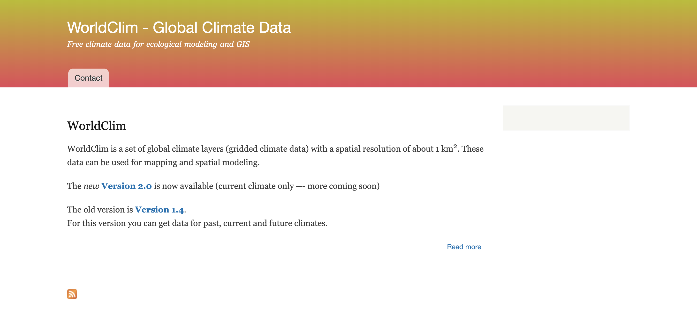
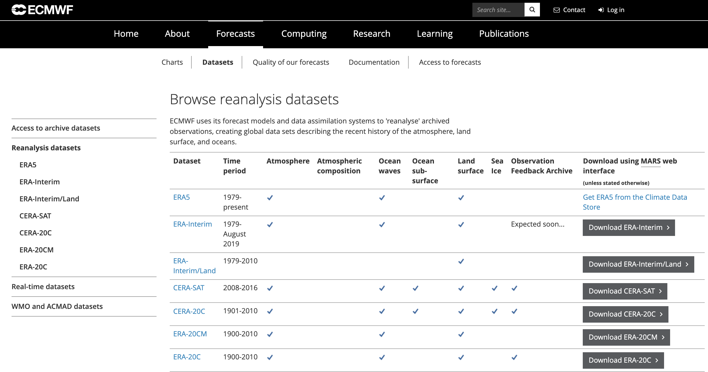
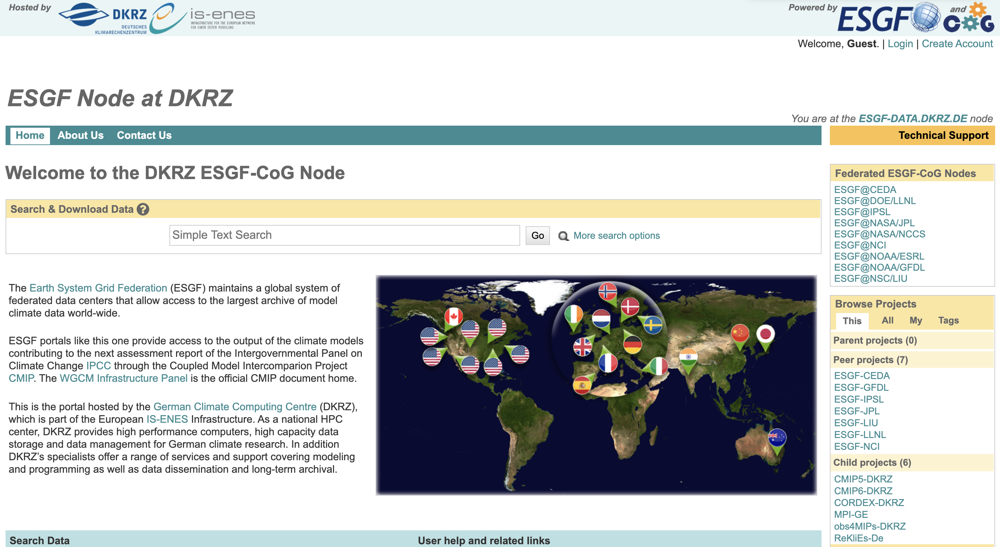
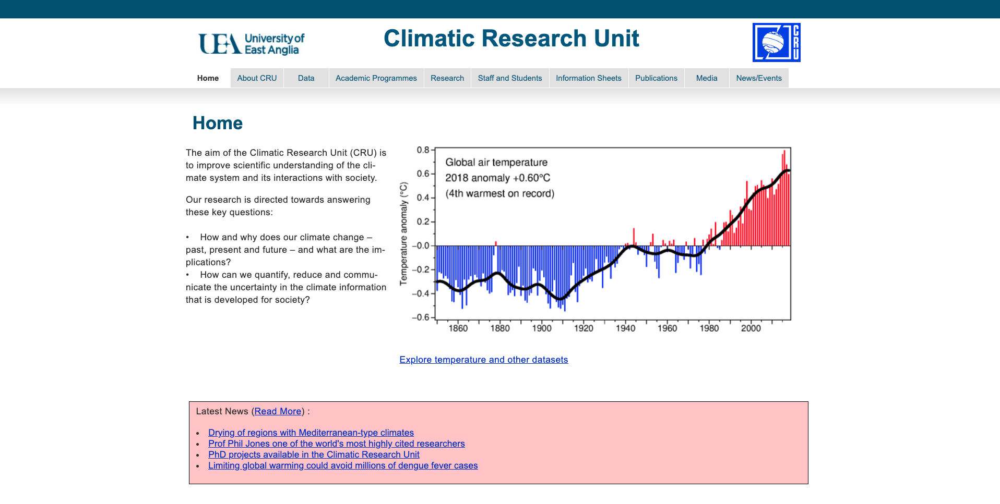

***

  - Earthdata
  - KNMI
  - Wordclim
  - ERA
  - GFS
  - ESGF
  - CRU
  - E-OBS

***

### **Earthdata**

[LINK](https://earthdata.nasa.gov/)

***

### **KNMI**

*The Royal Netherlands Meteorological Institute*

[LINK](http://climexp.knmi.nl/start.cgi)

***

### **Wordclim**

[LINK](https://www.worldclim.org/)

***

### **ERA**

*European Centre for Medium-Range Weather Forecasts*

[LINK](https://www.ecmwf.int/en/forecasts/datasets/browse-reanalysis-datasets)

***

### **GFS**

*National Centers for Environmental Prediction (NCEP)*

[LINK](https://www.ncdc.noaa.gov/data-access/model-data/model-datasets/global-forcast-system-gfs)

***

### **ESGF**

*The Earth System Grid Federation (ESGF)*

[LINK](https://esgf-data.dkrz.de/projects/esgf-dkrz/)

***

### **CRU**

*Climatic Research Unit-University of East Anglia*

[LINK](http://www.cru.uea.ac.uk/)

***

### **E-OBS**

*Europe daily gridded observational dataset*

[LINK](https://www.ecad.eu/download/ensembles/download.php)

***
