***

[LINK](https://www.datacamp.com/home)

***

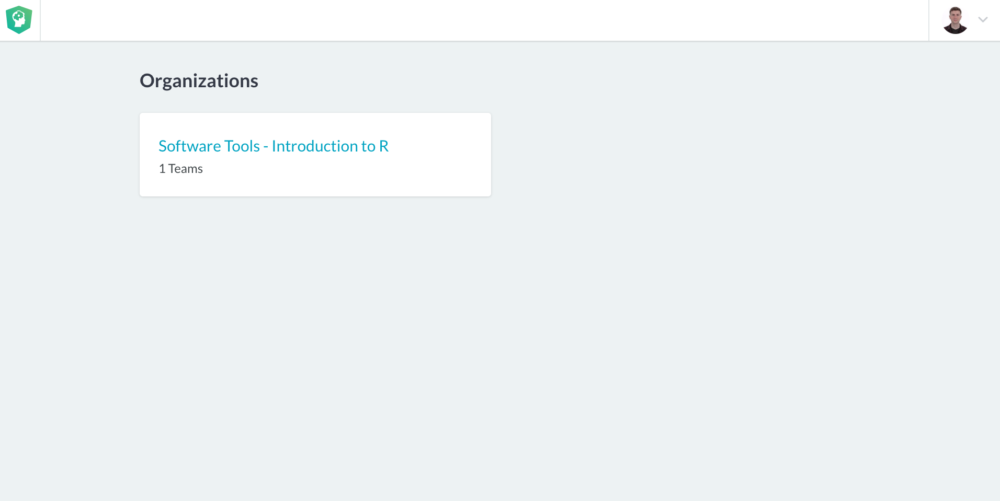

My Class

***

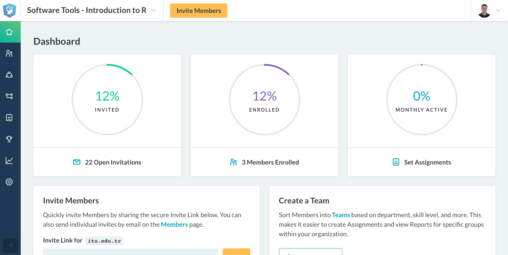

Home - My Class

***

Team - Introduction to R

***

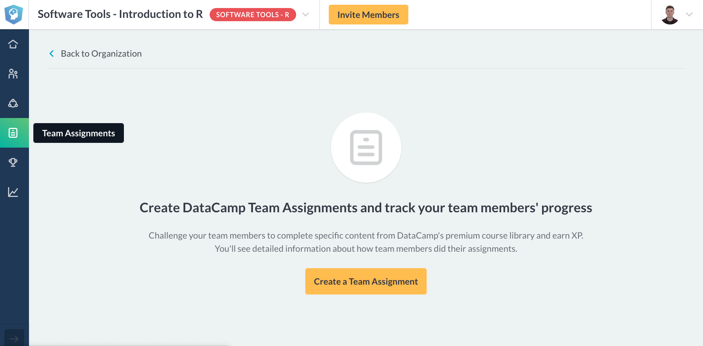

Team Assignments !!  

***

1000 XP - 1hour/Week

Related Chapters and Courses

***

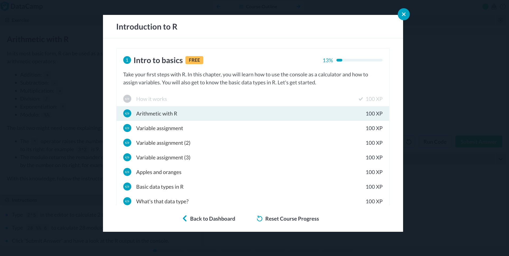

Each +100XP 

Take Hint -30 XP

***

Introduction to R Course

4 hours

62 Excersize

6200 XP

*Also available on mobile*

***

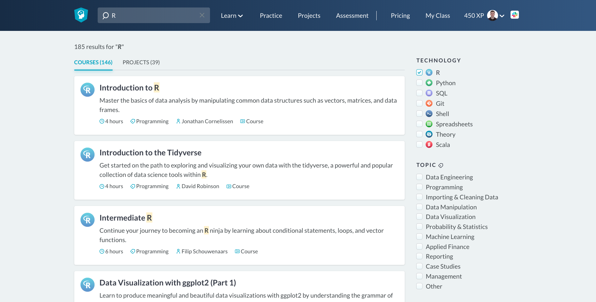

Search - "**R**"

***

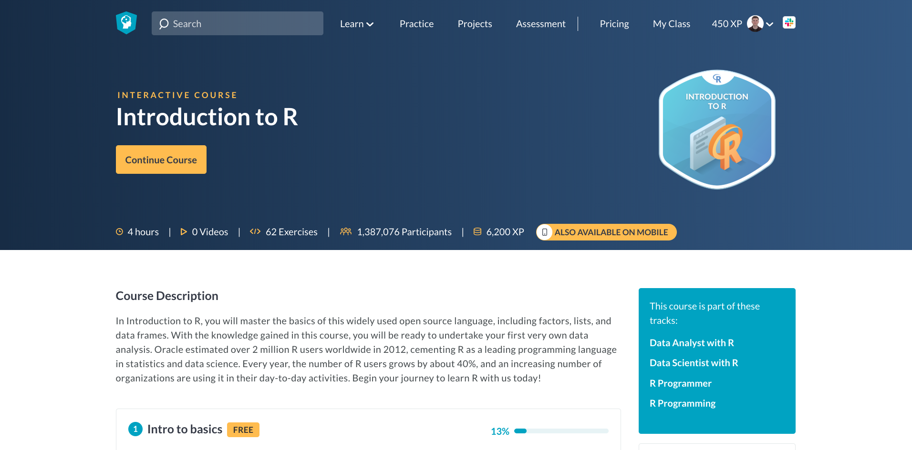

***

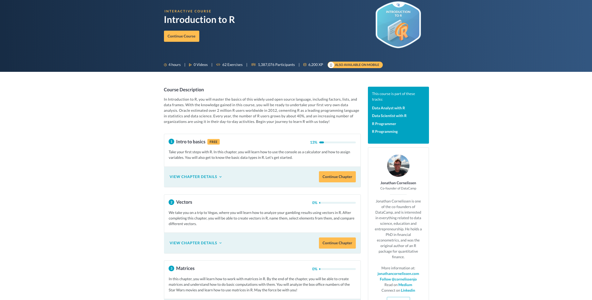

Only "Intro" is Free

***

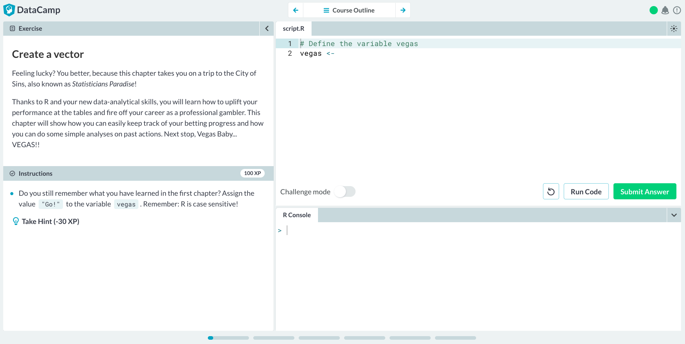

But you can use all

***

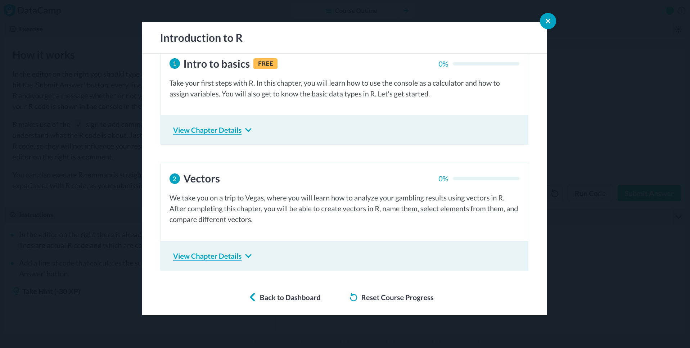

If you not a member of team

***

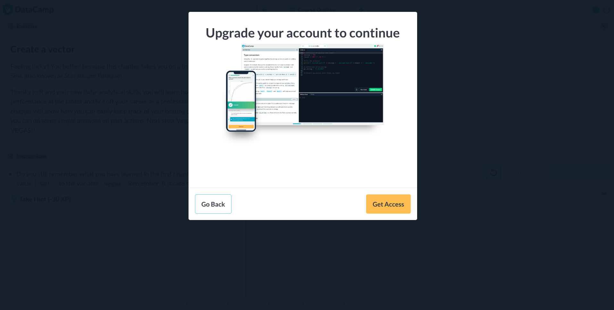

You have to pay

***

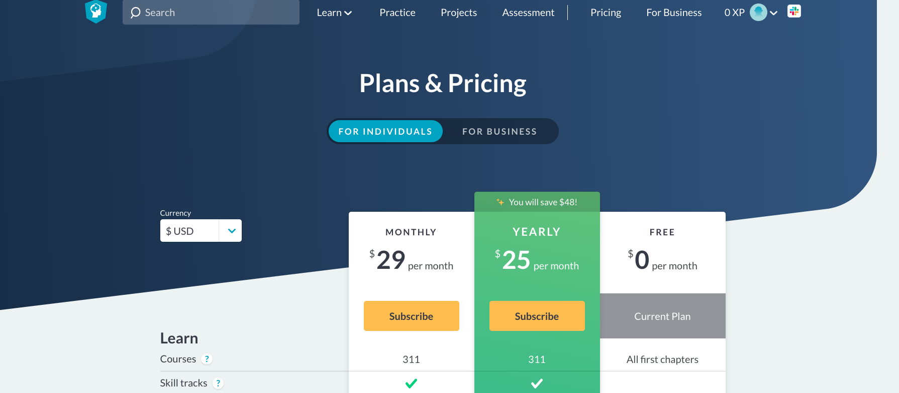
`(1$ = 5,75 TL)`

29$ `*` 5,75 TL `*` 6 Months `*` 1 Student= **833,75 TL** 

833,75 TL `*` 25 Students = **20.843,75 TL** 
