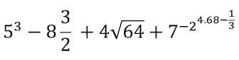

***

**Date** : 27/12/2019

***

### <span style="color:brown">**R Language - Indexing - 1D Data**</span>

1. Open your R-Studio, create a new **"R Project"** and **"R Script"** file and save it
2. Learn your **Working Directory** and check **files**, under your working directory 
3. Solve this math. Is your solution **bigger** than 4 ? TRUE or FALSE.
<center>   </center>
4. Create a **vector** with six **numeric** and two **integer** elements, and than **assign** it to a new variable *(vec1)*
5. Check the **class** *vec1*. Coerce *vec1* to be a **character** vector, **assign** it as *vec2*, and check the **class** *vec2*
6. Create a **vector** with eight **numeric** elements using **sequence function**, and **assign** it to a new variable *(vec3)*
7. Check the **length** and calculate the **mean** of *vec3*.
8. **Print** the second element of *vec3* and change it as "TRUE
9. Create a new **vector** with 16 elements using **the function that generate *r*andom *unif*orm numbers**, and **assign** it as *vec4*.
10. Create a new **matrix**, with 3 rows and 8 columns using *vec3* and *vec4* **by row**. Assign it as *mat1*.
11. Create a new **array** with 6 rows, 4 columns and 2 layers using *mat1*. Assign it as *arr1*
12. Check **structure** and **dimensions** of *mat1* and *arr1*.
13. **Select** 3rd row, 2nd column and change it with ***NA*** for each layers
14. Create a **data frame** with *vec1*, *vec2* and *vec3*. Assign it as *df1*. **Print** 2nd column of *df1*.
15. Create a **list** with *vec1*, *mat1*, *arr1* and *df1*. Assign it as *list1*. Print 4th element of *list1*.
16. Go to main web page and download Istanbul_Cekmekoy_Omerli_26072017-29072017_15min.txt in your working directory and **Read** the station data in R-Studio (be careful about file **path**, **header** and **seperator**). Assign it as **sta_data1**
17. Check the **structure** and **attributes** of **sta_data**. **Print** and **plot** the *precipiptation* and *temperature* of **sta_data1**.
18. Change temperature with **NA** if the value is **lower** than 20. Assign it as *sta_data2*
19. Write *sta_data2* as a new txt file in your working directory.
20. **Install** "ncdf4" package and call it into R-Studio from **library**.

***

### <span style="color:brown">**R Programming - Statistics - Visualization - 3D Data**</span>

21. Check the clock and assign it as a new variable named *clock* (e.g. 11,23). Write a **if condition**. If the *clock* is between 10 and 12, print "I am at school", else print "I should go to school".
```
if ( ... ) {
   print( ... )
} else {
   print( ... )
} 
```
22. Write a **loop**. Print **i** for each value from 4 to 11 in **for** loop.
```
for ( ... in ... ) { 
     print( ... ) 
}
```
23. **Assign** *temperature* of *sta_data1* as *temp1*. Write an nested **if-else condition** in **for loop**. Do that: 
  - look for all temperature values with **for loop**, (lenght of *temp1* is important, from 1st element to last element of *temp1*)
  - **if** *temp1* is **bigger than 20 and lower than 30** then **print** the value with " is not a extreme value" 
  - **else if** *temp1* is **lower than 20** then **print** each value with " is a lower value" 
  - **else**, **print** each value with " is a bigger value" 

```
for (i in 1:length( ... )) {
  if (temp1[i] < ... & ... ) {
    print(c(temp1[i], ... ))
  } else if ( ... ) {
    print( ... )
  } else { ... }
}
```
24. Write a **function** with named "*outlier*". Do these into function;
  - Mean, Median, Range of *temp1*
  - Variance, Standart Deviation
  - Plot, hist
  - Barplot with **table function**
  - **Summary function**
  - Boxplot
  - Write a **loop** and **condition**:
    Look **for** (loop) all *temp1*, **if** (condition) there is a outlier, **print** the *value* and *" is outlier"* together. Also **print** *index of outlier*.
  
  **NOTE** : Condition for outliers is:
OUTLIERS < MEAN-IQR(temp1)
or
OUTLIERS > MEAN+IQR(temp1)

```
outlier <- function( x ) {

...
...
...

  for (i in 1:length(x)) {
    if ( ... ) {
      print(c( ... , ... ))
      print(which(...))
    }
  }
  
}
```

***

25. Go to main web page and download CRU_TR_Near-Surface_Temp_16-01-1901_16-12-2012_Monthly.nc in your working directory and **read** the station data in R-Studio (WITH **ncdf4** Package). Assign it as **cru_data1**.
26. Check the metadata, **structure**, **class** and **attributes** of **cru_data1**.
27. Write these 
  - The **number** of *variable*(s) and *dimension*(s) 
  - **Name**(s) of *dimension*(s), 
  - Long and short **name** of *variable*(s), 
  - The **size** of *time* step.
  - **Last** step of *time.*
```
message(" ... variable(s) and ... dimension(s) ")
message("dimensions are ..., ..., ...")
message("the short name of variable is ..., the long name of variable is ... ")
message("the size of time step is ... ")
message("Time ends in  ... / ... ")

```
28. **Get** **attributes** of variable from netcdf file (WITH **ncdf4** Package). 
29. **Get** **variable** from netcdf file (WITH **ncdf4** Package). **Assign** it as *var1*.
30. Check the **structure**, **class** and **dimensions** of *var1*.
31. Print *var1* at 2nd *Time* step for all *Latitude*, *Longitude*.
32. **Image** the spatial (2D) Turkey Map for November 2010. (size of time step and temporal resolution are important)
33. Can you find the Latitude and Longitude grid (or **index**) number of **Istanbul**, approximately ? *(e.g. var1[2,34,])*
34. Calculate the **mean** of *var1* for Istanbul grid (or **index**) for **ALL time**.
35. **Plot** the values of *var1* time series for **ALL time** considering the Istanbul grid (or **index**).

***


