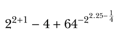

*** 

## Software Tools

#### 5th Week - R Language Part 1

***

**Part 1 - Basic Math**



```{r}
#aritmetic operators

```


**Part 2 - Assignment**

- Create a new object with the value. (Use Part 1 for value)
- Print your new object

```{r}
#assignment arrow
#print()

```

**Part 3 - Class**

- Print your name as a character string.
- Print your age as a numeric type.
- Print your age as a character type.
- Try to print your name as a numeric type. (?!) kidding
- Check classes for all.
- What is the class of TRUE and NA ?


```{r}
# print()
# " ... " 
# class()

```

**Part 4 - Vector**

- Create a new vector which has 4 elements with **numeric** class.
- Print you vector with **sorting**. (decreasing = TRUE)
- Add a new **character** element at your new vector.
- Now you must have 5 elemets. Learn the **length** of your vector.
- Check the class of your vector. Numeric or Character ?
- Now create another new vector, but now use **sequence** function.

```{r}
# combine them
# my_new_vector <-
# sort
# length()
# seq()

```


**Part 5 - Matrice**

- Create a new **matrice** with 4 rows and 5 colomns, using **random** variables.
- Select the grid located in 2nd row and 3rd coloms. Change it with **TRUE** (assigment).
- Check the **dimension**, **structure**, **length** and **class** of your matrix.


```{r}
# runif()
# matrix()
# indexing with []
# length()
# dim()
# str()
# class()

```


**Part 6 - Array**

- Create a new **vector** which has 4 elements, **character**.
- Create a new **matrice** with 2 rows and 4 colomns, **character**.
- Combine them, and create a new **array** with 2 rows, 4 columns and 2 layers. 
(first row must be vector, second and third rows must be matrix for each layer)
- Add **+2** for each values of 2nd layer of **matrix**.
- Check the **dimension**, **structure**, **length** and **class** of your matrix.
- Print values **which** is greater than or equal to 5

```{r}
# vector()
# matrix()
# array()
# length()
# dim()
# str()
# length
# class()
# which()
# >=

```


**Part 7 - Data Frame**

- **Read** and assign the data "18397_Cekmekoy_Omerli_15dk.txt". *(header=TRUE, sep = ";")*
(for example, <*my_txt_data*>)
- Check the **class** and **structure** of your new data. It must be **data.frame**.
- Take the *"Temperature"* parameter and save it as a new variable. (It will look like a vector)
- **Plot** the "temperature" vector.
- Find values **which** is lower than 20 and change them with **NA**.
- Print and Plot the new "temperature" vector 
- Replace these new temperature values with old temperature values located in your data frame. (*my_txt_data*)
- Write your data frame as a new csv file.

```{r}
# read.table()
# my_txt_data <-
# class()
# my_txt_data$
# plot()
# which()
# <20

```


