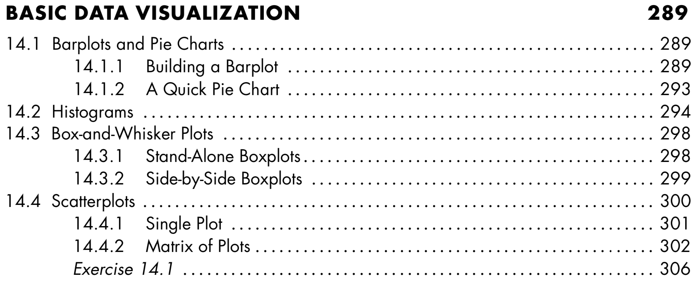

## **R Promgramming - Part 2**

- **Syllabus and Book**
- **DataCamp Class**
- **Practice - Assessment Test**
- **R Advance - <span style="color:orangered">*ncdf4*</span> & <span style="color:orangered">*RNetCDF*</span> Packages**

<span style="color:brown">**Coffee Break**</span>

- **R Elemantary Statistics**
- **Basic Data Visualization** 

<span style="color:brown">**QUIZ**</span>

- **Next Week**


# **Syllabus and Book**
## **Syllabus**


## **Book**


## **Book**



# **DataCamp Class**
## **DataCamp Class**


[LINK](https://www.datacamp.com/enterprise/software-tools-introduction-to-r)

# **Practice - Assessment Test**
## **Practice - Assessment Test**

1. Open Your R-Studio :)
2. Create a new **"R Project"**
3. Create a new **"R Script"** file and save it
4. Learn your **Working Directory**
5. Check **files**, under your working directory 
6. Create a **vector** with four **numeric** elements using **seq()**
7. **Assign** it to a new variable *(vec1)*
8. Check the **length** of vector
9. Calculate the **mean** of vector
10. Coerce your **numeric** vector to **characteristic** vector
11. Check the **class** of your new vetcor
12. **Print** the second element of your vector
13. **Change** the second element as "TRUE", assign it as ***vec1***

## **Practice - Assessment Test**

14. Create a new **vector** with 12 elements using **runif()**
15. Assign it as ***vec2***
16. Create a new **matrix**, 3 rows, 4 columns using this vector
17. **Assign** this matrix as a new variable
18. Check **dimensions** of this matrix
19. Create a new matrix (4x4) with using ***vec1*** and ***vec2***
20. Explain what is happening (bycol or byrow)
21. Create the same matrix again, this time with **byrow=T**
22. Assign it as ***mat1***
23. Create a new **array** with 4 rows, 4 columns and 2 layers using ***mat1***
24. Assign it as ***arr1***
25. **Select** 2nd row, 3rd column and change it with ***NA*** for each layers


## **Practice - Assessment Test**

26. Go to main web page of our course
27. Copy this data : Istanbul_Cekmekoy_Omerli_26072017-29072017_15min - txt
28. Paste your **"Download"** folder
29. Turn back to R Studio
30. **Read** the station data, be careful about file **path**, **header** and **seperator**
31. Assign it as **sta_data**
32. Check the **structure** and **attributes** of **sta_data**
33. **Print** and **plot** *precipiptation* of ***sta_data***
34. Write a **condition**; **if** total precipitation is **higher** than zero than **print** "Weather was rainy"
35. Install & load "ncdf4", "RNetCDF" and "ggplot2" packages


## NETCDF


## NETCDF - Data

CRU_TR_Near-Surface_Temp_16-01-1901_16-12-2012_Monthly


## NETCDF - Data

CRU_TR_Near-Surface_Temp_16-01-1901_16-12-2012_Monthly


# **R Advance - <span style="color:orangered">*ncdf4*</span> & <span style="color:orangered">*RNetCDF*</span> Packages**
## **R Advance - <span style="color:orangered">*ncdf4*</span> Package**


## **R Advance - <span style="color:orangered">*ncdf4*</span> Package**


- ncdf4_open <- <span style="color:brown">**nc_open**</span>("cru_1901_2012_tmp_TR.nc")


```
> ncdf4_open <- nc_open("cru_1901_2012_tmp_TR.nc")
> ncdf4_open

File ~/Desktop/Dersler/Yüksek_Lisans_Ders/Data Analysis/proje/Data_Analysis_Proje/cru_1901_2012_tmp_TR.nc (NC_FORMAT_CLASSIC):

     1 variables (excluding dimension variables):
        double tmp[lon,lat,time]   
            long_name: near-surface temperature
            units: degrees Celsius
            _FillValue: 9.96920996838687e+36
            missing_value: 9.96920996838687e+36
            correlation_decay_distance: 1200

     3 dimensions:
        lon  Size:42
            standard_name: longitude
            long_name: longitude
            units: degrees_east
            axis: X
        lat  Size:18
            standard_name: latitude
            long_name: latitude
            units: degrees_north
            axis: Y
        time  Size:1344   *** is unlimited ***
            standard_name: time
            long_name: time
            units: days since 1900-01-01 00:00:00
            calendar: standard

    10 global attributes:
        CDI: Climate Data Interface version 1.6.9 (http://mpimet.mpg.de/cdi)
        Conventions: CF-1.4
        history: Mon Feb 22 16:24:47 2016: cdo sellonlatbox,25,46,34,43 cru_ts3.21.1901.2012.tmp.dat.nc cru_1901_2012_tmp_TR.nc
Wed 10 Jul 2013 17:04:15 BST : User ianharris : Program makegridsauto.for called by update.for
        source: Run ID = 1307101324
Data generated by BADC from:
tmp.1307101049.dtb
        institution: Data held at British Atmospheric Data Centre, RAL, UK.
        title: CRU TS3.21 Mean Temperature
        references: Information on the data is available at http://badc.nerc.ac.uk/data/cru/
        comment: Data restrictions: for academic research use only.Contact BADC for details
        contact: BADC <badc@rl.ac.uk>
        CDO: Climate Data Operators version 1.7.0rc2 (http://mpimet.mpg.de/cdo)
```


## **R Advance - <span style="color:orangered">*RNetCDF*</span> Package**


## **R Advance - <span style="color:orangered">*RNetCDF*</span> Package**

- rnetcdf_open <- <span style="color:brown">**open.nc**</span>("cru_1901_2012_tmp_TR.nc")
- <span style="color:brown">**print.nc**</span>(rnetcdf_open)

```
> rnetcdf_open <- open.nc(veri.ad)
> print.nc(rnetcdf_open)

netcdf classic {
dimensions:
	lon = 42 ;
	lat = 18 ;
	time = UNLIMITED ; // (1344 currently)
variables:
	NC_DOUBLE lon(lon) ;
		NC_CHAR lon:standard_name = "longitude" ;
		NC_CHAR lon:long_name = "longitude" ;
		NC_CHAR lon:units = "degrees_east" ;
		NC_CHAR lon:axis = "X" ;
	NC_DOUBLE lat(lat) ;
		NC_CHAR lat:standard_name = "latitude" ;
		NC_CHAR lat:long_name = "latitude" ;
		NC_CHAR lat:units = "degrees_north" ;
		NC_CHAR lat:axis = "Y" ;
	NC_DOUBLE time(time) ;
		NC_CHAR time:standard_name = "time" ;
		NC_CHAR time:long_name = "time" ;
		NC_CHAR time:units = "days since 1900-01-01 00:00:00" ;
		NC_CHAR time:calendar = "standard" ;
	NC_DOUBLE tmp(lon, lat, time) ;
		NC_CHAR tmp:long_name = "near-surface temperature" ;
		NC_CHAR tmp:units = "degrees Celsius" ;
		NC_DOUBLE tmp:_FillValue = 9.96920996838687e+36 ;
		NC_DOUBLE tmp:missing_value = 9.96920996838687e+36 ;
		NC_DOUBLE tmp:correlation_decay_distance = 1200 ;

// global attributes:
		NC_CHAR :CDI = "Climate Data Interface version 1.6.9 (http://mpimet.mpg.de/cdi)" ;
		NC_CHAR :Conventions = "CF-1.4" ;
		NC_CHAR :history = "Mon Feb 22 16:24:47 2016: cdo sellonlatbox,25,46,34,43 cru_ts3.21.1901.2012.tmp.dat.nc cru_1901_2012_tmp_TR.nc
Wed 10 Jul 2013 17:04:15 BST : User ianharris : Program makegridsauto.for called by update.for" ;
		NC_CHAR :source = "Run ID = 1307101324
Data generated by BADC from:
tmp.1307101049.dtb" ;
		NC_CHAR :institution = "Data held at British Atmospheric Data Centre, RAL, UK." ;
		NC_CHAR :title = "CRU TS3.21 Mean Temperature" ;
		NC_CHAR :references = "Information on the data is available at http://badc.nerc.ac.uk/data/cru/" ;
		NC_CHAR :comment = "Data restrictions: for academic research use only.Contact BADC for details" ;
		NC_CHAR :contact = "BADC <badc@rl.ac.uk>" ;
		NC_CHAR :CDO = "Climate Data Operators version 1.7.0rc2 (http://mpimet.mpg.de/cdo)" ;
}
```


## R Advance - <span style="color:orangered">*ncdf4 *</span> VS <span style="color:orangered">*RNetCDF*</span>

<style>

.column-right0{
  float: right;
  width: 50%;
  text-align: right;
}
.column-left0{
  float: left;
  width: 50%;
  text-align: left;
}
</style>

<div class="column-left0">

```
- class(ncdf4_open)
- str(ncdf4_open)
- attributes(ncdf4_open)
- attributes(ncdf4_open$var)
- attributes(ncdf4_open$var$tmp)

- ncdf4_open$var$tmp$longname
- ncdf4_open$var$tmp$name
- ncdf4_open$var$tmp
 
```

```
- ncatt_get(ncdf4_open,'tmp')
- ncvar_get(ncdf4_open,ncdf4_open$var$tmp$name)
- ncvar_get(ncdf4_open,"tmp")
- ncdf4_tmp <- ncvar_get(ncdf4_open,"tmp")

- class(ncdf4_tmp)
- dim(ncdf4_tmp)
- str(ncdf4_tmp)

- attributes(ncdf4_open)
- attributes(ncdf4_open$dim)
- ncdf4_lon <- ncvar_get(ncdf4_open, ncdf4_open$dim$lon)
- ncdf4_lat <- ncvar_get(ncdf4_open, ncdf4_open$dim$lat)
- ncdf4_time<- ncvar_get(ncdf4_open, ncdf4_open$dim$time)

```

</div>


<div class="column-right0">

```
rnetcdf_open <- open.nc(data_name)
class(rnetcdf_open)
str(rnetcdf_open)

rnetcdf_read <- read.nc(rnetcdf_open)
class(rnetcdf_read)
str(rnetcdf_read)
attributes(rnetcdf_read)

var.get.nc(rnetcdf_open,'tmp')
rnetcdf_tmp <- var.get.nc(rnetcdf_open,'tmp')

class(rnetcdf_tmp)
dim(rnetcdf_tmp)
str(rnetcdf_tmp)
```

```
attributes(rnetcdf_open)
attributes(rnetcdf_read)

rnetcdf_lon <- var.get.nc(rnetcdf_open, "lon")
rnetcdf_lat <- var.get.nc(rnetcdf_open, "lat")
rnetcdf_time<- var.get.nc(rnetcdf_open, "time")
```

</div>


## **R Advance - <span style="color:orangered">*ncdf4*</span> Package**


```
- rnetcdf_time_julian <- as.Date(rnetcdf_time, origin=as.Date("1900-01-01")) 
- ncdf4_time_julian <- as.Date(ncdf4_time, origin=as.Date("1900-01-01"))

- ncdf4_tmp <- ncvar_get(ncdf4_open,"tmp")
- ncdf4_tmp[,,1]
- ncdf4_tmp_mean <- ncdf4_tmp[,,1:1344]

- image(ncdf4_lon, ncdf4_lat, ncdf4_tmp_mean)

```


## **R Advance - <span style="color:orangered">*ncdf4*</span> Package**


```
- install.packages("maptools")
- library("maptools")

- turkey_shp <- readShapePoly("turkiye.shp")

- image(rnetcdf_lon, rnetcdf_lat, ncdf4_tmp_mean)

- plot(turkey_shp, add = T)
```


## **R Advance - <span style="color:orangered">*ncdf4*</span> Package**


```
- library("fields")

- image.plot( rnetcdf_lon, rnetcdf_lat, ncdf4_tmp_mean, 
              xlab = "Lon", 
              ylab = "Lat", 
              main = "Mean Temperature for Turkey" )

- plot(turkiye.shp, add = T) 
```


# <span style="color:orangered">**Coffee Break**</span>


#  **R Elemantary Statistics**
##  **R Elemantary Statistics**


##  **R Elemantary Statistics**

**Centrality**: <span style="color:orangered">**Mean**</span>, Median, Mode

- Measures of centrality are commonly used to explain large collections of data by describing where numeric observations are centered.


##  **R Elemantary Statistics**

**Centrality**: Mean, <span style="color:orangered">**Median**</span>, Mode

- **Median** : “middle magnitude” of your observations


0 . 0 . <span style="color:orangered">0</span> . 0 . 0

o . o . <span style="color:orangered">o . o</span> . o . o


##  **R Elemantary Statistics**

**Centrality**: Mean, Median, <span style="color:orangered">**Mode**</span>

- **Mode** : Simply the “most common” observation.

Sample : 2 , 4.4 , 3 , 3 , 2 , 2.2 , 2 , 4


2 , 2 , 2 , 2.2 , 3 , 3 , 4, 4.4 ( n=8 , n/2 = 4)


##  **R Elemantary Statistics**

**Centrality**: Mean, Median, Mode


xdata <- c(2,4.4,3,3,2,2.2,2,4)

- mean(xdata)
- median(xdata)
- min(xdata)
- max(xdata)
- range(xdata)


##  **R Elemantary Statistics**

<span style="color:orangered">**Quantiles, Percentiles**</span>, and the Five-Number Summary

- A quantile is a value indicates an observation rank when compared to all the other present observations.
- For example, the **median** is itself a **quantile**. It’s the 0.5th quantile. 
- Alternatively, quantiles can be expressed as a **percentile.**

<span style="color:orangered">**The median = the 0.5th quantile = The 50th percentile**</span>

Sample : 2 , 4.4 , 3 , 3 , 2 , 2.2 , 2 , 4

2 , 2 , 2 , <span style="color:orangered">2.2 , 3</span> , 3 , 4, 4.4

0.5th quantile = median = 2.6

##  **R Elemantary Statistics**

<span style="color:orangered">**Quantiles, Percentiles**</span>, and the Five-Number Summary

```{r}
xdata <- c(2,4.4,3,3,2,2.2,2,4)
quantile(xdata,prob=0.8) # the 0.8th quan- tile (or 80th percentile)

quantile(xdata,prob=c(0,0.25,0.5,0.75,1))

summary(xdata) # A quartile is a type of quantile.
```


##  **R Elemantary Statistics**

Quantiles, Percentiles, and <span style="color:orangered">**the Five-Number Summary**</span>


A **quartile** is a type of quantile.

##  **R Elemantary Statistics**

**Spread**: Variance, Standard Deviation, and the Interquartile Range

- How dispersed your data are. For this, measures of spread are needed.

```{r}
xdata <- c(2,4.4,3,3,2,2.2,2,4)
ydata <- c(1,4.4,1,3,2,2.2,2,7)

mean(xdata)
mean(ydata)
```


##  **R Elemantary Statistics**

```{r fig.height=3, fig.width=8}
plot(xdata,type="n",xlab="",ylab="data vector",yaxt="n",bty="n")
abline(h=c(3,3.5),lty=2,col="red")
abline(v=2.825,lwd=2,lty=3)
text(c(0.8,0.8),c(3,3.5),labels=c("x","y"))
points(jitter(c(xdata,ydata)),c(rep(3,length(xdata)), rep(3.5,length(ydata))))
```

the observations in *ydata* are more “spread out”


##  **R Elemantary Statistics**

**Spread**: <span style="color:orangered">**Variance**</span>, Standard Deviation, and the Interquartile Range

- The sample **variance** measures the degree of the spread of numeric observations around their arithmetic mean.


##  **R Elemantary Statistics**

**Spread**: <span style="color:orangered">**Variance**</span>, Standard Deviation, and the Interquartile Range

2 , 4.4 , 3 , 3 , 2 , 2.2 , 2 , 4 ( mean = 2.825)


##  **R Elemantary Statistics**

**Spread**: Variance, <span style="color:orangered">**Standard Deviation**</span>, and the Interquartile Range

- The standard deviation is simply the square root of the variance. The scale of the original observations.


**0.953 represents the average distance of each observation from the mean**


##  **R Elemantary Statistics**

**Spread**: Variance, Standard Deviation, and <span style="color:orangered">**the Interquartile Range**</span>,

- Unlike the variance and standard deviation, the interquartile range (IQR) is **not** computed with respect to the sample mean.


- IQR is computed as the difference between the upper and lower quartiles of your data


##  **R Elemantary Statistics**

**Spread**: Variance, Standard Deviation, and the Interquartile Range

```{r}
xdata <- c(2,4.4,3,3,2,2.2,2,4)

var(xdata)
sd(xdata)
IQR(xdata)
```


##  **R Elemantary Statistics**


##  **R Elemantary Statistics**


##  **R Elemantary Statistics**

<span style="color:orangered">**Covariance**</span> and Correlation

- Investigate the relationship between two numeric variables to assess trends
- The *covariance* expresses how much two numeric variables “change together” and the nature of that relationship, whether it is positive or negative. 


##  **R Elemantary Statistics**

<span style="color:orangered">**Covariance**</span> and Correlation

x = {x1,x2,...,xn}

y = {y1,y2,...,yn}

for i = 1,. . . ,n


When you get a positive result for rxy, it shows that there is a positive lin- ear relationship. When rxy = 0, this indicates that there is no linear relationship. 


##  **R Elemantary Statistics**

<span style="color:orangered">**Covariance**</span> and Correlation

x = {2,4.4,3,3,2,2.2,2,4}

y = {1,4.4,1,3,2,2.2,2,7}

mean x and y = 2.825


positive relationship


##  **R Elemantary Statistics**

Covariance and <span style="color:orangered">**Correlation**</span>

- Correlation allows you to interpret the covariance further by identifying the strength of any association.


##  **R Elemantary Statistics**

Covariance and <span style="color:orangered">**Correlation**</span>

- Most common of these is Pearson’s product-moment correlation coefficient. (R default)

- The correlation coefficient estimates the nature of the linear relationship between two sets of observations


−1 ≤ *ρ*xy ≤ 1

ρxy = 1, which is a perfect positive linear relationship


##  **R Elemantary Statistics**

Covariance and <span style="color:orangered">**Correlation**</span>

x = {2,4.4,3,3,2,2.2,2,4}

y = {1,4.4,1,3,2,2.2,2,7}

(mean x and y = 2.825)

(*s*x = 0.953 and *s*y = 2.013)

(*r*xy = 1.479)


*ρ*xy is positive


##  **R Elemantary Statistics**

Covariance and Correlation

```{r}
xdata <- c(2,4.4,3,3,2,2.2,2,4)
ydata <- c(1,4.4,1,3,2,2.2,2,7)

cov(xdata,ydata)

cor(xdata,ydata)
```


##  **R Elemantary Statistics**

Covariance and Correlation

```{r fig.height=4, fig.width=4}
xdata <- c(2,4.4,3,3,2,2.2,2,4)
ydata <- c(1,4.4,1,3,2,2.2,2,7)
plot(xdata,ydata,pch=13,cex=1.5)
```


##  **R Elemantary Statistics**


##  **R Elemantary Statistics**


#  **Basic Data Visualization** 
##  **Basic Data Visualization** 

<span style="color:orangered">**Barplots**</span> and Pie Charts

```{r}
station_data <- read.csv("https://web.itu.edu.tr/~tokerem/18397_Cekmekoy_Omerli_15dk.txt", header=T, sep = ";")

head(station_data)

```


##  **Basic Data Visualization** 

<span style="color:orangered">**Barplots**</span> and Pie Charts

```{r fig.height=3, fig.width=6}
head(station_data$temp)
barplot(station_data$temp)
```


##  **Basic Data Visualization** 

<span style="color:orangered">**Barplots**</span> and Pie Charts

```{r fig.height=3, fig.width=6}
table(station_data$temp)

f_temp <- table(station_data$temp)
```


##  **Basic Data Visualization** 

<span style="color:orangered">**Barplots**</span> and Pie Charts

```{r fig.height=3, fig.width=6}
barplot(f_temp)
```


##  **Basic Data Visualization** 

<span style="color:orangered">**Barplots**</span> and Pie Charts

```{r fig.height=3, fig.width=8}
barplot(f_temp,beside=TRUE,horiz=TRUE,las=1,
        main="Frequency of Station Temperature",
        names.arg=c("T"),legend.text=c("TEMP-f"),
        args.legend=list(x="bottomright"))
```


##  **Basic Data Visualization** 

<span style="color:orangered">**Barplots**</span> and Pie Charts

```{r fig.height=3, fig.width=8}
library(ggplot2)
qplot(factor(station_data$temp),geom="bar")
```


##  **Basic Data Visualization** 

Barplots and <span style="color:orangered">**Pie Charts**</span>

```
head(station_data$precipitation)

pie(table(station_data$precipitation),labels=c("V1","V2","V3","V4","V5"),col=c("white","blue","green","orange"),main="pie chart for precipitation")
```


##  **Basic Data Visualization** 

<span style="color:orangered">**Histogram**</span>

```{r fig.height=3, fig.width=8}
hist(station_data$temp)
```


##  **Basic Data Visualization** 

<span style="color:orangered">**Histogram**</span>

```{r fig.height=3, fig.width=8}
hist(station_data$tem,breaks=seq(19,32,1),col="green",main="Temp",xlab="HP")
abline(v=c(mean(station_data$temp),median(station_data$temp)), col=c("blue","red"),lty=c(2,3),lwd=2)
legend("topright",legend=c("mean T","median T"),lty=c(2,3),lwd=2,col=c("blue","red"))
```

##  **Basic Data Visualization** 

<span style="color:orangered">**Histogram**</span>

```{r fig.height=3, fig.width=8}
qplot(station_data$temp,geom="blank",main="Temp Hist",xlab="Temp")+ 
  geom_histogram(color="black",fill="white",breaks=seq(19,32,1),closed="right") + 
  geom_vline(mapping=aes(xintercept=c(mean(station_data$tem), median(station_data$tem)), linetype=factor(c("mean","median"))) , col=c("blue","red"),show.legend=TRUE)+ 
  scale_linetype_manual(values=c(2,3)) + 
  labs(linetype="")
```


##  **Basic Data Visualization** 

<span style="color:orangered">**Boxplot**</span>

```{r fig.height=4, fig.width=4}
boxplot(station_data$temp)
```

##  **Basic Data Visualization** 

<span style="color:orangered">**Boxplot**</span>


##  **Basic Data Visualization** 

<span style="color:orangered">**Scatter Plots**</span>

```{r fig.height=4, fig.width=4}
plot(station_data$temp,station_data$relative_humidity)
```


##  **Basic Data Visualization** 

<span style="color:orangered">**Scatter Plots**</span>

```{r fig.height=4, fig.width=4}
head(station_data[,7:10])
```


##  **Basic Data Visualization** 

```{r fig.height=5, fig.width=6}
library("GGally")
ggpairs(station_data[,7:10],axisLabels="internal")
```


# <span style="color:brown">**QUIZ**</span>

# **Next Week**
