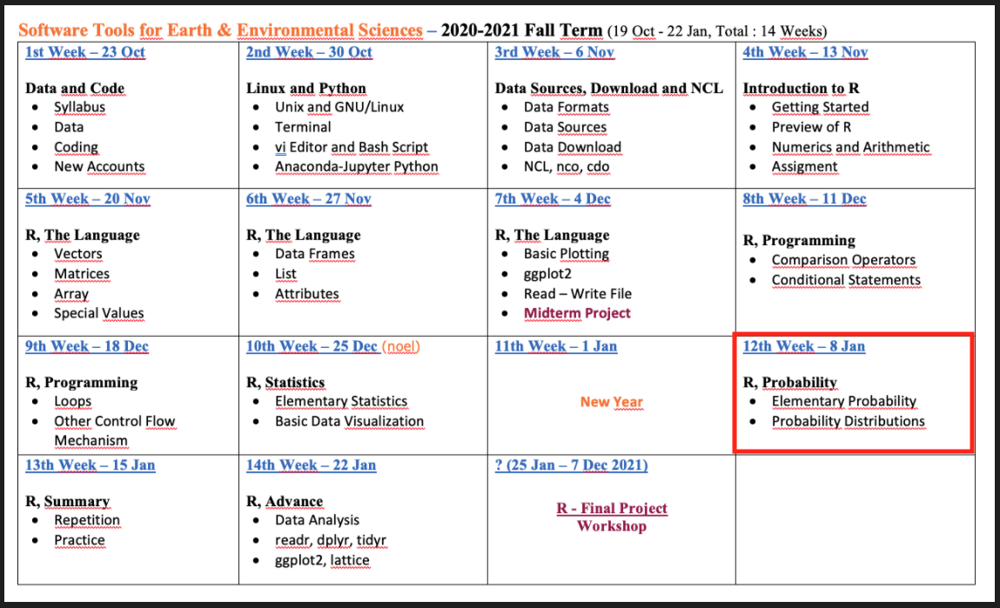
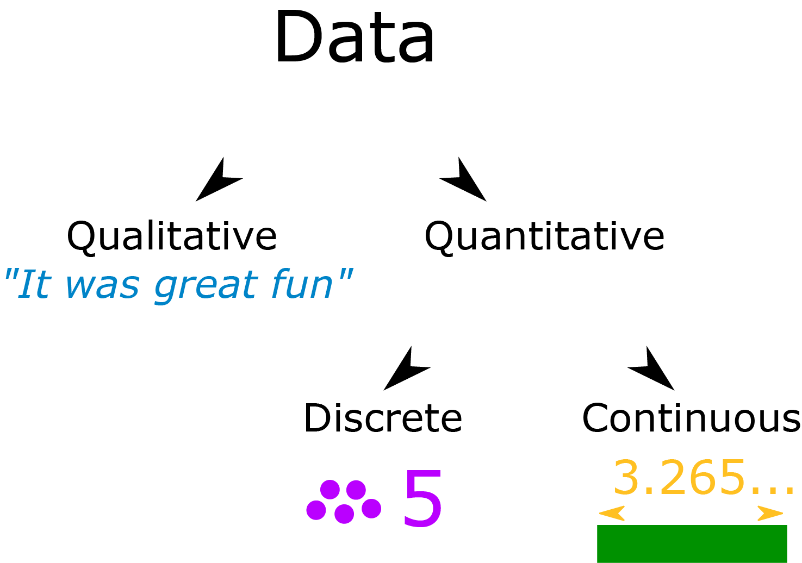
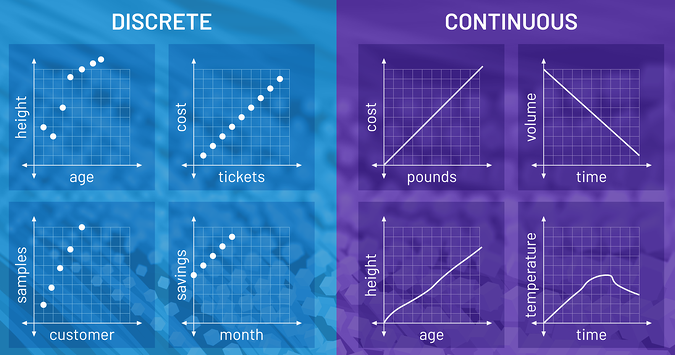
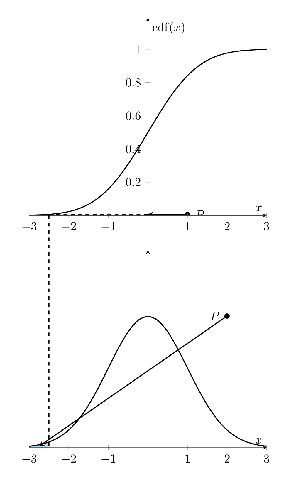
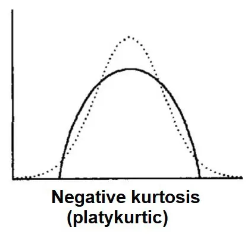
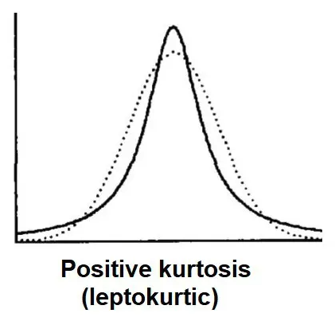
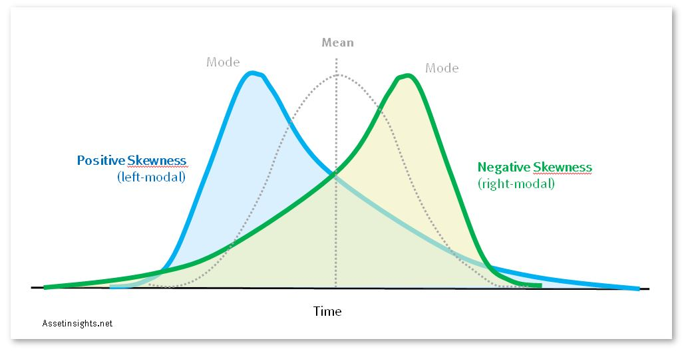
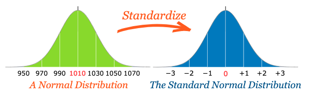

## **R Probability**

- **Syllabus and Book**
- **R Statistics - Repeat**
- **R - Probability**
- **Next Week**


# **Syllabus and Book**


## **Syllabus**



## **Book**

 

[LINK](https://www.datacamp.com/enterprise/software-tools-introduction-to-r)


#  **R - Elemantary Statistics**
##  **R - Elemantary Statistics**


##  **R - Elemantary Statistics**

**Centrality**: <span style="color:orangered">**Mean**</span>, Median, Mode

- Measures of centrality are commonly used to explain large collections of data by describing where numeric observations are centered.


##  **R - Elemantary Statistics**

**Centrality**: Mean, <span style="color:orangered">**Median**</span>, Mode

- **Median** : “middle magnitude” of your observations


0 . 0 . <span style="color:orangered">0</span> . 0 . 0

o . o . <span style="color:orangered">o . o</span> . o . o


##  **R - Elemantary Statistics**

**Centrality**: Mean, Median, <span style="color:orangered">**Mode**</span>

- **Mode** : Simply the “most common” observation.

Sample : 2 , 4.4 , 3 , 3 , 2 , 2.2 , 2 , 4


2 , 2 , 2 , 2.2 , 3 , 3 , 4, 4.4 ( n=8 , n/2 = 4)


##  **R - Elemantary Statistics**

**Centrality**: Mean, Median, Mode


xdata <- c(2,4.4,3,3,2,2.2,2,4)

- mean(xdata)
- median(xdata)
- min(xdata)
- max(xdata)
- range(xdata)


##  **R - Elemantary Statistics**

<span style="color:orangered">**Quantiles, Percentiles**</span>, and the Five-Number Summary

- A quantile is a value indicates an observation rank when compared to all the other present observations.
- For example, the **median** is itself a **quantile**. It’s the 0.5th quantile. 
- Alternatively, quantiles can be expressed as a **percentile.**

<span style="color:orangered">**The median = the 0.5th quantile = The 50th percentile**</span>

Sample : 2 , 4.4 , 3 , 3 , 2 , 2.2 , 2 , 4

2 , 2 , 2 , <span style="color:orangered">2.2 , 3</span> , 3 , 4, 4.4

0.5th quantile = median = 2.6

##  **R - Elemantary Statistics**

<span style="color:orangered">**Quantiles, Percentiles**</span>, and the Five-Number Summary

```{r}
xdata <- c(2,4.4,3,3,2,2.2,2,4)
quantile(xdata,prob=0.8) # the 0.8th quan- tile (or 80th percentile)

quantile(xdata,prob=c(0,0.25,0.5,0.75,1))

summary(xdata) # A quartile is a type of quantile.
```


##  **R - Elemantary Statistics**

Quantiles, Percentiles, and <span style="color:orangered">**the Five-Number Summary**</span>


A **quartile** is a type of quantile.


##  **R - Elemantary Statistics**

Quantiles , Percentiles, and the Five-Number Summary

xdata <- c(2,4.4,3,3,2,2.2,2,4)

- quantile(xdata)
- summary(xdata)


##  **R - Elemantary Statistics**

**Spread**: Variance, Standard Deviation, and the Interquartile Range

- How dispersed your data are. For this, measures of spread are needed.

```{r}
xdata <- c(2,4.4,3,3,2,2.2,2,4)
ydata <- c(1,4.4,1,3,2,2.2,2,7)

mean(xdata)
mean(ydata)
```


##  **R - Elemantary Statistics**

```{r fig.height=3, fig.width=8}
plot(xdata,type="n",xlab="values",ylab="data vector",yaxt="n",bty="n", xlim = c(0,7)  )
abline(h=c(2.5,3),lty=2,col="red")
abline(v=2.825,lwd=2,lty=3)
text(c(0.0,0.0),c(2.5,3),labels=c("x","y"))
text(c(2.825),c(4),labels=c("mean"))
points(jitter(c(xdata,ydata)),c(rep(2.5,length(xdata)), rep(3,length(ydata))))
```

the observations in *ydata* are more “spread out”


##  **R - Elemantary Statistics**

**Spread**: <span style="color:orangered">**Variance**</span>, Standard Deviation, and the Interquartile Range

- The sample **variance** measures the degree of the spread of numeric observations around their arithmetic mean.


##  **R - Elemantary Statistics**

**Spread**: <span style="color:orangered">**Variance**</span>, Standard Deviation, and the Interquartile Range

2 , 4.4 , 3 , 3 , 2 , 2.2 , 2 , 4 ( mean = 2.825)


##  **R - Elemantary Statistics**

**Spread**: Variance, <span style="color:orangered">**Standard Deviation**</span>, and the Interquartile Range

- The standard deviation is simply the square root of the variance. The scale of the original observations.


**0.953 represents the average distance of each observation from the mean**


##  **R - Elemantary Statistics**

**Spread**: Variance, Standard Deviation, and <span style="color:orangered">**the Interquartile Range**</span>,

- Unlike the variance and standard deviation, the interquartile range (IQR) is **not** computed with respect to the sample mean.


- IQR is computed as the difference between the upper and lower quartiles of your data


##  **R - Elemantary Statistics**

**Spread**: Variance, Standard Deviation, and the Interquartile Range

```{r}
xdata <- c(2,4.4,3,3,2,2.2,2,4)

var(xdata)
sd(xdata)
IQR(xdata)
```


##  **R - Elemantary Statistics**


##  **R - Elemantary Statistics**


##  **R - Elemantary Statistics**

**Spread**: Variance, Standard Deviation, and the Interquartile Range


xdata <- c(2,4.4,3,3,2,2.2,2,4)

- var()
- sd()
- IQR()


##  **R - Elemantary Statistics**

<span style="color:orangered">**Covariance**</span> and Correlation

- Investigate the relationship between two numeric variables to assess trends
- The *covariance* expresses how much two numeric variables “change together” and the nature of that relationship, whether it is positive or negative. 


##  **R - Elemantary Statistics**

<span style="color:orangered">**Covariance**</span> and Correlation

x = {x1,x2,...,xn}

y = {y1,y2,...,yn}

for i = 1,. . . ,n


When you get a positive result for rxy, it shows that there is a positive lin- ear relationship. When rxy = 0, this indicates that there is no linear relationship. 


##  **R - Elemantary Statistics**

<span style="color:orangered">**Covariance**</span> and Correlation

x = {2,4.4,3,3,2,2.2,2,4}

y = {1,4.4,1,3,2,2.2,2,7}

mean x and y = 2.825


positive relationship

##  **R - Elemantary Statistics**

<span style="color:orangered">**Covariance**</span> and Correlation

```{r fig.height=4, fig.width=4}
x <- c(2,4.4,3,3,2,2.2,2,4)
y <- c(1,4.4,1,3,2,2.2,2,7)
plot(x,y, col="red", pch=13,cex=1.5 )
```


##  **R Elemantary Statistics**

Covariance and Correlation

```{r fig.height=3, fig.width=3}
x <- c(2,4.4,3,3,2,2.2,2,4)
y <- c(1,4.4,1,3,2,2.2,2,7)
plot(x,y, col="red", pch=13,cex=1.5 )
abline(lm(y~x), col="blue")
```

##  **R - Elemantary Statistics**

Covariance and <span style="color:orangered">**Correlation**</span>

- Correlation allows you to interpret the covariance further by identifying the strength of any association.


##  **R - Elemantary Statistics**

Covariance and <span style="color:orangered">**Correlation**</span>

- Most common of these is Pearson’s product-moment correlation coefficient. (R default)

- The correlation coefficient estimates the nature of the linear relationship between two sets of observations


−1 ≤ *ρ*xy ≤ 1

ρxy = 1, which is a perfect positive linear relationship


##  **R - Elemantary Statistics**

Covariance and <span style="color:orangered">**Correlation**</span>

x = {2,4.4,3,3,2,2.2,2,4}

y = {1,4.4,1,3,2,2.2,2,7}

(mean x and y = 2.825)

(*s*x = 0.953 and *s*y = 2.013)

(*r*xy = 1.479)


*ρ*xy is positive


##  **R - Elemantary Statistics**

Covariance and <span style="color:orangered">**Correlation**</span>

```{r fig.height=4, fig.width=4}
x <- c(2,4.4,3,3,2,2.2,2,4)
y <- c(1,4.4,1,3,2,2.2,2,7)
plot(x,y, col="red", pch=13,cex=1.5 )
abline(lm(y~x), col="blue")
```


##  **R - Elemantary Statistics**

Covariance and Correlation

```{r}
xdata <- c(2,4.4,3,3,2,2.2,2,4)
ydata <- c(1,4.4,1,3,2,2.2,2,7)

cov(xdata,ydata)

cor(xdata,ydata)
```


##  **R - Elemantary Statistics**

Covariance and Correlation

- cov( , )
- cor( , )


##  **R - Elemantary Statistics**


#  **Basic Data Visualization** 
##  **Basic Data Visualization** 

<span style="color:orangered">**Barplots**</span>

```{r}
station_data <- read.csv("https://web.itu.edu.tr/~tokerem/18397_Cekmekoy_Omerli_15min.txt", header=T, sep = ";")

head(station_data)

```


##  **Basic Data Visualization** 

<span style="color:orangered">**Barplots**</span> 

```{r fig.height=3, fig.width=6}
head(station_data$temp)
barplot(station_data$temp)
```


##  **Basic Data Visualization** 

<span style="color:orangered">**Barplots**</span>

```{r}
station_data$temp
```


##  **Basic Data Visualization** 

<span style="color:orangered">**Barplots**</span>

```{r fig.height=3, fig.width=6}
table(station_data$temp)

f_temp <- table(station_data$temp)
```


##  **Basic Data Visualization** 

<span style="color:orangered">**Barplots**</span>

```{r fig.height=3, fig.width=6}
barplot(f_temp)
```


##  **Basic Data Visualization** 

<span style="color:orangered">**Histogram**</span>

```{r fig.height=3, fig.width=8}
hist(station_data$temp)
```


##  **Basic Data Visualization** 

<span style="color:orangered">**Histogram**</span>

```{r fig.height=3, fig.width=8}
library(ggplot2)
qplot(station_data$temp,geom="blank",main="Temp Hist",xlab="Temp")+ 
  geom_histogram(color="black",fill="white",breaks=seq(19,32,1),closed="right") + 
  geom_vline(mapping=aes(xintercept=c(mean(station_data$tem), median(station_data$tem)), linetype=factor(c("mean","median"))) , col=c("blue","red"),show.legend=TRUE)+ 
  scale_linetype_manual(values=c(2,3)) + 
  labs(linetype="")
```


##  **Basic Data Visualization** 

<span style="color:orangered">**Boxplot**</span>

<style>

.column-right0{
  float: right;
  width: 50%;
  text-align: right;
}
.column-left0{
  float: left;
  width: 50%;
  text-align: left;
}
</style>

<div class="column-left0">
```{r fig.height=4, fig.width=4}
boxplot(station_data$temp)
```
</div>

<div class="column-right0">
```{r fig.height=4, fig.width=4}
mean(station_data$temp)
median(station_data$temp)
quantile(station_data$temp)
# summary(station_data$temp)
```
</div>


##  **Basic Data Visualization** 

<span style="color:orangered">**Boxplot**</span>


##  **Basic Data Visualization** 

<span style="color:orangered">**Histogram and Boxplot**</span>

<style>

.column-right0{
  float: right;
  width: 50%;
  text-align: right;
}
.column-left0{
  float: left;
  width: 50%;
  text-align: left;
}
</style>

<div class="column-left0">
```{r fig.height=4, fig.width=4}
hist(station_data$temp)
abline(v=median(station_data$temp),col="red")
```
</div>

<div class="column-right0">
```{r fig.height=4, fig.width=4}
boxplot(station_data$temp,horizontal = T)
abline(v=median(station_data$temp),col="red")
```
</div>


##  **Basic Data Visualization** 

<span style="color:orangered">**Scatter Plots**</span>

```{r fig.height=4, fig.width=4}
plot(station_data$temp,station_data$relative_humidity)
```


# **R - Probability**


## **R - Probability**

- **Probability**
- **Qualitative and Quantitative Data**
- **Discrete and Continuous Data**
- **Probability 'Density vs Mass' Function (PDF vs PMF)**
- **Cumulative Distribution Function (CDF)**
- **Shape of PDF** : Symmetry, Skewness, Modality, Kurtosis
- **Common Probability Distributions - Discrete**
- **Common Probability Distributions - Continuous**
- **Practice** : Write A Function for outliers


# **Probability**

## **Probability**


A **probability** is a number that describes the *“magnitude of chance”* associated with making a particular observation or statement. 

{width=20%}

**?** *what is the probability of rolling a 3 with this black dice*

It’s always a number **between 0 and 1** (inclusive) and is often expressed as a fraction.


## **Qualitative and Quantitative Data**

**Quantitative** data can be counted, measured, and expressed using numbers. **Qualitative** data is descriptive and conceptual.

{width=50%}

## **Discrete and Continuous Data**

**Discrete** data is information that can only take certain values. **Continuous** data is data that can take any value




## **Probability 'Mass vs Density' Function (PDF vs PMF)**

Probability **mass** and **density** functions are used to describe discrete and continuous probability distributions, respectively. 


## **Cumulative Distribution Function**

**CDF** describes the probability (with a given probability distribution) at less than or equal to **x**.

{width=38.5%}   {width=30%} 


## Dice Example - White and Black Dice

{width=70%}

##

```{r fig.height=5}
X.outcomes <- c(2:12)
X.prob <- c((1/36),(2/36),(3/36),(4/36),(5/36),(6/36),(5/36),(4/36),(3/36),(2/36),(1/36))
barplot(X.prob,ylim=c(0,0.20),names.arg=X.outcomes,space=0,xlab="x",ylab="Pr(X = x)", main = "probability mass function")
```


##

```{r fig.height=5}
X.outcomes <- c(2:12)
X.prob <- c((1/36),(2/36),(3/36),(4/36),(5/36),(6/36),(5/36),(4/36),(3/36),(2/36),(1/36))
X.cumul <- cumsum(X.prob)
barplot(X.cumul,names.arg=X.outcomes,space=0,xlab="x",ylab="Pr(X <= x)", main = "cumulative distribution function")
```


##

```{r fig.height=5}
X.outcomes <- c(2:12)
X.prob <- c((1/36),(2/36),(3/36),(4/36),(5/36),(6/36),(5/36),(4/36),(3/36),(2/36),(1/36))
barplot(X.prob,ylim=c(0,0.20),names.arg=X.outcomes,space=0,xlab="x",ylab="Pr(X = x)", main = "probability mass function")
abline(v=c(0.5:10.5))
```

## PDF - Probability Density Function

<style>

.column-right1{
  float: right;
  width: 40%;
  text-align: right;
}
.column-left1{
  float: left;
  width: 60%;
  text-align: left;
}
</style>

<div class="column-left1">

</div>

<div class="column-right1">

```
lower < 7 < upper

X >= 2  &  X <= 7
(X[lower] - 1)/36

X > 7 & X <= 12
13 - X[upper])/36
```
</div>


##

```{r fig.height=3, fig.width=4}
X.outcomes <- c(1,2,3,4,5,6,7,8,9,10,11,12,13)
lower <- X.outcomes >= 2 & X.outcomes <= 7
upper <- X.outcomes > 7 & X.outcomes <= 12

fx <- rep(0,length(X.outcomes))
fx[lower] <- (X.outcomes[lower] - 1)/36
fx[upper] <- (13 - X.outcomes[upper])/36

plot(X.outcomes,fx,type="l",ylab="f(x)", xlim = c(0,14), main = "probability density function")
abline(h=0,col="gray",lty=2)
```


##

```{r fig.height=3, fig.width=4}
fx.specific <- (4.5-1)/36
fx.specific.area <- 3.5*fx.specific*0.5
fx.specific.vertices <- rbind(c(1,0),c(4.5,0),c(4.5,fx.specific))

plot(X.outcomes,fx,type="l",ylab="f(x)", xlim = c(0,14), main = "probability density function")
abline(h=0,col="gray",lty=2)
polygon(fx.specific.vertices,col="gray",border=NA)
abline(v=4.5,lty=3)
text(4,0.01,labels=fx.specific.area)
```


## **R - Probability - <span style="color:orangered">*Shape*</span>**

- **Symmetry** : Draw a vertical line down the center, and it is equally reflected with 0.5 probability.

- **Skewness** : If a distribution is asymmetric, look at the “**tail**” of a distribution. *Positive* or *right* *skew* indicates a tail extending longer to the right of center.

- **Modality** : Describes the number of easily identifiable peaks in the distribution of interest. *Unimodal*, *bimodal*, and *trimodal...*

- **Kurtosis** : Measure of the "tailedness" of the probability distribution. Positive kurtosis indicates a distribution where more of the values are located in the tails


## Kurtosis

 

{width=30%}  {width=29.4%} 

## Skewness



##


##

```{r}
table(station_data$temp)

df_temp_table <- data.frame(table(station_data$temp))
df_temp_table
```


##

```{r fig.height=6}
barplot(df_temp_table$Freq/121,names.arg=df_temp_table$Var1)
```


# **Common Probability Distributions - Discrete**

## **Common Probability Distributions - Discrete**

- Bernoulli Distribution
- Binomial Distribution
- Poisson Distribution


## **Bernoulli**

- Bernoulli Distribution has only two possible outcomes, such as success or failure.

{width=30%}


## **Bernoulli **

- Probability of rain : 0.6

```{r fig.height=3, fig.width=6}
x <- 1
p <- 0.6
b_fx <- p^x*((1-p)^(1-x))

barplot(c(1-p,p),names.arg=c(0,1))
```


## **Binomial **

-  The **binomial** distribution, **x** number of successes in a sequence of **n** independent experiments. *(success = p, failure q = 1 − p)*


## **Binomial **

Density, distribution function, quantile function and random generation for the **binomial** distribution with parameters size and prob.

- dbinom(x, size, prob)
- pbinom(x, size, prob)
- qbinom(p, size, prob)
- rbinom(n, size, prob)
-
- **x** is a vector of numbers.
- **p** is a vector of probabilities.
- **n** is number of observations.
- **size** is the number of trials.
- **prob** is the probability of success of each trial.


## **Binomial**

- Suppose there are **twelve** questions in a quiz. (size=12)
- Each question has **two** possible answers, and only one of them is correct. ( p = 1/2 = 0.5 )
- Find the probability of having **four** or less correct answers (x = 0:4) *(student answer questions randomly)*

```{r}
x <- 0:4  
size <- 12
prob <- 0.5

dbinom(x , size , prob)

pbinom(4 , size , prob)
```


## **Binomial**

```{r fig.height=3, fig.width=5}
prob <- dbinom(x = 0:12 , size = 12 , prob = 0.5)
plot(prob)
```


## **Binomial**

- Each question has **five** possible answers ( p = 1/5 = 0.2 )

```{r fig.height=3, fig.width=5}
prob <- dbinom(x = 0:12 , size = 12 , prob = 0.2)
plot(prob)
```


## **Poisson**

- In general, rarely seen event, basically. While **n** is too big, **p** is too small.


λp should be interpreted as the “mean number of occurrences”


## **Poisson**

There are three functions associated with Binomial distributions. 

- dpois(x, lambda)
- ppois(q, lambda, lower.tail)
- qpois(p, lambda, lower.tail)
- rpois(n, lambda)
-
- **x** : successes in a period
- **λ** : the expected number of events
- **lower.tail**  = TRUE for left tail
- **q** vector of quantiles
- **n** number of random values to return
- **p** vector of probabilities


## **Poisson**

- Historical average: 4 babies born in this hospital every day. 
- What is the probability that 6 babies will be born in this hospital tomorrow?

```{r}
x <- 6
lambpa <- 4

dpois(x, lambpa)
```


## **Poisson**

- What is the probability, between 6 and 16 babies in this hospital tomorrow?

```{r fig.height=3, fig.width=5}
x <- 6:16
lambpa <- 4
prob <- dpois(x, lambpa)
plot(x = 5:15, prob)
```


# **Common Probability Distributions - Continuous**

## **Common Probability Distributions - Continuous**

- Uniform Distribution
- Normal Distribution

## **Uniform**

The **uniform** distribution is a simple density function that describes a continuous random variable whose interval of possible values offers no fluctuations in probability.


## **Uniform**


## **Uniform**

- dunif( x, min, max )
- punif( q, min, max )
- qunif( p, min, max )
- runif( n, min, max )
-
- **x** : a vector of numbers.
- **p** : a vector of probabilities.
- **n** : number of observations.
- **min, max** : lower and upper limits

## **Uniform**

- Select ten random numbers between one and three.

```{r}
runif(n = 10, min = 1, max = 3)

r1 <- runif(n = 10, min = 1, max = 3)
table(r1)

t1 <- table(r1)    # frequence
```


## **Uniform**

```{r fig.height=5}
barplot(t1)      # frequence
```

## **Uniform**

```{r fig.height=5}
barplot(table(runif(n = 100,1,3)))

```


## **Uniform**

```{r fig.height=5}
barplot(table(runif(n = 1000,1,3)))

```


## **Normal**

- Theoretical, characterized by a distinctive “bell-shaped” curve 
- Aso referred to as the **Gaussian** distribution
- Mean = Median = Mode, Symmetric, Skewness = 0, Kurtosis = 3
- 50% of values less than the mean and 50% greater than the mean


## **Normal**


## **Normal**


{width=40%} {width=40%}


## **Standart Normal**

The standard normal distribution is a normal distribution with a mean of 0 and standard deviation of 1.




## **Normal**

- dnorm( x, mean, sd )
- pnorm( q, mean, sd )
- qnorm( p, mean, sd )
- rnorm( n, mean, sd )
- 
- x, q : vector of quantiles.
- p	: vector of probabilities.
- n	: number of observations. 
- mean : vector of means.
- sd : vector of standard deviations.


## **Normal**


```{r}
x <- seq(-15, 15, by=1)
x
```


## **Normal**

```{r fig.height=4}
plot(x)
```

## **Normal**

```{r fig.height=4}
hist(x)
```
`


## **Normal**

```{r fig.height=4}
barplot(x)
```

## **Normal**

```{r fig.height=4}
barplot(table(x))
```


## **Normal**

```{r}
dn <- dnorm(x, mean(x), sd(x)) 
dn
```


## **Normal**
```{r fig.height=4}
plot(x, dn) 
```


# Next Week

## Next Week


