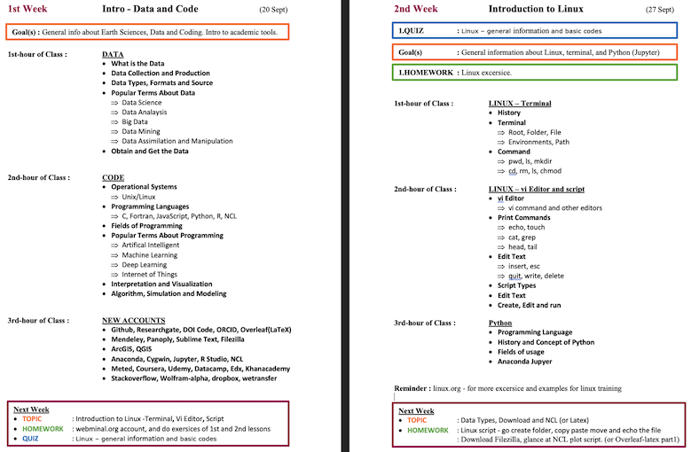
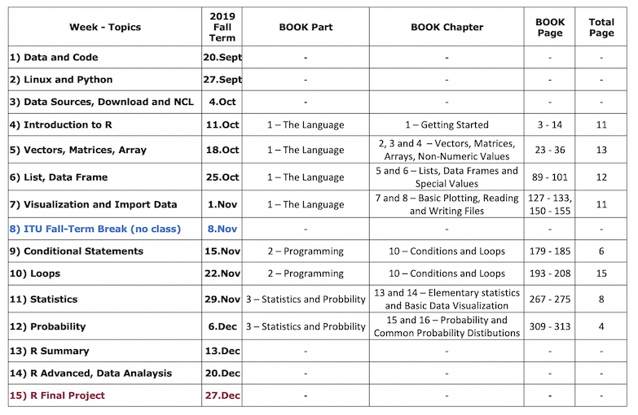
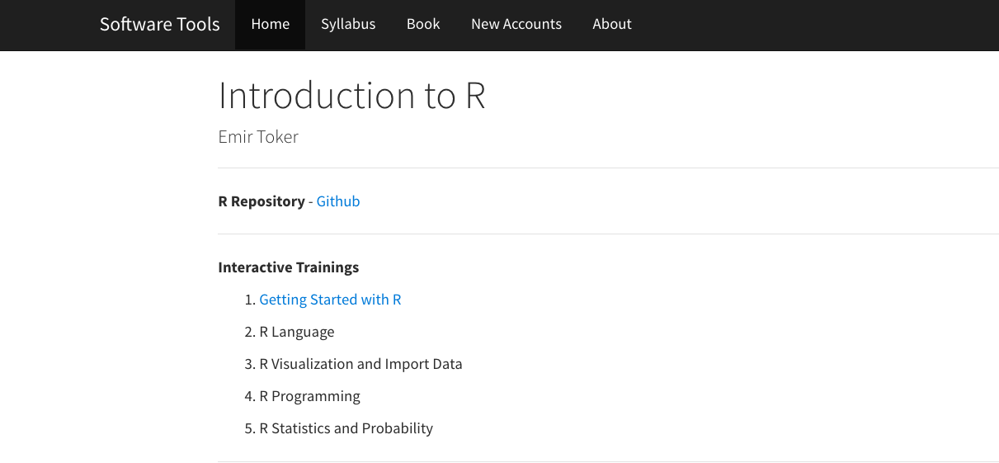
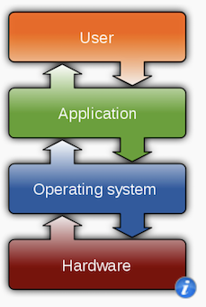
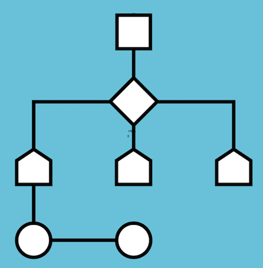
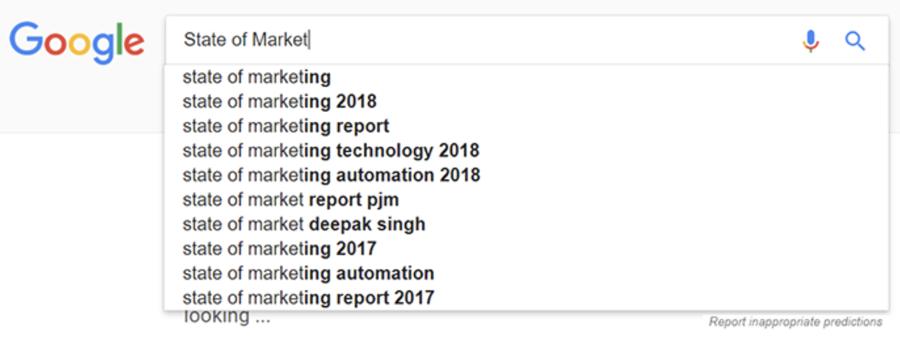
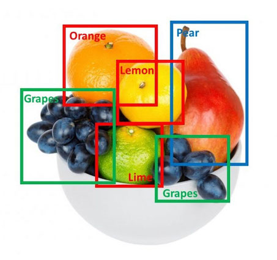

```{r, echo=FALSE}
knitr::opts_chunk$set(error = FALSE)
```

```{r, include = FALSE}
knitr::opts_chunk$set(echo = FALSE)
```


## **Lecture 1 - Data and Code**

- **Course**

- **Data**

- **Code**

- **New Accounts**


# **Course**
- Syllabus
- Book

## **Objective**

* Introduction to software tools.

* Traditional 5-step process for the scientific method

1. Observation
2. Hypothesis
3. Experimental Design
4. **Data** collection
5. **Analysis** and Conclusion

## **Syllabus**


## **Extended Syllabus**

 

[LINK](https://web.itu.edu.tr/~tokerem/Software_Tools_Syllabus.pdf)

## **Book**


[PDF](https://web.itu.edu.tr/~tokerem/The_Book_of_R.pdf)

## **Flow**



[LINK](https://web.itu.edu.tr/~tokerem/Software_Tools_Syllabus.pdf)


## **Course Github-Web Page**



[LINK](https://emirtoker.github.io/Software_Tools_R_Github/index.html)

# **Data**


## **Data**
- What is the Data and Metadata?
- Data Collection and Generation
- Data Types, Formats and Sources
- Download and Get the Data
- Interpretation and Visualization
- Popular Terms About Data

## What is the Data and Metadata?

Data are things, known or assumed as facts, making the basis of reasoning or calculation.

  

Metadata is information about data.

## Metadata


## Metadata


## Data Collection and Generation

Data collection is the process of gathering and measuring information on targeted variables in an established system. The purpose is to answer relevant questions or/and evaluate outcomes.

* Observational 
* Statistical 
* Simulation


## Data Types


## Data Formats

* Text, Picture, Audio, Video
* File; pdf, txt, csv, html, xml, nc, hdf
* Point, Line, Polygon
* 1D, 2D, 3D, xD


## Data Sources

The location where data that is being used comes from.


[LINK](https://earthdata.nasa.gov/)

## Download and Get the Data

 


## Interpretation and Visualization

Interpretation is the process of making sense of numerical data that has been collected, analyzed, and presented. 

Visualization is the graphical representation of information and data.


## Popular Terms About Data

- Data Analysis and EDA
- Big Data
- Data Mining
- Data Assimilation and Manipulation
- Data Scientist


## Data Analysis

Data analysis is a process of inspecting, cleaning, transforming and modeling data with the goal of discovering useful information, informing conclusions and supporting decision-making.

 

## Exploratory Data Analysis (EDA)

In statistics, exploratory data analysis (EDA) is an approach to analyzing data sets to summarize their main characteristics, often with visual methods.


## Big Data

Too large or complex data to be dealt with by traditional data-processing application and software.

 

Apache Point, New Mexico, US, 1995

ALMA, Atacama, Antofagasta Region, Chile

## Data Mining

Data mining is the process of discovering patterns in large data sets.

  

## Data Assimilation and Manipulation

Data assimilation is a mathematical discipline that seeks to optimally combine theory with observations. 


Data manipulation; inserting, deleting, and modifying data in a database.


## Data Science

Data science is a multi-disciplinary field that uses scientific methods, processes, algorithms and systems to extract knowledge from structured and unstructured data.


# **Code**

## **Code**


## **Code**

- Operating Systems
- Programming Languages
- Interpretation and Visualization
- Algorithm, Simulation and Modelling
- Popular Terms About Programming


## Operational Systems

An operating system (OS) is system software that manages computer hardware, software resources, and provides common services for computer programs.



Microsoft Windows, Apple macOS, Linux 

## Programming Languages


##  Algorithm 

The algorithm is a set of instructions, typically to solve a class of problems or perform a computation.



## Simulation 

The simulation is an approximate imitation of the operation of a process or system; that represents its operation over time.


## Modelling

Model is a description of a system using mathematical concepts. The aim of modeling is to understand easier a particular part or feature of thing.


##  Popular Terms About Programming

-	Artificial İntelligence
-	Machine Learning
-	Deep Learning
-	Internet of Things

##  Artificial İntelligence

Artificial intelligence (AI) is the simulation of human intelligence processes by machines, especially computer systems. These processes include learning, reasoning and self-correction.



##  Machine Learning

Machine learning (ML) is the scientific study of algorithms and statistical models that computer systems use to perform a specific task without using explicit instructions.


1997, Deep Blue vs Garry Kasparov

##  Deep Learning

Deep learning is part of a family of machine learning methods based on artificial neural networks.



##  Internet of Things

The Internet of Things (IoT) is a system of interrelated computing devices, mechanical and digital machines. IoT has the ability to transfer data over a network without requiring human-to-human or human-to-computer interaction.


# **NEW ACCOUNTS**


## **NEW ACCOUNTS**

- Github, Researchgate, DOI Code, ORCID, Overleaf(LaTeX)
- Mendeley, Panoply, Sublime Text, Filezilla
- ArcGIS, QGIS
- Anaconda, Jupyter, Cygwin, R Studio, NCL
- Meted, Coursera, Udemy, Datacamp, Edx, Khanacademy
- Stackoverflow, Wolfram-alpha, Dropbox, Wetransfer

[LINK](https://emirtoker.github.io/Software_Tools_R_Github/new_accounts.html)
