```{r, echo=FALSE}
knitr::opts_chunk$set(error = FALSE)
```

```{r, include = FALSE}
knitr::opts_chunk$set(echo = FALSE)
```


## **Week1 - Data and Code**

- **Syllabus**

- **Book**

- **Data**

- **Code**

- **New Accounts**


# **Course**
- Syllabus
- Book

## **Syllabus**

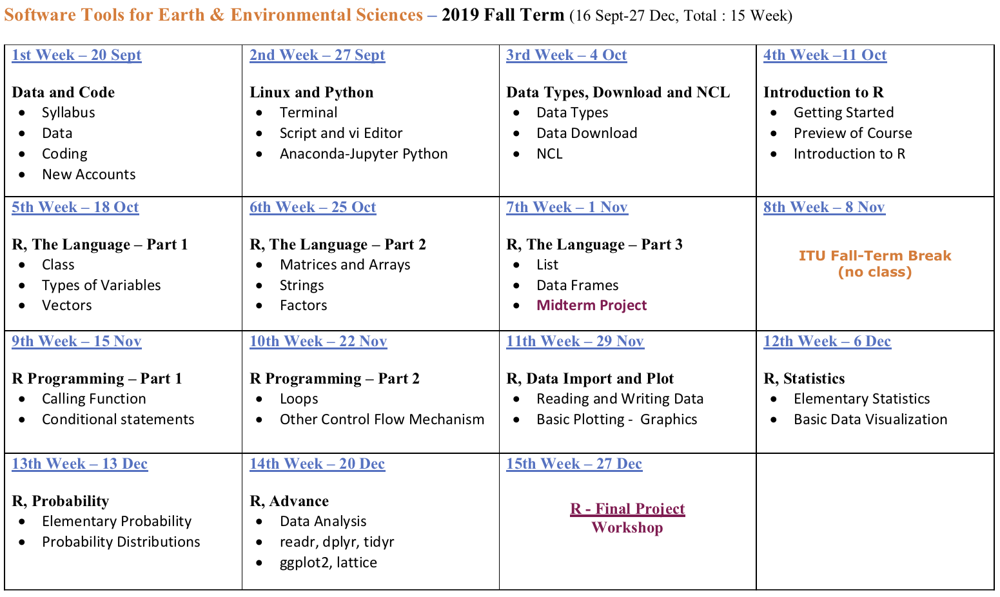

## **Book**


[PDF](https://web.itu.edu.tr/~tokerem/The_Book_of_R.pdf)

## **Data**

- What is the Data
- Data Collection and Production
- Data Types, Formats and Source
- Popular Terms About Data
- Obtain and Get the Data

## What is the Data

## Data Collection and Production

## Data Types, Formats and Source

## Popular Terms About Data

- Data Science
- Data Analysis
- Big Data
- Data Mining
- Data Assimilation and Manipulation

## Data Science

## Data Analysis

## Big Data

## Data Mining

## Data Assimilation and Manipulation


## Obtain and Get the Data


## **Code**

- Operational Systems
- Programming Languages
- Fields of Programming
- Popular Terms About Programming
- Interpretation and Visualization
- Algorithm, Simulation and Modeling


## Operational Systems

- Microsoft Windows
- Unix
- Apple Macintosh OS
- Linux OS

## Programming Languages

- C
- Fortran
- JavaScript
- Python
- R
- NCL

## Fields of Programming

##  Popular Terms About Programming

-	Artifical Intelligent
-	Machine Learning
-	Deep Learning
-	Internet of Things

## NEW ACCOUNTS

- Github, Researchgate, DOI Code, ORCID, Overleaf(LaTeX)
- Mendeley, Panoply, Sublime Text, Filezilla
- ArcGIS, QGIS
- Anaconda, Jupyter, Cygwin, R Studio, NCL
- Meted, Coursera, Udemy, Datacamp, Edx, Khanacademy
- Stackoverflow, Wolfram-alpha, Dropbox, Wetransfer

## Github


[LINK](https://github.com)

## Researchgate


[LINK](https://www.researchgate.net)

## DOI Code - (digital object identifier) - Zenodo


[LINK](https://zenodo.org/)

## ORCID


[LINK](https://orcid.org/)

## Overleaf (LaTeX)


[LINK](https://www.overleaf.com/)

## Mendeley

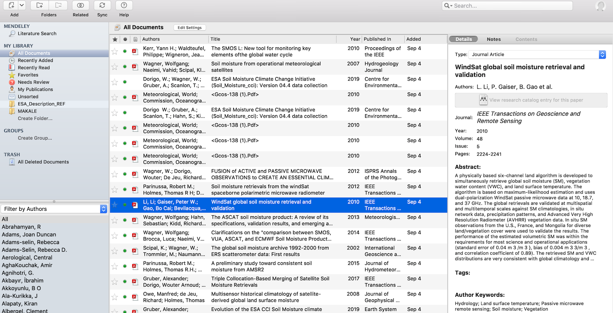

[LINK](https://www.mendeley.com)

## Panoply

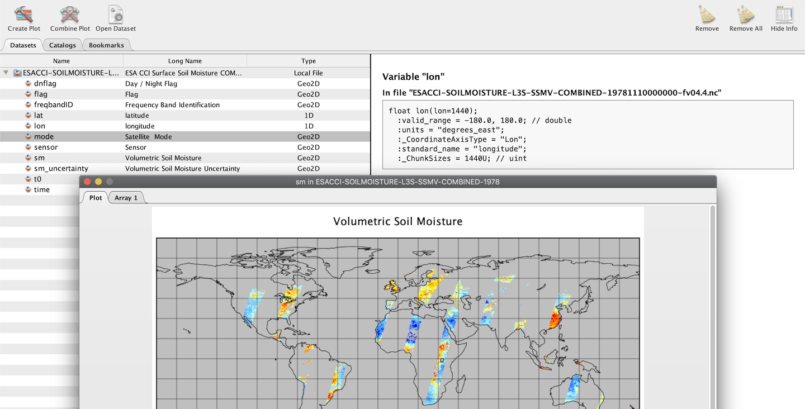

[LINK](https://www.giss.nasa.gov/tools/panoply/)

## Sublime Text

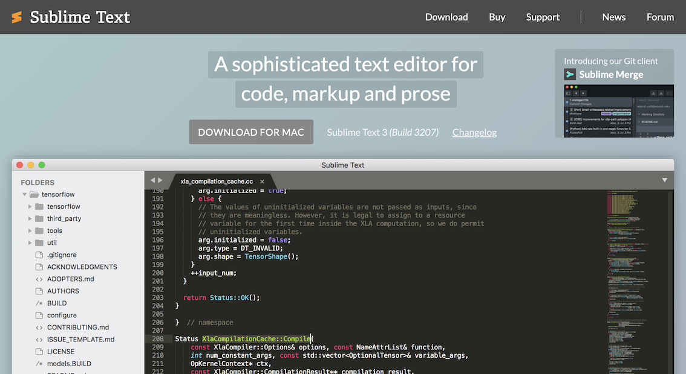

[LINK](https://www.sublimetext.com/)

## Filezilla

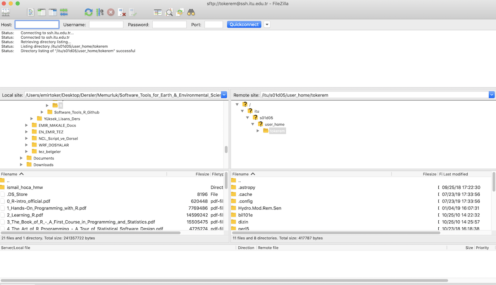

[LINK](https://filezilla-project.org/)

## ArcGIS

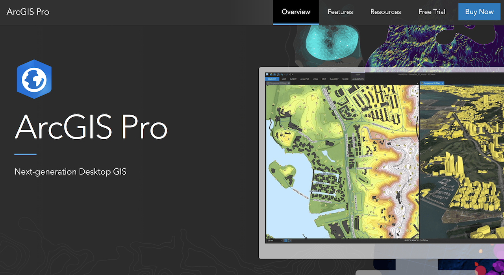

[LINK](https://www.arcgis.com/index.html)
 
## QGIS

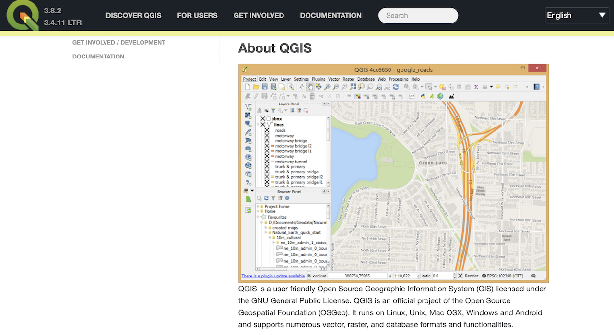

[LINK](https://qgis.org/en/site/)

## Anaconda

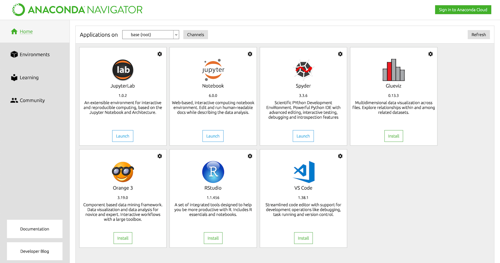

[LINK](https://www.anaconda.com)

## Jupyter


[LINK](https://jupyter.org/install)

## Cygwin

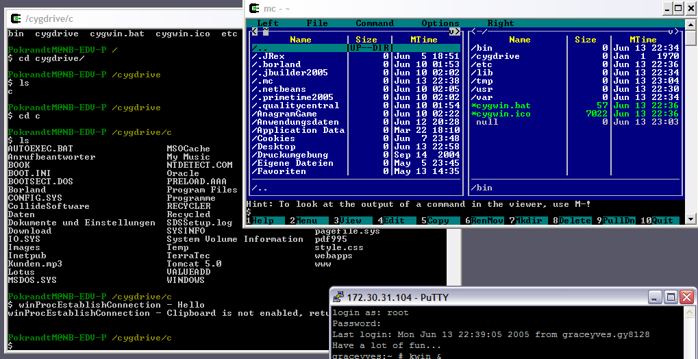

[LINK](https://www.cygwin.com/)

## R Studio

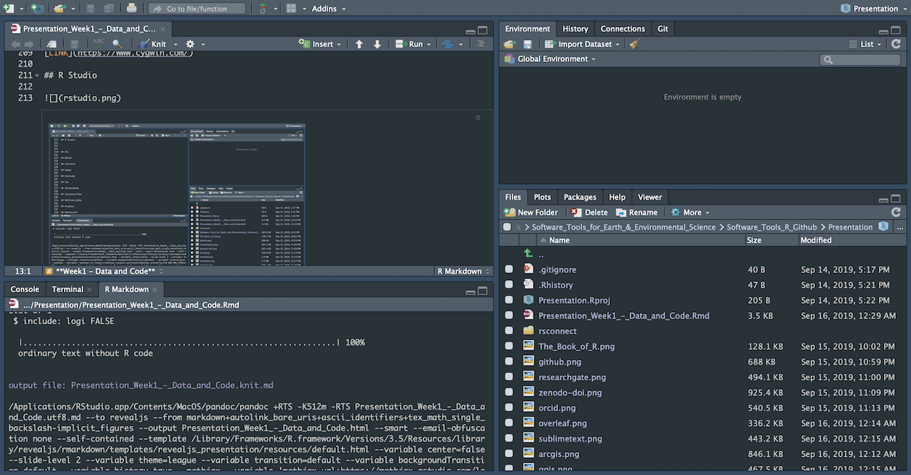

[LINK](https://www.rstudio.com/)

## NCL

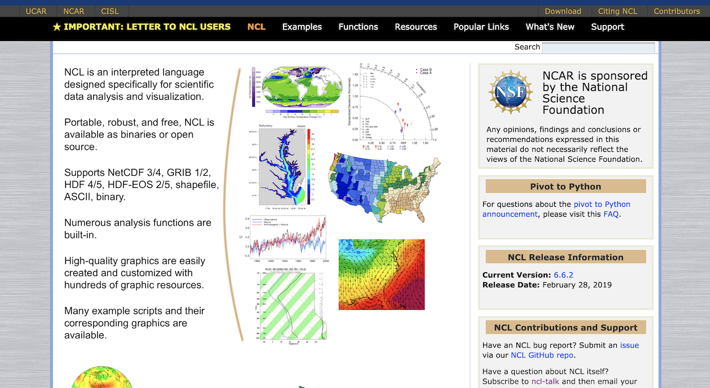

[LINK](https://www.ncl.ucar.edu/)

## Meted

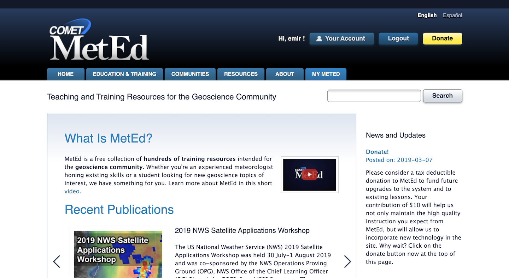

[LINK](https://www.meted.ucar.edu/)
 
## Coursera

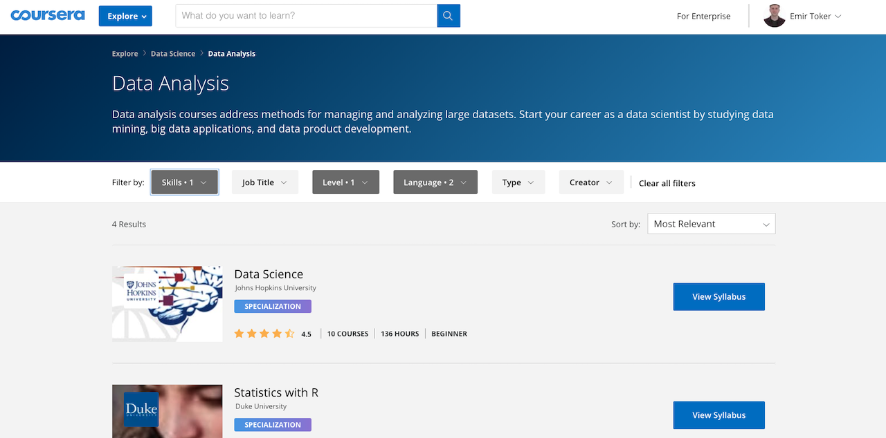

[LINK](https://www.coursera.org)

## Udemy


[LINK](https://www.udemy.com/)

## Datacamp


[LINK](https://www.datacamp.com/home)

## Edx

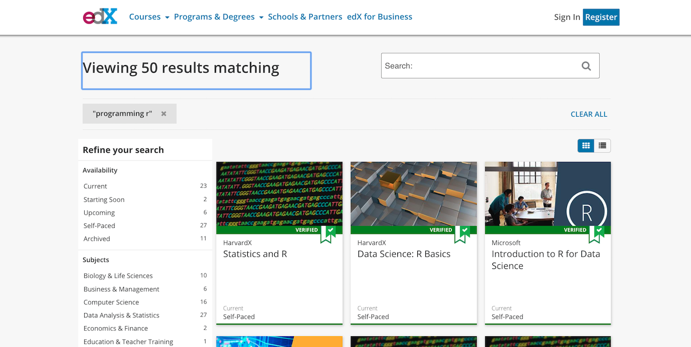

[LINK](https://www.edx.org)

## Khan academy


[LINK](https://www.khanacademy.org/)

## Stack overflow


[LINK](https://stackoverflow.com/)

## Wolfram alpha

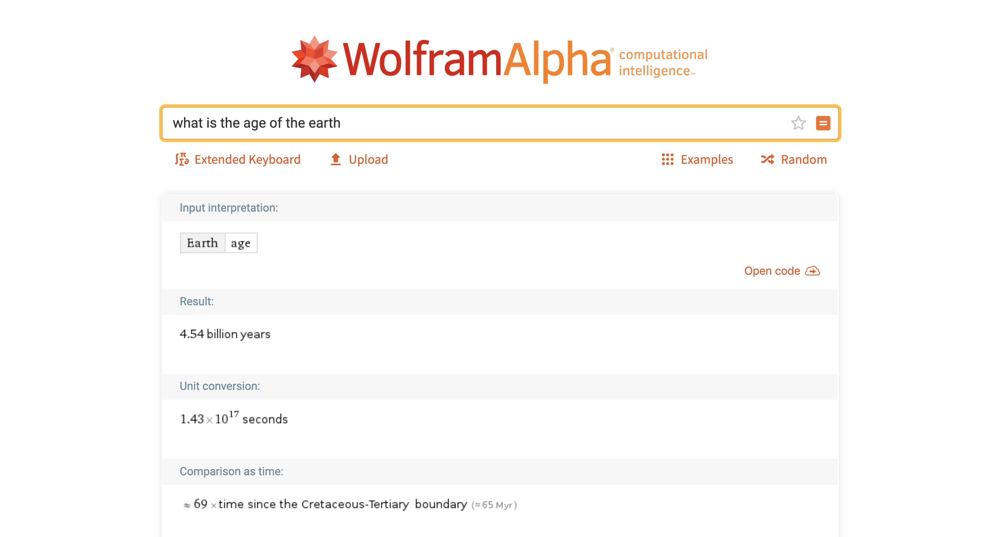

[LINK](https://www.wolframalpha.com/)

## Dropbox


[LINK](https://www.dropbox.com/)

## Wetransfer


[LINK](https://wetransfer.com/)

