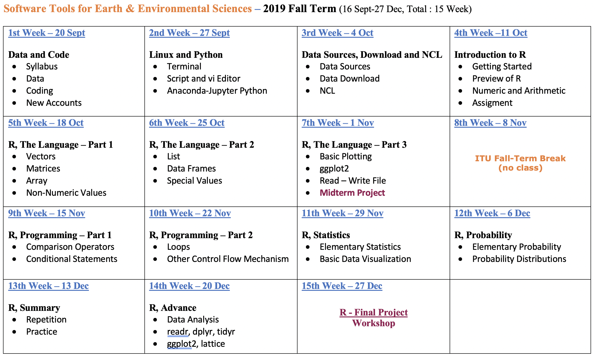
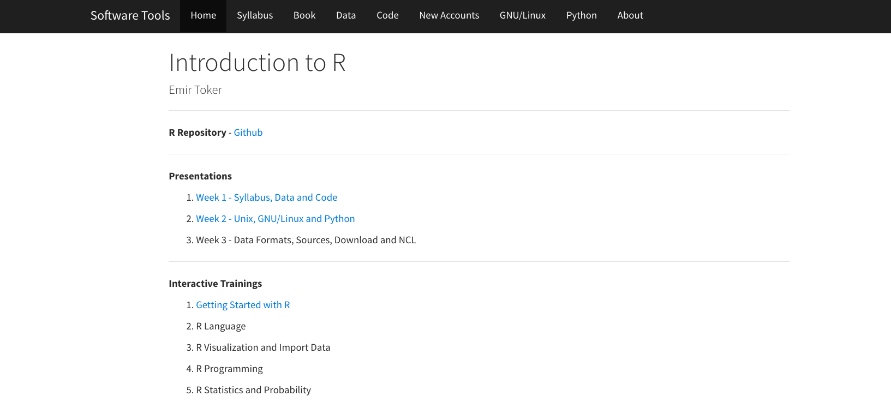
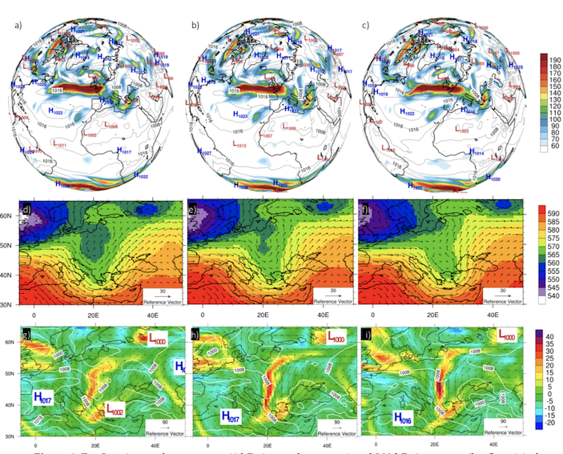

```{r, echo=FALSE}
knitr::opts_chunk$set(error = FALSE)
```

```{r, include = FALSE}
knitr::opts_chunk$set(echo = FALSE)
```


## **Data Sources-Download and NCL**

- **Syllabus, Book and Last Week**

- **Data and Metadata**

- **Data Formats**

- **Data Sources**

- **Data Download**

- **NCL, nco and cdo**

- **Next Week**


# **Syllabus, Book and Last Week**


## **Syllabus**


Extended Syllabus [PDF](https://web.itu.edu.tr/~tokerem/Software_Tools_Syllabus.pdf)

## **Book**


The Book of R - [PDF](https://web.itu.edu.tr/~tokerem/The_Book_of_R.pdf)

## **Last Week**


Course Home Page [LINK](https://emirtoker.github.io/Software_Tools_R_Github/index.html)

Week 2 - Presentation [LINK](http://rpubs.com/emirtoker/software_tools_week2)

## **3th Week - Extended Syllabus**


## **Repeat - Linux**


[webminal.org](https://www.webminal.org/)


## **Repeat and Practice**

- **Direction Commands**
    - <span style="color:red">**pwd**</span> *(**P**rint **W**orking **D**irectory)*
    - <span style="color:red">**ls**</span> *(**L**ist **D**irectories)*
    - <span style="color:red">**cd**</span> *(**C**hange **D**irectory)*
    - <span style="color:red">**mkdir**</span> *(**M**ake **D**irectory)*

- **File Commands**
    - <span style="color:red">**touch**</span>
    - <span style="color:red">**cat**</span> *(Concatenate)*
    - <span style="color:red">**rm**</span> *(Remove)*
    - <span style="color:red">**cp**</span> *(Copy)*
    - <span style="color:red">**mv**</span> *(Move)*
    
- **vi command**
    - <span style="color:red">**esc**</span> and <span style="color:red">**i**</span>
    - <span style="color:red">**:q**</span> and <span style="color:red">**:q!**</span> and <span style="color:red">**:qw**</span>
    

## **Practice**

1. **Learn where you are** *(Print your working directory)*
2. **Look at inside** *(list all documents and directories)*
3. **Create a new folder** *(make a directory,`<my_new_dir>`)*
4. **Go to the `<my_new_dir>`** *(change your directory)*
5. **Create a new file** *(touch it, file name : `<my_new_file>`)*
6. **Open your file with text editor** *(vi `<my_new_file>`)*
7. **Activate Insert mode** *(with i)*
8. **Write this line: <echo hello there>**
9. **Write/Save and Quit** *(:wq)*
10. **Change your new file name** *(move `<my_new_file.sh>`)*
11. **Run the script `<my_new_file.sh>`** *(bash .sh)*
12. **Turn back parent directory** *(cd ..)*
13. **Delete all files and folders** *(remove -rf)*


    
    
    
    
    
    
    
    

# **Data and Metadata**

## **What is Data?**

Data are things, known or assumed as facts, making the basis of reasoning or calculation.

  


## **What is Metadata?**

Metadata is information about data.


## **What is Metadata?**


# **Data Formats**

## **Data Formats**

  - **Data Types**

  - **Data Set**

  - **Data Formats**


## **Data Types**

- Vector
    - Point
    - Line
    - Polygon

- Raster

- Gridded

## **Vector Data**

Vector data structures represent specific features on the Earth’s surface, and assign attributes to those features.

 


## **BONUS - Point to Polygon**

Thiessen polygon 

  

It defines an area around a point, where every location is nearer to this point than to all the others (2D).

## **Raster Data**

Rasters are made up of a matrix of pixels (also called cells), each containing a value that represents the conditions for the area covered by that cell.


## **Vector vs Raster**


## **Vector vs Raster**


## **Vector vs Raster**


## **Gridded Data**

- A multi-dimensional rectangular or square-shaped
- The array of grid 
- Borders and points which are containing values


## **Gridded Data**


## **BONUS - Numerical weather prediction (NWP)**

NWP uses mathematical models of the atmosphere and oceans to predict the weather based on current weather conditions.


 


## **Data Set**

- Observation

- Forecast

- Re-Analysis Data

- Ensamble Data


## **Observation Data**

The information collected by a primary source.


## **Forecast**

The process of making predictions of the future based on past and present data. 


## **Re-Analysis Data**

A scientific method for developing a comprehensive record.
Observations and a numerical model are combined objectively.


## **Ensemble Data**

Instead of making a single forecast, a set (or ensemble) of forecasts. 
This set of forecasts aims to give an indication of the range of possible future states of the atmosphere.


    
## **Data Formats**

- ASCII (csv, txt)

- netCDF

- HDF

- GRIB

- Shapefile    


## **ASCII**

*American Standard Code for Information Interchange*

ASCII codes represent text in computers and other devices.

- .txt (tab-separated values)
- .csv (comma-separated values)
- .xls (excel spreadsheet)

 


## **netCDF**

*Network Common Data Form*

A file format for storing multidimensional scientific data (variables) such as temperature, humidity, pressure, wind speed, and direction.


## **netCDF - .nc**

NCAR (National Center for Atmospheric Research)

UCAR (University Corporation for Atmospheric Research)


## **HDF - .hdf**

*Hierarchical Data Format*

Designed to store and organize large amounts of data. 

National Center for Supercomputing Applications, supported by The HDF Group.


## **GRIB - .grib**

*GRIdded Binary or General Regularly-distributed Information in Binary form*

Data format commonly used in meteorology to store historical and forecast weather data.

World Meteorological Organization


## **GRIB - .grib**


## **Shapefile - .shp**

Geospatial vector data format for geographic information system (GIS) software. 

It is developed and regulated by Esri.


## **Shapefile - .shp**


# **Data Sources**

## **Data Sources**

  - Earthdata
  - KNMI
  - Wordclim
  - ERA
  - GFS
  - ESGF
  - CRU
  - E-OBS
  
## **Earthdata**


[LINK](https://earthdata.nasa.gov/)


## **KNMI**

*The Royal Netherlands Meteorological Institute*


[LINK](http://climexp.knmi.nl/start.cgi)


## **Wordclim**


[LINK](https://www.worldclim.org/)


## **ERA**

*European Centre for Medium-Range Weather Forecasts*


[LINK](https://www.ecmwf.int/en/forecasts/datasets/browse-reanalysis-datasets)


## **GFS**

*National Centers for Environmental Prediction (NCEP)*


[LINK](https://www.ncdc.noaa.gov/data-access/model-data/model-datasets/global-forcast-system-gfs)


## **ESGF**

*The Earth System Grid Federation (ESGF)*


[LINK](https://esgf-data.dkrz.de/projects/esgf-dkrz/)


## **CRU**

*Climatic Research Unit-University of East Anglia*


[LINK](http://www.cru.uea.ac.uk/)


## **E-OBS**

*Europe daily gridded observational dataset*


[LINK](https://www.ecad.eu/download/ensembles/download.php)


# **Data Download**

## **Data Download**

  - Click
  - ftp, sftp, https, ssh
  - wget


## **Click**


[KNMI Climate Explorer](http://climexp.knmi.nl/start.cgi)


## **ftp, sftp, https**

- ftp - File Transfer Protocol 
- sftp - Secure File Transfer Protocol
- https - Hypertext Transfer Protocol Secure
- ssh - Secure Shell

## **BONUS - FileZilla**

```
ssh.itu.edu.tr
```


# **cdo, nco and NCL**

## **cdo, nco and NCL**

  - cdo
  - nco
  - NCL


## **cdo**

*Climate Data Operator*

2019-06-13: 1.9.7


[LINK](https://code.mpimet.mpg.de/projects/cdo/embedded/cdo.pdf)


## **cdo**

```
era5_t2m.nc
```


## **cdo**

```
cdo yearmonmean era5_t2m.nc era5_t2m_yearmonmean.nc
era5_t2m_yearmonmean.nc
```


## **cdo**

```
cdo splitmon era5_t2m.nc era5_t2m_splitmon
era5_t2m_splitmon10.nc
```


## **cdo**

```
cdo sellonlatbox,26,-45,36,42 era5_t2m.nc era5_t2m_TR.nc
era5_t2m_TR.nc
```


## **cdo**

```
cdo seasmean era5_t2m.nc era5_t2m_seasmean.nc
era5_t2m_seasmean.nc
```


  
  
  
  
  
  
  
  
  
  
  
  
  
  
  
  
  
  
## **nco**

*netCDF Operator*

2019 Jul 01: 4.8.1 


[PDF](http://nco.sourceforge.net/nco.pdf)


## **nco**

```
ncdiff era5_t2m_splitmon03.nc era5_t2m_splitmon04.nc era5_t2m_splitmon0304_ncdiff.nc
era5_t2m_splitmon0304_ncdiff.nc
```


## **NCL**

*NCAR (National Center for Atmospheric Research) Command Language*


[LINK](https://www.ncl.ucar.edu/)


## **NCL**


## **NCL**


## **NCL**



## **NCL - Vapor**


## **BONUS - ncview**

*netCDF visual browser*


[LINK](http://meteora.ucsd.edu/~pierce/ncview_home_page.html)
  


  
  
  

# **Next (4th) Week**

## **Syllabus**


## **Extended Syllabus**

 


## **BOOK**

**The Book of R** - The Language - Getting Started 

(Part 1, Section 1, Pg. 3-14)

 


The Book of R - [PDF](https://web.itu.edu.tr/~tokerem/The_Book_of_R.pdf)


## **Homework**

- **Download R and R Studio**

<span style="color:red">**Udemy**</span> - R Basics - [LINK](https://www.udemy.com/course/r-basics/)

 

- **Introduction to R** 

<span style="color:red">**Datacamp**</span> - Introduction to R - Intro to basics
(FREE) - [LINK](https://www.datacamp.com/courses/free-introduction-to-r)


## **QUIZ**

**R - Getting Started**


