```{r, echo=FALSE}
knitr::opts_chunk$set(error = FALSE)
```

```{r, include = FALSE}
knitr::opts_chunk$set(echo = FALSE)
```


## **Data Sources-Download and NCL**

- **Syllabus**

- **Linux - Repeat and Practice**

- **Data and Metadata**

- **Data Formats**

- **Data Sources**

- **Data Download**

- **NCL, nco and cdo**

- **Next Week**


# **Syllabus**


## **Syllabus**

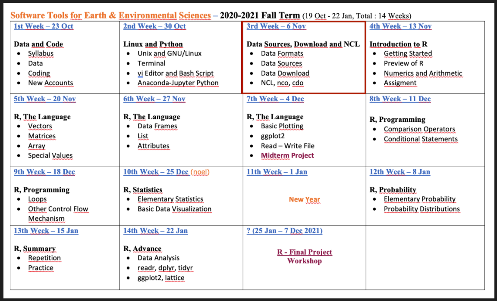
Extended Syllabus [PDF](https://web.itu.edu.tr/~tokerem/Software_Tools_Syllabus.pdf)

## **Last Week**

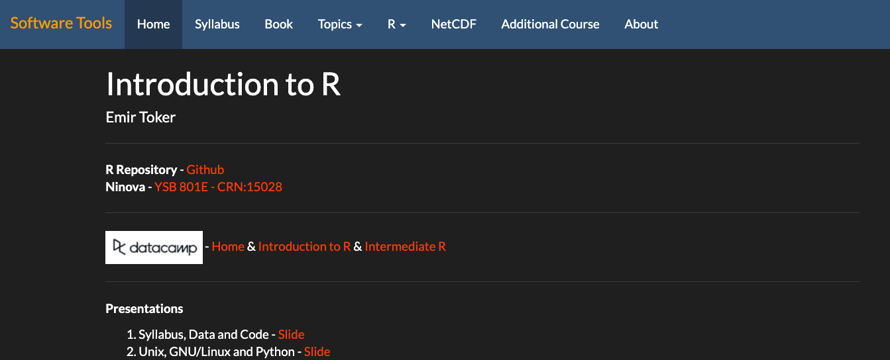
Course Home Page [LINK](https://emirtoker.github.io/Software_Tools_R_Github/index.html)
 
- Week 1 - Slide [LINK](http://rpubs.com/emirtoker/software_tools_week1)
- Week 2 - Slide [LINK](http://rpubs.com/emirtoker/software_tools_week2)

## **3th Week - Extended Syllabus**


## **Ek Ders (Extra Class/Additional Course)**

We will repeat and discuss the first three weeks of the course in Turkish. Ninova -> Announcement

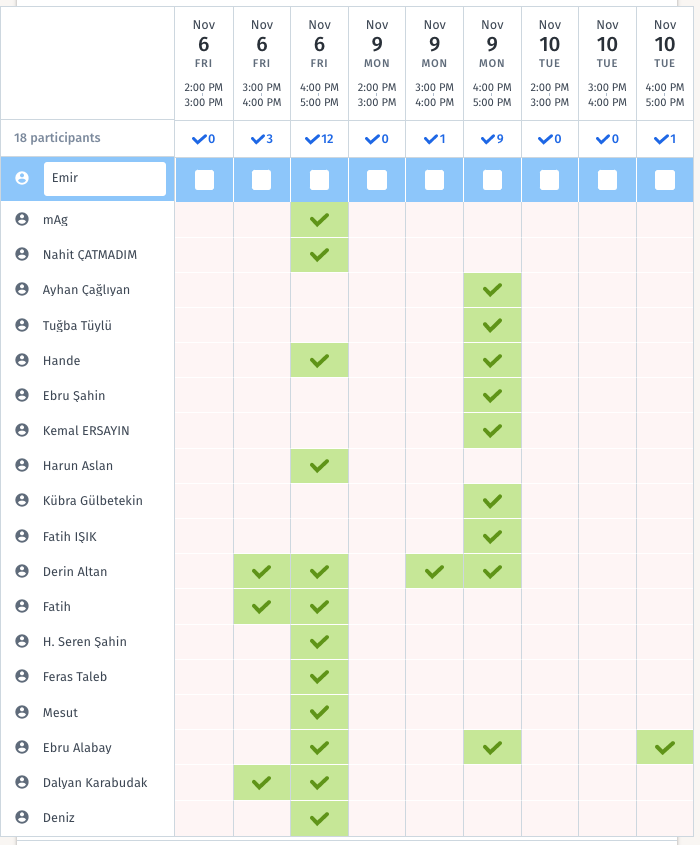{ width=35% }

Questionnaire - [LINK](https://doodle.com/poll/wetw363s5w79t3ib?utm_source=poll&utm_medium=link)


# **Linux - Repeat and Practice**

## **At First - Split Screen**

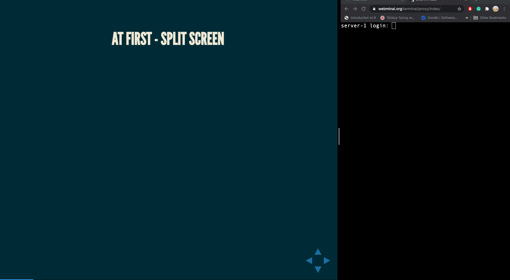{ width=80% }

Can you split your screen? (two different windows are on the same screen - Presentation and Web Browser)


## **Repeat - Linux**


[webminal.org](https://www.webminal.org/)

Log In -> Terminal -> 'Launch It' -> Log In

## **Repeat and Practice**

- **Direction Commands**
    - <span style="color:red">**pwd**</span> *(**P**rint **W**orking **D**irectory)*
    - <span style="color:red">**ls**</span> *(**L**ist **D**irectories)*
    - <span style="color:red">**cd**</span> *(**C**hange **D**irectory)*
    - <span style="color:red">**mkdir**</span> *(**M**ake **D**irectory)*

- **File Commands**
    - <span style="color:red">**touch**</span>
    - <span style="color:red">**cat**</span> *(Concatenate)*
    - <span style="color:red">**rm**</span> *(Remove)*
    - <span style="color:red">**cp**</span> *(Copy)*
    - <span style="color:red">**mv**</span> *(Move)*
    
- **vi command**
    - <span style="color:red">**esc**</span> and <span style="color:red">**i**</span>
    - <span style="color:red">**:q**</span> and <span style="color:red">**:q!**</span> and <span style="color:red">**:qw**</span>
    

## **Practice**

1. **Learn where you are** *(Print your working directory)*
2. **Look at inside** *(list all documents and directories)*
3. **Create a new folder** *(make a directory,`<my_new_dir>`)*
4. **Go to the `<my_new_dir>`** *(change your directory)*
5. **Create a new file** *(touch it, file name : `<my_new_file>`)*
6. **Open your file with text editor** *(vi `<my_new_file>`)*
7. **Activate Insert mode** *(with i)*
8. **Write this line:** echo what am i doing here
9. **Write/Save and Quit** *(:wq)*
10. **Change your new file name** *(move `<my_new_file.sh>`)*
11. **Run the script `<my_new_file.sh>`** *(bash .sh)*
12. **Turn back parent directory** *(cd ..)*
13. **Delete all files and folders** *(remove -rf)*


    
## **DataCamp - Shell**

    

    
[LINK](https://learn.datacamp.com/courses/introduction-to-bash-scripting)
    
    

# **Data and Metadata**

## **What is Data?**

Data are things, known or assumed as facts, making the basis of reasoning or calculation.

  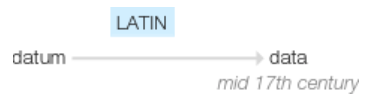


## **What is Metadata?**

Metadata is information about data.

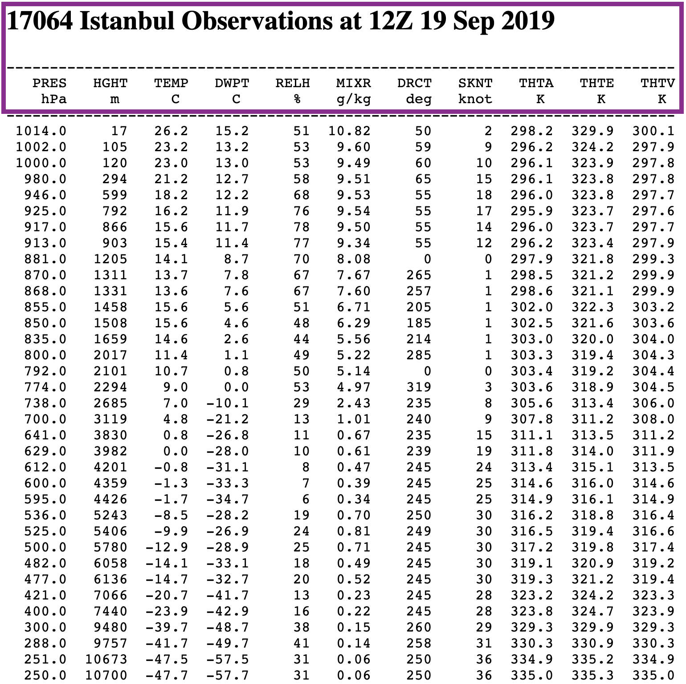

## **What is Metadata?**


# **Data Formats**

## **Data Formats**

  - **Data Types**

  - **Data Set**

  - **Data Formats**


## **Data Types**

- Vector
    - Point
    - Line
    - Polygon

- Raster

- Gridded

## **Vector Data**

Vector data structures represent specific features on the Earth’s surface, and assign attributes to those features.

 


## **BONUS - Point to Polygon**

Thiessen polygon 

  

It defines an area around a point, where every location is nearer to this point than to all the others (2D).

## **Raster Data**

Rasters are made up of a matrix of pixels (also called cells), each containing a value that represents the conditions for the area covered by that cell.

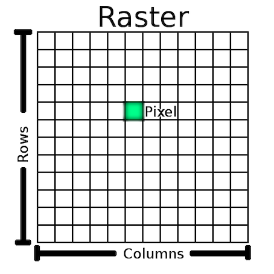

## **Vector vs Raster**


## **Vector vs Raster**


## **Vector vs Raster**

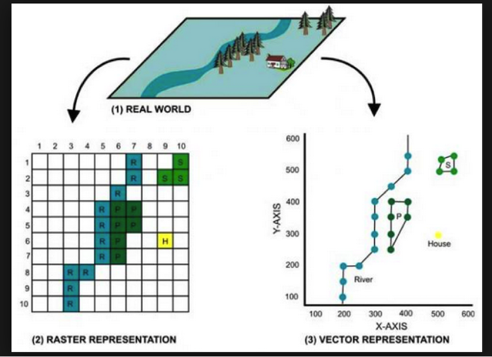


## **Vector to Raster**


## **Vector and Raster Formats**

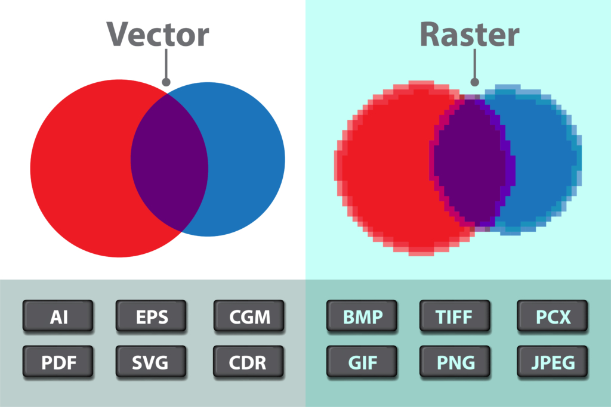


## **Vector and Raster**

What do you think about the advantages and disadvantages of vector and raster types? 

Write on Ninova -> Message Board

## **Gridded Data**

- A multi-dimensional rectangular or square-shaped
- The array of grid 
- Borders and points which are containing values


## **Gridded Data**

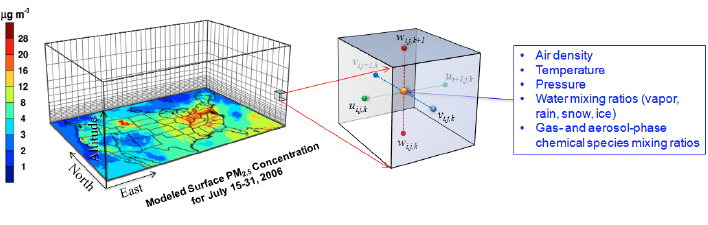


## **Grid - Spatial Resolution**

{width=55%} 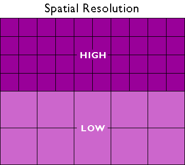{width=30%}


IPCC = Intergovernmental Panel on Climate Change ( 500, 250, 180, 110 km )

Coarse (low) and Finer (high) resolution

## **BONUS - Numerical weather prediction (NWP)**

NWP uses mathematical models of the atmosphere and oceans to predict the weather based on current weather conditions.

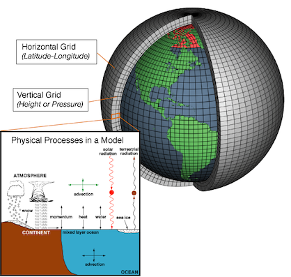 

## **BONUS - Numerical weather prediction (NWP)**

{width=45%} {width=45%}

Which one is the model and which one is the satellite ?


## **Questions**

- **What if you have not enough money or capacity to calculate the processes in high-resolution grids, globally?**

- *Hints: Regional Climate Models (RGM), Nested Grid or Domains etc.*

- **What should we do in polar regions? Which grid system would be better?**

- *Hints:Projection, Re-Shaped Grid etc.*

- **What are the other grid problems?**

- *Hint: Coastal region, Clouds etc.*


## **Data Set**

- Observation

- Forecast

- Re-Analysis Data

- Ensamble Data


## **Observation Data**

The information collected by a primary source.


## **Forecast**

The process of making predictions of the future based on past and present data. 

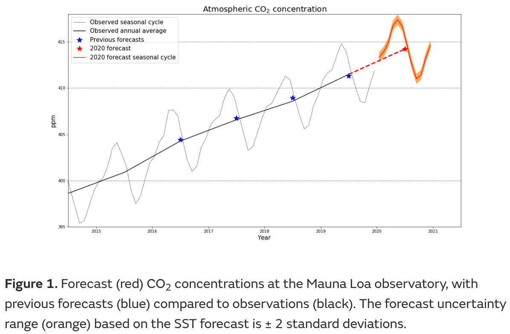{width=70%} {width=25%}


## **Re-Analysis Data**

A scientific method for developing a comprehensive record.
Observations and a numerical model are combined objectively.

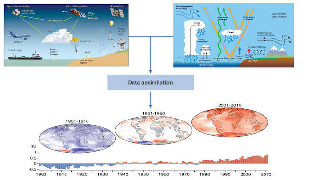


## **Ensemble Data**

Instead of making a single forecast, a set (or ensemble) of forecasts. 
This set of forecasts aims to give an indication of the range of possible future states of the atmosphere.

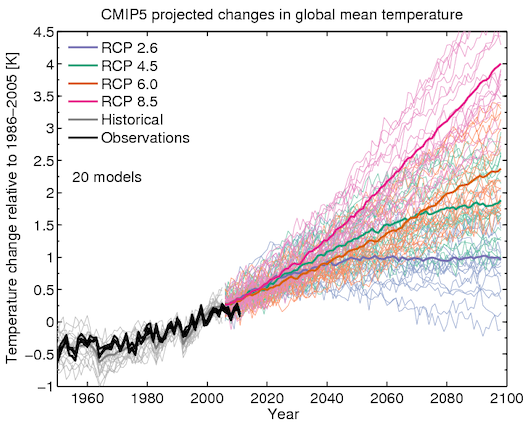


    
## **Data Formats**

- ASCII (csv, txt)

- netCDF

- HDF

- GRIB

- Shapefile    


## **ASCII**

*American Standard Code for Information Interchange*

ASCII codes represent text in computers and other devices.

- .txt (tab-separated values)
- .csv (comma-separated values)
- .xls (excel spreadsheet)

 


## **netCDF**

*Network Common Data Form*

A file format for storing multidimensional scientific data (variables) such as temperature, humidity, pressure, wind speed, and direction.


## **netCDF - .nc**

NCAR (National Center for Atmospheric Research)

UCAR (University Corporation for Atmospheric Research)


## **HDF - .hdf**

*Hierarchical Data Format*

Designed to store and organize large amounts of data. 

National Center for Supercomputing Applications, supported by The HDF Group.


## **GRIB - .grib**

*GRIdded Binary or General Regularly-distributed Information in Binary form*

Data format commonly used in meteorology to store historical and forecast weather data.

World Meteorological Organization

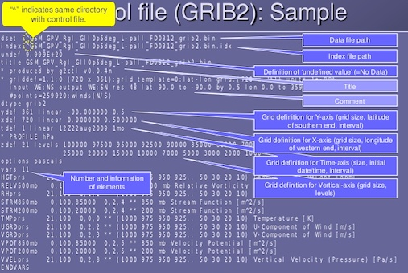

## **GRIB - .grib**


## **Shapefile - .shp**

Geospatial vector data format for geographic information system (GIS) software. 

It is developed and regulated by Esri.


## **Shapefile - .shp**


Global to Continental

What kind of shapefile could they have used?


# **Data Sources**

## **Data Sources**

  - Earthdata
  - KNMI
  - Wordclim
  - ERA
  - GFS
  - ESGF
  - CRU
  - E-OBS
  - CPC
  - NOAA
  
## **Earthdata**

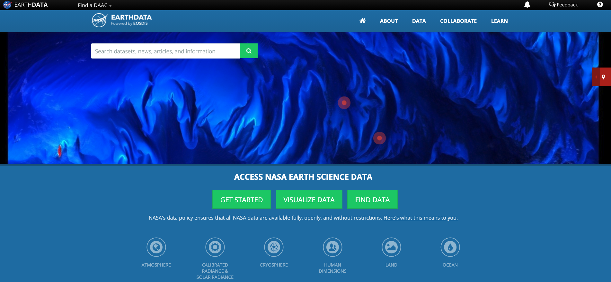

[LINK](https://earthdata.nasa.gov/)


## **KNMI**

*The Royal Netherlands Meteorological Institute*


[LINK](http://climexp.knmi.nl/start.cgi)


## **Wordclim**

{width=25%} {width=70%} 

[LINK](https://www.worldclim.org/)


## **ERA**

*European Centre for Medium-Range Weather Forecasts*


[LINK](https://www.ecmwf.int/en/forecasts/datasets/browse-reanalysis-datasets)


## **GFS**

*National Centers for Environmental Prediction (NCEP)*

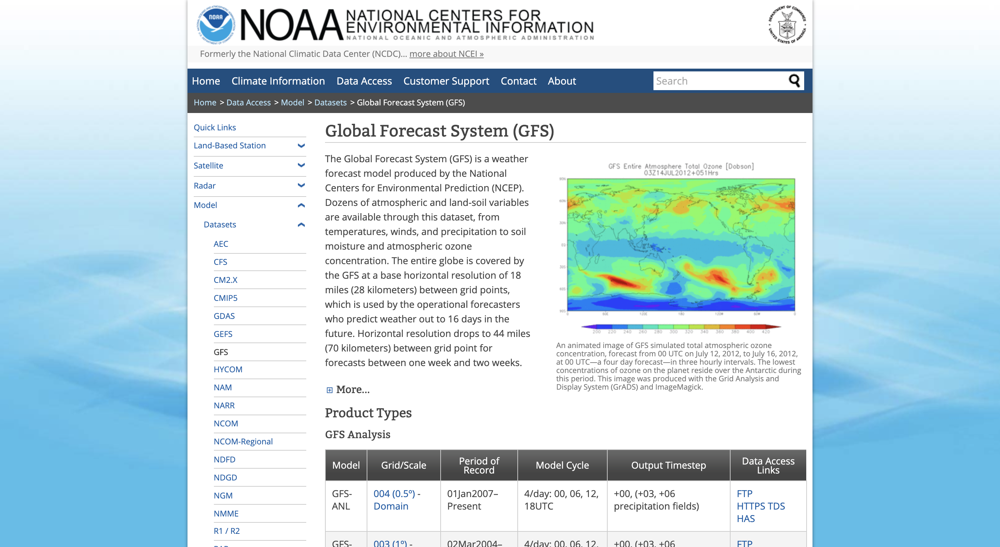{width=85%} 

[LINK](https://www.ncdc.noaa.gov/data-access/model-data/model-datasets/global-forcast-system-gfs)


## **ESGF**

*The Earth System Grid Federation (ESGF)*

{width=85%} 

[LINK](https://esgf-data.dkrz.de/projects/esgf-dkrz/)


## **CRU**

*Climatic Research Unit-University of East Anglia*


[LINK](http://www.cru.uea.ac.uk/)


## **E-OBS**

*Europe daily gridded observational dataset*

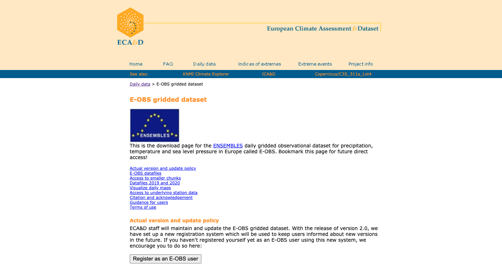
[LINK](https://www.ecad.eu/download/ensembles/download.php)


## **CPC**

*Global daily gridded observational dataset*

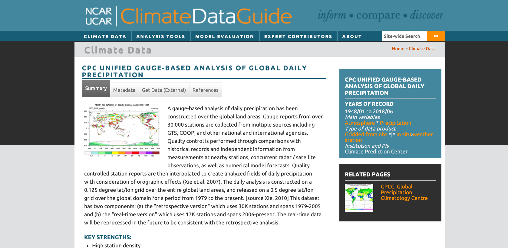

Climate Prediction Center - [LINK](https://www.ecad.eu/download/ensembles/download.php)

## **NOAA-NCDC**


National Oceanic and Atmospheric Administration (NOAA)

National Climatic Data Center (NCDC)

[LINK](https://www.ncdc.noaa.gov/)


## **Bonus - Visualize Data**


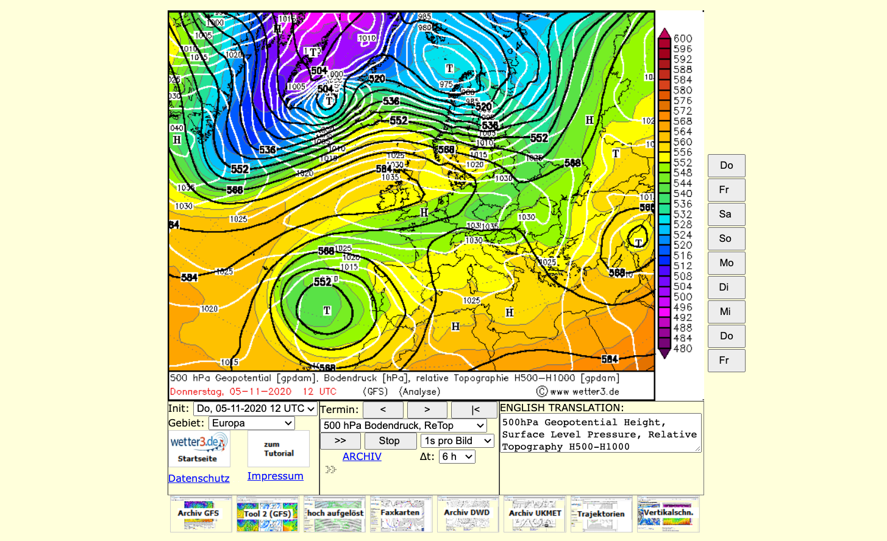{width=85%} 

GFS Data- [LINK](http://www1.wetter3.de/hinw_er.html)

## **Bonus - Visualize Data**

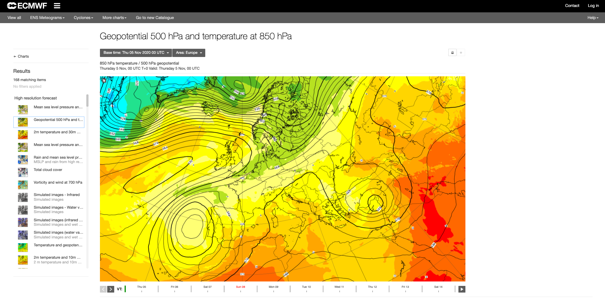

ERA Data- [LINK](https://www.ecmwf.int/en/forecasts/charts/catalogue/)

## **Bonus - Visualize Data**


ECMWF, GFS, OBS Data - [LINK](https://www.windy.com/)

## **Bonus - Visualize Data**

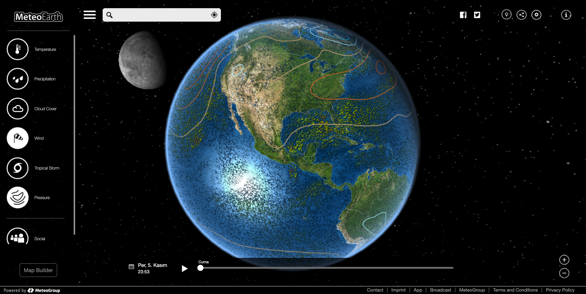

ECMWF - [LINK](http://www.meteoearth.com/)


## **Bonus - Visualize Data**

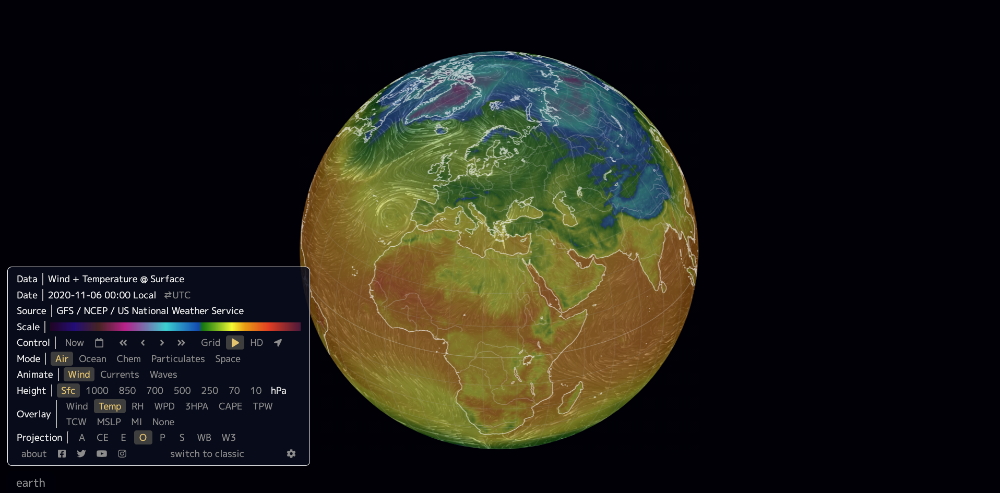

GFS - [LINK](https://earth.nullschool.net/)


## **Bonus - Visualize Data**


GFS - [LINK](https://climatereanalyzer.org/)

# **Data Download**

## **Data Download**

  - Click
  - ftp, sftp, https
  - ssh, nfs, smb
  - wget, curl


## **Click**

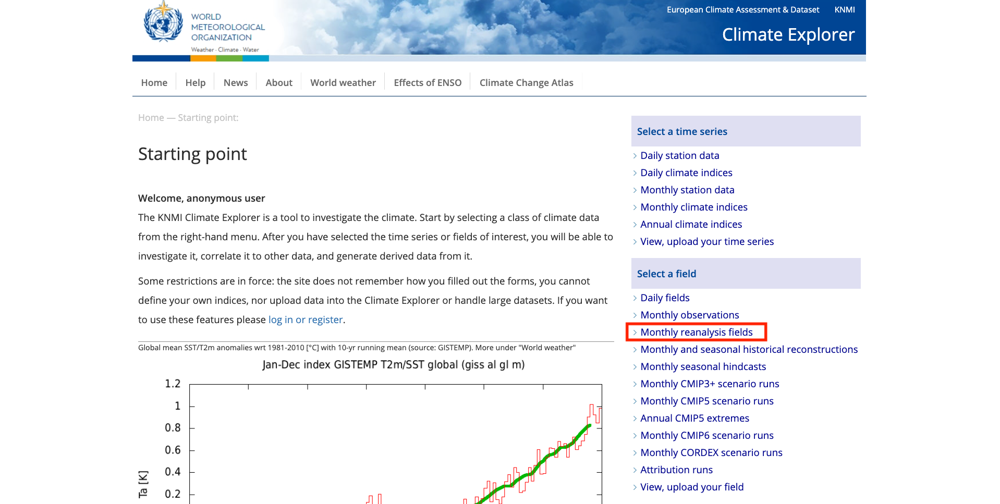

[KNMI Climate Explorer](http://climexp.knmi.nl/start.cgi)

Monthly reanalysis fields

## **Click - ERA**


## **Click - ERA 2m Temperature**


## **Click - ERA 2m Temperature**


Scroll Down

## **Click - ERA 2m Temperature - Netcdf**

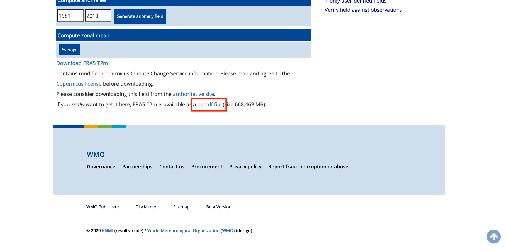


## **Connect to Download or Edit**

Connect-Download Remotely

- ftp - File Transfer Protocol 
- sftp - Secure File Transfer Protocol
- https - Hypertext Transfer Protocol Secure

Connect-Edit (also download) Remotely

- ssh - Secure Shell
- nfs - Network File System
- smb - Samba (ftp-like)

## **ftp**


## **ftp-NOAA**

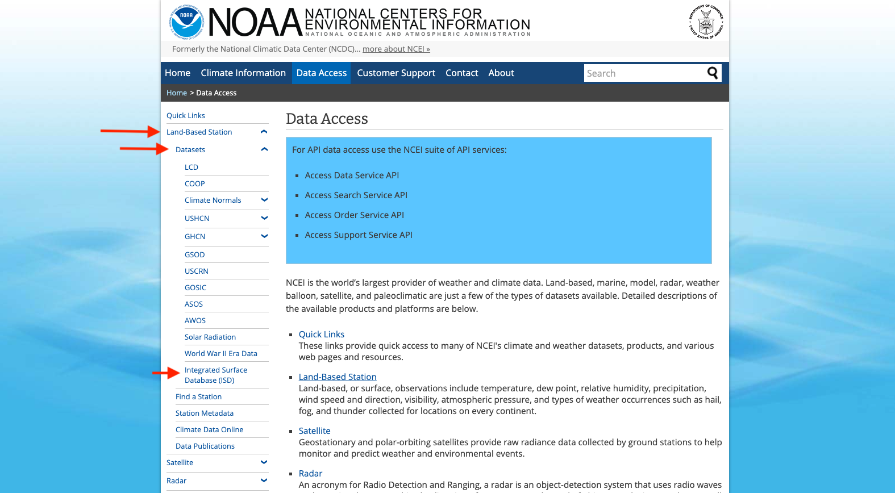

Land-Based Station -> Datasets -> Integrated Surface Databased (ISD)

## **ftp-NOAA**


## **ftp-NOAA**

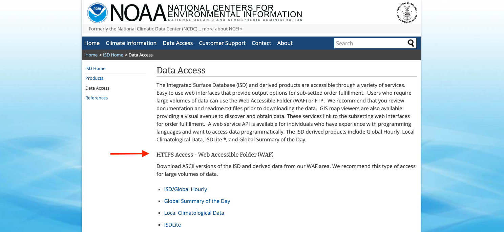

We will see it in 'wget' section

## **ftp-NOAA**

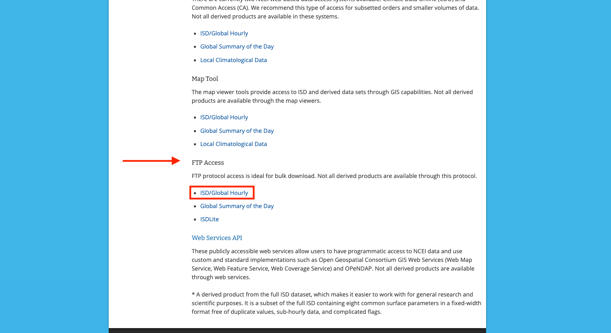

ISD/Global Hourly 

## **ftp-NOAA**

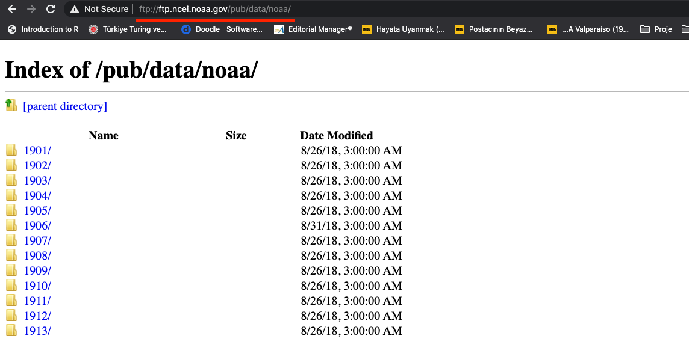

ftp://ftp.ncei.noaa.gov/pub/data/noaa/

## **ftp-NOAA with FileZilla**

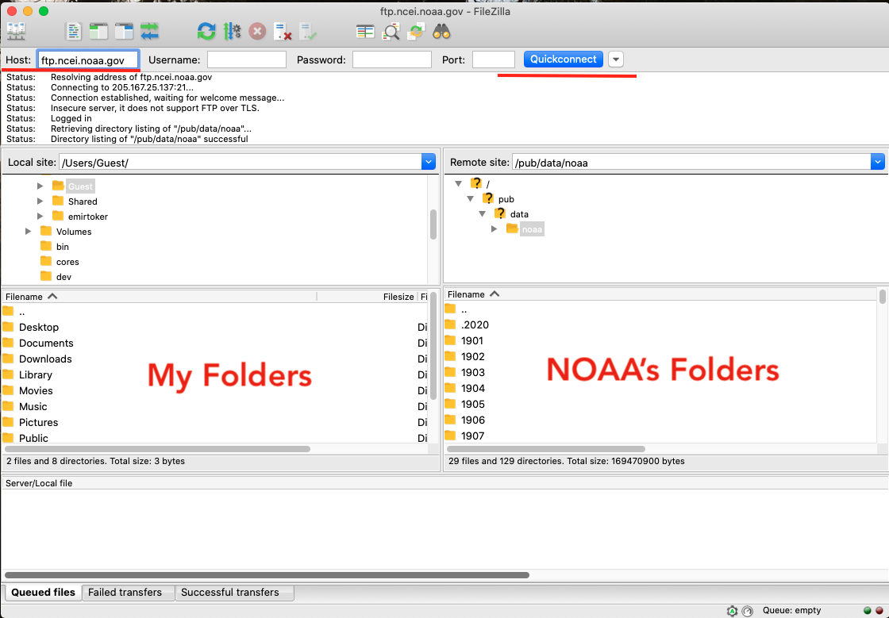


## **BONUS - FileZilla - sftp**

ITU Portal - https://portal.itu.edu.tr/apps/default/


Check your ITU Cloud quota

## **BONUS - FileZilla - sftp**

```
ssh.itu.edu.tr or sftp://ssh.itu.edu.tr
tokerem (your ITU account)
password (your ITU password)
```


## **BONUS - FileZilla - sftp**


## **BONUS - FileZilla - sftp**

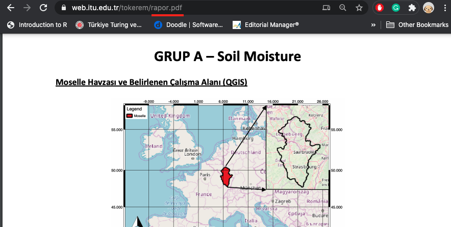

## **BONUS - FileZilla - sftp**

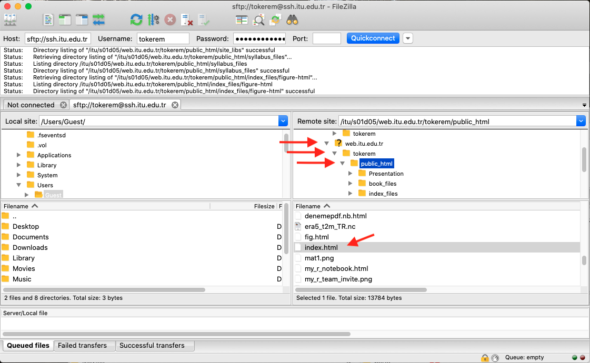


## **BONUS - FileZilla - sftp**

Your Official Website

https://web.itu.edu.tr/~tokerem/


I showed this page to DataCamp

## **wget or curl**

wget

  - GNU Wget (or just Wget)
  - World Wide Web and get
  - It supports downloading via HTTP, HTTPS, and FTP.
  


## **wget or curl**

cURL

- Client URL
- URL : Uniform Resource Locator. (reference web pages (http), file transfer (ftp), email (mailto), database access (JDBC) etc.)

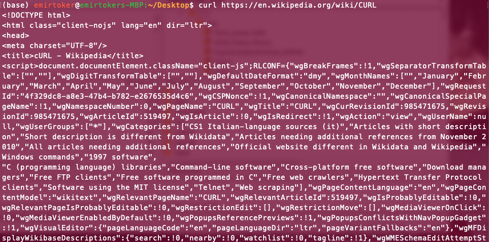


## **wget-noaa**


## **wget-noaa**


## **wget-noaa**

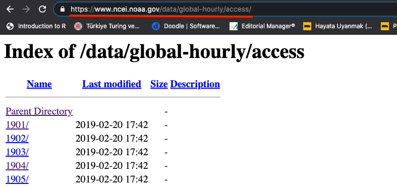


## **wget-noaa**


## **wget-noaa**


# **cdo, nco and NCL**

## **cdo, nco and NCL**

Operators (like Packages)

  - cdo
  - nco
  
Language

  - NCL


## **Panoply ?**


I have downloaded ERA5 2m-Temperature already.

## **Panoply**

```
era5_t2m.nc
```


## **era5_t2m**

I want to  

  - Calculate the mean of all months of each year separately
  
  - Split the data as 12 different files for all months
  
  - Cut/Crop the Turkey from global file
  
  - Calculate the mean of all seasons of each year separately


- Differences between two files

Normally I should use a programming language to open, read and manipulate the data like R, Python, NCL or etc.

## **cdo**

*Climate Data Operator*

2019-10: 1.9.8

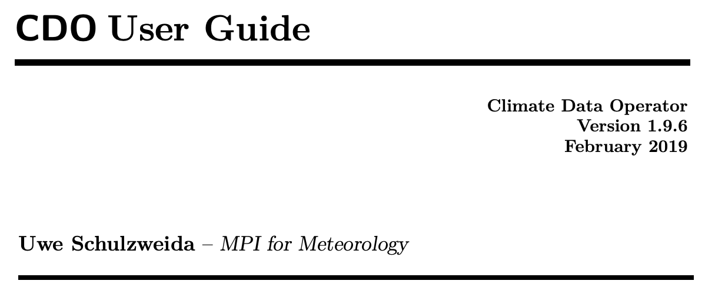

[LINK](https://code.mpimet.mpg.de/projects/cdo/embedded/cdo.pdf)


## **cdo**

- Calculate the mean of all months of each year separately:
**yearmonmean**

- Split the data as 12 different files for all months: **splitmon**

- Cut/Crop the global file for just Turkey: **sellonlatbox**

- Calculate the mean of all seasons of each year separately: **seasmean**


## **cdo**

You can use it in Terminal or Python. (Download it with Anaconda or Cygwin)

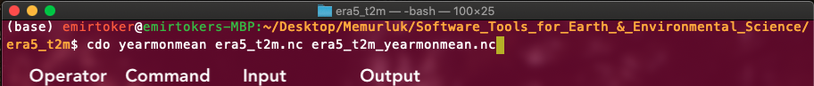


## **cdo**

```
cdo yearmonmean era5_t2m.nc era5_t2m_yearmonmean.nc

era5_t2m_yearmonmean.nc
```

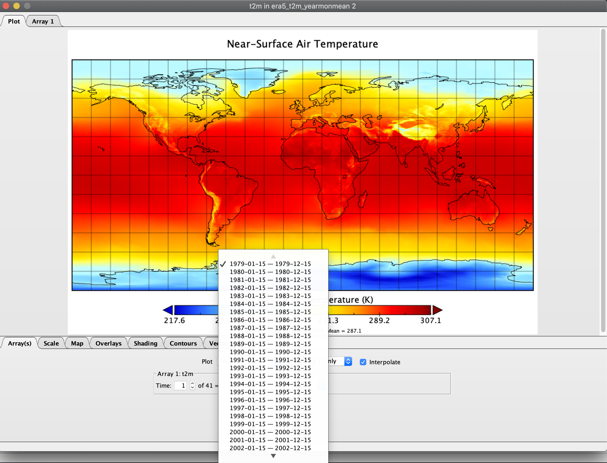


## **cdo**

```
cdo splitmon era5_t2m.nc era5_t2m_splitmon

era5_t2m_splitmon10.nc
```

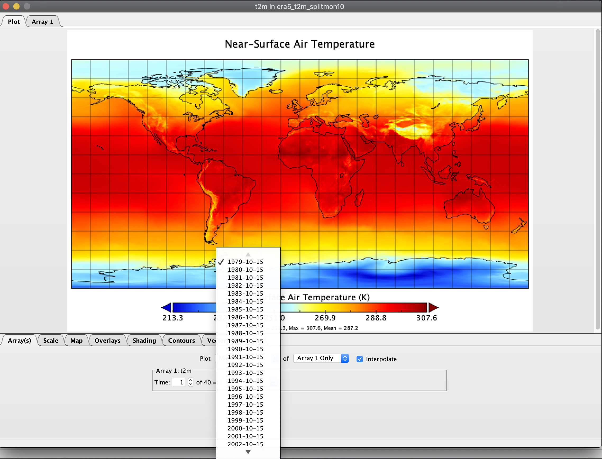


## **cdo**

```
cdo sellonlatbox,26,-45,36,42 era5_t2m.nc era5_t2m_TR.nc

era5_t2m_TR.nc
```


## **cdo**

```
cdo seasmean era5_t2m.nc era5_t2m_seasmean.nc

era5_t2m_seasmean.nc
```

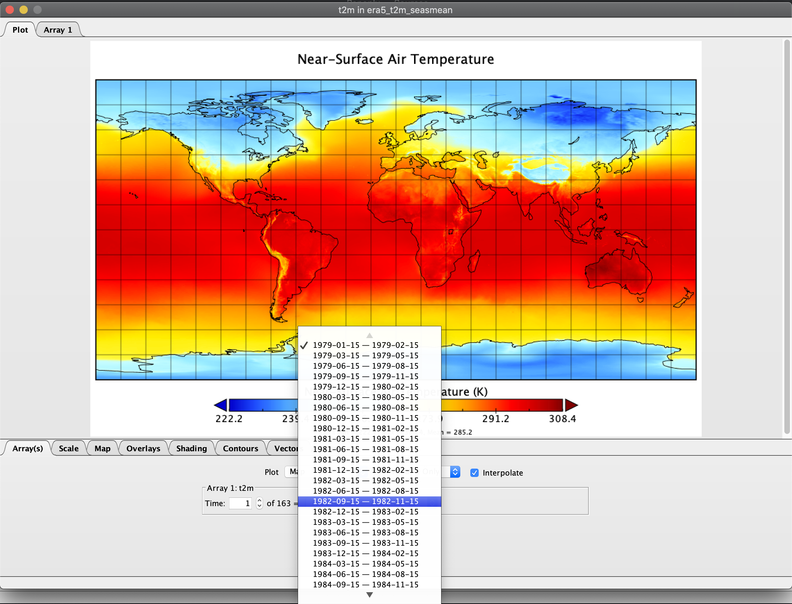
  
  
  
  
  
  
  
  
  
  
  
  
  
  
  
  
  
  
## **nco**

*netCDF Operator*

2020 Nov: 4.9.6 

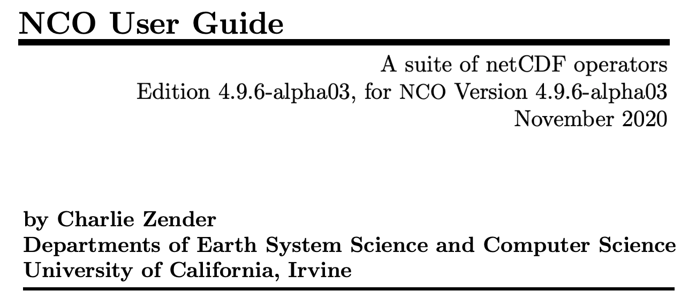

[PDF](http://nco.sourceforge.net/nco.pdf)


## **nco**

```
ncdiff era5_t2m_splitmon03.nc era5_t2m_splitmon04.nc era5_t2m_splitmon0304_ncdiff.nc
era5_t2m_splitmon0304_ncdiff.nc
```


## **NCL**

*NCAR (National Center for Atmospheric Research) Command Language* - [LINK](https://www.ncl.ucar.edu/)


## **NCL**

You can use it in Terminal and Python ( also download with Anaconda)


## **NCL + Sublime Text**

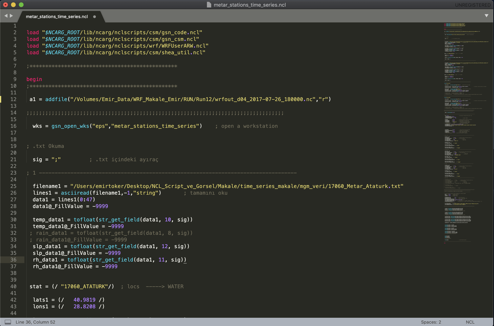


## **NCL**

{ width=20% } { width=58% }

## **NCL**


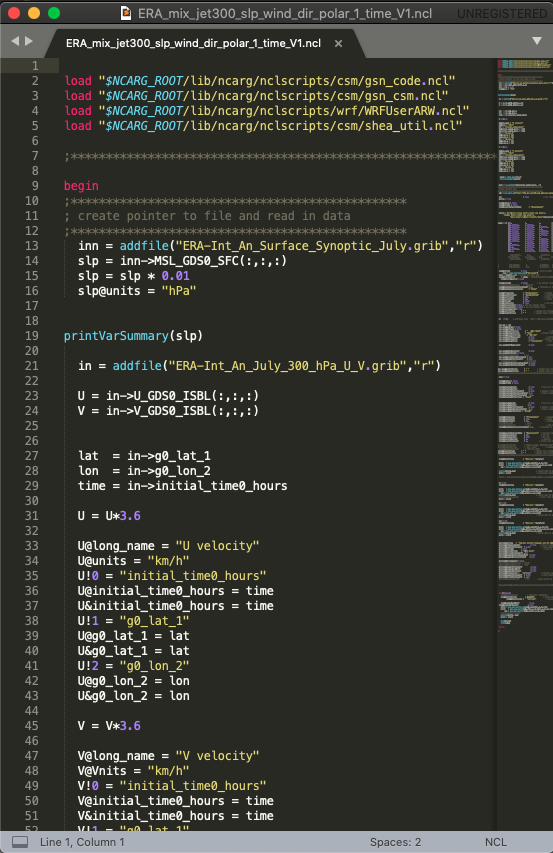{ width=20% } 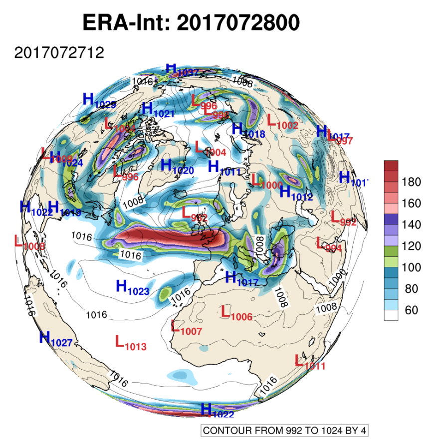{ width=58% }

## **NCL - Vapor**


## **BONUS - ncview**

*netCDF visual browser*

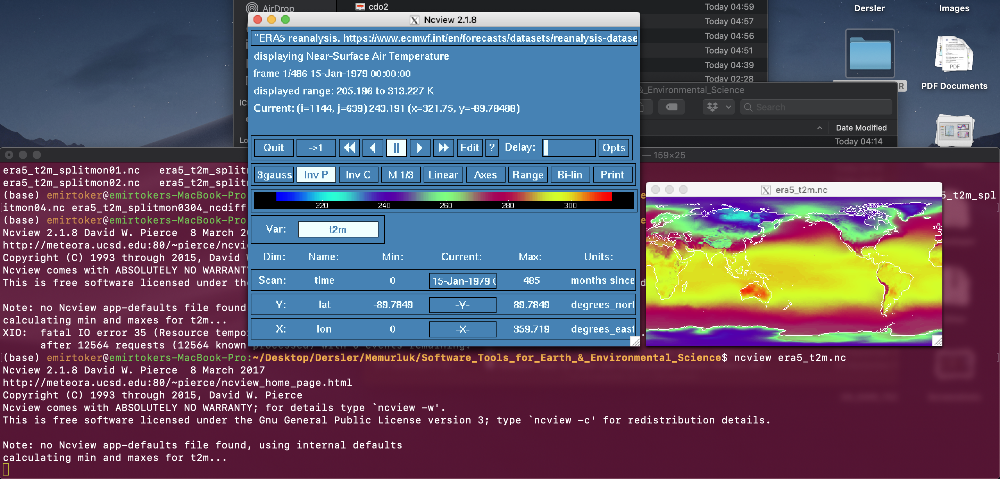

[LINK](http://meteora.ucsd.edu/~pierce/ncview_home_page.html)
  

## **BONUS - DataCamp - Conda Course**

Conda Essentials


[LINK](https://learn.datacamp.com/courses/conda-essentials)
  

# **Next (4th) Week**

## **Syllabus**

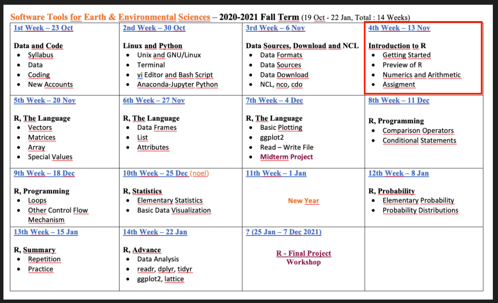

## **Extended Syllabus**


## **BOOK**

**The Book of R** - The Language - Getting Started 

(Part 1, Section 1, Pg. 3-14)

 


The Book of R - [PDF](https://web.itu.edu.tr/~tokerem/The_Book_of_R.pdf)


## **Homework**

- **Download R and R Studio**

<span style="color:red">**Udemy**</span> - R Basics - [LINK](https://www.udemy.com/course/r-basics/)

{ width=44% } { width=52% }

- **Introduction to R** 

<span style="color:green">**Datacamp**</span> - Introduction to R - Intro to basics - [LINK](https://www.datacamp.com/courses/free-introduction-to-r)


## **Getting Started with R** 

I created a basic Interactive Training with R-Shinny (Inspired from code_academy and ismail sezen)


[LINK](https://emir-toker.shinyapps.io/R_Interactive_Training_and_Quiz/)


## **Getting Started with R** 


## **QUIZ**

**R - Getting Started**


## **See you**

at EK DERS
