```{r, echo=FALSE}
knitr::opts_chunk$set(error = FALSE)
```

```{r, include = FALSE}
knitr::opts_chunk$set(echo = FALSE)
```


## **R Language - Part 1**

- **Syllabus, Last Week, Book and This Week**

- **R - Script, Notebook and Markdown**

- **GitHub**

- **R Language**
    - Class
    - Vectors 
    - Matrice
    - Arrays

- **PRACTICE, SUMMARY and QUIZ**

- **Next Week**


# **Syllabus, Last Week, Book and This Week**


## **Syllabus**


Extended Syllabus [PDF](https://web.itu.edu.tr/~tokerem/Software_Tools_Syllabus.pdf)


## **Last Week**


Week 4 - Presentation [LINK](http://rpubs.com/emirtoker/software_tools_week4)

- *assigment* **`<-`**
- *comments* **`#`**

## **Book**

 

(Pg. 22-27)


# **R Files**

## **R Files**


## **R Script**


## **R Notebook**

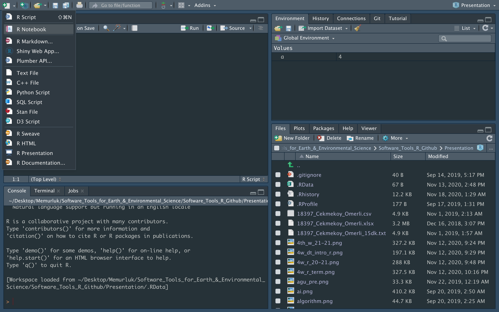

## **R Notebook**

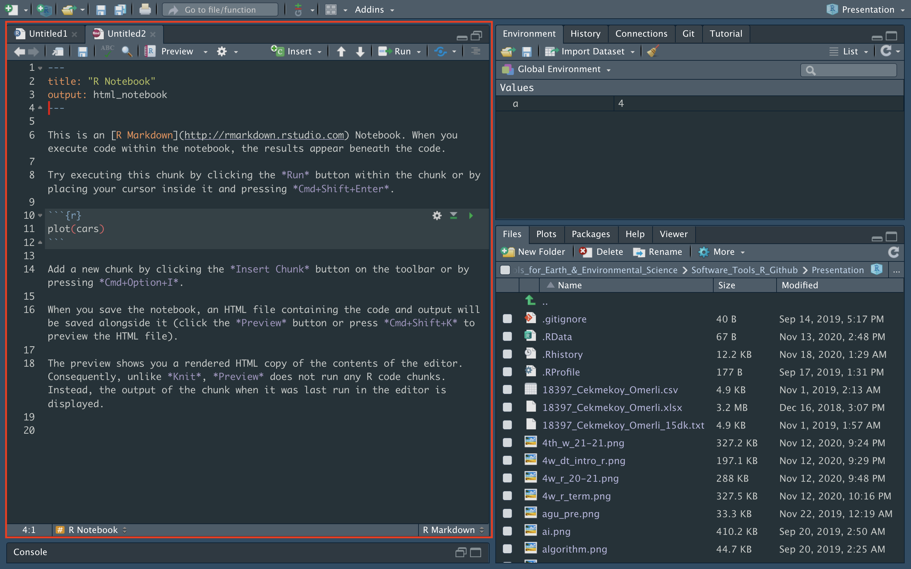

## **R Notebook**


## **R Notebook**

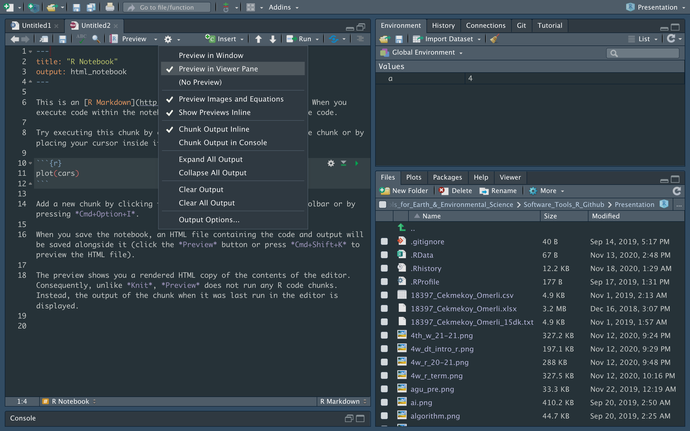

## **R Notebook**


## **R Notebook**

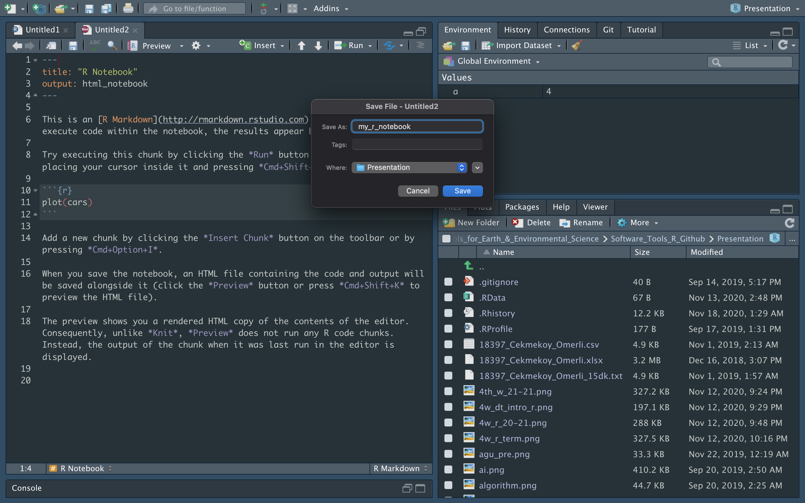


## **R Notebook**


## **R Notebook**

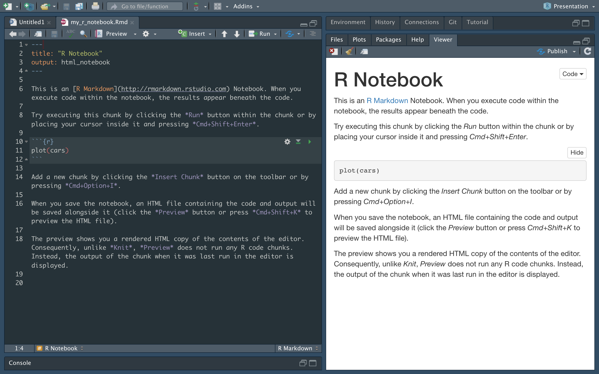

## **R Notebook**


## **R Notebook**


## **R Notebook**

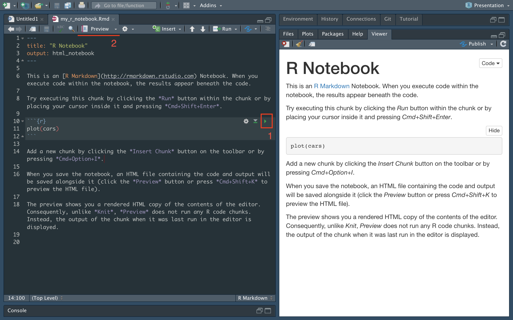

## **R Notebook**


## **R Notebook**


## **R Notebook**

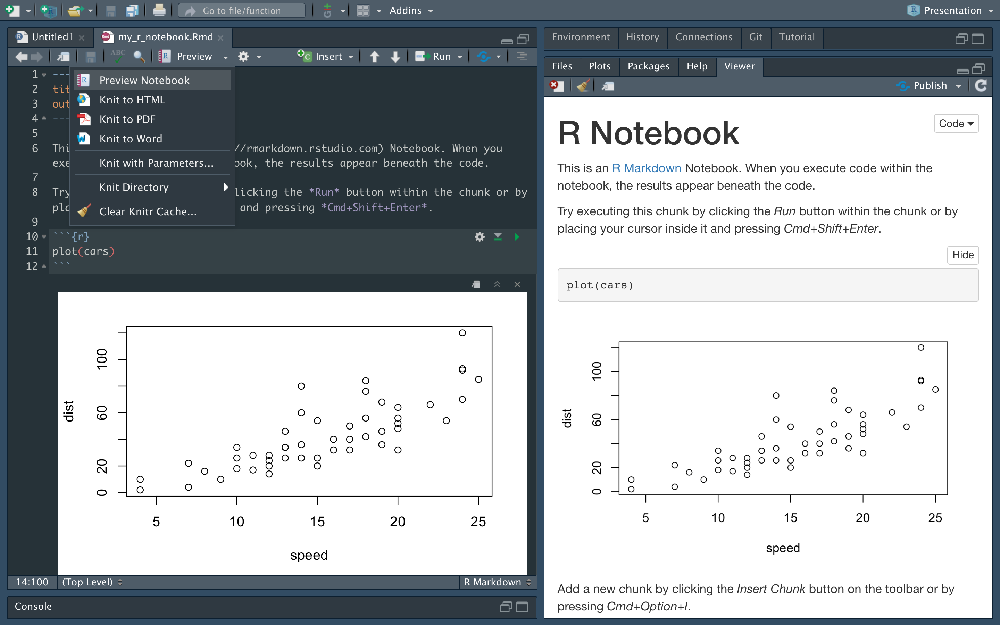


## **R Notebook - HTML**


## **R Notebook - PDF**


## **R Notebook - WORD**


## **R Markdown**

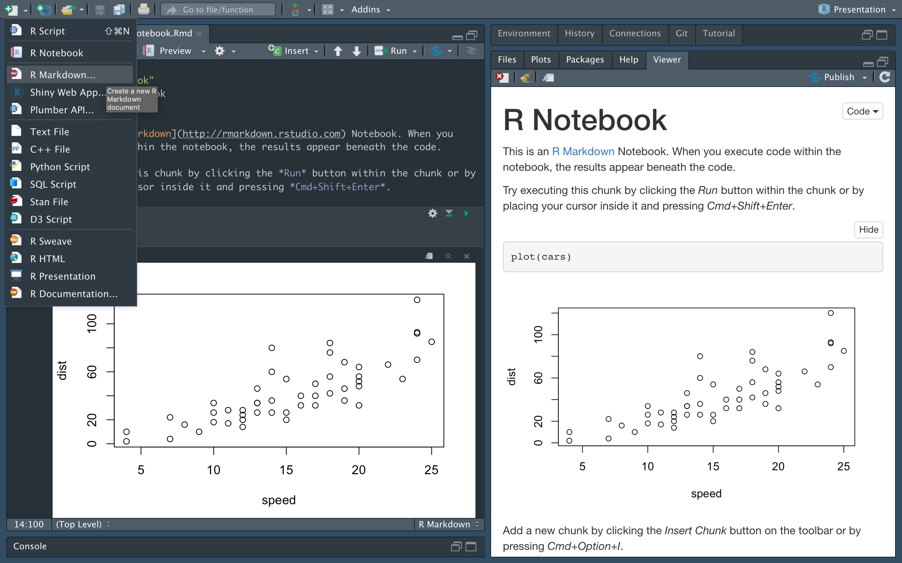

## **R Markdown**


## **R Markdown**


## **R Markdown**

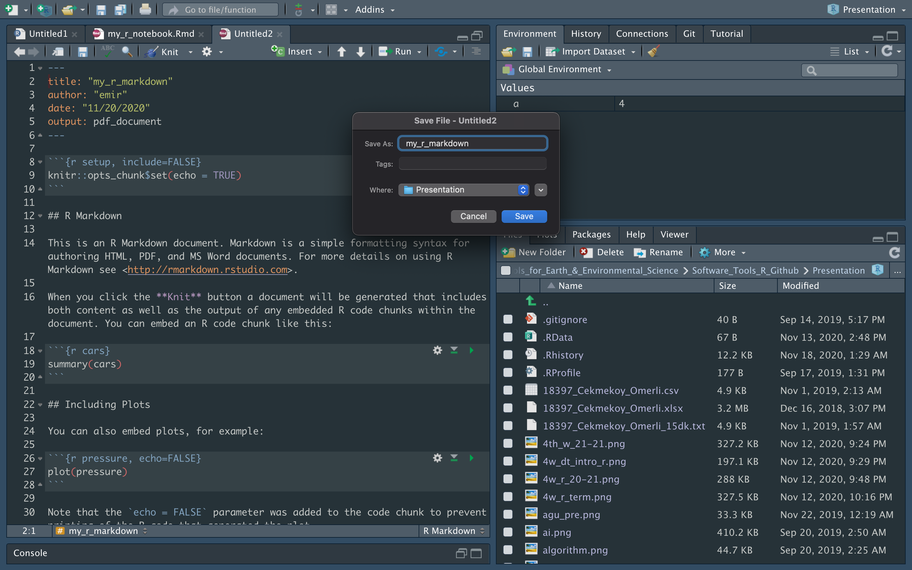


## **R Markdown**


## **R Markdown**


## **R Markdown**

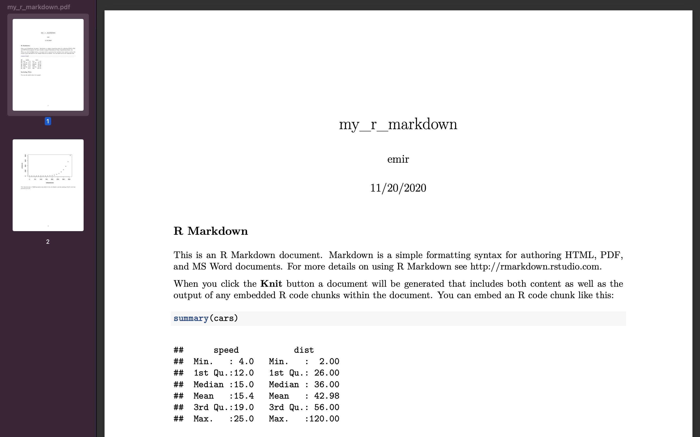


## **BONUS - R Shiny**


## **BONUS - R Shiny**


[LINK](https://emir-toker.shinyapps.io/R_Interactive_Training_and_Quiz/)


## **BONUS - R HTML**


[LINK](https://emirtoker.github.io/Software_Tools_R_Github/index.html)


## **Your R Notebook**


# **GitHub**

## **GitHub**


[https://github.com/](https://github.com/)

## **GitHub**


## **GitHub**


## **GitHub**


# **R Language**

## **R Language**

- Scientific Calculator

- Class

- Vectors 

- Matrices

- Arrays


# **Scientific Calculator**

## **Scientific Calculator**

**?Arithmetic** or **help("Arithmetic")**

- **^** *(exponentiation)*
- **sqrt** *(the square root)*
- **log** *(logarithm)*
- **exp** *(exponential)*
- **D** *(derivative)*
- **integrate** *(integration)*
- **sin** *(sinus)*
- **cos** *(cosinus)*
- **sum** *(sum)*
- **mean** *(mean)*

*example(exp)* , *demo(graphics)*


## **Scientific Calculator**

```
R> 2+3
[1] 5
R> 14/6
[1] 2.333333
R> 14/6+5
[1] 7.333333
R> 14/(6+5)
[1] 1.272727
R> 3^2
[1] 9
R> 2^3
[1] 8
R> sqrt(x=9)
[1] 3
R> sqrt(x=5.311)
[1] 2.304561
```

## **Scientific Calculator**


```
R> f <- expression(x^2+3*x)    # you can check ?expression
R> D(f,'x')                    # Calculate (first) derivative of f 
                               # with respect to x
```
```
2 * x + 3
```


# **Class**

## **Class**

- Data Types
- Data Structures


## **Data Types**

- Numeric (Double)
- Integer
- Complex
- Logical
- Character
- Special Values
- Date/Time

*Variables are defined with different data types*


## **Data Types - Numeric (Double)**

Any number with **(or without)** a decimal point.


```
a <- 3.8
a
class(a)
```
```
b <- 4
b
class(b)
```
```
c <- sqrt(2)
c
class(c)
```
```
d <- 3.5:9.5
d
class(d)
```
```
class(1)
```


## **Data Types - Integer**

Kind of a sub-class of the numeric class.

The suffix **L** tells R to store this as an integer.

```
a <- 7
a
class(a)
```
```
b <- 7L
b
class(b)
```
```
c <- 5:9
c
class(c)
```
```
d <- 5.1:9.1
d
class(d)
```
```
class(3.2L)
```


## **Numeric and Integer**

pi


```
sqrt(2)
sqrt(2)^2
sqrt(2)^2-2
2-2
```


- Numeric (64-bit) -> big  memory and calculations

- Integer (32-bit) -> Constant values like ID

- 6 digits after decimal

- 16 significant digits


## **Data Types - Complex**

Complex: x^2 = −1 (imaginary number)

```
a <- i
```
```
b <- 1i
b
class(b)
```
```
class(1+2i)
class(2iL)
```

try 

```
class(((1i^2)^2))
```
```
is.complex((1i^2)^2)
```
```
isTRUE(is.complex((1i^2)^2))
```
```
(1i^2)^2
```


## **Data Types - Logical**

TRUE or FALSE - Logical Operators


- **<**	    *(less than)*
- **<=**	  *(less than or equal to)*
- **>**	    *(greater than)*
- **>=**  	*(greater than or equal to)*
- **==**  	*(exactly equal to)*
- **!=**	  *(not equal to)*
- **!x**	  *(Not x, with exclamation mark)*
- **x | y**	  *(x OR y)*
- **x & y**	  *(x AND y)*
- **isTRUE(x)**	 *(test if X is TRUE)*


## **Data Types - Logical**

```
5 < 9
5 < -9
a <- 5 < -9
class(a)
```
```
1:10
1:10 >= 5
x <- 1:10 >= 5
1:10 < 2
y <- 1:10 < 2
x | y
z <- x | y
z
!z
class(z)
```
```
b <- 4:8
b
c <- 7:11
c
b != c
d <- 5:12
b != d
```


## **Data Types - Character**

Data type consists of letters or words. String.

single quotes: ' ... ' or double quotes " ... "

```
name <- emir
```
```
name <- 'emir'
name
class(name)
```
```
a <- 23
a
class(a)
b <- '23'
b
class(b)
```
```
print('hello')
cat('hello')
class(print('hello'))
class(cat("hello"))
```


## **Special Values**

Null, Infinity, Not a Number, Not Available

```
NULL   # Null (“empty” entity)
```

```
Inf    # Infinity
class(Inf)
Inf*-9
is.finite(Inf)
1/0
```

```
NaN    # Not a Number
class(NaN)
-Inf+Inf
is.nan(5^(-Inf/Inf))
0/0
```

```
NA    # Not Available (“missing” entity)
class(NA)
```


## **Data Types - Date/Time**

```
Sys.Date( ) 
date()
```
```
date <- "2007-06-22"
class(date)
date1 <- as.Date(date)    # Coercion
class(date1) 
```
```
date2 <- as.Date("2004-02-13")
date1 - date2
date_difference <- date1 - date2
class(date_difference)
```

```
%d    day as a number (0-31)	    01-31
%a    abbreviated weekday         Mon
%A	  unabbreviated weekday       Monday
%m	  month (00-12)               00-12
%b    abbreviated month           Jan
%B	  unabbreviated month         January
%y    2-digit year                07
%Y	  4-digit year                2007
```
```
today <- Sys.Date()
format(today, format="%B %d %Y")
```


## **Coercion**


## **Coercion**


```
3
class(3)
as.numeric(3)
as.character(3)
as.logical(3)

FALSE
class(FALSE)
as.character(FALSE)
as.numeric(FALSE)
as.numeric(TRUE)
TRUE+TRUE
class(TRUE+TRUE)
```


# **Class - Data Structure**


## **Data Structures (R-Objects)**

- (Atomic) Vector
- Matrices
- Array
- Data Frame
- List


## **Data Structures (R-Objects)**

 

## **Data Structures (R-Objects)**


- **Homogeneous**: Vector(1d), Matrix(2d), Array(nd)
- **Heterogeneous**: List(1d**?**), Data frame(2d)


## **Data Structures**

- **Vector**
- **Array**
- **Matrix**
- Data Frame
- List


## **(Atomic) Vector**

The simplest data structure in R


Vectors are a list-like structure that contain items of the **same** data type.

```
spring_month <- "April"
spring_month
spring_months <- c("March", "April","May","June")
spring_months
class(spring_months)
```

**c** means **“combine”**


## **(Atomic) Vector**

```
myvec <- c(1, 3, 1, 42)
a <- 35
myvec2 <- c(3L, 3.45, 1e+03, 64^0.5, 2+(3-1.1)/9.44, a)
myvec3 <- c(myvec, myvec2)
myvec3
```

```
x <- c("all", "b", "olive")
```

**Length** of a vector, *length(vector_name)*
```
length(x)
```
**Indexing** element, *vector_name[element_position]*
```
x[2]
```
**Manipulating** element of vector, *assigning arrow*
```
x[2] <- "b_new"
x
```
**Note**: In R, counting elements start position **1**, not **0**.


## **(Atomic) Vector**

```
y <- c( 1.2, 5, "Rt", "2000", 20, 4905)
y [0]
class(y)
y
```

**Sequences**

```
7:16.4
a <- 7:16
a
seq(from=7,to=16,by=3)
seq(50,150,25)
seq(50,149,25)
seq(from=3,to=27,length.out=40)
```


**Round**

```
3/2
round(3/2)
round(5.1)
round(pi)
```

## **(Atomic) Vector**

**Repetition**

```
rep(x=1, times=4)
rep(x=c(3, 62, 8),times=3)
rep(x=c(3, 62, 8),times=3,each=2)
```

**Sorting**

```
sort(x=c(2.5, -1, -10, 3.44))    # decreasing=FALSE (default)
sort(x=c(2.5, -1,- 10, 3.44), decreasing=TRUE)
```

**Random - Uniform Distribution**

```
runif(15, min = 20, max = 45)
runif(15, 20, 45)
runif(25, 60, 50)
```

**Random variable can be saved**
```
set.seed(1)
runif(15, 20, 45)
```


                        
## **Matrices**

Vectors indexed using two indices instead of one.

 

```
n <- runif(9,1,100)    
n
matrix(n, nrow = 3, ncol = 3)

n2 <- runif(10,1,100)    
matrix(n2, nrow = 3, ncol = 3)
```


## **Matrices**

```
x <- as.numeric(seq(from=10,to=120,by=10))
length(x)
mx <- matrix(x,3,4)                  # n, nrow, ncol
mx
class(mx)
class(mx[1])
typeof(mx)
```

```
mx[1,]
mx[,2]
mx[,2:4]
mx_new <- mx[,2:4]
mx
mx[2,3] <- "rose"
mx
class(mx)
typeof(mx)

mx_new <- as.numeric(mx)
mx_new
class(mx_new)
typeof(mx_new)
```


## **Matrices**

{width=29.5%}  {width=30%} 

```
m_mycol <- matrix(c(1, 2, 3, 4, 5, 6),
               nrow = 2,
               ncol = 3,
               byrow = FALSE)       # Default
m_mycol 

m_byrow <- matrix(c(1, 2, 3, 4, 5, 6),
               nrow = 2,
               ncol = 3,
               byrow = TRUE)     
m_byrow      
t(m_byrow)
```

```
length(m_byrow)
dim(m_byrow)
```


## **Arrays**


```
x <- 1:24
x
array(x, dim = c(4,3,2))    # raw, col, level
```
```
arr <- array(x, c(4,3,2))
class(arr)
typeof(arr)
```


## **Arrays**


```
arr <- array(data=1:24,dim=c(3,4,2))    # raw, col, level
arr
arr[2,2,1]
arr[-1,,]
```


# **Practice, Summary and QUIZ**


## **Practice**

**Scientific Calculator**


- define 'a' first


## **Practice**

**Scientific Calculator**

Problem: Compute double, triple or higher order integrals

 

```
install.packages("cubature")
library(cubature)

f <- function(x) 1
adaptIntegrate(f,lowerLimit = c(0,0,0),upperLimit = c(4,4,4))
```

```
$integral
[1] XX
```

## **BONUS**

**What is Function ?**

A function is a set of statements organized together to perform a specific task

ex: **mean()** (arithmetic mean)
```
x <- c(1,2,3)
mean(x)
```

```
(1+2+3) / 3
```


## **Practice**

**Create a Function**

Problem: Take a sample belonged to population and sum

```
pop <- 1:6                    # This is my population
samp <- sample(pop, size = 2) # This is my sample, I choose two var.
sum(samp)
```
```
pop
samp
```

I want to create a new function named ***roll()***
```
roll <- function(pop) {
pop <- 1:6 
samp <- sample(pop, size = 2) 
sum(samp)
}
```
```
roll()
```


## **Practice**

**Problem**: I want to define population myself, in every time.
*remove pre-defined population and changed the name* ***pop*** *to* ***box*** *?*

```
roll2 <- function(box) {
samp <- sample(box, size = 2) 
sum(samp)
}
```
```
roll2(box)
```
box ?
```
box = 1:6
roll2(box)

roll2(box = 1:6)
roll2(1:6)
```

## **Practice**

**Create a Function**


- You can add new options
- { } and () are important


## **Practice**

1. Print your name as a character string.
2. Print your age as a numeric type.
3. Print your age as a character type.

*print()*

4. Create a numeric vector with your favorite numbers.
5. Check the lenght of the vector, *lenght()*.
6. Choose the last element (indexing) with []. 
7. Create 4 × 2 matrice, fill with numbers
8. Delete first row. (minus indexing)
9. Generate 48 random number and assign it, *runif()*.
9. Create and store a three-dimensional array with six layers of a
4 × 2 matrice, and fill it with these random numbers.


## **Summary**

- Arithmetic Operators ( +, -, /, x )
- Logical Operators ( <, >, ==, != ....)
- Special Values ( NULL, Nan, NA, Inf)
- Vector, Matrice, Array (1d,2d,nd and Homogeneous)
- **class()**, **length()**, **print()**, **seq()**, **runif()**, 
- **c()**, **[]**, **{}**
- **?**xxx or **help(**xxx**)**
- **example()**, **demo()**
- **install.packages()**, **library()**

## **QUIZ**

R Language - Part-I


https://kahoot.it/


# **Next Week**

## **6th Week - R Language Part 2**
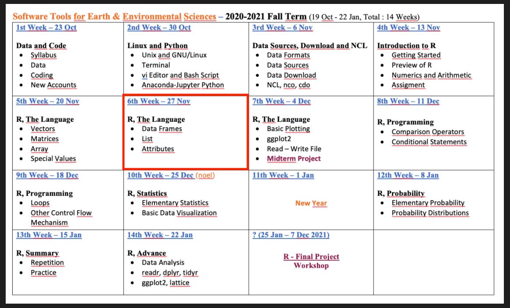
List - Data Frame - Attributes

## **Homework**

Udemy – Introduction to R, Section 3 (Video 22-25)


[LINK](https://www.udemy.com/course/introduction-to-r/)

## **Homework**


LINK - [datacamp](https://learn.datacamp.com/courses/free-introduction-to-r/)


## **Take Home - HOMEWORK-I**

{width=60%} 

- Create a new R notebook
- Write your name
- Create a new vector, matrice and array
- Create a new function


## **Quiz**

R Language - Part-II


List and Data Frame

