```{r, echo=FALSE}
knitr::opts_chunk$set(error = FALSE)
```

```{r, include = FALSE}
knitr::opts_chunk$set(echo = FALSE)
```


## **R Language - Part 3**

- **Syllabus, Last Week and Book**

- **R Language - Part 3**

  -   Read
  -   Write
  -   Plot

- <span style="color:orangered">**TakeHome - MidTerm Project**</span>

- Additional Course - II

- **Next Week - R Programming**


# **Syllabus, Last Week and Book**


## **Syllabus**

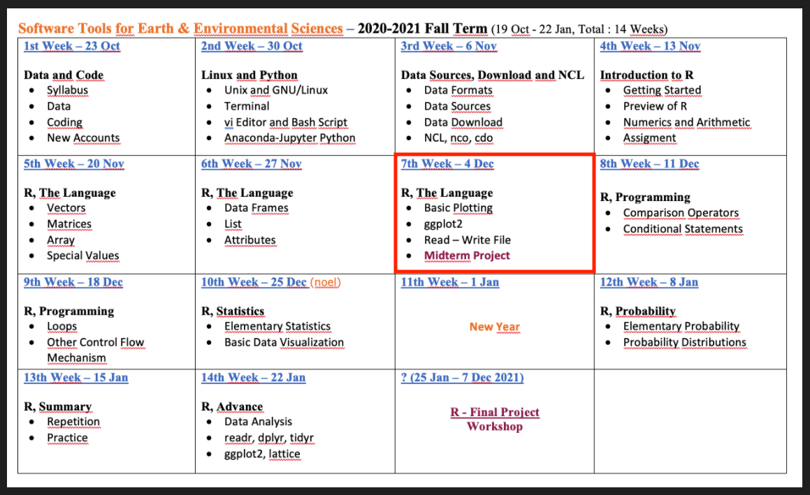
Extended Syllabus [PDF](https://web.itu.edu.tr/~tokerem/Software_Tools_Syllabus.pdf)


[LINK](https://emirtoker.github.io/Software_Tools_R_Github/)

## **Book**

 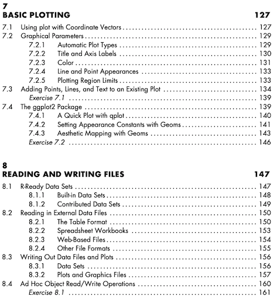

[PDF](https://web.itu.edu.tr/~tokerem/The_Book_of_R.pdf) - (Pg. 127-133 and 150-155)


## **Homework - I and II**

*due date: 07/12/2020 23:59


## **Homework - I**

Create a Notebook


## **Homework - II**

Practice - Data Types and Structures


## **Additional Course - II**


Today, 15:00 - 16:00


# **R Language**

## **R Language - Part 1 & Part 2**

 - **Basic Math, Assigment, Comment**
 - **Data Types - Classes**
     - Numeric
     - Integer
     - Logical
     - Character
     - Special Values
 - **Data Structures - Objects**
     - Vector
     - Matrice
     - Array
     - Data Frame
     - List

## **R Language - Part 3**
    
 - **Read**
 
 - **Write**
 
 - **Plot**

# **R Language - Part 1 & 2**

## **Getting Started**

- Assignment; <span style="color:orangered">**<-**</span>
- Comment; <span style="color:orangered">**#**</span>
- Help; <span style="color:orangered">**?**</span>func .or. <span style="color:orangered">**help(**</span>func<span style="color:orangered">**)**</span>
- Install Packages; <span style="color:orangered">install.packages()</span>
- Call from Library; <span style="color:orangered">library()</span>
- Basic Math; 
    - addition; <span style="color:orangered">**+**</span>
    - subtraction; <span style="color:orangered">**-**</span>
    - multiplication; <span style="color:orangered">**`*`**</span>
    - division; <span style="color:orangered">**/**</span>
    - exponentiation; <span style="color:orangered">**^**</span>
    - the square root; <span style="color:orangered">**sqrt**</span>


## **Data Types - Classes**

  - Numeric
```
# Any number with (or without) a decimal point.
a <- 3
```
  - Integer
```
# Sub-class of the numeric class. The suffix L tells R to store.
a <- 3L
```
  - Logical
```
# TRUE or FALSE - Logical Operators. < , > , == , >= , <= , != ... 
a <- 3<2
```
  - Character
```
# Data type consists of letters or words. String. with quotes: " … "
a <- "3"
```

<span style="color:orangered">**is.XXX()**</span> and <span style="color:orangered">**class()**</span>


## **Coercion**


## **Data Structures (R-Objects)**

 

## **Data Structures (R-Objects)**


## **Data Structures - (Atomic) Vector**

**Vector** : The simplest data structure in R


```
name <- "emir"
surname <- "toker"

print(c(name,surname))     # c means “combine”
```


## **Data Structures - Matrice**

Vectors indexed using two indices instead of one.

 

**[ row, col ]**


```{r, echo=TRUE}
a <- c(1:3)
# str(a) and dim(a) and length(a)
b <- matrix(1:3, nrow = 1, ncol = 3)
# str(b) and dim(b) and length(b)
```


## **Data Structures - Matrix**

<style>
.column-left{
  float: left;
  width: 25%;
  text-align: left;
}
.column-right{
  float: right;
  width: 75%;
  text-align: right;
}
</style>

<div class="column-left">


</div>

<div class="column-right">
```{r, echo=TRUE}
a <- c(1:3)
b <- matrix(1:3, nrow = 1, ncol = 3)
```
```{r}
a <- c(1:3)
b <- matrix(1:3, nrow = 1, ncol = 3)
a
b
```
```{r, echo=TRUE}
c <- matrix(1:9, nrow = 3, ncol = 3)
```
```{r}
c <- matrix(1:9, nrow = 3, ncol = 3)
c
```
```{r, echo=TRUE}
d <- matrix(1:9, nrow = 3, ncol = 3, byrow = TRUE)
```
```{r}
d <- matrix(1:9, nrow = 3, ncol = 3, byrow = TRUE)
d
```
</div>


## **Data Structures - Array**

<style>
.column-left1{
  float: left;
  width: 35%;
  text-align: left;
}
.column-right1{
  float: right;
  width: 65%;
  text-align: right;
}
</style>

<div class="column-left1">

```{r}
arr <- array(1:24, dim = c(4,3,2)) #raw,col,level
```
```{r, echo=TRUE}
str(arr)
# dim(arr)
# length(arr)
```

</div>

<div class="column-right1">
```{r, echo=TRUE}
x <- 1:24
```
```{r}
x <- 1:24
x
```
```{r, echo=TRUE}
arr <- array(x, dim = c(4,3,2)) #raw,col,level
```
```{r}
arr <- array(x, dim = c(4,3,2))    # raw, col, level
arr
```
</div>

## **Data Structures - Array**


**[ row, col, level ]**


## **Data Structures - Data Frame**


- Each element is of the same length, like a matrix.
- A column can have different types.
- BUT, all the elements within a column are the same type. 


## **Data Structures - List**

  

- Lists are like atomic vectors because they group data into a one-dimensional set. 
- Lists are like data frame because they can group different types of data.
- BUT, the length of elements is NOT important.


## **Data Structures - List**

  

```
matrix <- matrix(data=1:4,nrow=2,ncol=2)
vector <- c(T,F,T,T)
var <- "hello"
data_frame <- new_df2

list  <- list(matrix,vector,var,data_frame)
class(list)
str(list)
dim(list)
length(list)
```


# **R Language - Part 3**

## **R Language - Part 3**
    
 - **Read**
 
 - **Write**
 
 - **Plot**


## **Read**

First, we need a DATA to read.

Go to Course web page

https://emirtoker.github.io/Software_Tools_R_Github/index.html

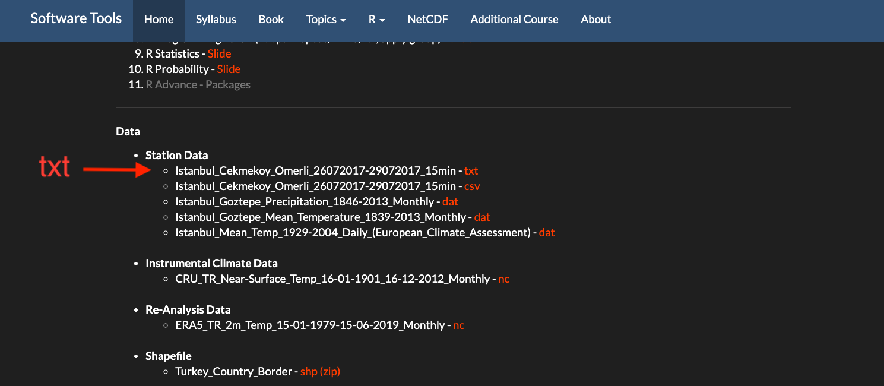

## **Read**

Save .txt data to your **R Project Directory**

**Cekmekoy_Omerli_15min.txt**

https://emirtoker.github.io/Software_Tools_R_Github/index.html

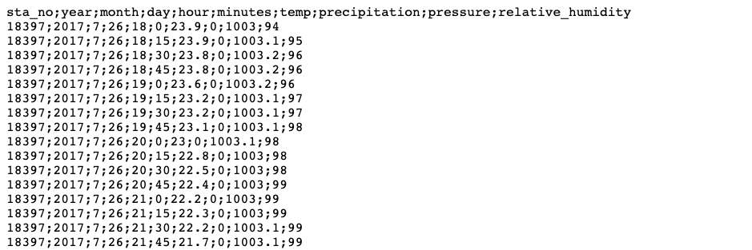

## **Read**

Learn where you are, working directory
```
getwd()
```
List all directories
```
list.dirs()
```
List all files
```
list.files()
```

Use default dataset in R
```
library(help="datasets")
# for example co2
# print() and plot() co2
```


## **Read**

Two main ways

- Interface of R
- Console


## **Read**

Interface of R -> Environment -> Import Dataset

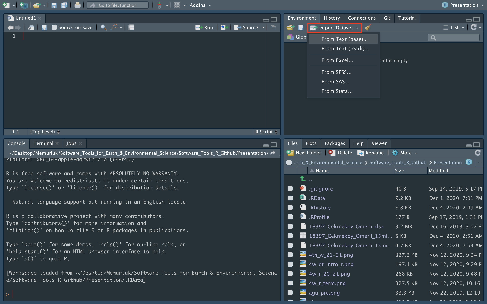

## **Read**

Interface of R -> Environment -> Import Dataset

From Text (base)

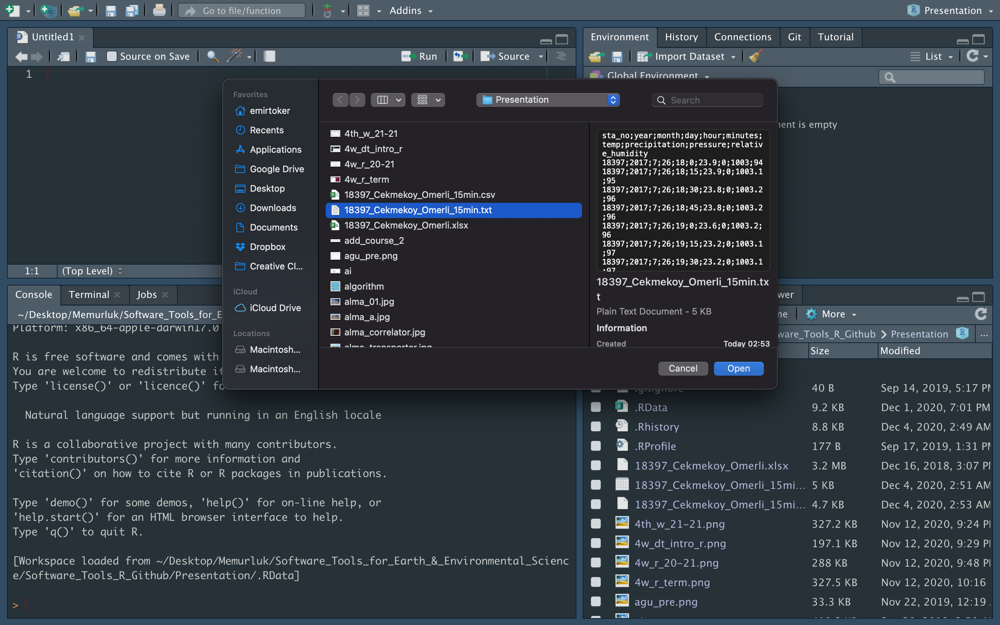
## **Read**

Interface of R -> Environment -> Import Dataset

From Text (base)


## **Read**

Import Dataset -> From Text (readr) -> Browse


## **Read**

Import Dataset -> From Text (readr) -> URL Paste -> Update

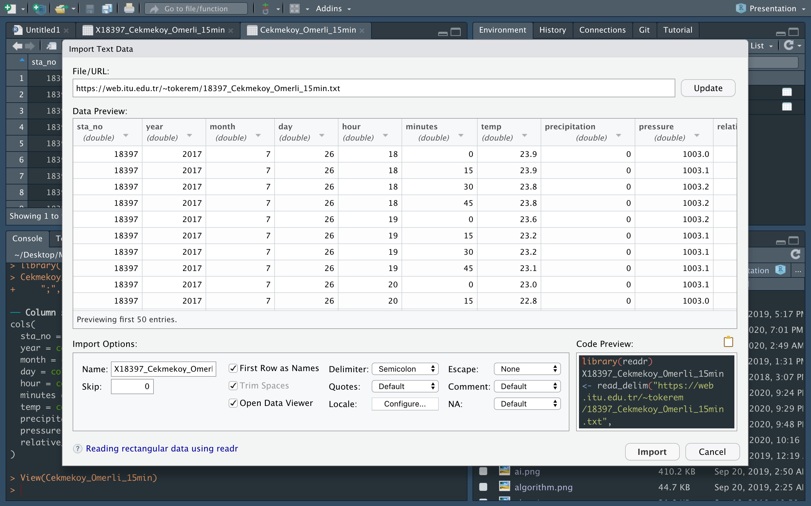


## **Read**

Import Dataset -> From Text 

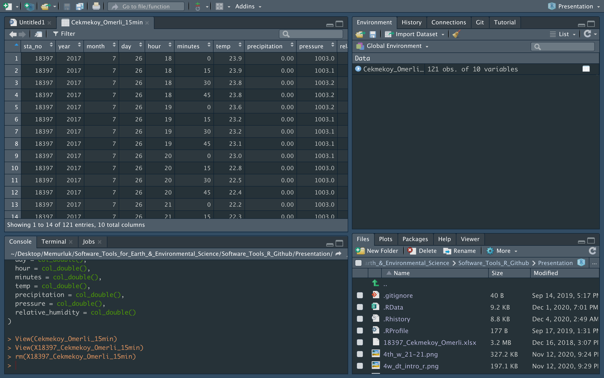


## **Read**

Console

- read.table()
- read.delim()
- read.csv()

Try on console

```
- read.table("Cekmekoy_Omerli_15min.txt")
- read.delim("Cekmekoy_Omerli_15min.txt")
- read.csv("Cekmekoy_Omerli_15min.txt")
```

help()

OPTIONS : header =TRUE, sep = ";"


## **Read**

Console

```
url <- "https://web.itu.edu.tr/~tokerem/18397_Cekmekoy_Omerli_15min.txt"

urldata_txt <- read.table(url,
                          header=TRUE, 
                          sep=";")
```

## **BONUS : Attributes**

```
my_data <- read.csv("Cekmekoy_Omerli_15min.txt", 
                    header=T, 
                    sep=";")
View(my_data)
print(my_data)
```
```
class(my_data)
str(my_data)
attributes(my_data)
my_data$temp
```
```
attributes(my_data)
attributes(my_data)$names
attributes(my_data)$names[7]
attributes(my_data)$names[7] <- "temperature"
```
```
attributes(my_data)
attributes(my_data)$row.names
attributes(my_data)$row.names[1]
attributes(my_data)$row.names[1] <- "first"
```


## **Plot**

```
plot()
plot(my_data)
plot(my_data[7])
plot(my_data[,7])
plot(my_data$temperature)
```
```
help(plot)
OPTIONS
plot(my_data$temperature, 
     type = "l", main = "My Plot", 
     xlab = "Time", ylab = "Temperature")
```

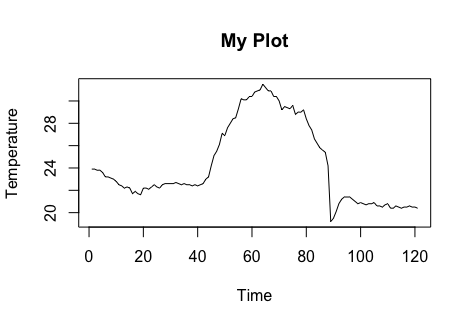


## **Plot**

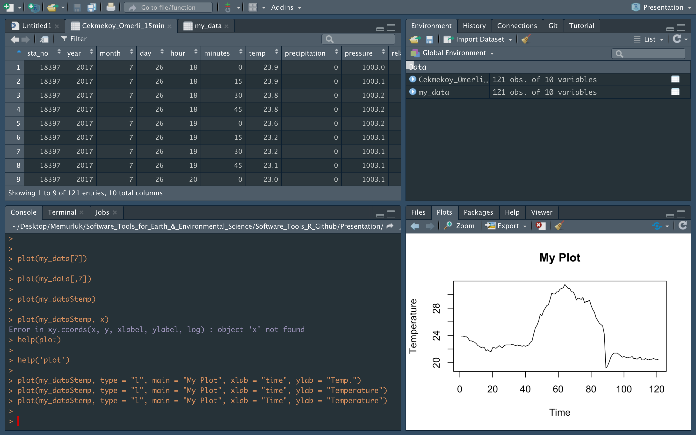

## **Plot**

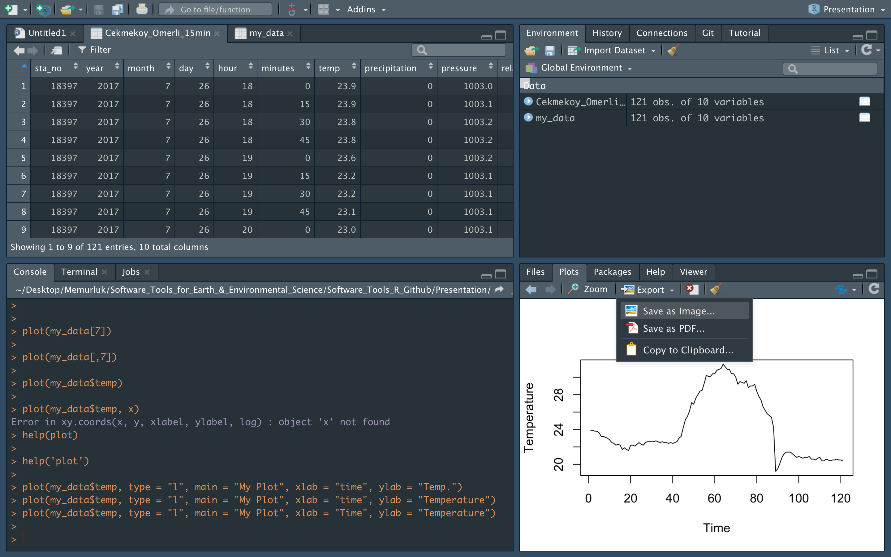

## **Plot**

Uptade Preview

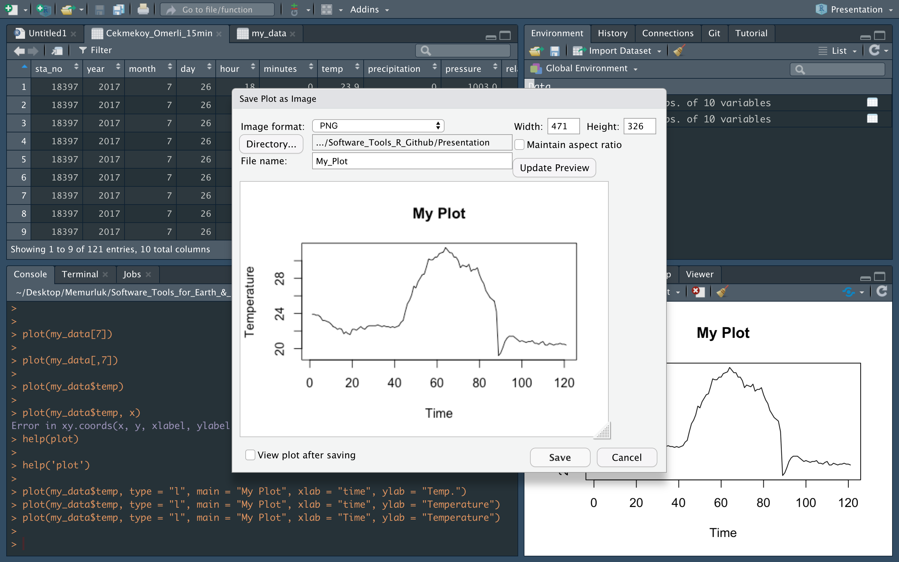

## **Plot**

Now, plot **PRESSURE** parameter, in my_data

```
plot(my_data$pressure, 
     type = "l", 
     main = "My Plot", 
     xlab = "Time", 
     ylab = "Pressure")
```


## **Plot**

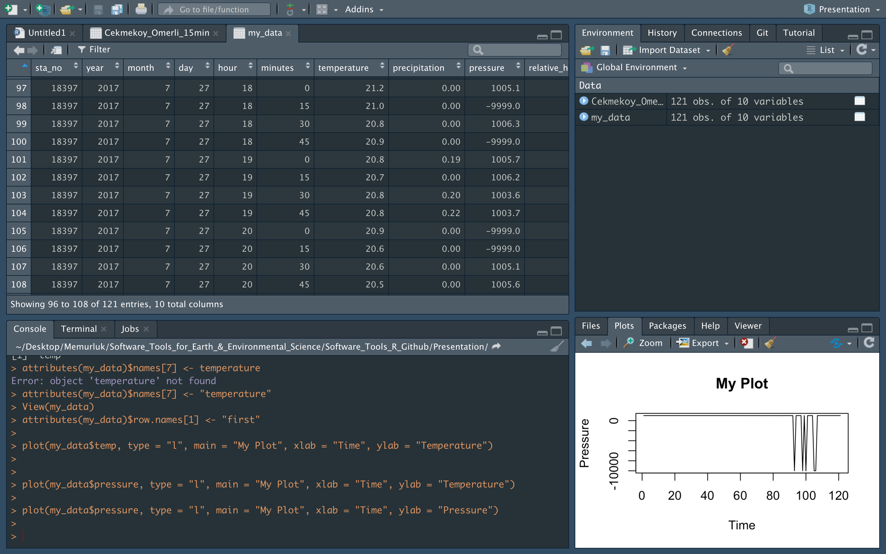

## **Problem**

How can I fix the missing data?

I will just assign NA for now. HOW?

Two ways:

  - Read the data again, but this time with NA
  - Assign all -9999.0 numbers as NA

```
my_data_NA <- read.csv("Cekmekoy_Omerli_15min.txt", 
                      header=T, 
                      sep=";",
                      na.strings=-9999.0)
View(my_data_NA)
print(my_data_NA)
```

## **Problem**

How can I fix the missing data?

I will just assign NA for now. HOW?

Two ways:

  - Read the data again, but this time with NA
  - Assign all -9999.0 numbers as NA
  
```
my_data$pressure
my_data$pressure==-9999.0

which(my_data$pressure==-9999.0)
index <- which(my_data$pressure==-9999.0)
my_data$pressure[index]
my_data$pressure[index] <- NA

View(my_data)
print(my_data)
```

## **Plot**


## **Write**

```
write.table(x=urldata_txt,
            file="somenewfile.txt"
            sep=";",
            na="-9999",
            row.names=FALSE)
```
```
write.table(x=my_data,
            file="my_data.txt",
            sep=";",
            na=-9999.0,
            row.names=FALSE)
```
```       
write.table(x=my_data_NA,
            file="my_data_NA.csv",
            sep=";",
            na="-9999",
            row.names=FALSE)
```

write.table() and OPTIONS


## **Plot**

```
foo <- c(1.1,2,3.5,3.9,4.2)
bar <- c(2,2.2,-1.3,0,0.2)
plot(foo,bar)
```

- **type** the supplied coordinates (for example, as stand-alone points or joined by lines or both dots and lines).
- **main, xlab, ylab** Options to include plot title, the horizontal axis label, and the vertical axis label, respectively.
- **col** Color (or colors) to use for plotting points and lines.
- **lty** Stands for line type. (for example, solid, dotted, or dashed).
- **lwd** This controls the thickness of plotted lines.
- **xlim, ylim** limits for the horizontal range and vertical range (respectively)

## **Plot**

```
plot(foo,bar)
plot(foo,bar,type="l")
plot(foo,bar,type="b",main="My lovely plot",xlab="x axis label", ylab="location y")
plot(foo,bar,type="b",main="My lovely plot",xlab="",ylab="",col="red")
```

<style>
.column-left3{
  float: left;
  width: 70%;
  text-align: left;
}
.column-right3{
  float: right;
  width: 30%;
  text-align: right;
}
</style>

<div class="column-left3">

</div>

<div class="column-right3">
```
x <- 1:20
y <- c(-1.49,3.37,2.59,-2.78,-3.94,-0.92,6.43,8.51,3.41,-8.23,
-12.01,-6.58,2.87,14.12,9.63,-4.58,-14.78,-11.67,1.17,15.62)
plot(x,y,type="n",main="")
abline(h=c(-5,5),col="red",lty=2,lwd=2)
segments(x0=c(5,15),y0=c(-5,-5),x1=c(5,15),y1=c(5,5),col="red",lty=3,
lwd=2)
points(x[y>=5],y[y>=5],pch=4,col="darkmagenta",cex=2)
points(x[y<=-5],y[y<=-5],pch=3,col="darkgreen",cex=2)
points(x[(x>=5&x<=15)&(y>-5&y<5)],y[(x>=5&x<=15)&(y>-5&y<5)],pch=19,
col="blue")
points(x[(x<5|x>15)&(y>-5&y<5)],y[(x<5|x>15)&(y>-5&y<5)])
lines(x,y,lty=4)
arrows(x0=8,y0=14,x1=11,y1=2.5)
text(x=8,y=15,labels="sweet spot")
legend("bottomleft",
legend=c("overall process","sweet","standard",
"too big","too small","sweet y range","sweet x range"),
pch=c(NA,19,1,4,3,NA,NA),lty=c(4,NA,NA,NA,NA,2,3),
col=c("black","blue","black","darkmagenta","darkgreen","red","red"),
lwd=c(1,NA,NA,NA,NA,2,2),pt.cex=c(NA,1,1,2,2,NA,NA))
```

## **Plot**

```
my_data_NA <- read.csv("Cekmekoy_Omerli_15min.txt", 
                      header=T, 
                      sep=";",
                      na.strings=-9999.0)
plot(my_data$temp, 
     type = "l", 
     main = "My Plot", 
     xlab = "Time", 
     ylab = "Temperature",
     col = "red")
```


## **Plot ggplot2**

```
library('ggplot2')

gg <- ggplot(my_data_NA, aes(x=seq(1,121))) +
      geom_line(aes(y=temp)) +
      labs(title="My Time Series", 
           subtitle="Temperature for Omerli Station", 
           caption="Source: Meteorology Station", 
           y="Temperature", 
           x="Time Step")
           
plot(gg)
```                    
            


## **Plot ggplot2**

```
library('ggplot2')

gg <- ggplot(my_data_NA, aes(x=seq(1,121), y=temp)) +
      geom_point(aes(col=temp, size=temp)) +
      geom_smooth(method="loess", se=F) +
      labs(title="My Time Series", 
           subtitle="Temperature for Omerli Station",
           y="Temperature", 
           x="Time Step")
           
plot(gg)
```


# **Practice - R Language**

## **Practice - R Language**

1. **Read** and **assign** your csv data (Header or seperator ?).
"Cekmekoy_Omerli_15min.txt"
2. Check the **class** and **structure** of your new data.
3. Take the ***"Temperature"*** parameter and **assign** it as a new variable.
4. **Plot** the "temperature" vector.
5. **Print** **minimum** temperature and find **which** element is the minimum in temperature vector.
6. **change** the minimum value with **NA** and **Print**.
7. **Plot** the new "temperature" vector.
8. Replace these **new** temperature values with **old** temperature values located in your data frame.
9. **Write** your data frame as a new csv file.

## **Practice - R Language**

1. **Read** and **assign** your csv data (Header or seperator ?).
"18397_Cekmekoy_Omerli_15dk.txt"

```{r, echo=TRUE}
mydata <- read.csv(file = "Cekmekoy_Omerli_15min.txt", 
                   header = TRUE, 
                   sep = ";")
mydata
```


## **Practice - R Language**

1. **Read** and **assign** your csv data (Header or seperator ?).
"Cekmekoy_Omerli_15min.txt"
2. Check the **class** and **structure** of your new data.
3. Take the ***"Temperature"*** parameter and **assign** it as a new variable.
4. **Plot** the "temperature" vector.
5. **Print** **minimum** temperature and find **which** element is the minimum in temperature vector.
6. **change** the minimum value with **NA** and **Print**.
7. **Plot** the new "temperature" vector.
8. Replace these **new** temperature values with **old** temperature values located in your data frame.
9. **Write** your data frame as a new csv file.

## **Practice - R Language**

2. Check the **class** and **structure** of your new data.

```{r}
class(mydata)
str(mydata)
attributes(mydata)
```


## **Practice - R Language**

1. **Read** and **assign** your csv data (Header or seperator ?).
"Cekmekoy_Omerli_15min.txt"
2. Check the **class** and **structure** of your new data.
3. Take the ***"Temperature"*** parameter and **assign** it as a new variable.
4. **Plot** the "temperature" vector.
5. **Print** **minimum** temperature and find **which** element is the minimum in temperature vector.
6. **change** the minimum value with **NA** and **Print**.
7. **Plot** the new "temperature" vector.
8. Replace these **new** temperature values with **old** temperature values located in your data frame.
9. **Write** your data frame as a new csv file.

## **Practice - R Language**

3. Take the ***"Temperature"*** parameter and **assign** it as a new variable.

```{r, echo=TRUE}
temp_data <- mydata$temp
temp_data
```


## **Practice - R Language**

1. **Read** and **assign** your csv data (Header or seperator ?).
"Cekmekoy_Omerli_15min.txt"
2. Check the **class** and **structure** of your new data.
3. Take the ***"Temperature"*** parameter and **assign** it as a new variable.
4. **Plot** the "temperature" vector.
5. **Print** **minimum** temperature and find **which** element is the minimum in temperature vector.
6. **change** the minimum value with **NA** and **Print**.
7. **Plot** the new "temperature" vector.
8. Replace these **new** temperature values with **old** temperature values located in your data frame.
9. **Write** your data frame as a new csv file.

## **Practice - R Language**

4. **Plot** the "temperature" vector.
```
plot(temp_data)
```


## **Practice - R Language**

1. **Read** and **assign** your csv data (Header or seperator ?).
"Cekmekoy_Omerli_15min.txt"
2. Check the **class** and **structure** of your new data.
3. Take the ***"Temperature"*** parameter and **assign** it as a new variable.
4. **Plot** the "temperature" vector.
5. **Print** **minimum** temperature and find **which** element is the minimum in temperature vector.
6. **change** the minimum value with **NA** and **Print**.
7. **Plot** the new "temperature" vector.
8. Replace these **new** temperature values with **old** temperature values located in your data frame.
9. **Write** your data frame as a new csv file.

## **Practice - R Language**

5. **Print** **minimum** temperature and find **which** element is the minimum in temperature vector.

```{r, echo=TRUE}
print(min(temp_data))

which(temp_data==19.2) # which(temp_data==min(temp_data))
```


## **Practice - R Language**

1. **Read** and **assign** your csv data (Header or seperator ?).
"Cekmekoy_Omerli_15min.txt"
2. Check the **class** and **structure** of your new data.
3. Take the ***"Temperature"*** parameter and **assign** it as a new variable.
4. **Plot** the "temperature" vector.
5. **Print** **minimum** temperature and find **which** element is the minimum in temperature vector.
6. **change** the minimum value with **NA** and **Print**.
7. **Plot** the new "temperature" vector.
8. Replace these **new** temperature values with **old** temperature values located in your data frame.
9. **Write** your data frame as a new csv file.

## **Practice - R Language**

6. **change** the minimum value with **NA** and **Print**.

```{r, echo=TRUE}

temp_data[89] <- NA

temp_data[which(temp_data==19.2)] <- NA

temp_data[which(temp_data==min(temp_data))] <- NA

print(temp_data)
```

## **Practice - R Language**

1. **Read** and **assign** your csv data (Header or seperator ?).
"Cekmekoy_Omerli_15min.txt"
2. Check the **class** and **structure** of your new data.
3. Take the ***"Temperature"*** parameter and **assign** it as a new variable.
4. **Plot** the "temperature" vector.
5. **Print** **minimum** temperature and find **which** element is the minimum in temperature vector.
6. **change** the minimum value with **NA** and **Print**.
7. **Plot** the new "temperature" vector.
8. Replace these **new** temperature values with **old** temperature values located in your data frame.
9. **Write** your data frame as a new csv file.

## **Practice - R Language**

7. **Plot** the new "temperature" vector.

```{r}
plot(temp_data)
```

## **Practice - R Language**

1. **Read** and **assign** your csv data (Header or seperator ?).
"Cekmekoy_Omerli_15min.txt"
2. Check the **class** and **structure** of your new data.
3. Take the ***"Temperature"*** parameter and **assign** it as a new variable.
4. **Plot** the "temperature" vector.
5. **Print** **minimum** temperature and find **which** element is the minimum in temperature vector.
6. **change** the minimum value with **NA** and **Print**.
7. **Plot** the new "temperature" vector.
8. Replace these **new** temperature values with **old** temperature values located in your data frame.
9. **Write** your data frame as a new csv file.

## **Practice - R Language**

8. Replace these **new** temperature values with **old** temperature values located in your data frame.

```{r, echo=TRUE}
mydata$temp <- temp_data

mydata
```


## **Practice - R Language**

1. **Read** and **assign** your csv data (Header or seperator ?).
"Cekmekoy_Omerli_15min.txt"
2. Check the **class** and **structure** of your new data.
3. Take the ***"Temperature"*** parameter and **assign** it as a new variable.
4. **Plot** the "temperature" vector.
5. **Print** **minimum** temperature and find **which** element is the minimum in temperature vector.
6. **change** the minimum value with **NA** and **Print**.
7. **Plot** the new "temperature" vector.
8. Replace these **new** temperature values with **old** temperature values located in your data frame.
9. **Write** your data frame as a new csv file.

## **Practice - R Language**

9. **Write** your data frame as a new csv file.

```{r, echo=TRUE}
write.csv(mydata, file = "new_data.csv")
```


## **BONUS - Create a Function**

**What is Function ?**

A function is a set of statements organized together to perform a specific task

ex: **mean()** (arithmetic mean)

```{r echo=TRUE}
x <- c(1,2,3)
mean(x)
```

```{r echo=TRUE}
(1+2+3) / 3
```


## **BONUS - Create a Function**

**What is Function ?**

A function is a set of statements organized together to perform a specific task

ex: **sample()** (takes a sample of the specified size from the elements of x )

```{r echo=TRUE}
sample(c(1,6,32,7), size = 2)
```

ex: **sum()** (returns the sum of all the values)


## **Practice**

**Create a Function**

Problem: Take a sample belonged to population and sum

```
box <- 1:6                    # This is my population in a BOX
my_samp <- sample(box, size = 2) # This is my sample, I choose two var.
sum(my_samp)
```
```
box
samp
```

I want to create a new function named ***my_roll()***
```
my_roll <- function(box) {
box <- 1:6 
my_samp <- sample(box) 
sum(my_samp)
}
```
```
my_roll()
```


## **Practice**

**Problem**: I want to define population myself, in every time.
*remove pre-defined population* ***box*** *?*

```
my_roll2 <- function(box) {
my_samp <- sample(box, size = 2) 
sum(my_samp)
}
```
```
my_roll2(box)
```
box ?
```
box = 1:6
my_roll2(box)

my_roll2(box = 1:6)
my_roll2(1:6)
```

## **Practice**

**Create a Function**


- You can add new options
- { } and () are important


# **Workshop - Midterm Project**

## **Workshop - Midterm Project**

- Open a new R notebook
- Go to course home page, (Midterm Project)
- Click **Rmd** and Open "Midterm_Project.Rmd"
- Copy all code and paste in your R notebook
- Same way, open "Data" and paste file in your project directory.
- Start to follow **Instructions**


# **Next Week**

## **Next Week R Programming - PART I**


## **Next Week R Programming - PART I**


