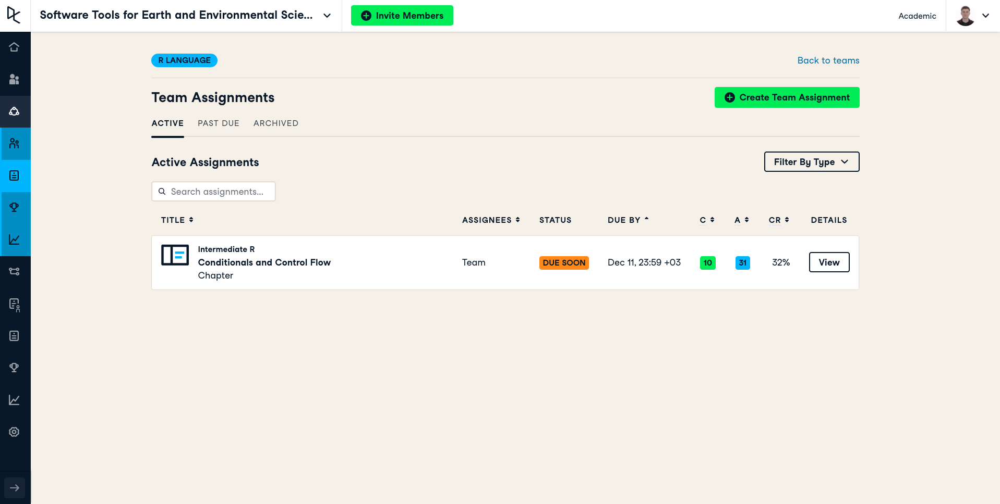
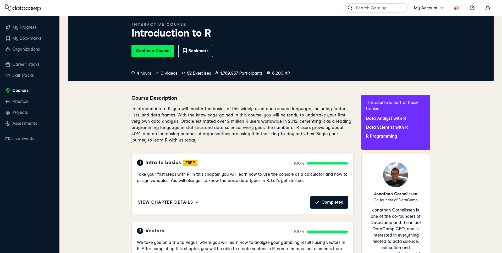
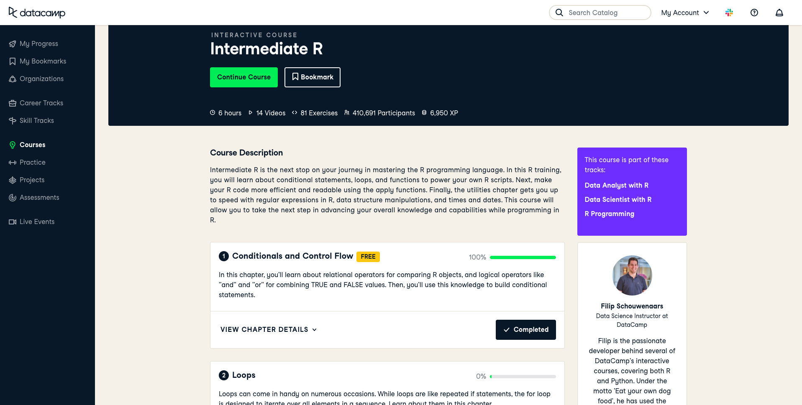
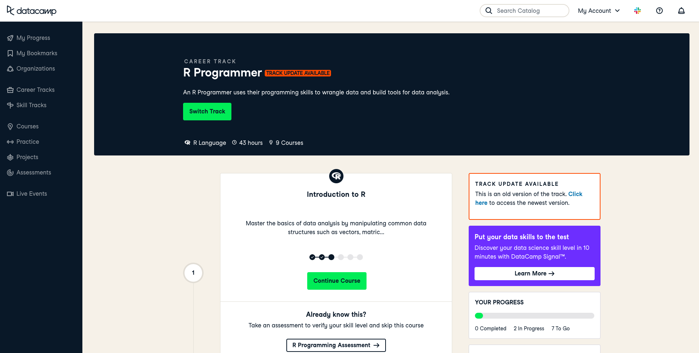
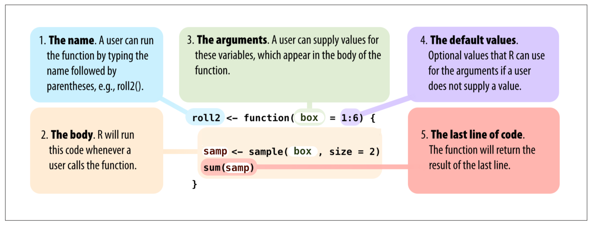
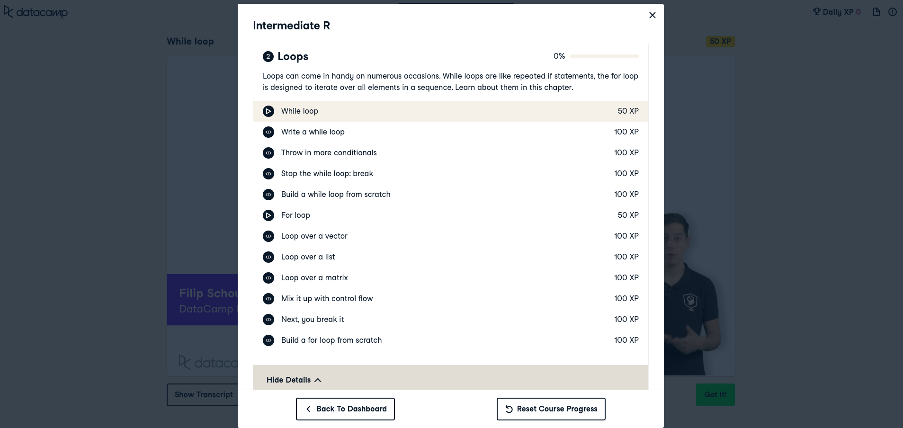

```{r, echo=FALSE}
knitr::opts_chunk$set(error = FALSE)
```

```{r, include = FALSE}
knitr::opts_chunk$set(echo = FALSE)
```


## **R Promgramming - Part 1**

- **Syllabus and Book**
- **DataCamp Class**
- **Homework I & II and Midterm Project**
- **Questions - R Language**
- **Practice - Create a Function**
- **R Programming - Conditions**
     - Comparison Operators
     - ***if*** Statement
     - ***else*** Statement
     - ***else if*** Statement
- **Next Week**


# **Syllabus and Book**


## **Syllabus**


Extended Syllabus [PDF](https://web.itu.edu.tr/~tokerem/Software_Tools_Syllabus.pdf)

## **Book**

 

[PDF](https://web.itu.edu.tr/~tokerem/The_Book_of_R.pdf) - (179 - 185)


# **DataCamp - Class**

## **DataCamp**


[LINK](https://www.datacamp.com/home)

## **DataCamp**


Past Team Assignments

## **DataCamp**



Active Team Assignments


## **DataCamp**



## **DataCamp**




## **DataCamp**


## **DataCamp**


## **DataCamp**


## **DataCamp**



## **DataCamp**

- **Introduction to R**  - *due date: 22 Jan 2021 23:59*
- **Intermediate R**     - *due date: 22 Jan 2021 23:59*


## **Homework I & II and Midterm Project**

- **HMW - I**  - *due date: 22 Dec 2020 23:59*
- **HMW - II** - *due date: 22 Dec 2020 23:59*
- **Midterm Project** - *due date: 18 Dec 2020 23:59*


# **R Language - Repeat**

## **Questions - R Language**

- What are the benefits of R-Script and R-Project?
- What are the data types and data structures in R?
- What are the advantages of the Data Frame?
- What is the difference between NA and NaN?


# **Practice - Create a Function**


## **What is Function ?**

A function is a set of statements organized together to perform a specific task

ex: **mean()** (arithmetic mean)

```{r echo=TRUE}
x <- c(1,2,3)
mean(x)
```

```{r echo=TRUE}
(1+2+3) / 3
```


## **Create a Function**


## **Create a Function**

{width=60%}


{width=90%}


## **Create a Function**


**Problem**: Take a **sample** belonged to population, and **sum**

```{r, echo=TRUE}
box <- 1:6                    # This is my population in a BOX
box

samp <- sample(box, size = 2)   # This is my sample, I choose two values.
samp

sum(samp)
```


## **Create a Function**

I want to collect my **sample()** and **sum()** functions and put in ONE **function**.
I will create a new function named ***roll2()***.

{width=70%}


```
name_new_function <- function( argument ) {

name_new_variable <- do_this( argument, option )
then_do_this( name_new_variable )
}
```
```
name_new_function( )    # It will work with my default argument
```


## **Create a Function**

```
name_new_function <- function( argument ) {

name_new_variable <- do_this( argument, option )
then_do_this( name_new_variable )
}
```
```
name_new_function( )   # It will work with my default argument
```
in formal :
```{r, echo=TRUE}
roll2 <- function(box = 1:6) {
  
samp <- sample(box, size=2) 
sum(samp)
}
```
```{r, echo=TRUE}

roll2( )      # It will work with my default argument ( box = 1:6 )
```


## **Create a Function**

{width=70%}

```{r, echo=TRUE}
roll2 <- function(box = 1:6) {
  
samp <- sample(box, size=2) 
sum(samp)
}
```
```{r, echo=TRUE}

roll2()    # It will work with my default argument ( box = 1:6 )
```


## **Create a Function**

You can change the default argument in every time

```{r, echo=TRUE}

roll2(box = 1:10)   # It will work with argument ( 1,2,3,4,5,6,7,8,9,10 )

roll2(1:10)   # It will work with argument ( 1,2,3,4,5,6,7,8,9,10 )

roll2(seq(1,10,0.5))   # It will work with argument ( 1, 1.5, 2, 2.5, 3,... )

```


## **Practice - Create a Function**


{width=70%}

You can add new options or new functions in your new function.

**{ }** and **()** are important

```
# Think about these functions
# mean(), print(), plot(), max(), install.packages(), help(), ...
```


# **R Programming - Conditions**

## **R Programming - Conditions**

<style>

.column-right0{
  float: right;
  width: 50%;
  text-align: right;
}
.column-left0{
  float: left;
  width: 50%;
  text-align: left;
}
</style>

<div class="column-left0">

- **Comparison Operators **
    - equal (**==**)
    - not equal (**!=**)
    - greater or equal to (**>=**)
    - less or equal to (**<=**)


- **Logical Operators **
    - the *and* operator (**&**)
    - the *or* operator (**|**)
    - the *not* operator (**!**)

- ***if*** (Stand-Alone) Statement
- ***else*** Statement
- ***else if*** Statement

</div>


<div class="column-right0">

```
TRUE & TRUE  
TRUE & FALSE
TRUE | FALSE 
!TRUE

2 == 3
5 < 6

c(1,4) >= 6

9 != 8

5 < 6 & 9 != 8
```

```
score <- 80
exam_name <- "math"

score >= 75 & exam_name == "math"
```

</div>


     
## ***if*** (Stand-Alone) Statement

The ***if statement*** executes a chunk of code if and only if a defined condition is **TRUE**, which looks something like this:


<style>
.column-left2{
  float: left;
  width: 50%;
  text-align: left;
}
.column-right2{
  float: right;
  width: 50%;
  text-align: right;
}
</style>

<div class="column-left2">

```{r, echo=TRUE}
if(TRUE) message("It was true!")

if(FALSE) message("It wasn't true!")
```
</div>

<div class="column-right2">

```{r, echo=TRUE}
if(TRUE&FALSE) message("It was true!")

if(TRUE|FALSE) message("It doesn't matter")
```
</div>


## ***if*** (Stand-Alone) Statement


<style>
.column-left2{
  float: left;
  width: 50%;
  text-align: left;
}
.column-right2{
  float: right;
  width: 50%;
  text-align: right;
}
</style>

<div class="column-left2">

```{r, echo=TRUE}
a <- 3
num <- 4

if ( a != num ) {
print(a)
}
```
</div>

<div class="column-right2">

```{r, echo=TRUE}
a <- 3
num <- 4

if ( a <= num ) {
a <- a ^ 2
print(a)
}
```
</div>


## ***if*** (Stand-Alone) Statement

{width=80%}

```{r, echo=TRUE}
num <- -1

if ( num < 0 ) {
  print("num is negative.")
  print("Don't worry, I'll fix it.") 
  num <- num * -1
  print(num)
  print("Now num is positive.")
}
```


## ***if*** (Stand-Alone) Statement


just look

## ***if*** (Stand-Alone) Statement


just look


## ***if*** (Stand-Alone) Statement

Try it

Is it in the range ?

```

x <- 6
y <- 2

if ( x > 3 & x == 7 ) {
  print("It is in the range")
  z <- x + y
  print(z)
}

```

Can you fix this, with just ONE **symbol** ?


## ***if*** (Stand-Alone) Statement

Is it in the range ?

```{r, echo=TRUE}

x <- 6
y <- 2

if ( x > 3 & x <= 7 ) {
  print("It is in the range")
  z <- x + y
  print(z)
}

```


## ***if*** (Stand-Alone) Statement

Try it

You have a fruit which is yellow.

Is that a banana?

Or an orange ?

```
banana <- "yellow"
my_fruit <- "yellow"

if ( my_fruit == banana ) {
  print("Your fruit might be a banana")
}

```

```
orange <- "orange"
my_fruit <- "yellow"

if ( my_fruit == orange ) {
  print("Your fruit is not a banana")
}

```


## ***else*** - Statement

If you want something different to happen when the condition
is **FALSE**, you can add an else declaration.

{width=80%}
<style>
.column-left1{
  float: left;
  width: 60%;
  text-align: left;
}
.column-right1{
  float: right;
  width: 40%;
  text-align: right;
}
</style>

<div class="column-left1">

```{r, echo=TRUE}
if(FALSE) {
      message("This won't appearance ...")
} else {
      message("but this will !")
}
```
</div>

<div class="column-right1">

```{r, echo=TRUE}
a <- 3.5
b <- 0.5

if (a <= 0.5) {
  c <- b + 1
  print(c)
} else {
  c <- b
  print(c)
}
```
</div>


## ***else*** - Statement

Report the weather. Is it rainy ?

{width=80%}

Let's say we have two conditions. **Rainy** or **Shiny**. 

And you have recorded **4 mm** precipitation.

```
weather <-       # mm           # fill this number

if ( ) {                        # fill this condition, using weather
  print("it is rainy")
} else {
  print("it is shiny")
}
```


## ***else*** - Statement

Report the weather. Is it rainy ?

{width=80%}

Let's say we have two conditions. **Rainy** or **Shiny**. 

And you have recorded 4 mm precipitation.

```{r, echo=TRUE}
weather <- 4      # mm              # fill this number

if ( weather > 0 ) {                # fill this condition, using weather
  print("it is rainy")              
} else {
  print("it is shiny")
}
```


## -***else ***-  and -***else if***- Statement


If your situation has more than two mutually exclusive cases, 
use **else** and **if** statements together.


## -***else ***-  and -***else if***- Statement

If your situation has more than two mutually exclusive cases, 
use **else** and **if** statements together.


```{r, echo=TRUE}
a <- 1                  # team 'a' has 1 goal
b <- 1                  # team 'b' has 1 goal

if (a > b) { 
  print("A wins!")
} else if (a < b) { 
  print("B wins!")
} else {
  print("Tie.")
}
```


## -***else ***-  and -***else if***- Statement

**What do you gonna do ? Eating, Sleeping, or Reading?**

When do you want to read ?

- When you are hungry, or sleepy. **No.**
- When you are not hungry and sleepy. **Yes.**

So, start to think about your feelings about sleeping or eating to decide whether reading or not.    
    

## -***else ***-  and -***else if***- Statement

**What do you gonna do ? Eating, Sleeping, or Reading?**

Let's start with define the conditions

  - If you are hungry --> eat
  - If you are sleepy --> sleep
  
    - If you are hungry and sleepy --> ?
    - If you are hungry but not sleepy --> ?
    - If you are not hungry but sleepy --> ?
    - If you are not hungry and sleepy --> ?


## -***else ***-  and -***else if***- Statement

What do you gonna do ? Eat, Sleep or Read? 

- If you are hungry and sleepy --> eat
- If you are hungry but not sleepy --> eat
- If you are not hungry but sleepy --> sleep
- If you are not hungry and sleepy --> read

Let's define your feelings. **Yes** (TRUE,1) or **No** (FALSE,0)

- Are you hungry ? 
- Are you sleepy ? 


```
hungry <-                   # TRUE or FALSE (1 or 0)
sleepy <-                   # TRUE or FALSE (1 or 0)


```


## -***else ***-  and -***else if***- Statement

What do you gonna do ? Eat, Sleep or Read? 

- 1) If you are hungry and sleepy --> eat
- 2) If you are hungry but not sleepy --> eat
- 3) If you are not hungry but sleepy --> sleep
- 4) If you are not hungry and sleepy --> read

```
hungry <- TRUE                  # Yes , TRUE , 1
sleepy <- TRUE                  # Yes , TRUE , 1

if ( ) { 
  print(" ")
} else if ( ) { 
  print(" ")
} else if ( ) { 
  print(" ")
} else {
  print(" ")
}
```

## -***else ***-  and -***else if***- Statement

What do you gonna do ? Eat, Sleep or Read? 

- 1) If you are hungry and sleepy --> eat
- 2) If you are hungry but not sleepy --> eat
- 3) If you are not hungry but sleepy --> sleep
- 4) If you are not hungry and sleepy --> read

```
hungry <- TRUE                  # Yes , TRUE , 1
sleepy <- TRUE                  # Yes , TRUE , 1

if ( ) {                    # hungry is TRUE and sleepy is TRUE
  print(" ")
} else if ( ) {             # hungry is TRUE and sleepy is FALSE
  print(" ")
} else if ( ) {             # hungry is FALSE and sleepy is TRUE
  print(" ") 
} else {                    # hungry is FALSE and sleepy is FALSE
  print(" ")
}
```


## -***else ***-  and -***else if***- Statement

What do you gonna do ? Eat, Sleep or Read? 

- If you are hungry and sleepy --> eat
- If you are hungry but not sleepy --> eat
- If you are not hungry but sleepy --> sleep
- If you are not hungry and sleepy --> read

```{r, echo=TRUE}
hungry <- TRUE                  # Yes , TRUE , 1
sleepy <- TRUE                  # Yes , TRUE , 1

if (hungry==TRUE & sleepy==TRUE) {          # hungry is TRUE and sleepy is TRUE
  print(" ")
} else if (hungry==TRUE & sleepy==FALSE) {  # hungry is TRUE and sleepy is FALSE
  print(" ")
} else if (hungry==FALSE & sleepy==TRUE) {  # hungry is FALSE and sleepy is TRUE
  print(" ") 
} else {                                    # hungry is FALSE and sleepy is FALSE
  print(" ")
}
```


## -***else ***-  and -***else if***- Statement

What do you gonna do ? Eat, Sleep or Read? 

- If you are hungry and sleepy --> eat
- If you are hungry but not sleepy --> eat
- If you are not hungry but sleepy --> sleep
- If you are not hungry and sleepy --> read

```{r, echo=TRUE}
hungry <- TRUE                  # Yes , TRUE , 1
sleepy <- TRUE                  # Yes , TRUE , 1

if (hungry==TRUE & sleepy==TRUE) {          # hungry is TRUE and sleepy is TRUE
  print("EAT")
} else if (hungry==TRUE & sleepy==FALSE) {  # hungry is TRUE and sleepy is FALSE
  print("EAT")
} else if (hungry==FALSE & sleepy==TRUE) {  # hungry is FALSE and sleepy is TRUE
  print("SLEEP") 
} else {                                    # hungry is FALSE and sleepy is FALSE
  print("READ")
}
```


##  Nesting and Stacking Statements

An ***if statement*** can be placed in another ***if statement***.
In the editor, modify the mynumber example once more as follows:

{width=90%}


##  Nesting and Stacking Statements


##  Nesting and Stacking Statements


##  Nesting and Stacking Statements


##  Nesting and Stacking Statements


#  Practices 

##  Practice - Conditions - TRUE and FALSE


1. **Print** this **if** it is **TRUE.**
"This message will print!"

```
if (...) {
  print(...)
} 
```
2. Go to bed **if** time **equals** to 22 o'clock, **else** wake up.

```
if (...) {
   print("Go to bed!")
} else {
   print("Wake up!")
}
```

3. The variable message to *"I print this when it is false!"* when the condition is **FALSE**.

```
if (...) {
  print("I print this when it is true!")
} else {
  print(...)
}
```


##  Practice - Conditions - Logical Op

**ROLE PLAY** : You are a CAR, and you are going on the road. 


Problem : **BUT** ;

- Traffic (stop) light turned to **orange**
- **Two** pedestrians started to walk across the road

**How can you move ?**


##  Practice - Conditions - Logical Op


**How can you move ?**

- Waiting for the traffic (stop) light turns to **green**
- Waiting for pedestrians pass to the across of the road

**Parameters** : 

-
-


##  Practice - Conditions - Logical Op


**How can you move ?**

- Waiting for the traffic (stop) light turns to **green**
- Waiting for pedestrians pass to the across of the road

**Parameters** : 

- The **COLOR** of the traffic (stop) light
- The **NUMBER** of pedestrians


##  Practice - Conditions - Logical Op

You are a CAR, **BUT** ;

- Traffic (stop) light turned to **orange**
- **Two** pedestrians started to walk across the road

**Parameters** : 

- The **COLOR** of the traffic (stop) light
- The **NUMBER** of pedestrians

*First, define the situation*

```
Traffic_Stop_Light <- 
Number_of_Pedestrians <-
```

##  Practice - Conditions - Logical Op

You are a CAR, **BUT** ;

- Traffic (stop) light turned to **orange**
- **Two** pedestrians started to walk across the road

**Parameters** : 

- The **COLOR** of the traffic (stop) light
- The **NUMBER** of pedestrians

*First, define the situation*

```{r, echo=T}
Traffic_Stop_Light <- 'orange'
Number_of_Pedestrians <- 2
```


##  Practice - Conditions - Logical Op

You are a CAR, **BUT** ;

```{r, echo=T}
Traffic_Stop_Light <- 'orange'
Number_of_Pedestrians <- 2
```

*Second, define the conditions to move again*

```
Traffic_Stop_Light : ?
Number_of_Pedestrians : ?
```

##  Practice - Conditions - Logical Op

Situation
```{r, echo=T}
Traffic_Stop_Light <- 'orange'
Number_of_Pedestrians <- 2
```

Condition
```
Traffic_Stop_Light : 'green'
Number_of_Pedestrians : 0
```

Remember rules
```
if (...) {
  print(...);
} else {
  print(...);
}
```


##  Practice - Conditions - Logical Op

Situation
```{r, echo=T}
Traffic_Stop_Light <- 'orange'
Number_of_Pedestrians <- 2
```

Condition
```
Traffic_Stop_Light : 'green'
Number_of_Pedestrians : 0
```

Remember rules
```
if ( & ) {
  print('Go!');
} else {
  print('STOP');
}
```


##  Practice - Conditions - Logical Op

Situation
```{r, echo=T}
Traffic_Stop_Light <- 'orange'
Number_of_Pedestrians <- 2
```

Condition
```
Traffic_Stop_Light : 'green'
Number_of_Pedestrians : 0
```

Remember rules
```{r, echo=T}
if (Traffic_Stop_Light=='green' & Number_of_Pedestrians==0) {
  print('Go!');
} else {
  print('STOP');
}
```


##  Practice - Conditions - Logical Op

**Problem** : You want to enjoy at the weekend ("Saturday" or "Sunday"), and let's say the **day** is;

```{r, echo=T}
day <- "Friday"
```

What do you gonna do **if** it is **Friday**.
```
if (...) {
  print('Enjoy the weekend!')
} else {
  print('Do some work.')
}
```


##  Practice - Conditions - Logical Op

**Problem** : You want to enjoy at the weekend ("Saturday" or "Sunday"), and let's say the **day** is;

```{r, echo=T}
day <- "Friday"
```

What do you gonna do **if** it is **Friday**.
```
if ( day... | day... ) {
  print('Enjoy the weekend!')
} else {
  print('Do some work.')
}
```


##  Practice - Conditions - Logical Op

**ANSWER** : You want to enjoy, and let's say the day is;

```{r, echo=T}
day <- "Friday"
```

It is okay, you can fun **if** it is **weekend**.
```{r, echo=T}
if (day == 'Saturday' | day == 'Sunday') {
  print('Enjoy the weekend!')
} else {
  print('Do some work.')
}
```


##  Practice - Conditions - Logical Op

**Problem** : You want to go out and your question is 

**"Should I take an umbrella?"**

**Note** : There are two variables in your code,

**"sky"** (*character*) and **"high_chance_of_rain"** (*logical*)

- Check, if "**sky**" is equal to "**cloudy**" and, whether there is a "**high_chance_of_rain**".
- If both are true, the code should print: **"Take umbrella!"**
- Otherwise, the code should print: **"No need for umbrella!"**
- Based on the condition, what is the answer?

        RADIO: The sky is cloudy and the chance of rain is high.

##  Practice - Conditions - Logical Op

Your conditions, for two variables

```
# you want to go out and your question is "Should I take an umbrella?"

sky <- 

high_chance_of_rain <- 
```


##  Practice - Conditions - Logical Op

Your conditions, for two variables


```{r, echo=T}
# you want to go out and your question is "Should I take an umbrella?"

sky <- "cloudy"

high_chance_of_rain <- TRUE
```

##  Practice - Conditions - Logical Op


```{r, echo=T}
# you want to go out and your question is "Should I take an umbrella?"

sky <- "cloudy"

high_chance_of_rain <- TRUE
```

```
if (...) {
  print("...")
} else { 
  print("...")
  }
```


##  Practice - Conditions - Logical Op


```{r, echo=T}
# you want to go out and your question is "Should I take an umbrella?"

sky <- "cloudy"

high_chance_of_rain <- TRUE
```

```
if (...) {
  print("Take umbrella!")
} else { 
  print("No need for umbrella!")
  }
```

##  Practice - Conditions - Logical Op


```{r, echo=T}
# you want to go out and your question is "Should I take an umbrella?"

sky <- "cloudy"

high_chance_of_rain <- TRUE
```

```
if ( sky... & high_chance_of_rain... ) {
  print("Take umbrella!")
} else { 
  print("No need for umbrella!")
  }
```


##  Practice - Conditions - Logical Op


```{r, echo=T}
# you want to go out and your question is "Should I take an umbrella?"

sky <- "cloudy"

high_chance_of_rain <- TRUE

if (sky == "cloudy" & high_chance_of_rain == TRUE) {
  print("Take umbrella!")
} else { 
  print("No need for umbrella!")
  }
```


# **Next Week**

## **Next Week**


## **Next Week - DataCamp**



https://learn.datacamp.com/courses/intermediate-r

Loops, DataCamp


## **QUIZ - GAME**

R Programming - Part - I & II


kahoot.it


