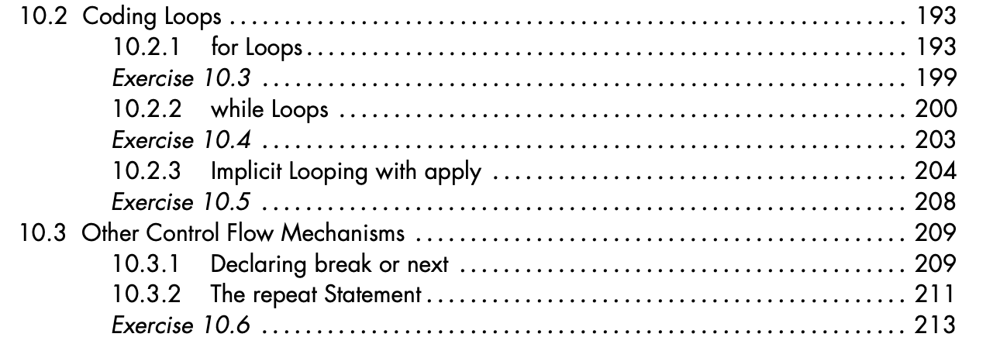
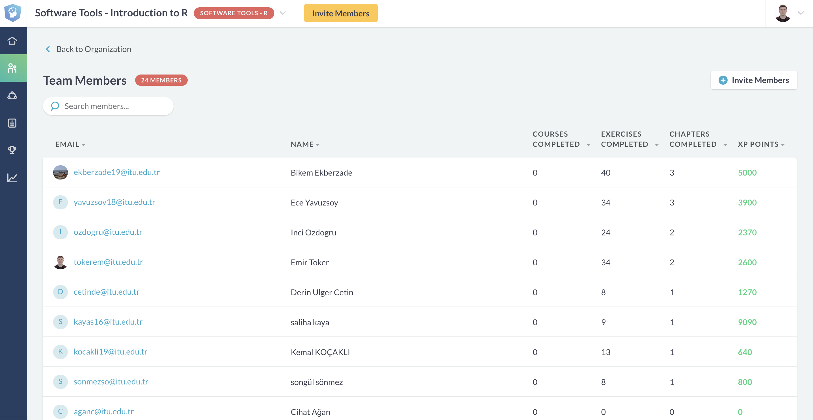

## **R Promgramming - Part 2**

- **Syllabus and Book**
- **DataCamp Class**
- **Practice - R Language**
- **Practice - R Programming**

**Coffee Break**

- **R Programming - *repeat* Loops**
- **R Programming - *while* Loops**
- **R Programming - *for* Loops** 
- **R Programming - *apply* Loops**

**QUIZ**

- **Next Week**

# **Syllabus, Book**
## **Syllabus**

## **Book**

## Homework-1 and Midterm Project 

**?**

# **DataCamp Class**
## **DataCamp Class**

## **DataCamp Class**

`(1$ = 5,75 TL)`

29$ `*` 5,75 TL `*` 6 Months `*` 1 Student= **833,75 TL** 

833,75 TL `*` 25 Students = **20.843,75 TL** 

# **Practice - R Language**
## **Practice - R Language**

**Objectives**

- Manage Working Directory

- Find the Data

- Read Data with **utils** (R utility functions)

## **Practice - R Language**

[LINK](https://emirtoker.github.io/Software_Tools_R_Github/r_programming.html)

# **Practice - R Programming**

## **Practice - R Programming**

**Objectives**

- Identify the Data

- Indexing 

- Use Condition Statements

- Plot

## **Practice - R Programming**

[LINK](https://emirtoker.github.io/Software_Tools_R_Github/r_programming.html)

# **R Programming - Loops**

## **R Programming - Loops**

Loops are R’s method for repeating a task, which makes them a useful tool for programming simulations. 

## **R Programming - Loops**

[LINK](https://emirtoker.github.io/Software_Tools_R_Github/r_programming.html)

# **QUIZ**
## **QUIZ**

# **Next Week**
## **Next Week**

- QUIZ - Seriously
- Homework - 2 (read and plot)
- Homework - 3 (if, for, function)
- DataCamp Assignments

- Elementery Statistics

