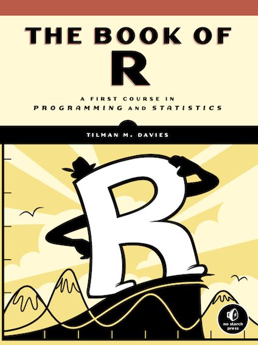
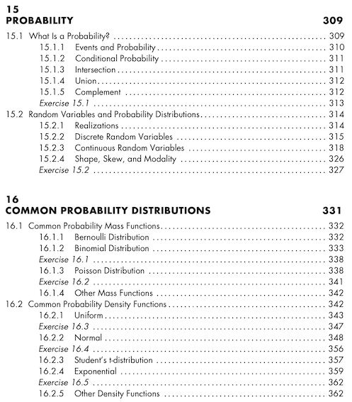
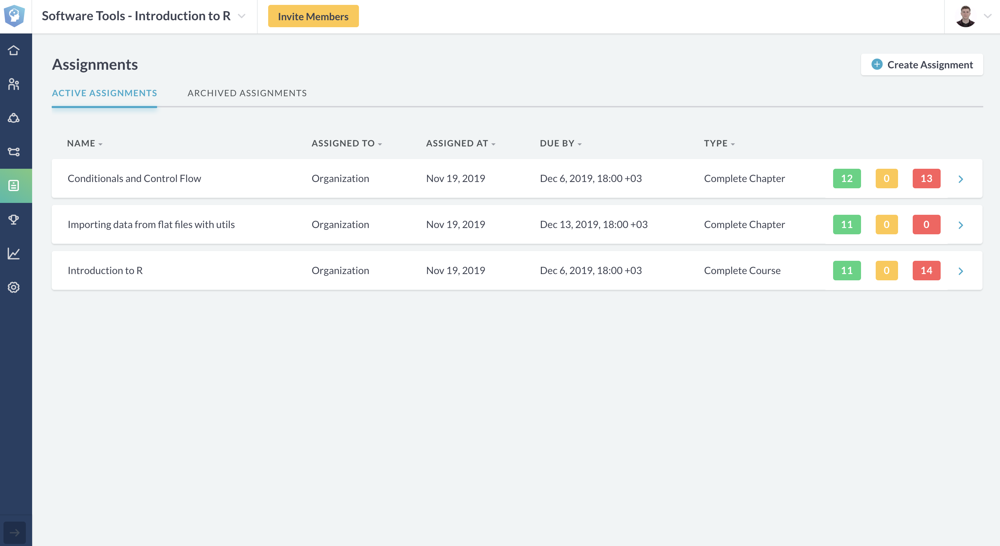

## **R Probability**

- **Syllabus and Book**
- **DataCamp Class**
- **Additional Course**
- **R - Common Probability Distributions**
- **Practice** : Write A Function for outliers

**Coffee Break**

- **R - NETCDF**

**QUIZ**

**Next Week**

# **Syllabus and Book**
## **Syllabus and Book**

## **Book**

 

# **DataCamp Class**
## **DataCamp Class**

[LINK](https://www.datacamp.com/enterprise/software-tools-introduction-to-r/assignments)

# **Additional Course**

## **Additional Course**

[LINK](https://emirtoker.github.io/Software_Tools_R_Github/additional_course.html)

# **R - Common Probability Distributions**

## **R - Common Probability Distributions**

#**Coffee Break**

# **R - NETCDF**

## **R - NETCDF**

# **QUIZ**

## **QUIZ**

(https://kahoot.it/)

# **Next Week**

