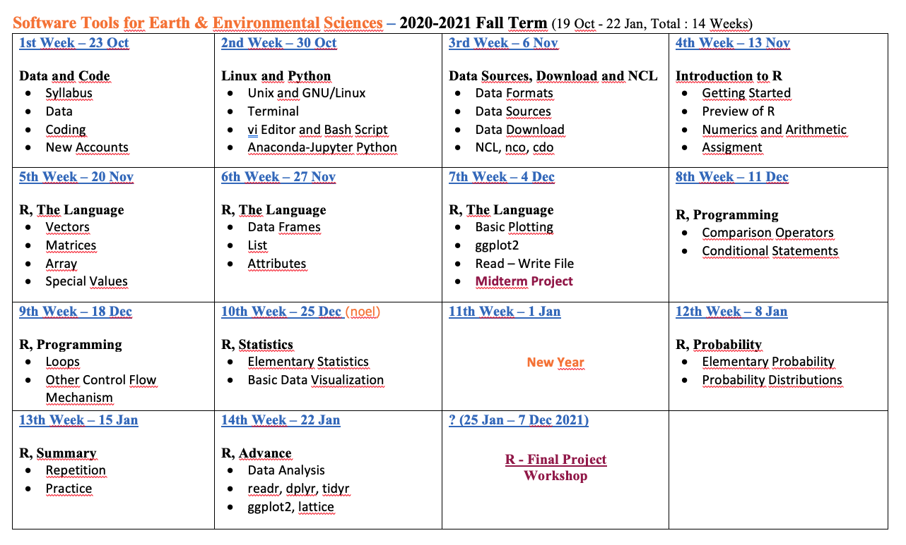
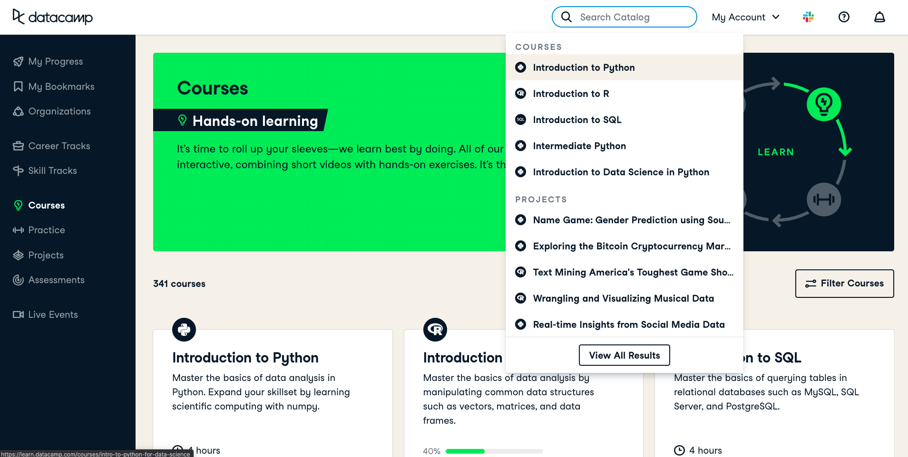

```{r, echo=FALSE}
knitr::opts_chunk$set(error = FALSE)
```

```{r, include = FALSE}
knitr::opts_chunk$set(echo = FALSE)
```


## **Linux and Python**

- **Syllabus, Book and WebPage**

- **Unix, Gnu and Gnu/Linux**

- **Terminal**

- **Basic GNU/Linux Commands**

- <span style="color:purple">**Quiz**</span>

- **Python and Jupyter**

- **Next Week**


# **Syllabus, Book and WebPage**


## **Syllabus**




## **Syllabus**


## **Syllabus**


## **Extended Syllabus**


Extended Syllabus [PDF](https://web.itu.edu.tr/~tokerem/Software_Tools_for_Earth_and_Environmental_Science_Syllabus_2020_21_Fall.pdf)

## **Book**


The Book of R - [PDF](https://web.itu.edu.tr/~tokerem/The_Book_of_R.pdf)

## **WebPage**


Course Home Page [LINK](https://emirtoker.github.io/Software_Tools_R_Github/index.html)

Week 1 - Presentation [LINK](http://rpubs.com/emirtoker/software_tools_week1)

## **Good News**


DataCamp - [LINK](https://learn.datacamp.com/)

## **DataCamp**



## **DataCamp**


## **The Value of DataCamp Class**

- 1 $ -> 8 TL

- Standard -> 12$ / month

- Course -> 6 month

- People -> 30


8 TL * 12$ * 6 month * 30 people

**17.280 TL**


## **DataCamp**


Filtered course for R -> 147 courses

We will have new assignments


# **Unix, Gnu/Linux and Terminal**

## **Unix, Gnu/Linux and Terminal**

- **What is Unix?**
- **What is GNU?**
- **What is Linux (or GNU/Linux) ?**
- **How is Unix different from Linux?**
- **GNU/Linux Distributions**
- **Terminal**
- **Basic GNU/Linux Commands**
- Practice and Quiz

[Web Link](https://emirtoker.github.io/Software_Tools_R_Github/unix_linux.html)


# **Python and Jupyter**


## **Python and Jupyter**

- **What is the Python**
- **Python in Terminal**
- **What is the Anaconda/Jupyter**
- **Python in Anaconda/Jupyter**

[Web Link](https://emirtoker.github.io/Software_Tools_R_Github/unix_linux.html)

# **Next Week**

## **Next Week**

- Data Fortmats, Sources and Download

- NCL, nco, cdo


