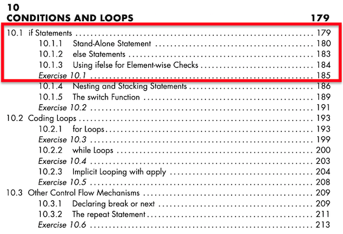
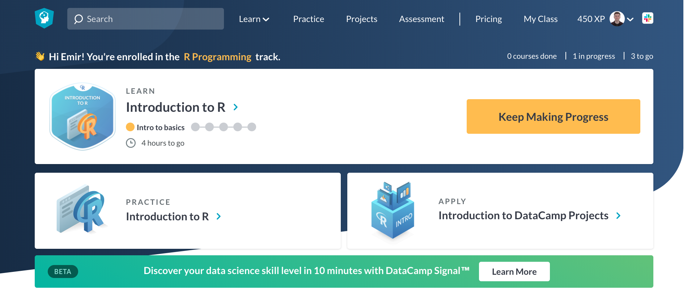
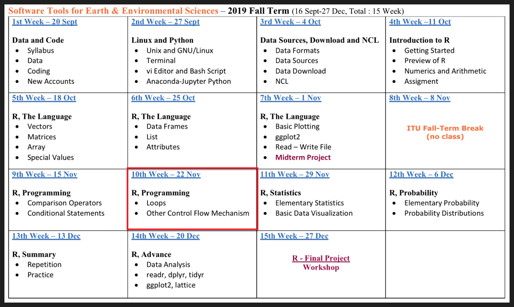

```{r, echo=FALSE}
knitr::opts_chunk$set(error = FALSE)
```

```{r, include = FALSE}
knitr::opts_chunk$set(echo = FALSE)
```


## **R Promgramming - Part 1**

- **Syllabus and Book**
- **DataCamp Class**
- **Repeat - R Language**
- **Practice - R Language**
- **Practice - Create a Function**

<span style="color:brown">**Coffee Break**</span>

- **R Programming - Conditions**
     - Comparison Operators
     - ***if*** Statement
     - ***else*** Statement
     - ***ifelse*** Statement

- **Next Week**

<span style="color:brown">**(Optional)**</span> <span style="color:brown">**Practice - MidTerm Project**</span>


# **Syllabus and Book**


## **Syllabus**


Extended Syllabus [PDF](https://web.itu.edu.tr/~tokerem/Software_Tools_Syllabus.pdf)

## **Book**

 

[PDF](https://web.itu.edu.tr/~tokerem/The_Book_of_R.pdf) - (179 - 185)


# **DataCamp - Class**

## **DataCamp**




[Home](https://www.datacamp.com/home) & [Info-Class](https://emirtoker.github.io/Software_Tools_R_Github/datacamp.html)


# **R Language - Repeat**

## **R Language - Repeat**

 - **Create/Open R Project or R File**
 - **Basic Math, Assigment, Comment**
 - **Data Types - Classes**
     - Numeric
     - Integer
     - Logical
     - Character
 - **Data Structures - Objects**
     - Vector
     - Matrice
     - Array
     - Data Frame
     - List
 - **Special Values, Attributes**
    
## **R Language - Repeat**

[LINK](https://emirtoker.github.io/Software_Tools_R_Github/r_language.html)

# **R Programming - Conditions**

## **R Programming - Conditions**

<style>

.column-right0{
  float: right;
  width: 50%;
  text-align: right;
}
.column-left0{
  float: left;
  width: 50%;
  text-align: left;
}
</style>

<div class="column-left0">

- **Comparison Operators **
    - equal (**==**)
    - not equal (**!=**)
    - greater or equal to (**>=**)
    - lower or equal to (**<=**)


- **Logical Operators **
    - the and operator (**&**)
    - the or operator (**|**)
    - the not operator (**!**)

- ***if*** (Stand-Alone) Statement
- ***else*** Statement
- ***ifelse*** Statement

</div>


<div class="column-right0">

```
TRUE & TRUE  
TRUE & FALSE
TRUE | FALSE 
!TRUE

2 == 3
5 < 6

c(1,4) >= 6

9 != 8

5 < 6 & 9 != 8
```
```
score <- 80
exam_no <- 2

score >= 75 | exam_no == 1

score>=75 & score<90 | exam_no==1
```
</div>


## **R Programming - Conditions**


[LINK](https://emirtoker.github.io/Software_Tools_R_Github/r_programming.html)


# **Next Week**

## **Next Week**


Conditions and Loops, DataCamp

# <span style="color:brown">**(Optional) Practice - MidTerm Project**</span>


