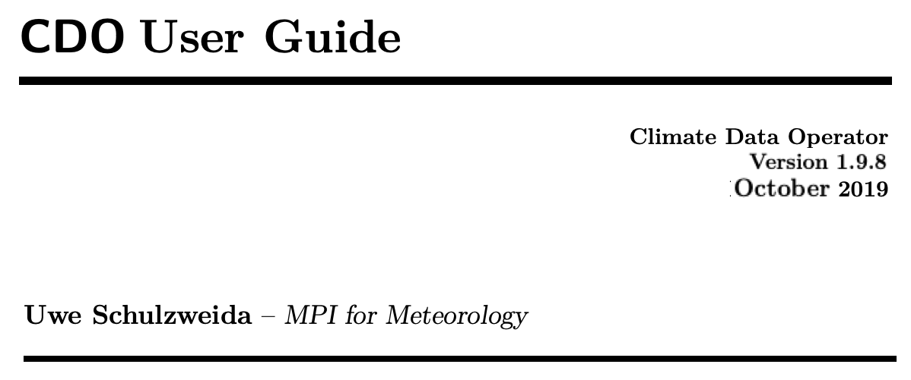
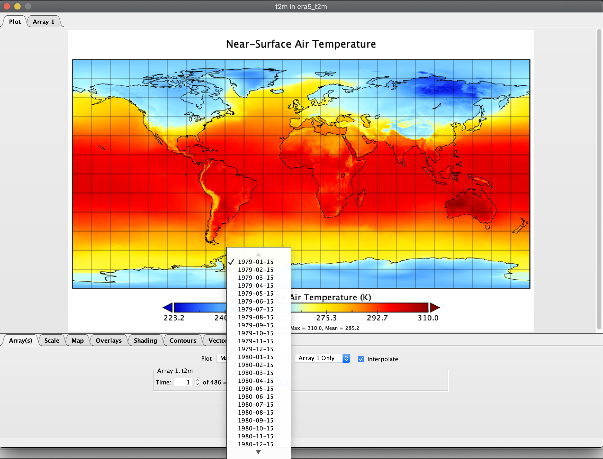
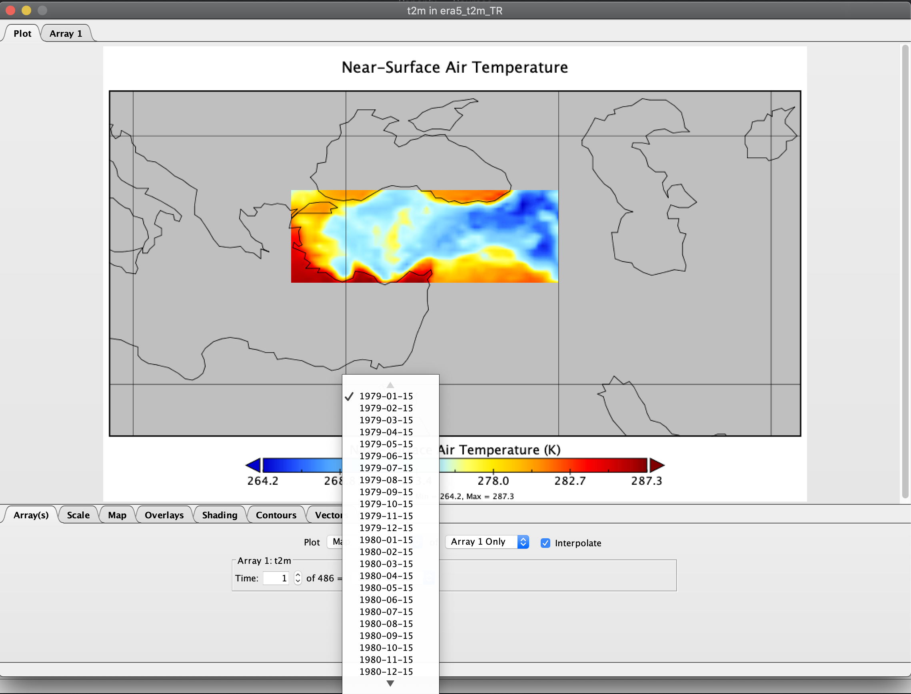
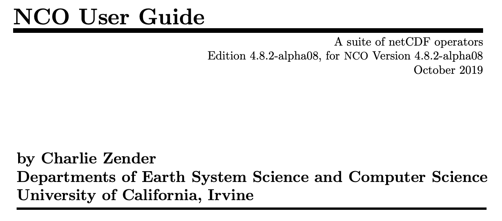
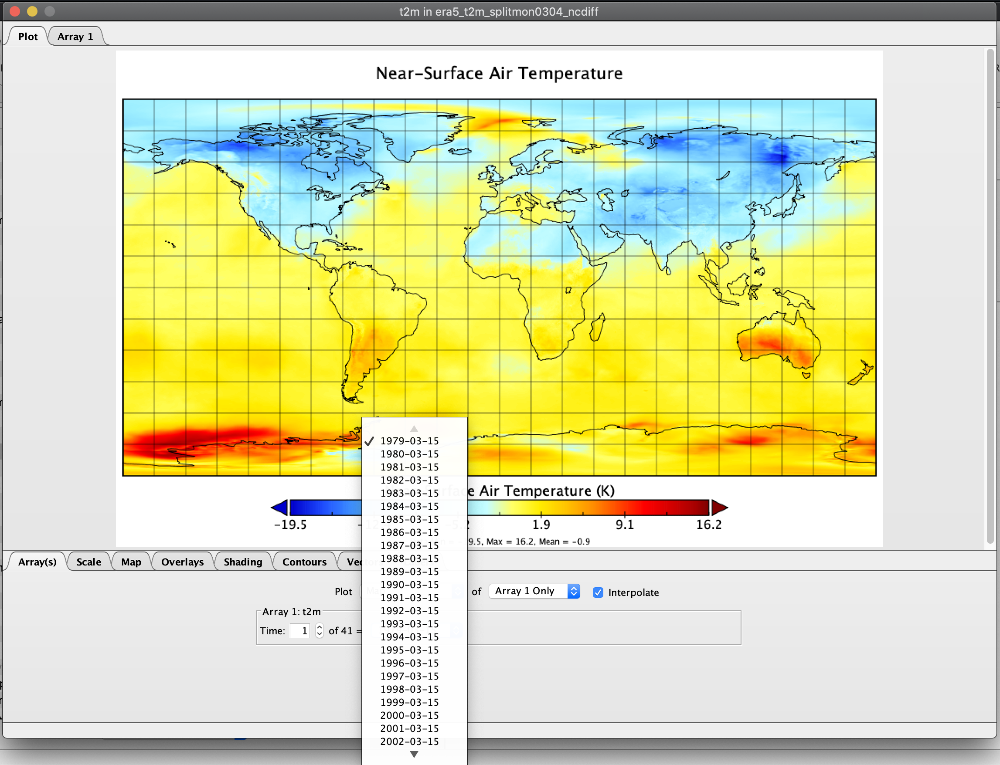
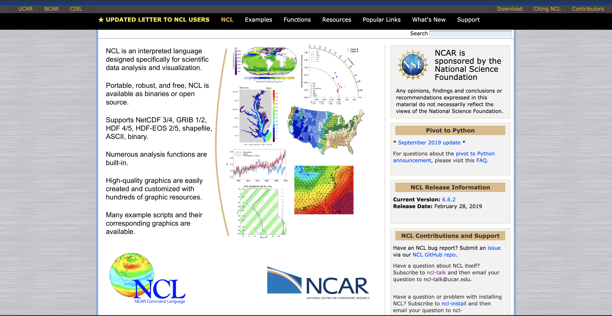
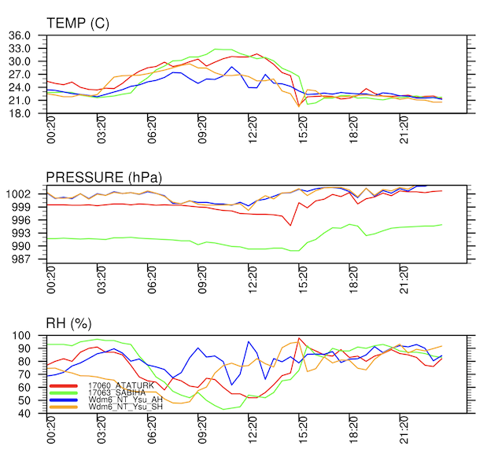
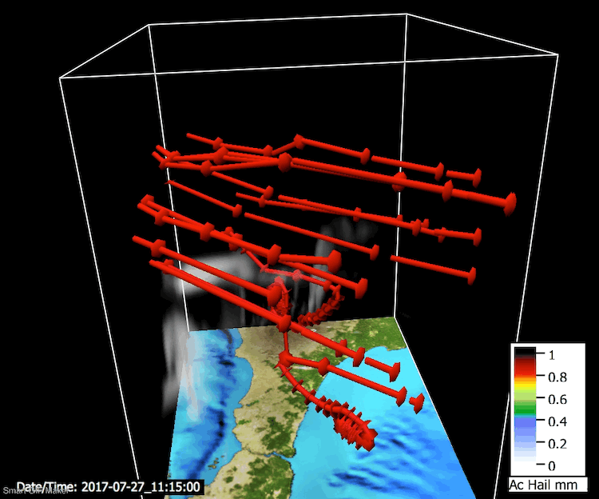

***

  - cdo
  - nco
  - NCL
  
***

### **cdo**

*Climate Data Operator*

2019-06-13: 1.9.7



[LINK](https://code.mpimet.mpg.de/projects/cdo/embedded/cdo.pdf)


***

### **cdo**

```
era5_t2m.nc
```




***

### **cdo**

```
cdo yearmonmean era5_t2m.nc era5_t2m_yearmonmean.nc
era5_t2m_yearmonmean.nc
```


***

### **cdo**

```
cdo splitmon era5_t2m.nc era5_t2m_splitmon
era5_t2m_splitmon10.nc
```


***

### **cdo**

```
cdo sellonlatbox,26,-45,36,42 era5_t2m.nc era5_t2m_TR.nc
era5_t2m_TR.nc
```




***

### **cdo**

```
cdo seasmean era5_t2m.nc era5_t2m_seasmean.nc
era5_t2m_seasmean.nc
```


  
  
  
  
  
  
  
  
  
  
  
  
  
  
  
  
  
  
***

### **nco**

*netCDF Operator*

2019 Jul 01: 4.8.1 



[PDF](http://nco.sourceforge.net/nco.pdf)


***

### **nco**

```
ncdiff era5_t2m_splitmon03.nc era5_t2m_splitmon04.nc era5_t2m_splitmon0304_ncdiff.nc
era5_t2m_splitmon0304_ncdiff.nc
```




***

### **NCL**

*NCAR (National Center for Atmospheric Research) Command Language*




[LINK](https://www.ncl.ucar.edu/)


***

### **NCL**


***

### **NCL**




***

### **NCL**


***

### **NCL - Vapor**




***

### **BONUS - ncview**

*netCDF visual browser*


[LINK](http://meteora.ucsd.edu/~pierce/ncview_home_page.html)
  

***