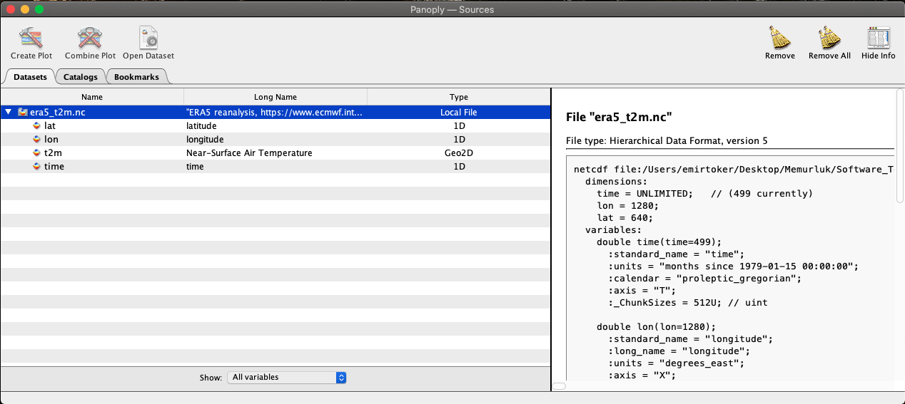
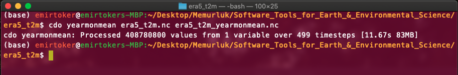
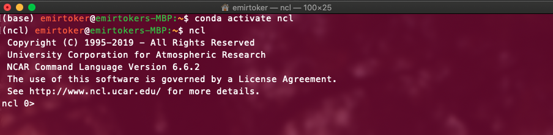
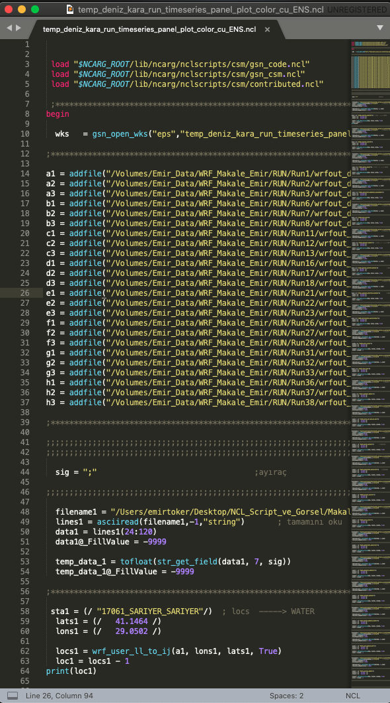
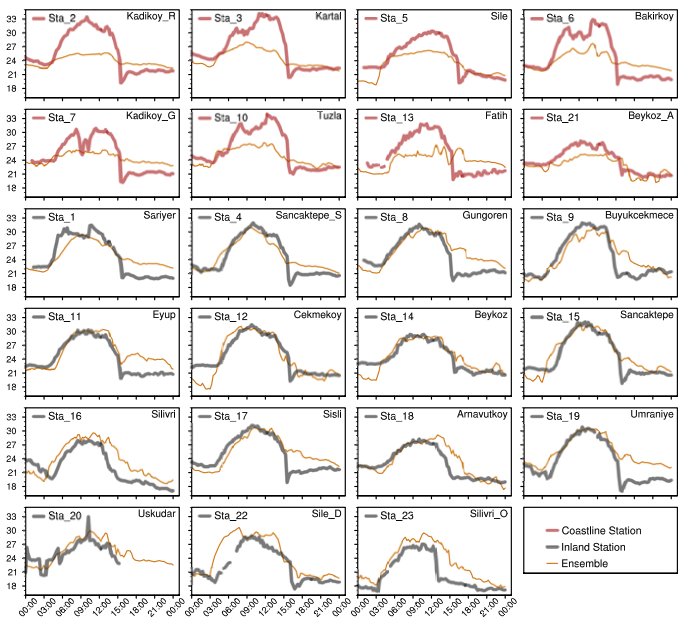

***

Operators (like Packages)

  - cdo
  - nco
  
Language

  - NCL
  

***

### **Panoply ?**




I have downloaded ERA5 2m-Temperature already.

***

### **Panoply**

```
era5_t2m.nc
```


***

### **era5_t2m**

I want to  

  - Calculate the mean of all months of each year separately
  
  - Split the data as 12 different files for all months
  
  - Cut/Crop the Turkey from global file
  
  - Calculate the mean of all seasons of each year separately


- Differences between two files

Normally I should use a programming language to open, read and manipulate the data like R, Python, NCL or etc.


***

### **cdo**

*Climate Data Operator*

2019-10: 1.9.8


[LINK](https://code.mpimet.mpg.de/projects/cdo/embedded/cdo.pdf)


***

### **cdo**

- Calculate the mean of all months of each year separately:
**yearmonmean**

- Split the data as 12 different files for all months: **splitmon**

- Cut/Crop the global file for just Turkey: **sellonlatbox**

- Calculate the mean of all seasons of each year separately: **seasmean**

***

### **cdo**

You can use it in Terminal or Python. (Download it with Anaconda or Cygwin)





***

### **cdo**

```
era5_t2m.nc
```


***

### **cdo**

```
cdo yearmonmean era5_t2m.nc era5_t2m_yearmonmean.nc

era5_t2m_yearmonmean.nc
```


***

### **cdo**

```
cdo splitmon era5_t2m.nc era5_t2m_splitmon

era5_t2m_splitmon10.nc
```


***

### **cdo**

```
cdo sellonlatbox,26,-45,36,42 era5_t2m.nc era5_t2m_TR.nc

era5_t2m_TR.nc
```


***

### **cdo**

```
cdo seasmean era5_t2m.nc era5_t2m_seasmean.nc

era5_t2m_seasmean.nc
```


  
  
  
  
  
  
  
  
  
  
  
  
  
  
  
  
  
  
***

### **nco**

*netCDF Operator*

2020 Nov: 4.9.6 


[PDF](http://nco.sourceforge.net/nco.pdf)


***

### **nco**

```
ncdiff era5_t2m_splitmon03.nc era5_t2m_splitmon04.nc era5_t2m_splitmon0304_ncdiff.nc
era5_t2m_splitmon0304_ncdiff.nc
```


***

### **NCL**

*NCAR (National Center for Atmospheric Research) Command Language* - [LINK](https://www.ncl.ucar.edu/)


***

### **NCL**

You can use it in Terminal and Python ( also download with Anaconda)




***

### **NCL + Sublime Text**


***

### **NCL**

{ width=20% } { width=58% }


***

### **NCL**

{ width=20% } { width=58% }


***

### **NCL - Vapor**


***

### **BONUS - ncview**

*netCDF visual browser*


[LINK](http://meteora.ucsd.edu/~pierce/ncview_home_page.html)
  

***