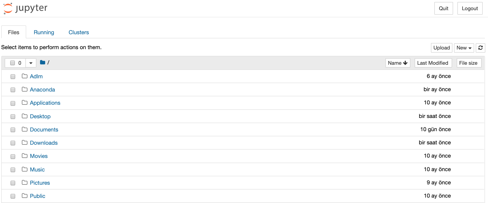

***

# **Python and Jupyter**

***

### **What is the Python**

- Python is a programming language.
- Created by Guido van Rossum and first released in 1991.
- Python 2.0, released 2000, Python 3.0, released 2008.
- Python 2.7, the last release in the 2.x series, was extended to 2020.


***
### **Python in Terminal**

[webminal.org](https://www.webminal.org/terminal/)


GCC : GNU Compiler Collection


***
### **What is the Anaconda/Jupyter**


***
### **Python in Anaconda/Jupyter**


```
jupyter notebook
```



