***

# **R and RStudio**


***

- What is R?
- R History
- R and CRAN
- What is RStudio?
- RStudio Products
- Fields of Usage

***

### **What is R?**

R is a **language**. It is a free software environment for statistical computing and graphics.

 

It is a **GNU project**.

UNIX, Windows and MacOS

*R version 3.6.1 has been released on 2019-07-05*

***

### **R History**

- **Bell Laboratories** are used for industrial research and scientific development.
- **S** is a statistical programming language, by John Chambers, Bell Laboratories, New Jersey, 1975–1976.
- **R** was created by **R**oss Ihaka and **R**obert Gentleman, (statisticians), **GNU** public license, the University of Auckland, New Zealand, 1992.

 

/
*Powerful but cheap graphics*
- *R Core Team*
- *Open Sources*
/

***

### **Milestones of R**

- 1991 - Statistical Models in S (White Book) was published.
- 1997 - The oldest R source was released on The Comprehensive R Archive Network (CRAN).
- 1997 - 3 mirrors and 12 packages.
- 1997 - R becomes an official part of the GNU Project.
- 1999 - "*update.packages*" and "*install.packages*" functions.
- 2001 - The first version for Mac OS X.
- 2010 - Support for Windows 64 bit systems.
- 2013 - Support for numeric index values 2^31 and larger on 64 bit systems.
- 2017 - Just-in-time compilation (JIT) of functions and loops (10 to 20 times faster).

*almost 20 years, and more than 10,000 R packages*

***

### **R Download and CRAN**

R Homepage - [LINK](https://www.r-project.org/)

The Comprehensive R Archive Network (CRAN) - [LINK](https://cran.r-project.org/mirrors.html)


*please choose a location close to you*


***

### **R Download and CRAN**

Turkey - Middle East Technical University Northern Cyprus Campus, Mersin - [LINK](https://cran.ncc.metu.edu.tr)

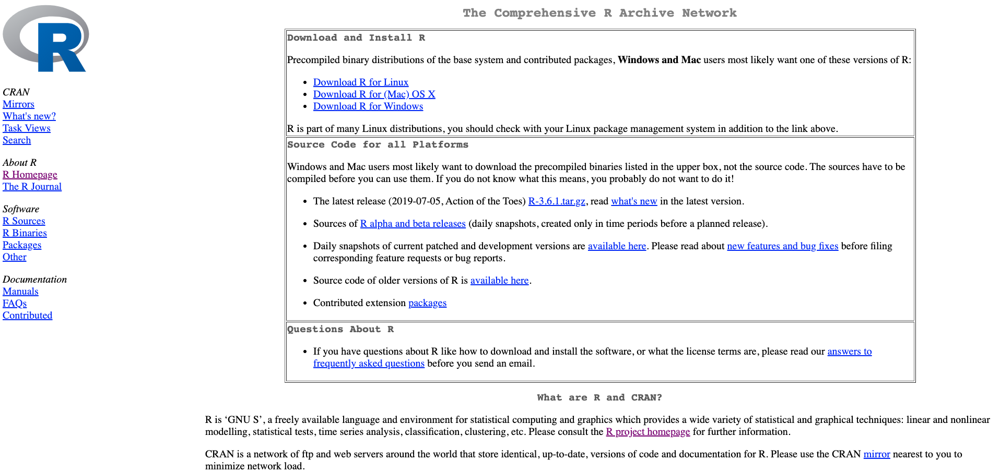


***

### **R**

 


***

### **What is RStudio**

An **Integrated Development Environment (IDE)** for R.


**RStudio Desktop** and **RStudio Server**

- *Developer(s) : RStudio, Inc.*
- *Initial release :	28 February 2011*
- *Stable release : 1.2.5001 / 19 September 2019*
- *Written in : Java, C++, JavaScript*


***

### **RStudio Desktop**


***

### **RStudio Server**

R studio anywhere using a web browser https://rstudio.cloud/


***

### **Other RStudio Products**


[https://rstudio.com/](https://rstudio.com/)

***  ### **RStudio Desktop Download**


Download [LINK](https://rstudio.com/products/rstudio/download/)


***

### Any Problem About Installation ?


***

## **Fields of Usage**


- **Data analysis**
    - Interpretation
    - Visualization
    - Manipulation

- **Statistical techniques**
    - Linear and nonlinear regression (or modelling)
    - Classical statistical tests
    - Time-series analysis
    - Classification and Clustering 
    - Correlation Analysis
    - etc.


***

### **Interpretation**

The process of making sense out of a collection of data.


***

### **Visualization**

Data visualization is the graphical representation of information and data.


***

### **Visualization**


*storms*


***

### **Manipulation**

The process of changing data to make it easier to read or be more organized.


*R dplyr scheme*


***

### **Linear and nonlinear Regression (or Modelling)**

Linear functions are those whose graph is a straight line.

y = f(x) = a + bx

Regression is a statistical method used to create a model.


***

### **Classical statistical tests**

Describe the distribution of data and to determine the reliability of a sample drawn from a population.

 

***Statistical significance tests** is used to inform judgments regarding whether the hypothesis is false or not false*


***

### **Time-series analysis**

Time series is a series of data points in which each data point is associated with a timestamp.

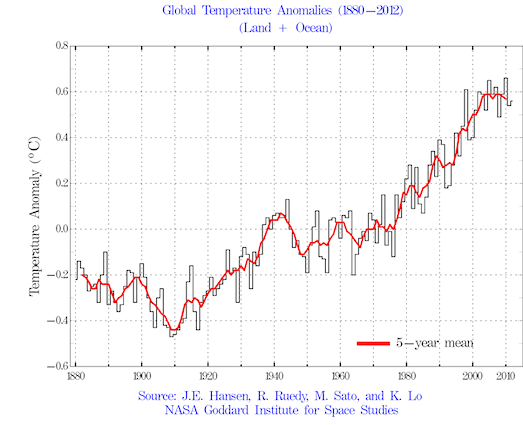


***

### **Classification and Clustering**

Classification and Clustering are characterize objects into groups by one or more features. 


***Classification** is used in a supervised learning technique which include predefined properties. **Clustering** is used in unsupervised learning based on group properties.*


***

### **Correlation analysis**

The measure of the strength and direction of the linear relationship between two variables.


***

### **Fields of Usage**

- **Facebook** – Update status and social network graph.
- **Google** – Calculate Return on Investment (ROI), predict the economic activity, improve the efficiency of online advertising.
- **New York Times** – Prepare graphics before printing.
- **Twitter** – R is part of Twitter’s Data Science toolbox for sophisticated statistical modeling.


***

## **Preview of R Course**

- A Scientific Calculator 

- Classes and Data Structures 

- Create and Manipulation Data

- Reading, Writing and Plotting Data

- R Programming Structure

- Statistics and Probability

- Data Analysis Packages


***

## **Getting Started**

- Using the RStudio

- R for Basic Math

- Assigning Objects

- Comments


***

### **Open Your RStudio**


***R*** You Ready ?!


***

## **Using the RStudio**

 - Preferences
 - Project
 - File
     - Script
 - Undo, Redo, Replace and Find
 - Tools - New Terminal
 - View/Show Screens

***

### **Preferences**
*RStudio - Preferences - Appearance - Editor Theme*


***

### **New Theme**

*Functions, Parentheses, Quotation Marks  - Material*


***

### **Project**

*File - New Project*

*Don't Save Current Workspace - New Directory*


***

### **Project**

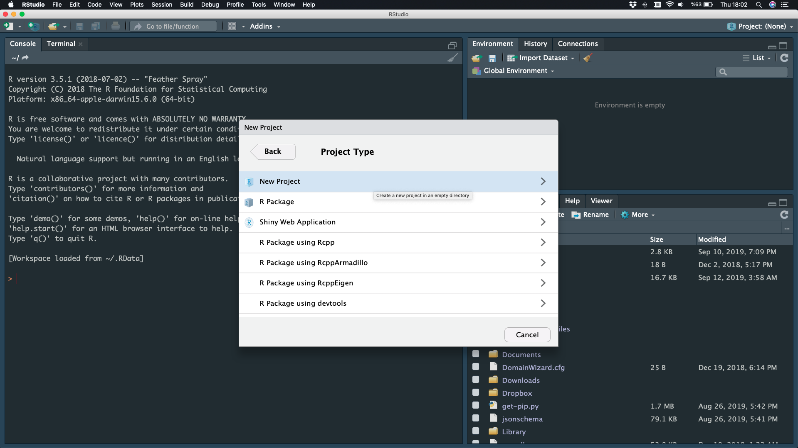


*New Project*


***

### **Project**

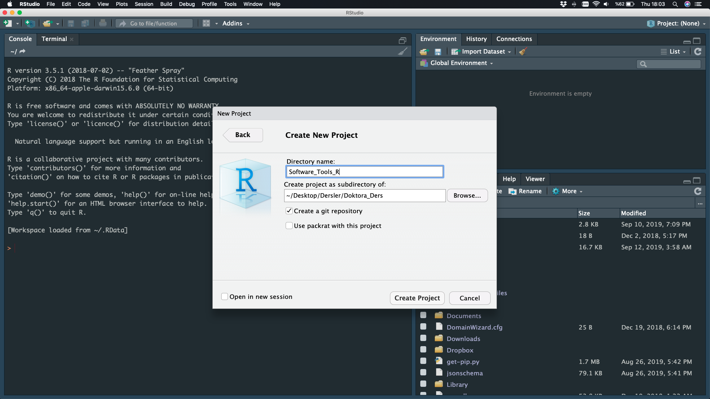

Directory Name - Create Project


***

### **NEW Project is Ready**

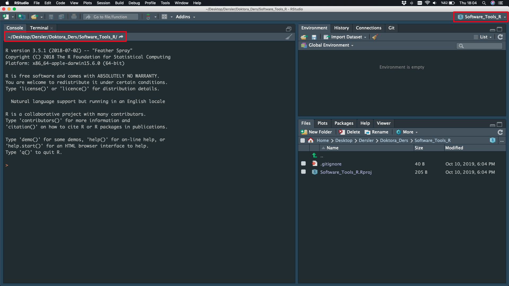


***

### **File**

*File - New File - Script*


***

### **File**

*File - New File - Script*


***

### **Undo, Redo, Replace and Find**

*Edit*

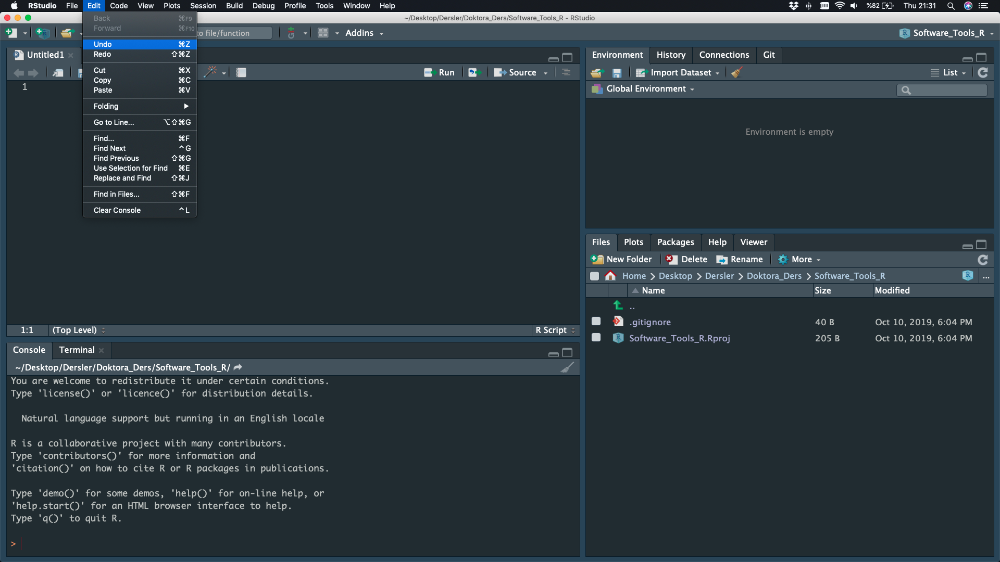

***

### **Tools - New Terminal**

*Tools - Terminal - New Terminal*

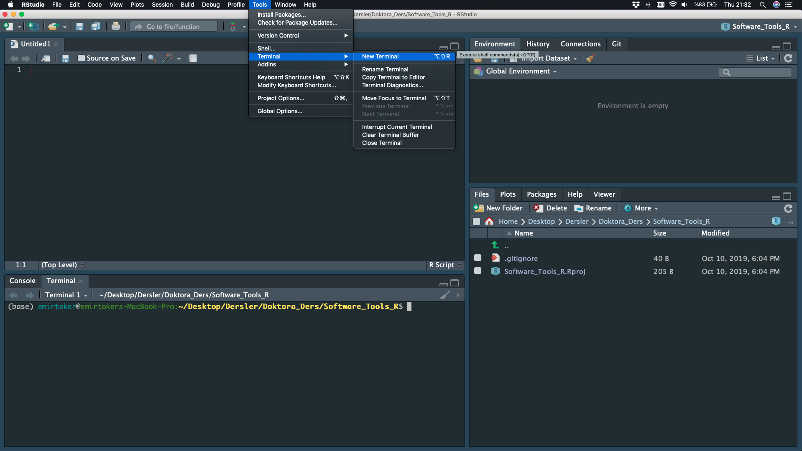


    
***

### **View/Show Screens**

*View - Zoom and Show ...*


***

### **Script**

*Save, Run*

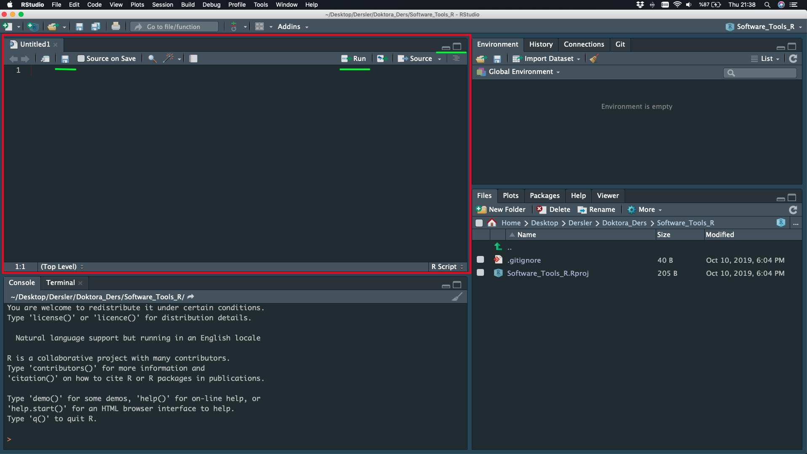

***

### **Environment**

*Save, Import Dataset, Clean*

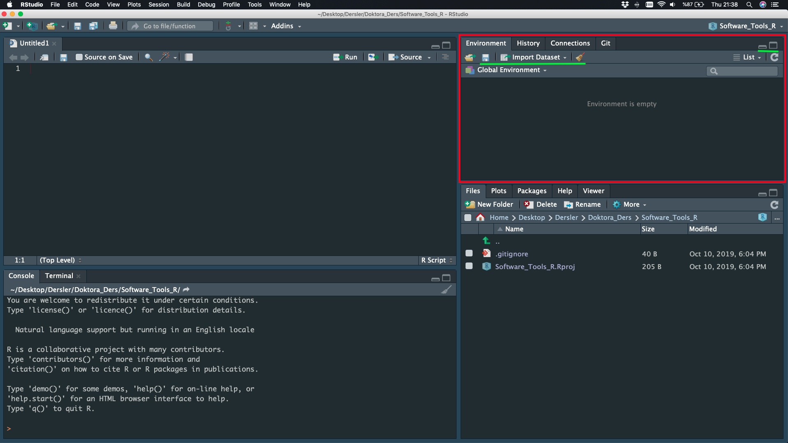

***

### **History**

*Save, Remove, Clean*


***

### **Console**

*Working Directory, Commands, Clean*


***

### **Files**

*New Folder, Delete, Rename, Copy*


***

### **Plot**

*Before, Zoom, Export, Remove, Clean*


***

### **Packages**

*Install, Update*


***

### **Help**

*Topic / Word Search*


***

## R for Basic Math

addition (**+**),
subtraction (**-**),
multiplication (**`*`**),
division (**/**)

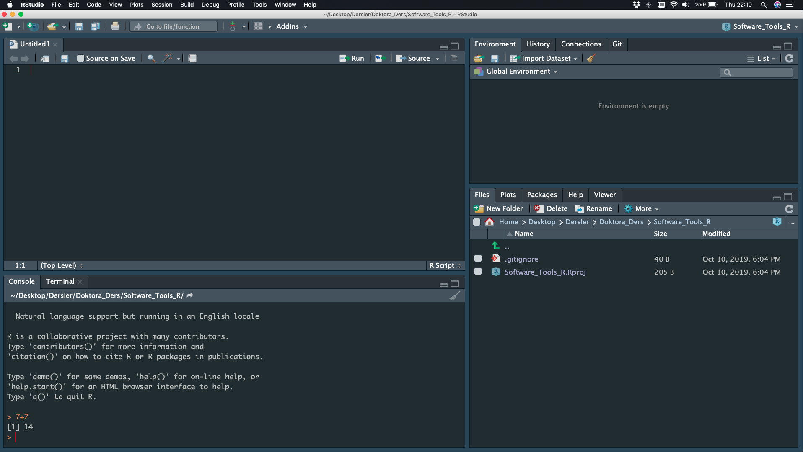


***

### R for Basic Math

25 **`*`** 4 **+** 9 **/** 3 **-** 56


***

## Assigning Objects

The assignment arrow (**<-**)


***

## Comments

How to tell R to ignore a part of your code? (**#**)


***

### Comments

- Help yourself and other people to reading the code and understand it faster:

```
# This code will calculate the likelihood that it will rain tomorrow

  complicated_rain_calculation_for_tomorrow()
```

- Ignore a line of code and see how a program will run without it:

```
# value <- old_code()

  value <- new_code()
```

## Save Your Script

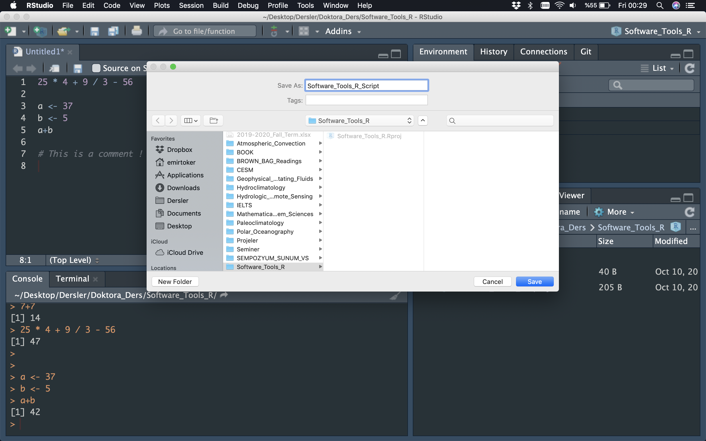


***

## SUMMARY

- R is a language

- RStudio is an interface

- Script is a passive text

- Console is an interactive decoding area

- Math is pre-defined

- Assigment arrow ***<-***

- Comments (hashtag) ***#***


***

## **R Files**


***

### **R Script**

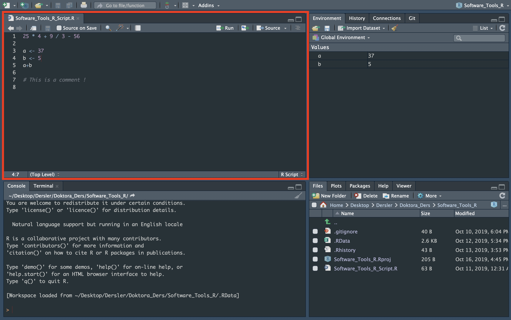

***

### **R Notebook**


***

### **R Notebook**


***

### **R Notebook - HTML**


***

### **R Notebook - PDF**


***

### **R Notebook - WORD**

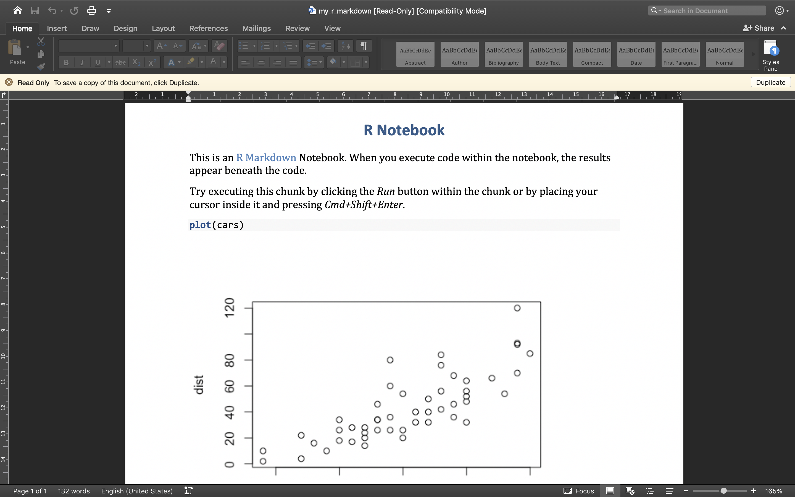


***

### **R Markdown**


***

###**BONUS - R Shiny**


***

### **BONUS - R Shiny**


[LINK](https://emir-toker.shinyapps.io/R_Interactive_Training_and_Quiz/)


***

### **BONUS - R HTML**

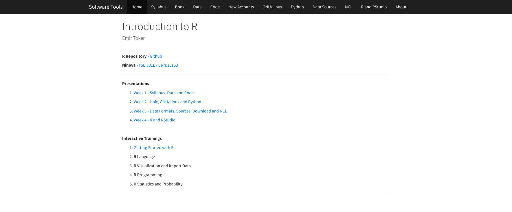

[LINK](https://emirtoker.github.io/Software_Tools_R_Github/index.html)


***

### **Your R Notebook**

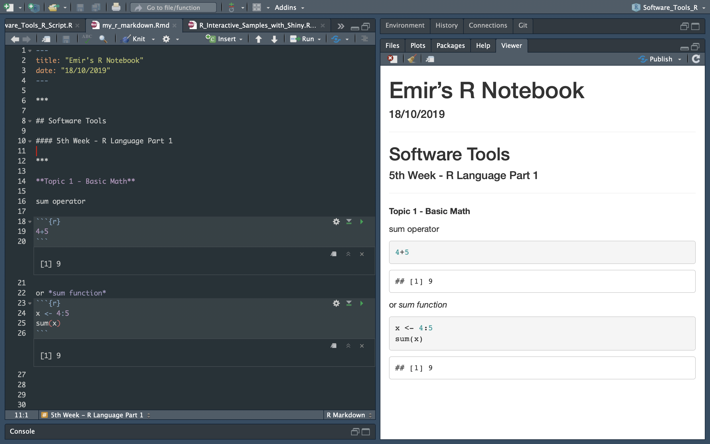

***


