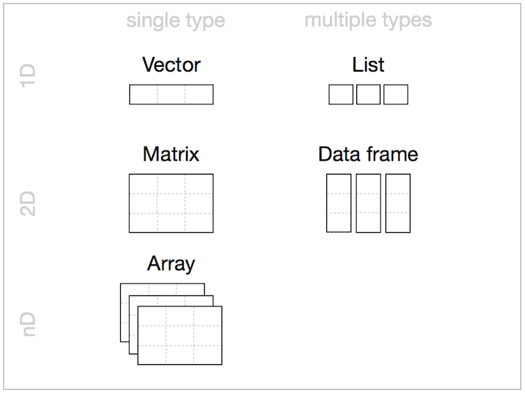
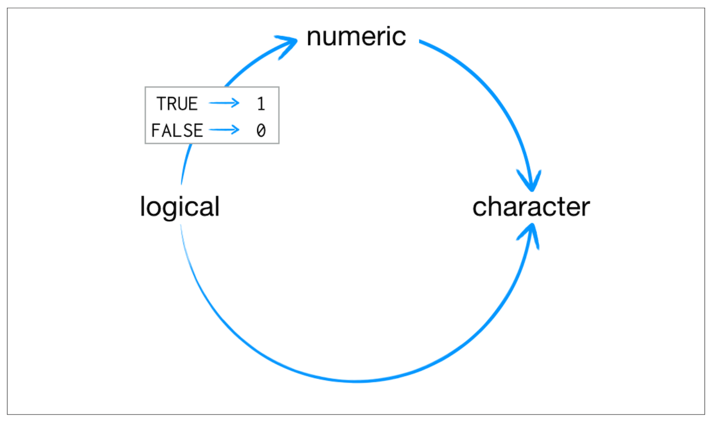
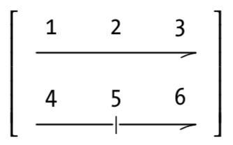
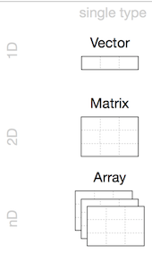

***

- Scientific Calculator

- Class

- Vectors 

- Matrices

- Arrays


***

### **Scientific Calculator**

**?Arithmetic** or **help("Arithmetic")**

- **^** *(exponentiation)*
- **sqrt** *(the square root)*
- **log** *(logarithm)*
- **exp** *(exponential)*
- **D** *(derivative)*
- **integrate** *(integration)*
- **sin** *(sinus)*
- **cos** *(cosinus)*
- **sum** *(sum)*
- **mean** *(mean)*

*example(integer)* , *demo(graphics)*


***

### **Scientific Calculator**

```{r}
2+3
14/6
14/6+5
14/(6+5)
3^2
2^3
sqrt(x=9)
sqrt(x=5.311)
```

***

### **Scientific Calculator**


```{r}
f <- expression(x^2+3*x)    # you can check ?expression
D(f,'x')                    # Calculate (first) derivative of f 
                               # with respect to x
```


***

### **Class**

- Data Structures
- Data Types


***

### **Data Structures (R-Objects)**

- (Atomic) Vectos
- Matrices
- Array
- Data Frame
- List


***

### **Data Structures (R-Objects)**

 

***

### **Data Structures (R-Objects)**


- **Homogeneous**: Vector(1d), Matrix(2d), Array(nd)
- **Heterogeneous**: List(1d**?**), Data frame(2d)


***

### **Data Types**

- Numeric (Double)
- Integer
- Complex
- Logical
- Character
- Special Values
- Date/Time

*Variables are defined with different data types*

**Also**

*Variables are assigned with R-Objects*

**--->** *The data type of the R-object*


***

### **Data Types - Numeric (Double)**

Any number with **(or without)** a decimal point.


```{r}
a <- 3.8
a
class(a)
```
```{r}
b <- 4
b
class(b)
```
```{r}
c <- sqrt(2)
c
class(c)
```
```{r}
d <- 3.5:9.5
d
class(d)
```
```{r}
class(1)
```


***

### **Data Types - Integer**

Kind of a sub-class of the numeric class.

The suffix **L** tells R to store this as an integer.

```{r}
a <- 7
a
class(a)
```
```{r}
b <- 7L
b
class(b)
```
```{r}
c <- 5:9
c
class(c)
```
```{r}
d <- 5.1:9.1
d
class(d)
```
```{r}
class(3.2L)
```


***

### **Numeric and Integer**

pi

sqrt(2)^2-2

- Numeric (64-bit) -> big  memery and calculations

- Integer (32-bit) -> Constant lalues like ID

- 6 digits after decimal

- 16 significant digits


***

### **Data Types - Complex**

Complex: x2 = −1 (imaginary number)

```{r
a <- i   # This will give error
```
```{r}
b <- 1i
b
class(b)
```
```{r
class(1+2i)
class(2iL)
```

try 

```{r}
class(((1i^2)^2))
```
```{r}
is.complex((1i^2)^2)
```
```{r}
isTRUE(is.complex((1i^2)^2))
```
```{r}
(1i^2)^2
```


***

### **Data Types - Logical**

TRUE or FALSE - Logical Operators


- **<**	    *(less than)*
- **<=**	  *(less than or equal to)*
- **>**	    *(greater than)*
- **>=**  	*(greater than or equal to)*
- **==**  	*(exactly equal to)*
- **!=**	  *(not equal to)*
- **!x**	  *(Not x)*
- **x | y**	  *(x OR y)*
- **x & y**	  *(x AND y)*
- **isTRUE(x)**	 *(test if X is TRUE)*


***

### **Data Types - Logical**

```{r}
5 < 9
5 < -9
a <- 5 < -9
class(a)
```
```{r}
1:10
1:10 >= 5
x <- 1:10 >= 5
1:10 < 2
y <- 1:10 < 2
x | y
z <- x | y
z
!z
class(z)
```
```{r}
b <- 4:8
b
c <- 7:11
c
b != c
d <- 5:12
b != d
```


***

### **Data Types - Character**

Data type consists of letters or words. String.

single quotes: ' ... ' or double quotes " ... "

```{r
name <- emir   # This will give an error
```
```{r}
name <- 'emir'
name
class(name)
```
```{r}
a <- 23
a
class(a)
b <- '23'
b
class(b)
```
```{r}
print('hello')
cat('hello')
class(print('hello'))
class(cat("hello"))
```


***

### **Special Values**

Null, Infinity, Not a Number, Not Available

```{r}
NULL   # Null (“empty” entity)
```

```{r}
Inf    # Infinity
class(Inf)
Inf*-9
is.finite(Inf)
1/0
```

```{r}
NaN    # Not a Number
class(NaN)
-Inf+Inf
is.nan(5^(-Inf/Inf))
0/0
```

```{r}
NA    # Not Available (“missing” entity)
class(NA)
```


***

### **Data Types - Date/Time**

```{r}
Sys.Date( ) 
date()
```
```{r}
date <- "2007-06-22"
class(date)
date1 <- as.Date(date)    # Coercion
class(b) 
```
```{r}
date2 <- as.Date("2004-02-13")
date1 - date2
date_difference <- date1 - date2
class(date_difference)
```

```{r
%d    day as a number (0-31)	    01-31
%a    abbreviated weekday         Mon
%A	  unabbreviated weekday       Monday
%m	  month (00-12)               00-12
%b    abbreviated month           Jan
%B	  unabbreviated month         January
%y    2-digit year                07
%Y	  4-digit year                2007
```
```{r}
today <- Sys.Date()
format(today, format="%B %d %Y")
```


***

### **Coercion**




***

### **Coercion**


```{r}
3
class(3)
as.numeric(3)
as.character(3)
as.logical(3)
FALSE
class(FALSE)
as.character(FALSE)
as.numeric(FALSE)
as.numeric(TRUE)
TRUE+TRUE
class(TRUE+TRUE)
```


***

## **Class - Data Structure**


***

### **Data Structures**

- **Vector**
- **Array**
- **Matrix**
- Data Frame
- List


***

### **(Atomic) Vector**

The simplest data structure in R


Vectors are a list-like structure that contain items of the **same** data type.

```{r}
spring_month <- "April"
spring_month
spring_months <- c("March", "April","May","June")
spring_months
class(spring_months)
```

**c** means **“combine”**


***

### **(Atomic) Vector**

```{r}
myvec <- c(1, 3, 1, 42)
a <- 35
myvec2 <- c(3L, 3.45, 1e+03, 64^0.5, 2+(3-1.1)/9.44, a)
myvec3 <- c(myvec, myvec2)
myvec3
```

```{r}
x <- c("all", "b", "olive")
```

**Length** of a vector, *length(vector_name)*
```{r}
length(x)
```
**Indexing** element, *vector_name[element_position]*
```{r}
x[2]
```
**Manipulating** element of vector, *assigning arrow*
```{r}
x[2] <- "b_new"
x
```
**Note**: In R, counting elements start position **1**, not **0**.


***

### **(Atomic) Vector**

```{r}
y <- c( 1.2, 5, "Rt", "2000", 20, 4905)
y [0]
class(y)
y
```

**Sequences**

```{r}
7:16.4
a <- 7:16
a
seq(from=7,to=16,by=3)
seq(50,150,25)
seq(50,149,25)
seq(from=3,to=27,length.out=40)
```


**Round**

```{r}
3/2
round(3/2)
round(5.1)
round(pi)
```

***

### **(Atomic) Vector**

**Repetition**

```{r}
rep(x=1, times=4)
rep(x=c(3, 62, 8),times=3)
rep(x=c(3, 62, 8),times=3,each=2)
```

**Sorting**

```{r}
sort(x=c(2.5, -1, -10, 3.44))    # decreasing=FALSE (default)
sort(x=c(2.5, -1,- 10, 3.44), decreasing=TRUE)
```

**Random - Uniform Distribution**

```{r}
runif(15, min = 20, max = 45)
runif(15, 20, 45)
runif(25, 60, 50)
```

**Random variable can be saved**
```{r}
set.seed(1)
runif(15, 20, 45)
```


                        
***

### **Matrices**

Vectors indexed using two indices instead of one.

 

```{r}
n <- runif(9,1,100)    
n
matrix(n, nrow = 3, ncol = 3)

n2 <- runif(10,1,100)    
matrix(n2, nrow = 3, ncol = 3)
```


***

### **Matrices**

```{r}
x <- as.numeric(seq(10,120,10))
mx <- matrix(x,3,4)                  # n, nrow, ncol
mx
class(mx)
class(mx[1])
typeof(mx)
```

```{r}
mx[1,]
mx[,2]
mx[,2:4]
mx_new <- mx[,2:4]
mx
mx[2,3] <- "rose"
mx
class(mx)
typeof(mx)

mx_new <- as.numeric(mx)
mx_new
class(mx_new)
typeof(mx_new)
```


***

### **Matrices**

 

```{r}
m_mycol <- matrix(c(1, 2, 3, 4, 5, 6),
               nrow = 2,
               ncol = 3,
               byrow = FALSE)       # Default
m_mycol 

m_byrow <- matrix(c(1, 2, 3, 4, 5, 6),
               nrow = 2,
               ncol = 3,
               byrow = TRUE)     
m_byrow      
t(m_byrow)
```

```{r}
length(mx)
dim(mx)
```


***

### **Arrays**



```{r}
x <- 1:24
x
array(x, dim = c(4,3,2))    # raw, col, level
```
```{r}
arr <- array(x, c(4,3,2))
class(arr)
typeof(arr)
```


***

### **Arrays**


```{r}
arr <- array(data=10:33,dim=c(3,4,2))
arr
arr[2,2,1]
arr[-1,,]
```

