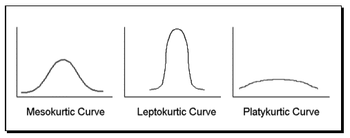
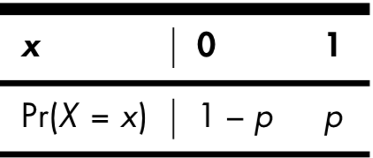
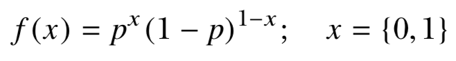
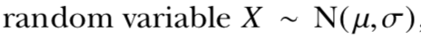
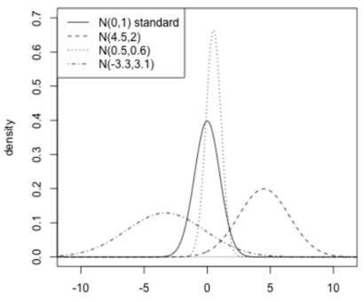
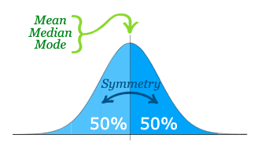
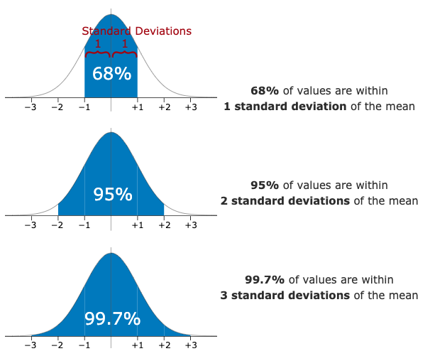

***

- **Probability**
- **Qualitative and Quantitative Data**
- **Discrete and Continuous Data**
- **Probability 'Density vs Mass' Function (PDF vs PMF)**
- **Cumulative Distribution Function (CDF)**
- **Shape of PDF** : Symmetry, Skewness, Modality, Kurtosis
- **Common Probability Distributions - Discrete**
- **Common Probability Distributions - Continuous**
- **Practice** : Write A Function for outliers


***

A **probability** is a number that describes the *“magnitude of chance”* associated with making a particular observation or statement. 


It’s always a number **between 0 and 1** (inclusive) and is often expressed as a fraction.

***

**Quantitative** data can be counted, measured, and expressed using numbers. **Qualitative** data is descriptive and conceptual.

{width=50%}


***

**Discrete** data is information that can only take certain values. **Continuous** data is data that can take any value


***

Probability **mass** and **density** functions are used to describe discrete and continuous probability distributions, respectively. 


***

**CDF** describes the probability (with a given probability distribution) at less than or equal to **x**.

{width=38.5%}   {width=30%} 

***


***

```{r fig.height=5}
X.outcomes <- c(2:12)
X.prob <- c((1/36),(2/36),(3/36),(4/36),(5/36),(6/36),(5/36),(4/36),(3/36),(2/36),(1/36))
barplot(X.prob,ylim=c(0,0.20),names.arg=X.outcomes,space=0,xlab="x",ylab="Pr(X = x)", main = "probability distribution")
```


***

```{r fig.height=5}
X.outcomes <- c(2:12)
X.prob <- c((1/36),(2/36),(3/36),(4/36),(5/36),(6/36),(5/36),(4/36),(3/36),(2/36),(1/36))
X.cumul <- cumsum(X.prob)
barplot(X.cumul,names.arg=X.outcomes,space=0,xlab="x",ylab="Pr(X <= x)", main = "cumulative probability distribution")
```


***

```{r fig.height=5}
X.outcomes <- c(2:12)
X.prob <- c((1/36),(2/36),(3/36),(4/36),(5/36),(6/36),(5/36),(4/36),(3/36),(2/36),(1/36))
barplot(X.prob,ylim=c(0,0.20),names.arg=X.outcomes,space=0,xlab="x",ylab="Pr(X = x)", main = "probability distribution")
abline(v=c(0.5:10.5))
```

***

### PDF - Probability Density Function


```
lower < 7 < upper

X >= 2  &  X <= 7
(X[lower] - 1)/36

X > 7 & X <= 12
13 - X[upper])/36
```


***


```{r fig.height=4, fig.width=6}
X.outcomes <- c(1,2,3,4,5,6,7,8,9,10,11,12,13)

lower <- X.outcomes >= 2 & X.outcomes <= 7
upper <- X.outcomes > 7 & X.outcomes <= 12

fx <- rep(0,length(X.outcomes))
fx[lower] <- (X.outcomes[lower] - 1)/36
fx[upper] <- (13 - X.outcomes[upper])/36

plot(X.outcomes,fx,type="l",ylab="f(x)", xlim = c(0,14), main = "probability density function")
abline(h=0,col="gray",lty=2)
```


***


```{r fig.height=4, fig.width=6}
fx.specific <- (4.5-1)/36

fx.specific.area <- 3.5*fx.specific*0.5

fx.specific.vertices <- rbind(c(1,0),c(4.5,0),c(4.5,fx.specific))

plot(X.outcomes,fx,type="l",ylab="f(x)", xlim = c(0,14), main = "probability density function")
abline(h=0,col="gray",lty=2)
polygon(fx.specific.vertices,col="gray",border=NA)
abline(v=4.5,lty=3)
text(4,0.01,labels=fx.specific.area)
```

***

### **R - Probability - <span style="color:orangered">*Shape*</span>**

- **Symmetry** : Draw a vertical line down the center, and it is equally reflected with 0.5 probability.

- **Skewness** : If a distribution is asymmetric, look at the “**tail**” of a distribution. *Positive* or *right* *skew* indicates a tail extending longer to the right of center.

- **Modality** : Describes the number of easily identifiable peaks in the distribution of interest. *Unimodal*, *bimodal*, and *trimodal...*

- **Kurtosis** : Measure of the "tailedness" of the probability distribution. Positive kurtosis indicates a distribution where more of the values are located in the tails


***

 


{width=30%}  {width=29.4%} 


***


```{r}
station_data <- read.table("https://web.itu.edu.tr/~tokerem/18397_Cekmekoy_Omerli_15dk.txt", sep = ";", header = T)

table(station_data$temp)

df_temp_table <- data.frame(table(station_data$temp))
df_temp_table
```


***


```{r fig.height=6}
barplot(df_temp_table$Freq/121,names.arg=df_temp_table$Var1)
```


***

### **R - Common Probability Mass Functions**

For discrete random variables

- **Bernoulli Distribution** : has only two possible outcomes, such as success or failure.





***

### **Bernoulli Distribution**

```{r fig.height=4, fig.width=6}
x<-1
p <- 0.6

b_fx <- p^x*((1-p)^(1-x))

barplot(c(1-p,p),names.arg=c(0,1))
```


***

### **R - Common Probability Mass Functions**

For discrete random variables

- **Binomial Distribution** : The *binomial* *distribution* is the distribution of successes in **n** number of trials involving binary discrete random variables.


***

### **Binomial Distribution**

There are four functions associated with Binomial distributions. 

- dbinom(x, size, prob)
- pbinom(x, size, prob)
- qbinom(p, size, prob)
- rbinom(n, size, prob)
-
- **x** is a vector of numbers.
- **p** is a vector of probabilities.
- **n** is number of observations.
- **size** is the number of trials.
- **prob** is the probability of success of each trial.

***

### **Binomial Distribution - dbinom**

It is a density or distribution function.

```{r}
x <- 0:4  
size <- 12
prob <- 0.5

dbinom(x , size , prob)

pbinom(4 , size , prob)
```


***

```{r fig.height=5}
prob <- dbinom(x = 0:12 , size = 12 , prob = 0.5)
plot(prob)
```


```{r fig.height=3, fig.width=5}
prob <- dbinom(x = 0:12 , size = 12 , prob = 0.2)
plot(prob)
```


***

```{r fig.height=4}
X.outcomes <- c(1:13)
X.prob <- c((0/36),(1/36),(2/36),(3/36),(4/36),(5/36),(6/36),(5/36),(4/36),(3/36),(2/36),(1/36),(0/36))
barplot(X.prob,ylim=c(0,0.20),names.arg=X.outcomes,space=0,xlab="x",ylab="Pr(X = x)", main = "probability distribution")
```


***

```{r fig.height=4}
X.outcomes <- c(1:13)
X.prob <- c((0/36),(1/36),(2/36),(3/36),(4/36),(5/36),(6/36),(5/36),(4/36),(3/36),(2/36),(1/36),(0/36))
barplot(X.prob,ylim=c(0,0.20),names.arg=X.outcomes,space=0,xlab="x",ylab="Pr(X = x)", main = "probability distribution")

lines(dbinom(x = 0:12, size = 36, prob = 1/6), col= "red")
```

***

### **R - Common Probability Mass Functions**

- **Poisson Distribution** : important and rarely seen event.


λp should be interpreted as the “mean number of occurrences”


***

### **Poisson Distribution**

There are three functions associated with Binomial distributions. 

- dpois(x, lambda)
- ppois(q, lambda, lower.tail)
- qpois(p, lambda, lower.tail)
- rpois(n, lambda)
-
- **x** : successes in a period
- **λ** : the expected number of events
- **lower.tail**  = TRUE for left tail
- **q** vector of quantiles
- **n** number of random values to return
- **p** vector of probabilities


***

```{r fig.height=3, fig.width=5}
x <- 6:16
lambpa <- 4
prob <- dpois(x, lambpa)
plot(x = 5:15, prob)
```


```{r fig.height=5}
plot(dpois(0:10,2.22),type = "o", col="red")
lines(dpois(0:10,4.22), type = "o", col = "blue")
lines(dpois(0:10,7.22), type = "o", col = "green")
```


***
**R - Common Probability Density Functions**

    - Uniform
    - Normal
    - Student’s t-distribution
    - Exponential
    - (gamma, beta, log-normal)
    
    
***

### **Uniform**

The **uniform** distribution is a simple density function that describes a continuous random variable whose interval of possible values offers no fluctuations in probability.


***


***

- runif()
- dunif()
- punif()
- qunif()


***


```{r}
runif(n = 10,-0.4,1.1)

r1 <- runif(n = 10,-0.4,1.1)
table(r1)

t1 <- table(r1)
```

***

```{r fig.height=5}
barplot(t1)
```

***

```{r fig.height=5}
barplot(table(runif(n = 100,-0.4,1.1)))

```


***

```{r fig.height=5}
barplot(table(runif(n = 1000,-0.4,1.1)))

```


***

```{r fig.height=3}
dunif(x=c(-2,-0.33,0,0.5,1.05,1.2),min=-0.4,max=1.1)
d1 <- dunif(x=c(-2,-0.33,0,0.5,1.05,1.2),min=-0.4,max=1.1)
barplot(d1,names.arg=c(-2,-0.33,0,0.5,1.05,1.2))
```

***

```{r fig.height=3}
d2 <- dunif(x=c(-2,runif(998,-0.4,1.1),1.2),min=-0.4,max=1.1)
barplot(d2)
```


***

Characterized by a distinctive “bell-shaped” curve, it’s also referred to as the **Gaussian** distribution.





***

### **Normal**


- Theoretical, characterized by a distinctive “bell-shaped” curve 
- Aso referred to as the **Gaussian** distribution
- Mean = Median = Mode, Symmetric, Skewness = 0, Kurtosis = 3
- 50% of values less than the mean and 50% greater than the mean






{width=40%} {width=40%}


***

#### **Standart Normal**

The standard normal distribution is a normal distribution with a mean of 0 and standard deviation of 1.


***

**0.95 −2σ to +2σ** and **0.99 −3σ tp +3σ**


***

- rnorm()
- dnorm()
- pnorm()

***


```{r}
r1 <- rnorm(50,mean = 0, sd = 1)
r1
```


***

```{r fig.height=4}
plot(r1)
```

***

```{r fig.height=4}
hist(r1)
```


***

```{r fig.height=4}
barplot(r1)
```

***

```{r fig.height=4}
barplot(table(r1))
```


***

```{r}
dnorm(r1, mean = 0, sd = 1)
fx3 <- dnorm(r1)
```


***

```{r fig.height=4}
plot(r1,fx3)
```


***

### **Practice** : Write A Function for outliers

***

### **outliers**

```{r}
foo <- c(0.6,-0.6,0.1,-0.2,-1.0,0.4,0.3,-1.8,1.1,6.0)
```


***


```{r}
summary(foo)
```

***

```{r fig.height=4}
plot(foo,rep(0,10),yaxt="n",ylab="",bty="n",cex=2,cex.axis=1.5,cex.lab=1.5)
abline(h=0,col="gray",lty=2)
```

***

```{r fig.height=4}
plot(foo,rep(0,10),yaxt="n",ylab="",bty="n",cex=2,cex.axis=1.5,cex.lab=1.5)
abline(h=0,col="gray",lty=2)
arrows(5,0.5,5.9,0.1,lwd=2)
text(5,0.7,labels="outlier?",cex=3)
```


***


boxplot()

***

```{r fig.height=4}
boxplot(foo)
```

***

```{r fig.height=4}
mean(foo)
mean(foo[-10])
```

***

### **Function**

```
baz <- c(-0.3,0.9,2.8,2.3,1.2,12,-4.1,-0.4,4.1,-2.3)
```

- Mean, Median, Range
- Variance, Standart Deviation
- Plot, hist
- Barplot with table() function
- summary() function
- boxplot
- if there is *outliers*, print

**Condition for outliers is**

OUTLIERS < MEAN-(3`*`IQR) 

or 

OUTLIERS > MEAN+(3`*`IQR) 


***

```{r}
baz <- c(-0.3,0.9,2.8,2.3,1.2,12,-4.1,-0.4,4.1,-2.3,1.2)

statistic_function <- function(baz) {

  
}
```


***

```{r}
statistic_function <- function(baz) {
  print(c(mean(baz),"mean"))
  print(c(median(baz),"median"))
  print(c(range(baz),"range"))
  
}

statistic_function(baz)
```


***

```{r}
statistic_function <- function(baz) {
  print(c(mean(baz),"mean"))
  print(c(median(baz),"median"))
  print(c(range(baz),"range"))
  print(c(var(baz),"var"))
  print(c(sd(baz),"sd"))

}

statistic_function(baz)
```


***

```{r}
statistic_function <- function(baz) {
  print(c(mean(baz),"mean"))
  print(c(median(baz),"median"))
  print(c(range(baz),"range"))
  print(c(var(baz),"var"))
  print(c(sd(baz),"sd"))
  plot(baz)
  hist(baz)
}

statistic_function(baz)
```


***

```{r}
statistic_function <- function(baz) {
  print(c(mean(baz),"mean"))
  print(c(median(baz),"median"))
  print(c(range(baz),"range"))
  print(c(var(baz),"var"))
  print(c(sd(baz),"sd"))
  plot(baz)
  hist(baz)
  barplot(table(baz))
  print(c(summary(baz),"summary"))
  boxplot(baz)
  
}

statistic_function(baz)
```


***

```{r}
statistic_function <- function(baz) {
  print(c(mean(baz),"mean"))
  print(c(median(baz),"median"))
  print(c(range(baz),"range"))
  print(c(var(baz),"var"))
  print(c(sd(baz),"sd"))
  plot(baz)
  hist(baz)
  barplot(table(baz))
  print(c(summary(baz),"summary"))
  boxplot(baz)
  for (i in 1:length(baz)) {
      if (baz[i]<mean(baz)-3*IQR(baz) | baz[i]>mean(baz)+3*IQR(baz)) {
        print("there is outliers")
        print(c(baz[i] , "outlier") )
        print(which(baz==baz[i]))
      }
  }
}

statistic_function(baz)
```

***


