***

# **R Programming - Conditions**


- **Comparison Operators **
    - equal (**==**)
    - not equal (**!=**)
    - greater or equal to (**>=**)
    - lower or equal to (**<=**)


- **Logical Operators **
    - the and operator (**&**)
    - the or operator (**|**)
    - the not operator (**!**)

- ***if*** (Stand-Alone) Statement
- ***else*** Statement
- ***ifelse*** Statement


```
TRUE & TRUE  
TRUE & FALSE
TRUE | FALSE 
!TRUE

2 == 3
5 < 6

c(1,4) >= 6

9 != 8

5 < 6 & 9 != 8
```
```
score <- 80
exam_no <- 2

score >= 75 | exam_no == 1

score>=75 & score<90 | exam_no==1
```

***

### ***if*** (Stand-Alone) Statement

The ***if statement*** executes a chunk of code if and only if a defined condition is **TRUE**, which looks something like this:


```{r, echo=TRUE}
if(TRUE) message("It was true!")

if(FALSE) message("It wasn't true!")

if(TRUE&FALSE) message("It was true!")

if(TRUE|FALSE) message("It doesn't matter")

```

```{r, echo=TRUE}
a <- 3
num <- 4

if ( a != num ) {
print(a)
}
```

```{r, echo=TRUE}
a <- 3
num <- 4

if ( a <= num ) {
a <- a ^ 2
print(a)
}
```

***

### ***if*** (Stand-Alone) Statement


```{r, echo=TRUE}
num <- -1

if ( num < 0 ) {
  print("num is negative.")
  print("Don't worry, I'll fix it.") 
  num <- num * -1
  print("Now num is positive.")
}
num
```


***

### ***if*** (Stand-Alone) Statement

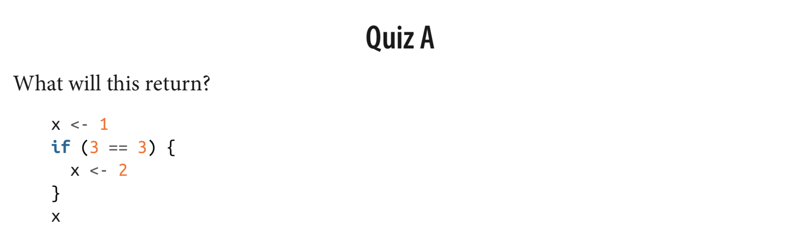

***

### ***if*** (Stand-Alone) Statement


Try it

Is it in the range ?

```

x <- 6
y <- 2

if ( x > 3 & x == 7 ) {
  print("It is in the range")
  z <- x + y
  print(z)
}

```


Is it in the range ?

```{r, echo=TRUE}

x <- 6
y <- 2

if ( x > 3 & x <= 7 ) {
  print("It is in the range")
  z <- x + y
  print(z)
}

```


Try it

You have a fruit which is yellow.

Is that a banana?

Or an orange ?

```
banana <- "yellow"
my_fruit <- "yellow"

if ( my_fruit == banana ) {
  print("Your fruit might be a banana")
}

```

```
orange <- "orange"
my_fruit <- "yellow"

if ( my_fruit == orange ) {
  print("Your fruit is not a banana")
}

```


***

### ***else*** - Statement

If you want something different to happen when the condition
is **FALSE**, you can add an else declaration.

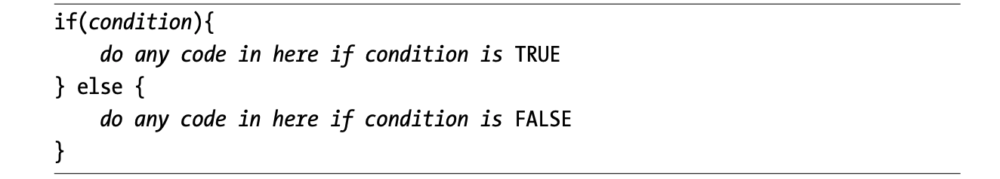


```{r, echo=TRUE}
if(FALSE)
    {
      message("This won't execute...")
} else
    {
      message("but this will.")
}
```


```{r, echo=TRUE}
a <- 3.5
b <- 0.5

if (a <= 0.5) {
  c <- b + 1
  print(c)
} else {
  c <- b
  print(c)
}
```


Let's say we have two conditions. **Rainy** or **Shiny**. 

And you have recorded **4 mm** precipitation.

```
weather <-       # mm           # fill this number

if ( ) {                        # fill this condition, using weather
  print("it is rainy")
} else {
  print("it is shiny")
}
```


Report the weather. Is it rainy ?

{width=80%}

Let's say we have two conditions. **Rainy** or **Shiny**. 

And you have recorded 4 mm precipitation.

```{r, echo=TRUE}
weather <- 4      # mm              # fill this number

if ( weather > 0 ) {                # fill this condition, using weather
  print("it is rainy")              
} else {
  print("it is shiny")
}
```


***

### -***else ***-  and -***else if***- Statement


If your situation has more than two mutually exclusive cases, 
use **else** and **if** statements together.


```{r, echo=TRUE}
a <- 1                  # team 'a' has 1 goal
b <- 1                  # team 'b' has 1 goal

if (a > b) { 
  print("A wins!")
} else if (a < b) { 
  print("B wins!")
} else {
  print("Tie.")
}
```


**What do you gonna do ? Eating, Sleeping, or Reading?**

When do you want to read ?

- When you are hungry, or sleepy. **No.**
- When you are not hungry and sleepy. **Yes.**

So, start to think about your feelings about sleeping or eating to decide whether reading or not.    
    

## -***else ***-  and -***else if***- Statement

**What do you gonna do ? Eating, Sleeping, or Reading?**

Let's start with define the conditions

  - If you are hungry --> eat
  - If you are sleepy --> sleep
  
    - If you are hungry and sleepy --> ?
    - If you are hungry but not sleepy --> ?
    - If you are not hungry but sleepy --> ?
    - If you are not hungry and sleepy --> ?


What do you gonna do ? Eat, Sleep or Read? 

- If you are hungry and sleepy --> eat
- If you are hungry but not sleepy --> eat
- If you are not hungry but sleepy --> sleep
- If you are not hungry and sleepy --> read

Let's define your feelings. **Yes** (TRUE,1) or **No** (FALSE,0)

- Are you hungry ? 
- Are you sleepy ? 


```
hungry <-                   # TRUE or FALSE (1 or 0)
sleepy <-                   # TRUE or FALSE (1 or 0)


```

What do you gonna do ? Eat, Sleep or Read? 

- 1) If you are hungry and sleepy --> eat
- 2) If you are hungry but not sleepy --> eat
- 3) If you are not hungry but sleepy --> sleep
- 4) If you are not hungry and sleepy --> read

```
hungry <- TRUE                  # Yes , TRUE , 1
sleepy <- TRUE                  # Yes , TRUE , 1

if ( ) { 
  print(" ")
} else if ( ) { 
  print(" ")
} else if ( ) { 
  print(" ")
} else {
  print(" ")
}
```


What do you gonna do ? Eat, Sleep or Read? 

- 1) If you are hungry and sleepy --> eat
- 2) If you are hungry but not sleepy --> eat
- 3) If you are not hungry but sleepy --> sleep
- 4) If you are not hungry and sleepy --> read

```
hungry <- TRUE                  # Yes , TRUE , 1
sleepy <- TRUE                  # Yes , TRUE , 1

if ( ) {                    # hungry is TRUE and sleepy is TRUE
  print(" ")
} else if ( ) {             # hungry is TRUE and sleepy is FALSE
  print(" ")
} else if ( ) {             # hungry is FALSE and sleepy is TRUE
  print(" ") 
} else {                    # hungry is FALSE and sleepy is FALSE
  print(" ")
}
```

What do you gonna do ? Eat, Sleep or Read? 

- If you are hungry and sleepy --> eat
- If you are hungry but not sleepy --> eat
- If you are not hungry but sleepy --> sleep
- If you are not hungry and sleepy --> read

```{r, echo=TRUE}
hungry <- TRUE                  # Yes , TRUE , 1
sleepy <- TRUE                  # Yes , TRUE , 1

if (hungry==TRUE & sleepy==TRUE) {          # hungry is TRUE and sleepy is TRUE
  print(" ")
} else if (hungry==TRUE & sleepy==FALSE) {  # hungry is TRUE and sleepy is FALSE
  print(" ")
} else if (hungry==FALSE & sleepy==TRUE) {  # hungry is FALSE and sleepy is TRUE
  print(" ") 
} else {                                    # hungry is FALSE and sleepy is FALSE
  print(" ")
}
```


What do you gonna do ? Eat, Sleep or Read? 

- If you are hungry and sleepy --> eat
- If you are hungry but not sleepy --> eat
- If you are not hungry but sleepy --> sleep
- If you are not hungry and sleepy --> read

```{r, echo=TRUE}
hungry <- TRUE                  # Yes , TRUE , 1
sleepy <- TRUE                  # Yes , TRUE , 1

if (hungry==TRUE & sleepy==TRUE) {          # hungry is TRUE and sleepy is TRUE
  print("EAT")
} else if (hungry==TRUE & sleepy==FALSE) {  # hungry is TRUE and sleepy is FALSE
  print("EAT")
} else if (hungry==FALSE & sleepy==TRUE) {  # hungry is FALSE and sleepy is TRUE
  print("SLEEP") 
} else {                                    # hungry is FALSE and sleepy is FALSE
  print("READ")
}
```


***

###  Nesting and Stacking Statements

An ***if statement*** can be placed in another ***if statement***.
In the editor, modify the mynumber example once more as follows:

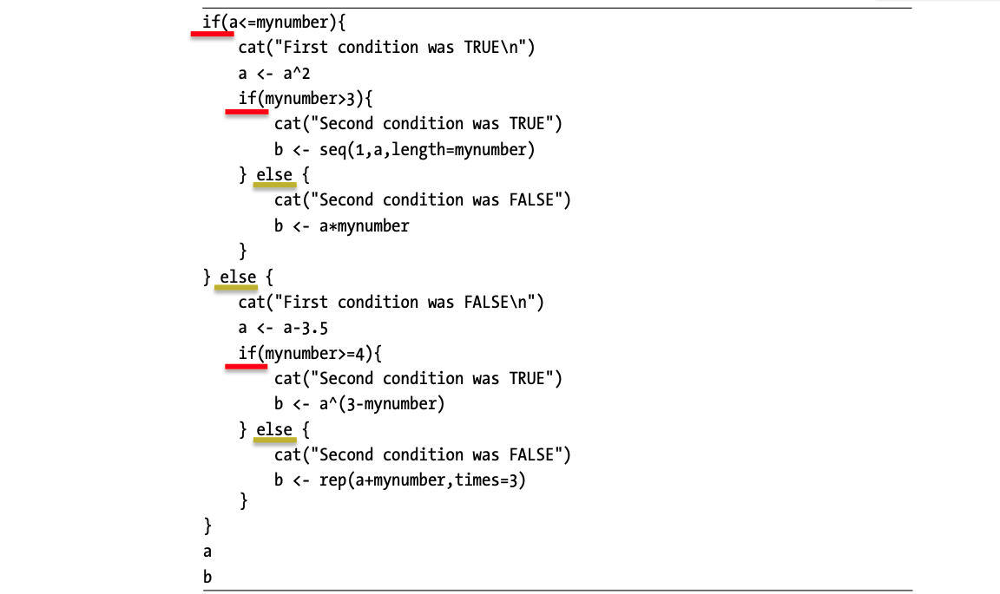


***

### Nesting and Stacking Statements


***

###  Nesting and Stacking Statements

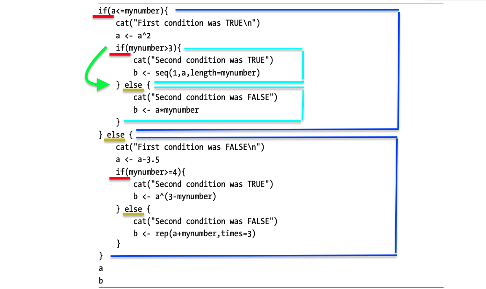

***

###  Nesting and Stacking Statements


***

###  Nesting and Stacking Statements


***

###  Practice - Conditions - TRUE and FALSE


1. **Print** this **if** it is **TRUE.**
"This message will print!"

```
if (...) {
  print(...)
} 
```
2. Go to sleep if it is TRUE, else wake up.

```
if (...) {
   print("Go to sleep!")
} else {
   print("Wake up!")
}
```

3. The variable message to *"I print this when it is false!"* when the condition is **FALSE**.

```
if (...) {
  print("I print this when it is true!")
} else {
  print(...)
}
```


***

###  Practice - Conditions - Logical Op

**ROLE PLAY** : You are a CAR, and you are going on the road. 


Problem : **BUT** ;

- Traffic (stop) light turned to **orange**
- **Two** pedestrians started to walk across the road

**How can you move ?**

- Waiting for the traffic (stop) light turns to **green**
- Waiting for pedestrians pass to the across of the road

**Parameters** : 

- The **COLOR** of the traffic (stop) light
- The **NUMBER** of pedestrians


You are a CAR, **BUT** ;

- Traffic (stop) light turned to **orange**
- **Two** pedestrians started to walk across the road

**Parameters** : 

- The **COLOR** of the traffic (stop) light
- The **NUMBER** of pedestrians

*First, define the situation*

```{r, echo=T}
Traffic_Stop_Light <- 'orange'
Number_of_Pedestrians <- 2
```


You are a CAR, **BUT** ;

```{r, echo=T}
Traffic_Stop_Light <- 'orange'
Number_of_Pedestrians <- 2
```

*Second, define the conditions to move again*

```
Traffic_Stop_Light : ?
Number_of_Pedestrians : ?
```

##  Practice - Conditions - Logical Op

Situation
```{r, echo=T}
Traffic_Stop_Light <- 'orange'
Number_of_Pedestrians <- 2
```


Condition
```
Traffic_Stop_Light : 'green'
Number_of_Pedestrians : 0
```

Remember rules
```
if (...) {
  print(...);
} else {
  print(...);
}
```


Situation
```{r, echo=T}
Traffic_Stop_Light <- 'orange'
Number_of_Pedestrians <- 2
```

Condition
```
Traffic_Stop_Light : 'green'
Number_of_Pedestrians : 0
```

Remember rules
```
if ( & ) {
  print('Go!');
} else {
  print('STOP');
}
```


Situation
```{r, echo=T}
Traffic_Stop_Light <- 'orange'
Number_of_Pedestrians <- 2
```

Condition
```
Traffic_Stop_Light : 'green'
Number_of_Pedestrians : 0
```

Remember rules
```{r, echo=T}
if (Traffic_Stop_Light=='green' & Number_of_Pedestrians==0) {
  print('Go!');
} else {
  print('STOP');
}
```


***

###  Practice - Conditions - Logical Op

**Problem** : You want to enjoy, and let's say the day is;

```{r, echo=T}
day <- "Friday"
```

What do you gonna do **if** it is **Friday**.
```
if (...) {
  print('Enjoy the weekend!')
} else {
  print('Do some work.')
}
```


***

```{r, echo=T}
day <- "Friday"
```

What do you gonna do **if** it is **Friday**.
```
if ( day... | day... ) {
  print('Enjoy the weekend!')
} else {
  print('Do some work.')
}
```


***

### Practice - Conditions - Logical Op

**ANSWER** : You want to enjoy, and let's say the day is;

```{r, echo=T}
day <- "Friday"
```

It is okay, you can fun **if** it is **weekend**.
```{r, echo=T}
if (day == 'Saturday' | day == 'Sunday') {
  print('Enjoy the weekend!')
} else {
  print('Do some work.')
}
```


***

###  Practice - Conditions - Logical Op

**Problem** : You want to go out and your question is 

**"Should I take an umbrella?"**

**Note** : There are two variables in your code,

**"sky"** (*character*) and **"high_chance_of_rain"** (*logical*)

- Check, if "**sky**" is equal to "**cloudy**" and, whether there is a "**high_chance_of_rain**".
- If both are true, the code should print: **"Take umbrella!"**
- Otherwise, the code should print: **"No need for umbrella!"**
- Based on the condition, what is the answer?

        RADIO: The sky is cloudy and the chance of rain is high.

***

Your conditions, for two variables

```
# you want to go out and your question is "Should I take an umbrella?"

sky <- 

high_chance_of_rain <- 
```
***

### Practice - Conditions - Logical Op


```{r, echo=T}
# you want to go out and your question is "Should I take an umbrella?"

sky <- "cloudy"

high_chance_of_rain <- TRUE
```

***

### Practice - Conditions - Logical Op


```{r, echo=T}
# you want to go out and your question is "Should I take an umbrella?"

sky <- "cloudy"

high_chance_of_rain <- TRUE
```


```
if (...) {
  print("...")
} else { 
  print("...")
  }
```

```
if (...) {
  print("Take umbrella!")
} else { 
  print("No need for umbrella!")
  }
```


```{r, echo=T}
# you want to go out and your question is "Should I take an umbrella?"

sky <- "cloudy"

high_chance_of_rain <- TRUE
```

```
if ( sky... & high_chance_of_rain... ) {
  print("Take umbrella!")
} else { 
  print("No need for umbrella!")
  }
```


***

### Practice - Conditions - Logical Op


```{r, echo=T}
# you want to go out and your question is "Should I take an umbrella?"

sky <- "cloudy"

high_chance_of_rain <- TRUE

if (sky == "cloudy" & high_chance_of_rain == TRUE) {
  print("Take umbrella!")
} else { 
  print("No need for umbrella!")
  }
```


***

## **Practice - R Language**

**Objectives**

- Manage Working Directory

- Find the Data

- Read Data with **utils** (R utility functions)


***

### **Practice - R Language**

Manage Working Directory

- <span style="color:green">**getwd()**</span> - ***get** **w**orking **d**irectory*
- <span style="color:green">**list.files()**</span> *# or dir()*

```{r}
getwd()
list.files()
```

***

### **Practice - R Language**

Manage Working Directory

- <span style="color:green">**setwd()**</span> - ***set** **w**orking **d**irectory*

```{r}
# 1
setwd("/Users/emirtoker/Downloads/")
# 2
getwd()
list.files()
file.path("~","Users","emirtoker","Downloads","-this_is_my_file.csv")
```


***

### **Practice - R Language**

Find the Data

- <span style="color:green">**file.path()**</span>

```{r}
# Option 1
# setwd("/Users/emirtoker/Downloads/")
# read.csv("-this_is_my_file.csv")

# Option 2
path <- file.path("~","Users","emirtoker","Downloads","-this_is_my_file.csv")
path
# read.csv(path)
```


***

### **Practice - R Language**

Read Data 

*with **utils** (R utility functions)*

- <span style="color:green">**read.csv()**</span> - ***C**omma **S**eperated **V**alue*
- <span style="color:green">**read.delim()**</span> - *Tab Delimited Data*
- <span style="color:green">**read.table()**</span> - *Exocit file format*

***

### **Practice - R Language**

Read Data with **utils** (R utility functions)

<span style="color:green">**read.csv()**</span> -  ***C**omma **S**eperated **V**alue*

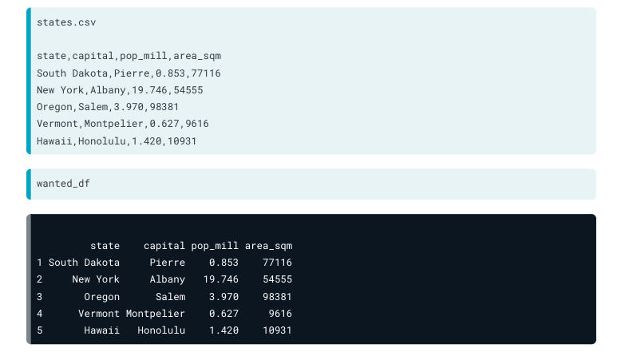

***

### **Practice - R Language**

Read Data with **utils** (R utility functions)

<span style="color:green">**read.delim()**</span> - *Tab Delimited Data*


***

### **Practice - R Language**

Read Data with **utils** (R utility functions)

<span style="color:green">**read.table()**</span> - *Exocit file format*

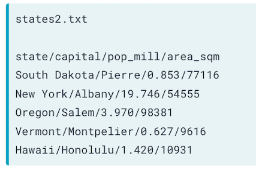 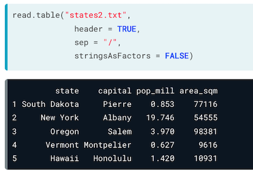 


***

### **Practice - R Language**

BONUS - <span style="color:green">**Import Dataset**</span>


***

### **Practice - R Language**

BONUS - <span style="color:green">**Import Dataset**</span>

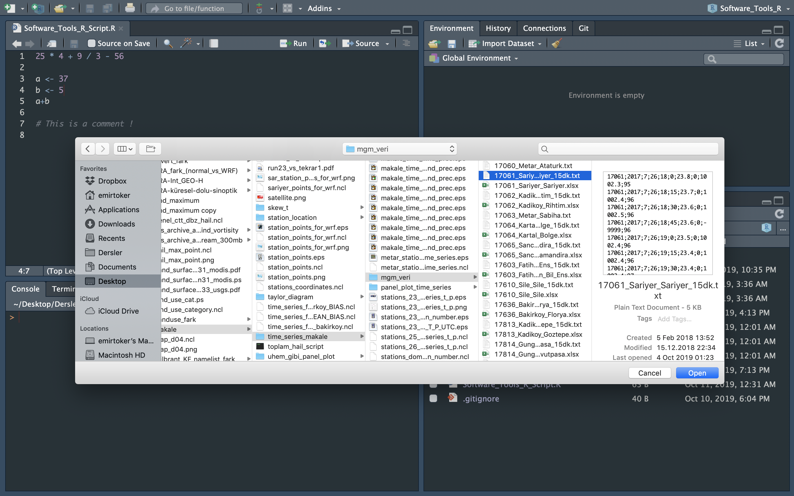

***

### **Practice - R Language**

BONUS - <span style="color:green">**Import Dataset**</span>

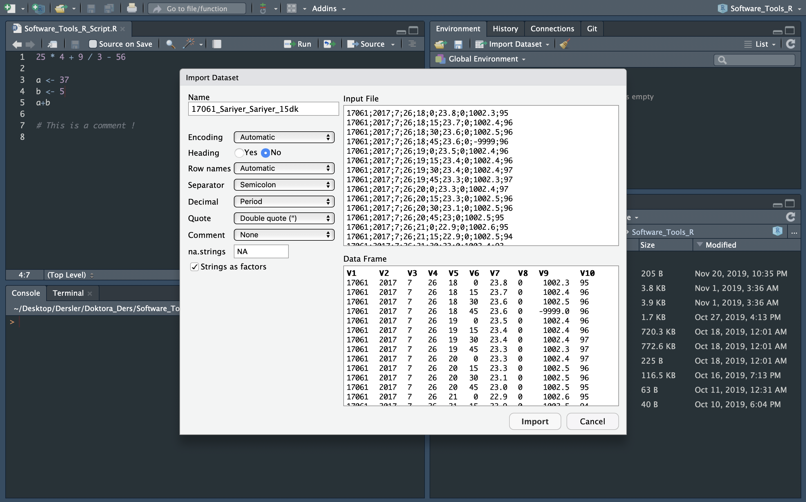

***

### **Practice - R Language**

BONUS - <span style="color:green">**Import Dataset**</span>


***

### **Practice - R Language**


BONUS - <span style="color:green">**Import Dataset**</span>


- `17061_Sariyer_Sariyer_15dk` <- read.csv(
  "~/Desktop/NCL_Script_ve_Gorsel/Makale/
  time_series_makale/mgm_veri/17061_Sariyer_Sariyer_15dk.txt", 
  header=FALSE,
  sep=";")

- View(`17061_Sariyer_Sariyer_15dk`)

<span style="color:brown">**~**</span>


***

### **Practice - R Language**

Manage Directory, Find and Read Data

**Instructions**

1. Go to main webpage of course
2. Open Data "Istanbul_Goztepe_Precipitation_1846-2013_Monthly" (.dat) LINK
3. Copy and Paste it in your "Downloads" directory in a text file
4. Open your R Studio

**We Have 4 Ways to Read**

***

### **Practice - R Language**

Manage Directory, Find and Read Data

**Instructions** - <span style="color:green">WAY 1 - **GO TO FILE**<span>

5. Check your Project Name and your Working directory
6. Go to "Downloads" directory in R Studio
7. List files and Read Data with three different read functions
    - read.csv()
    - read.delim()
    - read.table()
8. Choose the best 
9. Assign your data as "precip_1"

<span style="color:brown">***Caraful about header, seperater and missing data***<span>

***look at the main web page for examples***

***

### **Practice - R Language**

Manage Directory, Find and Read Data

**Instructions** - <span style="color:green">WAY 2 - **CALL THE FILE**<span>

10. Go Back to your Working directory
11. Define your file path with file.path()
12. Assign the path a new variable as "path_my_file"
13. Use your best read() function
14. Read the file with "path_my_file"
15. Assign your data as "precip_2"

```
path_my_file <- file.path("~","Downloads")
precip_2 <- read.table(path_my_file)
```

***

### **Practice - R Language**

Manage Directory, Find and Read Data

**Instructions** - <span style="color:green">WAY 3 - **IMPORT THE FILE**<span>

16. Use "Import Datase"
17. Assign your data as "precip_3"


***

### **Practice - R Language**

Manage Directory, Find and Read Data

**Instructions** - <span style="color:green"> WAY 4 - **DOWNLOAD THE FILE**<span>

18. Copy the LINK of data
19. Use your best read() function
20. Read the file with this function and LINK
21. Assign your data as "precip_4"

```
precip_4 <- read.table("link")
```


***

## **Practice - R Programming**

***

### **Practice - R Programming**

**Objectives**

- Identify the Data

- Indexing 

- Use Condition Statements

- Plot


***

### **Practice - R Programming**

**Meet with the Data**

1. Look at structure
2. Learn attributes and dimensions
3. Rename attributes

**? dimensions, variables and types ?**

```
month.name
month.abb

attributes(precip_2)
attributes(precip_2)[1]
attributes(precip_2)[[1]]

attributes(precip_2)[[1]] <- c("Year",month.abb)

attr(precip_2,"names") <- c("Year",month.abb)
attr(precip_2,"row.names") <- 1846:2013

precip_2a <- precip_2[-1]
head(precip_2a)
```

***

### **Practice - R Programming**

**Clear NA and Choose Colomn**

4. Print "precip_2a"
5. Delete rows which include NA ( na.omit() )
6. Assign it as "precip_2b"
7. Select summer season 
8. Assign it as "precip_2b_summer"


```
precip_2b <- na.omit(precip_2a)
precip_2b_summer <- precip_2b[ ,6:8]
```

***

### **Practice - R Programming**

**Use Condition Statements - if**


9. Compare June Mean Precipitation with July
10. IF June mean precipitation is LOWER than July then print "June has low precipitation."

```
mean_jun <- mean(precip_2b_summer$Jun)
mean_jul <- mean(precip_2b_summer$Jul)

if (mean_jun > mean_jul) {
  print("June has low precipitation.")
}

colMeans(precip_2b_summer)

```


***

### **Practice - R Programming**

**Use Condition Statements - else**


10. IF June mean precipitation is LOWER than July then print "June has low precipitation."
11. ELSE print "June has high precipitation."
12. Calculate mean of each month ( colMeans() )

```
mean_jun <- mean(precip_2b_summer$Jun)
mean_jul <- mean(precip_2b_summer$Jul)

if (mean_jun < mean_jul) {
  print("June has low precipitation.")
} else {
  print("June has high precipitation.")
}

colMeans(precip_2b_summer)
```

***

### **Practice - R Programming**

**Plot**

Problem : Extremes and Outliers

13. Plot precipitation for June
14. Add title and unit

```
plot(precip_2b_summer$Jun, 
    xlab = "Years",
    ylab = "Precipitation [mm/month]", 
    main = "Istanbul Monthly Precipitation - June", 
    type = "l", 
    col="blue")
```


***

### **Practice - R Programming**

**Plot**

Problem : Extremes and Outliers

15. Edit x-axis, which years are they ?
16. What about August ?

```
attr(precip_2b_summer,"row.names")
x_years <- attr(precip_2b_summer,"row.names")

plot(x_years,
    precip_2b_summer$Jun, 
    xlab = "Years",
    ylab = "Precipitation [mm/month]", 
    main = "Istanbul Monthly Precipitation - June", 
    type = "l", 
    col="blue")
    
    plot(precip_2b_summer$Aug)
```

***

### **Practice - R Programming**

**Plot**

Problem : Extremes and Outliers

 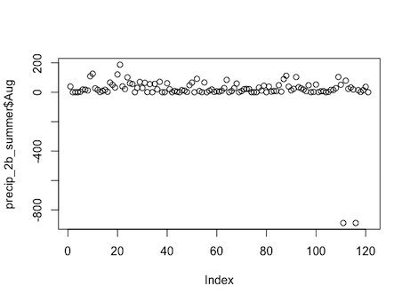

Homework-2

***


# **R Programming - Loops**


Loops are R’s method for repeating a task, which makes them a useful tool for programming simulations. 


***

### **R Programming - <span style="color:green">*repeat*</span> Loops**


```
repeat
{
  message("Happy Groundhog Day!")
  break
}
```

***

### **R Programming - <span style="color:green">*repeat*</span> Loops**

```{r}
coins <- 3
game <- 0

repeat
{
  game <- game + 1
  coins <- coins -1
  
  print(game)
  print("nice try, play again")
  
if (coins==0) {
    break
  }
}
```

```
[1] 1
[1] "nice try, play again"
[1] 2
[1] "nice try, play again"
[1] 3
[1] "nice try, play again"
```

***

### **R Programming - <span style="color:green">*while*</span> Loops** 

While loops are like backward repeat loops.


```
while(condition) {
conditional statement
}
```

***

### **R Programming - <span style="color:green">*while*</span> Loops** 


```{r}
coins <- 3
game <- 0

while(coins >= 0)
{
  coins <- coins -1
  game <- game + 1
  print(game)
  print("nice try, play again")
}
```


***

### **R Programming - <span style="color:green">*for*</span> Loops**

The third type of loop is to be used when you know exactly how many times you want the code to repeat. 


***

### **R Programming - <span style="color:green">*for*</span> Loops**


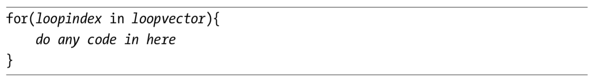
```{r}
for(i in 1:2) {
message("just say it ", i, " times")
}
```


***

### **R Programming - <span style="color:green">*for*</span> Loops**

```{r}
for(i in c(1,2) ) {
message("just say it ", i, " times")
}
```

```{r}
for(i in c("apple","banana") ) {
message("just say it ", i, " times")
}
```

<span style="color:brown">*it is related with length of vector*</span>


***

### **R Programming - <span style="color:green">*for*</span> Loops**

```{r}
month.name

for(month in month.name) {
  message("The month of ", month)
}
```


***

### **R Programming - <span style="color:green">*apply*</span> Loops**

- The **apply()** functions form the basis of more complex combinations and helps to perform operations with very few lines of code. 
- More specifically, the family is made up of the **apply()**, **lapply()** , **sapply()**, **vapply()**, **mapply()**, **rapply()**, and **tapply()** functions.

```
apply(X, MARGIN, FUN, ...)

# X is an array or a matrix, dim(X) must have a positive length
# MARGIN=1, it applies over rows, whereas with 
# MARGIN=2, it works over columns. Note that when you use the construct 
# MARGIN=c(1,2), it applies to both rows and columns
# FUN, which is the function that you want to apply to the data. 
```

```
apply(precip_2b_summer, MARGIN=1, mean)
apply(precip_2b_summer, MARGIN=2, mean)
apply(precip_2b_summer, MARGIN=c(1,2), mean)
apply(precip_2b_summer, MARGIN=c(2,1), mean)
```

***

### **R Programming - <span style="color:green">*apply*</span> Loops**


***

### **R Programming - <span style="color:green">*lapply*</span> Loops**


```
lapply(precip_2b_summer,"[",1)

sapply(precip_2b_summer,"[",1)
```

***

**Practice** : Write A Function - 3

- I have four different numbers w,x,y,z
- I want to define them WHEN I am using the function
- I want to calculate w+x IN function
- I want to calculate y*z IN function
- I want to print the results IN function


```{r}
my_fun3 <- function(w,x,y,z){
  
result1 <- w+x
result2 <- y*z

print(result1)
print(result2)

}

# my_fun3()
my_fun3(1,2,3,4)
```

***

 BONUS

- menu() function


```
menu(c("Yes", "No"), title="What dou you think?")
menu1 <- menu(c("Yes", "No"), title="What dou you think?")
menu1

menu(c("Option1","Option2","Option3","Option4"), title="Choose one of them")
menu2 <- menu(c("Option1","Option2","Option3","Option4"), title="Choose one of them")
menu2

```

***

- I have two different numbers x,y
- I want to define them WHEN I am using the function
- I want to define ONE calculation DURING the function
- I want to print the results IN function

```
my_fun3 <- function(x,y){

math <- menu(c("+", "-", "*", "/"), title="Which calculation?")

  if (math==1) {
    result <- x+y
  } else if ( ) {
     
  } else if ( ) {
    
  } else  {
    
  }

print(result)
}
```


***

 **Practice** : Write An IF-Statement - 2

<style>

.column-right0{
  float: right;
  width: 50%;
  text-align: right;
}
.column-left0{
  float: left;
  width: 50%;
  text-align: left;
}
</style>

<div class="column-left0">


</div>

<div class="column-right0">

- Two answers
- Two options
- One Result

```{r}
worry_flow <- function() {

answer1 <-  menu(c("Yes","No"), title = "Do you have a problem in your life ?")
  if (answer1 == 2) {
      print("Then Don't Worry")
  }
  else {
      answer2 <- menu(c("Yes","No"), title = "Can you do something about it ?")
      if(answer2 == 1){
          print("Then Don't Worry")
      }
      else{
      print("Then Don't Worry")
      }
  }

require(tcltk)
msgBox <- tkmessageBox(title = "Title of message box",
                       message = "THEN WYH WORRY!", 
                       icon = "info", 
                       type = "ok")

}
```

</div>


***


