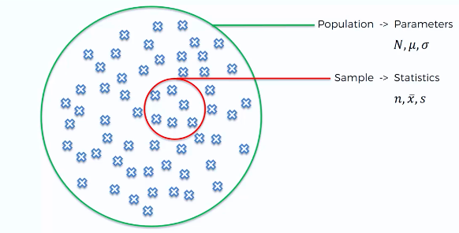
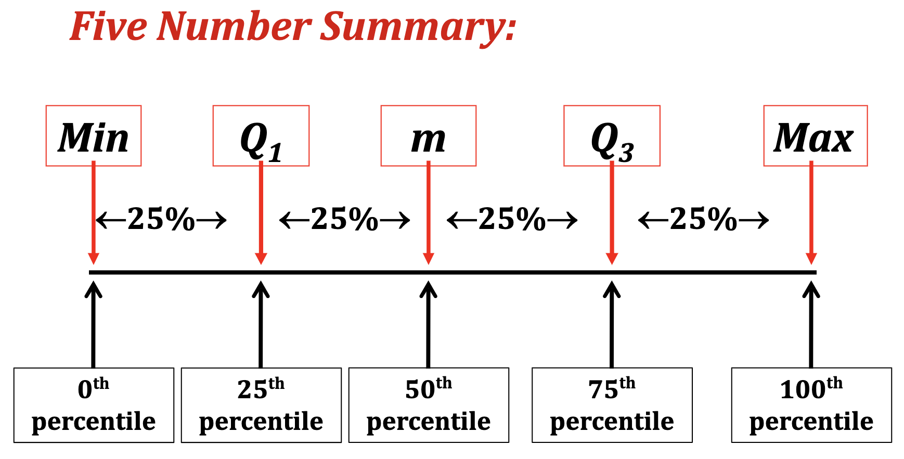
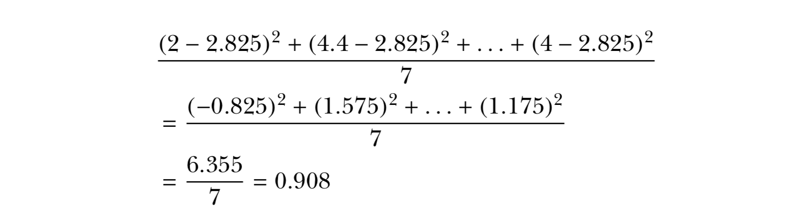
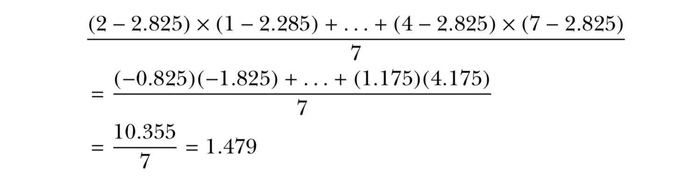
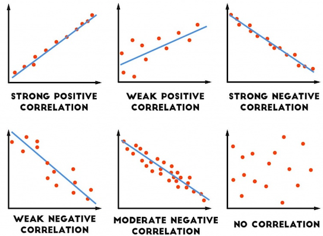
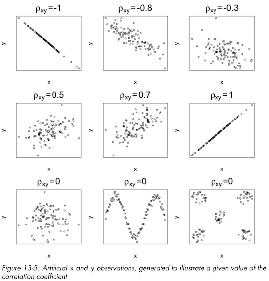
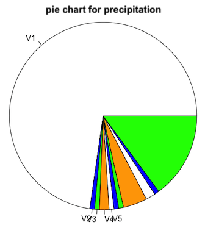
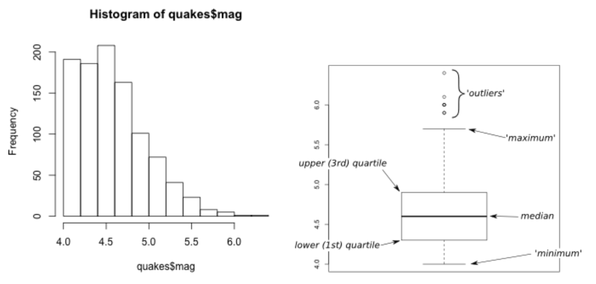

***

# **1. R Elemantary Statistics** 
# **2. Basic Data Visualization** 

***

###  **R Elemantary Statistics**





***

**Centrality**: <span style="color:orangered">**Mean**</span>, Median, Mode

- Measures of centrality are commonly used to explain large collections of data by describing where numeric observations are centered.


***

**Centrality**: Mean, <span style="color:orangered">**Median**</span>, Mode

- **Median** : “middle magnitude” of your observations


0 . 0 . <span style="color:orangered">0</span> . 0 . 0

o . o . <span style="color:orangered">o . o</span> . o . o


***

**Centrality**: Mean, Median, <span style="color:orangered">**Mode**</span>

- **Mode** : Simply the “most common” observation.

Sample : 2 , 4.4 , 3 , 3 , 2 , 2.2 , 2 , 4


2 , 2 , 2 , 2.2 , 3 , 3 , 4, 4.4 ( n=8 , n/2 = 4)


***

**Centrality**: Mean, Median, Mode


xdata <- c(2,4.4,3,3,2,2.2,2,4)

- mean(xdata)
- median(xdata)
- min(xdata)
- max(xdata)
- range(xdata)
- table(xdata)


***

<span style="color:orangered">**Quantiles, Percentiles**</span>, and the Five-Number Summary

- A quantile is a value indicates an observation rank when compared to all the other present observations.
- For example, the **median** is itself a **quantile**. It’s the 0.5th quantile. 
- Alternatively, quantiles can be expressed as a **percentile.**

<span style="color:orangered">**The median = the 0.5th quantile = The 50th percentile**</span>


Sample : 2 , 4.4 , 3 , 3 , 2 , 2.2 , 2 , 4     ( n=8 , n/2 - 1 = 3, n/2 = 4)
 
Sort : 2 , 2 , 2 , <span style="color:orangered">2.2 , 3</span> , 3 , 4, 4.4    

0.5th quantile = median = 2.6

***

<span style="color:orangered">**Quantiles, Percentiles**</span>, and the Five-Number Summary

```{r}
xdata <- c(2,4.4,3,3,2,2.2,2,4)
quantile(xdata,prob=0.8) # the 0.8th quan- tile (or 80th percentile)

quantile(xdata,prob=c(0,0.25,0.5,0.75,1))

summary(xdata) # A quartile is a type of quantile.
```


***

Quantiles, Percentiles, and <span style="color:orangered">**the Five-Number Summary**</span>



A **quartile** is a type of quantile.

***

**Spread**: Variance, Standard Deviation, and the Interquartile Range

- How dispersed your data are. For this, measures of spread are needed.

```{r}
xdata <- c(2,4.4,3,3,2,2.2,2,4)
ydata <- c(1,4.4,1,3,2,2.2,2,7)

mean(xdata)
mean(ydata)
```


***

```{r fig.height=3, fig.width=8}
plot(xdata,type="n",xlab="values",ylab="data vector",yaxt="n",bty="n", xlim = c(0,7)  )
abline(h=c(2.5,3),lty=2,col="red")
abline(v=2.825,lwd=2,lty=3)
text(c(0.0,0.0),c(2.5,3),labels=c("x","y"))
text(c(2.825),c(4),labels=c("mean"))
points(jitter(c(xdata,ydata)),c(rep(2.5,length(xdata)), rep(3,length(ydata))))
```

the observations in *ydata* are more “spread out”


***

**Spread**: <span style="color:orangered">**Variance**</span>, Standard Deviation, and the Interquartile Range

- The sample **variance** measures the degree of the spread of numeric observations around their arithmetic mean.


***

**Spread**: <span style="color:orangered">**Variance**</span>, Standard Deviation, and the Interquartile Range

2 , 4.4 , 3 , 3 , 2 , 2.2 , 2 , 4 ( mean = 2.825)



***

**Spread**: Variance, <span style="color:orangered">**Standard Deviation**</span>, and the Interquartile Range

- The standard deviation is simply the square root of the variance. The scale of the original observations.


**0.953 represents the average distance of each observation from the mean**


***

**Spread**: Variance, Standard Deviation, and <span style="color:orangered">**the Interquartile Range**</span>,

- Unlike the variance and standard deviation, the interquartile range (IQR) is **not** computed with respect to the sample mean.


- IQR is computed as the difference between the upper and lower quartiles of your data


***

**Spread**: Variance, Standard Deviation, and the Interquartile Range

```{r}
xdata <- c(2,4.4,3,3,2,2.2,2,4)
var(xdata)
sd(xdata)
IQR(xdata)
```


***


***


***

<span style="color:orangered">**Covariance**</span> and Correlation

- Investigate the relationship between two numeric variables to assess trends
- The *covariance* expresses how much two numeric variables “change together” and the nature of that relationship, whether it is positive or negative. 


***

<span style="color:orangered">**Covariance**</span> and Correlation

x = {x1,x2,...,xn}

y = {y1,y2,...,yn}

for i = 1,. . . ,n


When you get a positive result for rxy, it shows that there is a positive lin- ear relationship. When rxy = 0, this indicates that there is no linear relationship. 


***

<span style="color:orangered">**Covariance**</span> and Correlation

x = {2,4.4,3,3,2,2.2,2,4}

y = {1,4.4,1,3,2,2.2,2,7}

mean x and y = 2.825



positive relationship


***

Covariance and <span style="color:orangered">**Correlation**</span>

- Correlation allows you to interpret the covariance further by identifying the strength of any association.




***

Covariance and <span style="color:orangered">**Correlation**</span>

- Most common of these is Pearson’s product-moment correlation coefficient. (R default)

- The correlation coefficient estimates the nature of the linear relationship between two sets of observations


−1 ≤ *ρ*xy ≤ 1

ρxy = 1, which is a perfect positive linear relationship


***

Covariance and <span style="color:orangered">**Correlation**</span>

x = {2,4.4,3,3,2,2.2,2,4}

y = {1,4.4,1,3,2,2.2,2,7}

(mean x and y = 2.825)

(*s*x = 0.953 and *s*y = 2.013)

(*r*xy = 1.479)


*ρ*xy is positive


***

Covariance and Correlation

```{r}
xdata <- c(2,4.4,3,3,2,2.2,2,4)
ydata <- c(1,4.4,1,3,2,2.2,2,7)

cov(xdata,ydata)

cor(xdata,ydata)
```


***

Covariance and Correlation

```{r fig.height=4, fig.width=4}
xdata <- c(2,4.4,3,3,2,2.2,2,4)
ydata <- c(1,4.4,1,3,2,2.2,2,7)
plot(xdata,ydata,pch=13,cex=1.5)
```


***




***


***

##  **Basic Data Visualization** 

<span style="color:orangered">**Barplots**</span> and Pie Charts

```{r}
file_url = "https://web.itu.edu.tr/~tokerem/18397_Cekmekoy_Omerli_15min.txt"
station_data <- read.csv(file_url, header=T, sep = ";")

head(station_data)
```


***

<span style="color:orangered">**Barplots**</span> and Pie Charts

```{r fig.height=3, fig.width=6}
head(station_data$temp)
barplot(station_data$temp)
```


***

<span style="color:orangered">**Barplots**</span> and Pie Charts

```{r fig.height=3, fig.width=6}
table(station_data$temp)

f_temp <- table(station_data$temp)
```


***

<span style="color:orangered">**Barplots**</span> and Pie Charts

```{r fig.height=3, fig.width=6}
barplot(f_temp)
```


***

<span style="color:orangered">**Barplots**</span> and Pie Charts

```{r fig.height=3, fig.width=8}
barplot(f_temp,beside=TRUE,horiz=TRUE,las=1,
        main="Frequency of Station Temperature",
        names.arg=c("T"),legend.text=c("TEMP-f"),
        args.legend=list(x="bottomright"))
```


***

<span style="color:orangered">**Barplots**</span> and Pie Charts

```{r fig.height=3, fig.width=8}
library(ggplot2)
qplot(factor(station_data$temp),geom="bar")
```


***

Barplots and <span style="color:orangered">**Pie Charts**</span>

```
head(station_data$precipitation)

pie(table(station_data$precipitation),labels=c("V1","V2","V3","V4","V5"),col=c("white","blue","green","orange"),main="pie chart for precipitation")
```




***

<span style="color:orangered">**Histogram**</span>

```{r fig.height=3, fig.width=8}
hist(station_data$temp)
```


***

<span style="color:orangered">**Histogram**</span>

```{r fig.height=3, fig.width=8}
hist(station_data$tem,breaks=seq(19,32,1),col="green",main="Temp",xlab="HP")
abline(v=c(mean(station_data$temp),median(station_data$temp)), col=c("blue","red"),lty=c(2,3),lwd=2)
legend("topright",legend=c("mean T","median T"),lty=c(2,3),lwd=2,col=c("blue","red"))
```

***

<span style="color:orangered">**Histogram**</span>

```{r fig.height=3, fig.width=8}
qplot(station_data$temp,geom="blank",main="Temp Hist",xlab="Temp")+ 
  geom_histogram(color="black",fill="white",breaks=seq(19,32,1),closed="right") + 
  geom_vline(mapping=aes(xintercept=c(mean(station_data$tem), median(station_data$tem)), linetype=factor(c("mean","median"))) , col=c("blue","red"),show.legend=TRUE)+ 
  scale_linetype_manual(values=c(2,3)) + 
  labs(linetype="")
```


***

<span style="color:orangered">**Boxplot**</span>

```{r fig.height=4, fig.width=4}
boxplot(station_data$temp)
```

***

<span style="color:orangered">**Boxplot**</span>




***

<span style="color:orangered">**Scatter Plots**</span>

```{r fig.height=4, fig.width=4}
plot(station_data$temp,station_data$relative_humidity)
```


***

<span style="color:orangered">**Scatter Plots**</span>

```{r fig.height=4, fig.width=4}
head(station_data[,7:10])
```


***

```{r fig.height=5, fig.width=6}
library("GGally")
ggpairs(station_data[,7:10],axisLabels="internal")
```

***


## **Practice**

  1-    Read the data

  2-    Plot the data

  3-    Find the outliers

  4-    Remove the outliers


***

**Read**
```{r}
file_url = "https://web.itu.edu.tr/~tokerem/18397_Cekmekoy_Omerli_15min.txt"
station_data <- read.csv(file_url)
station_data
```


***

```{r}
file_url = "https://web.itu.edu.tr/~tokerem/18397_Cekmekoy_Omerli_15min.txt"
station_data <- read.csv(file_url, sep = ";" )
station_data
```


***

**Plot**
```{r fig.height=4, fig.width=6}
plot(station_data)
```


***

```{r fig.height=4, fig.width=6}
plot(station_data$temp)
```


***

```{r fig.height=4, fig.width=6}
plot(station_data$pressure)
```


***

**Read with missing values (NA)**
```{r}
file_url = "https://web.itu.edu.tr/~tokerem/18397_Cekmekoy_Omerli_15min.txt"
station_data <- read.csv(file_url, sep = ";", na.strings = -9999.0 )
station_data
```


***

**Plot**
```{r fig.height=4, fig.width=4}
plot(station_data$pressure)
```


***

**Plot - Histogram**
```{r fig.height=4, fig.width=4}
hist(station_data$pressure)
```


***

**Plot - Boxplot**
```{r fig.height=4, fig.width=4}
boxplot(station_data$pressure)
```


***

**Summary**
```{r fig.height=4, fig.width=4}
summary(station_data$pressure, na.rm = T)
IQR(station_data$pressure, na.rm = T)
1.5 * IQR(station_data$pressure, na.rm = T)
```


***

**Plot - Boxplot - RANGE**
```{r fig.height=4, fig.width=4}
boxplot(station_data$pressure, range = 3)  # default range=1.5
```


***

**Find outliers**

  - Outliers = DATA > 0.75th DATA + 3*IQR
  - Outliers = DATA < 0.25th DATA - 3*IQR

```{r fig.height=4, fig.width=4}
boxplot(station_data$pressure, range = 3)   #default range=1.5
```

***

  - Outliers = DATA > 0.75th DATA + 3*IQR

```{r}
data <- station_data$pressure
IQR_3 <- 3*IQR(data, na.rm = TRUE)
data_075th <- quantile(data, na.rm = T, probs = 0.75)
outlier_index <- which(data > (data_075th + IQR_3)) 

data[outlier_index]
```


***

**Find outliers** - WAY 2

```
str(boxplot(station_data$pressure, range = 3))

List of 6
 $ stats: num [1:5, 1] 1002 1003 1003 1004 1004
 $ n    : num 116
 $ conf : num [1:2, 1] 1003 1003
 $ out  : num [1:38] 1002 1002 1001 1001 1001 ...
 $ group: num [1:38] 1 1 1 1 1 1 1 1 1 1 ...
 $ names: chr "1"
```

```
boxplot(station_data$pressure, range = 3)$out

 [1] 1006.3 1005.7 1006.2 1005.7 1005.8 1005.8 1005.9 1006.0 1005.9 1005.9 1005.9 1006.0 1006.0 1006.0
```

***

**Remove outliers**

```{r}
data <- station_data$pressure

data_Q1  <- quantile(data, probs = .25, na.rm = T)
data_Q3  <- quantile(data, probs = .75, na.rm = T)
data_IQR <- IQR(data, na.rm = T)

part1 <- data > (data_Q1 - 3*data_IQR)
part2 <- data < (data_Q3 + 3*data_IQR)

no_outliers <- subset(data, part1 & part2)

no_outliers
```


***

```{r fig.height=4, fig.width=4}
boxplot(no_outliers)
```


***

```{r fig.height=4, fig.width=4}
boxplot(no_outliers, range = 3)
```

***


